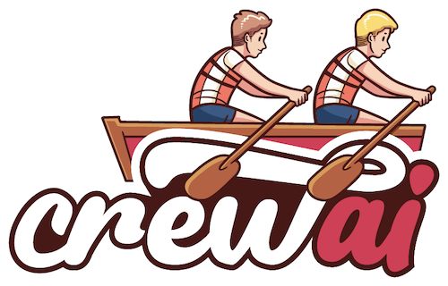

# crewAI



🤖 Cutting-edge framework for orchestrating role-playing, autonomous AI agents. By fostering collaborative intelligence, CrewAI empowers agents to work together seamlessly, tackling complex tasks.

- [Why CrewAI](#why-crewai)
- [Getting Started](#getting-started)
- [Key Features](#key-features)
- [Examples](#examples)
- [Local Open Source Models](#local-open-source-models)
- [CrewAI x AutoGen x ChatDev](#how-crewai-compares)
- [Contribution](#contribution)
- [💬 CrewAI Discord Community](https://discord.gg/4ZqbAStv)
- [Hire Consulting](#hire-consulting)
- [License](#license)

## Why CrewAI?

The power of AI collaboration has too much to offer.
CrewAI is designed to enable AI agents to assume roles, share goals, and operate in a cohesive unit - much like a well-oiled crew. Whether you're building a smart assistant platform, an automated customer service ensemble, or a multi-agent research team, CrewAI provides the backbone for sophisticated multi-agent interactions.

- 🤖 [Talk with the Docs](https://chat.openai.com/g/g-qqTuUWsBY-crewai-assistant)
- 📄 [Documentation Wiki](https://github.com/joaomdmoura/CrewAI/wiki)

## Getting Started

To get started with CrewAI, follow these simple steps:

1. **Installation**:

```shell
pip install crewai
```

The example below also uses duckduckgo, so also install that
```shell
pip install duckduckgo-search
```

2. **Setting Up Your Crew**:

```python
import os
from crewai import Agent, Task, Crew, Process

os.environ["OPENAI_API_KEY"] = "YOUR KEY"

# You can choose to use a local model through Ollama for example.
#
# from langchain.llms import Ollama
# ollama_llm = Ollama(model="openhermes")

# Install duckduckgo-search for this example:
# !pip install -U duckduckgo-search

from langchain.tools import DuckDuckGoSearchRun
search_tool = DuckDuckGoSearchRun()

# Define your agents with roles and goals
researcher = Agent(
  role='Senior Research Analyst',
  goal='Uncover cutting-edge developments in AI and data science in',
  backstory="""You work at a leading tech think tank.
  Your expertise lies in identifying emerging trends.
  You have a knack for dissecting complex data and presenting
  actionable insights.""",
  verbose=True,
  allow_delegation=False,
  tools=[search_tool]
  # You can pass an optional llm attribute specifying what mode you wanna use.
  # It can be a local model through Ollama / LM Studio or a remote
  # model like OpenAI, Mistral, Antrophic of others (https://python.langchain.com/docs/integrations/llms/)
  #
  # Examples:
  # llm=ollama_llm # was defined above in the file
  # llm=ChatOpenAI(model_name="gpt-3.5", temperature=0.7)
)
writer = Agent(
  role='Tech Content Strategist',
  goal='Craft compelling content on tech advancements',
  backstory="""You are a renowned Content Strategist, known for
  your insightful and engaging articles.
  You transform complex concepts into compelling narratives.""",
  verbose=True,
  allow_delegation=True,
  # (optional) llm=ollama_llm
)

# Create tasks for your agents
task1 = Task(
  description="""Conduct a comprehensive analysis of the latest advancements in AI in 2024.
  Identify key trends, breakthrough technologies, and potential industry impacts.
  Your final answer MUST be a full analysis report""",
  agent=researcher
)

task2 = Task(
  description="""Using the insights provided, develop an engaging blog
  post that highlights the most significant AI advancements.
  Your post should be informative yet accessible, catering to a tech-savvy audience.
  Make it sound cool, avoid complex words so it doesn't sound like AI.
  Your final answer MUST be the full blog post of at least 4 paragraphs.""",
  agent=writer
)

# Instantiate your crew with a sequential process
crew = Crew(
  agents=[researcher, writer],
  tasks=[task1, task2],
  verbose=2, # You can set it to 1 or 2 to different logging levels
)

# Get your crew to work!
result = crew.kickoff()

print("######################")
print(result)
```

Currently the only supported process is `Process.sequential`, where one task is executed after the other and the outcome of one is passed as extra content into this next.

## Key Features

- **Role-Based Agent Design**: Customize agents with specific roles, goals, and tools.
- **Autonomous Inter-Agent Delegation**: Agents can autonomously delegate tasks and inquire amongst themselves, enhancing problem-solving efficiency.
- **Flexible Task Management**: Define tasks with customizable tools and assign them to agents dynamically.
- **Processes Driven**: Currently only supports `sequential` task execution but more complex processes like consensual and hierarchical being worked on.


## Examples
You can test different real life examples of AI crews [in the examples repo](https://github.com/joaomdmoura/crewAI-examples?tab=readme-ov-file)

### Code
- [Trip Planner](https://github.com/joaomdmoura/crewAI-examples/tree/main/trip_planner)
- [Stock Analysis](https://github.com/joaomdmoura/crewAI-examples/tree/main/stock_analysis)
- [Landing Page Generator](https://github.com/joaomdmoura/crewAI-examples/tree/main/landing_page_generator)
- [Having Human input on the execution](https://github.com/joaomdmoura/crewAI/wiki/Human-Input-on-Execution)

### Video
#### Quick Tutorial
[](https://www.youtube.com/watch?v=tnejrr-0a94 "CrewAI Tutorial")

#### Trip Planner
[](https://www.youtube.com/watch?v=xis7rWp-hjs "Trip Planner")

#### Stock Analysis
[](https://www.youtube.com/watch?v=e0Uj4yWdaAg "Stock Analysis")

## Local Open Source Models
crewAI supports integration with local models, thorugh tools such as [Ollama](https://ollama.ai/), for enhanced flexibility and customization. This allows you to utilize your own models, which can be particularly useful for specialized tasks or data privacy concerns.

### Setting Up Ollama
- **Install Ollama**: Ensure that Ollama is properly installed in your environment. Follow the installation guide provided by Ollama for detailed instructions.
- **Configure Ollama**: Set up Ollama to work with your local model. You will probably need to [tweak the model using a Modelfile](https://github.com/jmorganca/ollama/blob/main/docs/modelfile.md). I'd recommend adding `Observation` as a stop word and playing with `top_p` and `temperature`.

### Integrating Ollama with CrewAI
- Instantiate Ollama Model: Create an instance of the Ollama model. You can specify the model and the base URL during instantiation. For example:

```python
from langchain.llms import Ollama
ollama_openhermes = Ollama(model="openhermes")
# Pass Ollama Model to Agents: When creating your agents within the CrewAI framework, you can pass the Ollama model as an argument to the Agent constructor. For instance:

local_expert = Agent(
  role='Local Expert at this city',
  goal='Provide the BEST insights about the selected city',
  backstory="""A knowledgeable local guide with extensive information
  about the city, it's attractions and customs""",
  tools=[
    SearchTools.search_internet,
    BrowserTools.scrape_and_summarize_website,
  ],
  llm=ollama_openhermes, # Ollama model passed here
  verbose=True
)
```

## How CrewAI Compares

- **Autogen**: While Autogen excels in creating conversational agents capable of working together, it lacks an inherent concept of process. In Autogen, orchestrating agents' interactions requires additional programming, which can become complex and cumbersome as the scale of tasks grows.

- **ChatDev**: ChatDev introduced the idea of processes into the realm of AI agents, but its implementation is quite rigid. Customizations in ChatDev are limited and not geared towards production environments, which can hinder scalability and flexibility in real-world applications.

**CrewAI's Advantage**: CrewAI is built with production in mind. It offers the flexibility of Autogen's conversational agents and the structured process approach of ChatDev, but without the rigidity. CrewAI's processes are designed to be dynamic and adaptable, fitting seamlessly into both development and production workflows.

## Contribution

CrewAI is open-source and we welcome contributions. If you're looking to contribute, please:

- Fork the repository.
- Create a new branch for your feature.
- Add your feature or improvement.
- Send a pull request.
- We appreciate your input!

### Installing Dependencies
```bash
poetry lock
poetry install
```

### Virtual Env
```bash
poetry shell
```

### Pre-commit hooks

```bash
pre-commit install
```

### Running Tests
```bash
poetry run pytest
```

### Packaging
```bash
poetry build
```

### Installing Locally
```bash
pip install dist/*.tar.gz
```

## Hire Consulting
I, [@joaomdmoura](https://github.com/joaomdmoura) (creator or crewAI), offer consulting through my LLC ([AI Nest Labs](https://ainestlabs.com)).
If you are interested on hiring weekly hours with me on a retainer, feel free to email me at [joao@ainestlabs.com](mailto:joao@ainestlabs.com)

## License
CrewAI is released under the MIT License


