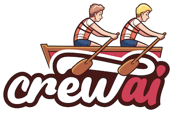

<div align="center">



<div align="left">

# **crewAI Tools**
Welcome to crewAI Tools! This repository provides a comprehensive guide for setting up sophisticated tools for [crewAI](https://github.com/crewAIInc/crewAI) agents, empowering your AI solutions with bespoke tooling.

In the realm of CrewAI agents, tools are pivotal for enhancing functionality. This guide outlines the steps to equip your agents with an arsenal of ready-to-use tools and the methodology to craft your own.

</div>

<h3>

[Homepage](https://www.crewai.io/) | [Documentation](https://docs.crewai.com/) | [Chat with Docs](https://chatg.pt/DWjSBZn) | [Examples](https://github.com/crewAIInc/crewAI-examples) | [Discord](https://discord.com/invite/X4JWnZnxPb)

</h3>

</div>

## Table of contents

- [Creating Your Tools](#creating-your-tools)
	- [Subclassing `BaseTool`](#subclassing-basetool)
	- [Utilizing the `tool` Decorator](#utilizing-the-tool-decorator)
- [Contribution Guidelines](#contribution-guidelines)
- [Development Setup](#development-setup)

## Available Tools

crewAI Tools provides a wide range of pre-built tools, including:

- File operations (FileWriterTool, FileReadTool)
- Web scraping (ScrapeWebsiteTool, SeleniumScrapingTool)
- Database interactions (PGSearchTool, MySQLSearchTool)
- API integrations (SerperApiTool, EXASearchTool)
- AI-powered tools (DallETool, VisionTool)
- And many more!

For a complete list and detailed documentation of each tool, please refer to the individual tool README files in the repository.

## Creating Your Tools

Tools are always expect to return strings, as they are meant to be used by the agents to generate responses.

There are three ways to create tools for crewAI agents:
- [Subclassing `BaseTool`](#subclassing-basetool)
- [Using the `tool` decorator](#utilizing-the-tool-decorator)

### Subclassing `BaseTool`

```python
from crewai_tools import BaseTool

class MyCustomTool(BaseTool):
    name: str = "Name of my tool"
    description: str = "Clear description for what this tool is useful for, you agent will need this information to use it."

    def _run(self, argument: str) -> str:
        # Implementation goes here
        pass
```

Define a new class inheriting from `BaseTool`, specifying `name`, `description`, and the `_run` method for operational logic.


### Utilizing the `tool` Decorator

For a simpler approach, create a `Tool` object directly with the required attributes and a functional logic.

```python
from crewai_tools import tool
@tool("Name of my tool")
def my_tool(question: str) -> str:
    """Clear description for what this tool is useful for, you agent will need this information to use it."""
    # Function logic here
```

The `tool` decorator simplifies the process, transforming functions into tools with minimal overhead.

## Contribution Guidelines

We welcome contributions! Here's how you can help:

1. Fork the repository
2. Create a feature branch (`git checkout -b feature/AmazingFeature`)
3. Commit your changes (`git commit -m 'Add some AmazingFeature'`)
4. Push to the branch (`git push origin feature/AmazingFeature`)
5. Open a Pull Request

Please ensure your code adheres to our coding standards and includes appropriate tests.

## **Development Setup**

**Installing Dependencies:**

```bash
poetry install
```

**Activating Virtual Environment:**

```bash
poetry shell
```

**Setting Up Pre-commit Hooks:**

```bash
pre-commit install
```

**Running Tests:**

```bash
poetry run pytest
```

**Static Type Checking:**

```bash
poetry run pyright
```

**Packaging:**

```bash
poetry build
```

**Local Installation:**

```bash
pip install dist/*.tar.gz
```

Thank you for your interest in enhancing the capabilities of AI agents through advanced tooling. Your contributions make a significant impact.

## Contact

For questions or support, please join our [Discord community](https://discord.com/invite/X4JWnZnxPb) or open an issue in this repository.


