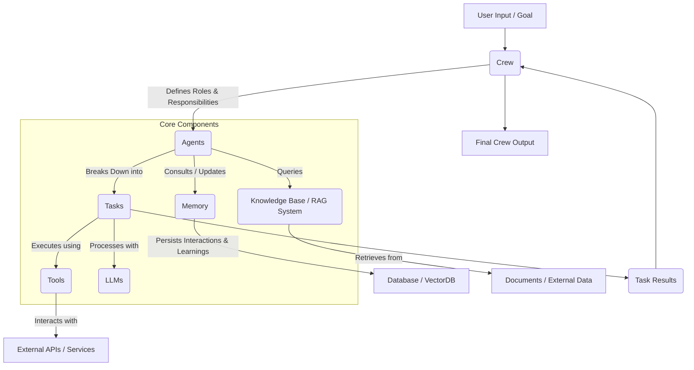

# 🚀 crewAI: Build & Orchestrate Autonomous AI Agents

<p align="center"></p>

Unleash the full potential of AI with `crewAI`, a groundbreaking framework designed for orchestrating intelligent, autonomous AI agents. Transform complex challenges into streamlined, collaborative workflows where agents with distinct roles, skills, and memories work together seamlessly to achieve sophisticated goals.

`crewAI` empowers you to define and manage multi-agent systems, enabling powerful problem-solving, dynamic decision-making, and unparalleled automation. From research and development to content creation and strategic planning, `crewAI` brings a new era of collaborative AI to your fingertips.

## Short Description

`crewAI` is an open-source framework for orchestrating role-playing, autonomous, and adaptable AI agents. It allows developers to build and deploy advanced multi-agent systems that can collaborate on tasks, leverage tools, access memory, and integrate external knowledge bases to solve complex problems with high precision and efficiency.

## ✨ Key Features

*   **Intelligent Agent Orchestration:** Assign specific roles, goals, and backstories to agents, fostering specialized expertise and dynamic collaboration.
*   **Dynamic Task Management:** Define tasks with clear objectives, human input requirements, and output formats, guiding agents toward precise outcomes.
*   **Advanced Memory Systems:** Equip agents with different memory types (short-term, long-term, contextual, entity) to learn, adapt, and build on past experiences.
*   **Robust Tool Integration:** Seamlessly integrate a vast array of tools (custom, pre-built, or third-party) to extend agents' capabilities beyond their inherent knowledge.
*   **Pluggable LLM Backends:** Flexibility to connect with various Large Language Models, allowing you to choose the best fit for your performance and cost requirements.
*   **Retrieval Augmented Generation (RAG):** Incorporate internal knowledge bases, ChromaDB, and Qdrant to provide agents with relevant, real-time information.
*   **Workflow Visualization & Persistence:** Monitor agent interactions and task progress with visual tools, and persist complex workflows for reproducibility and refinement.
*   **CLI for Rapid Development:** Accelerate your development cycle with a powerful Command-Line Interface for creating, deploying, and managing crews.
*   **Observability & Debugging:** Gain deep insights into agent reasoning and tool usage through comprehensive event logging and tracing.
*   **Guardrails for Hallucination & Security:** Implement safeguards to ensure agents operate within defined boundaries, maintaining output quality and security.

## Who is this for?

*   **AI Engineers & Developers:** Building sophisticated, autonomous AI applications.
*   **Researchers:** Experimenting with multi-agent systems and collaborative AI.
*   **Data Scientists:** Automating complex data analysis, report generation, and decision support.
*   **Product Managers:** Designing intelligent virtual assistants, personalized recommendation engines, and dynamic content platforms.
*   **Anyone looking to harness the power of collaborative AI** to automate tasks, generate insights, and enhance productivity.

## Technology Stack & Architecture

`crewAI` is built primarily in Python, leveraging its extensive ecosystem for AI and machine learning.

*   **Core Language:** Python
*   **LLM Integration:** Supports various LLM providers through a pluggable architecture (e.g., OpenAI, Google Gemini, custom local LLMs).
*   **Vector Databases:** Integrates with ChromaDB and Qdrant for Retrieval Augmented Generation (RAG).
*   **Persistence:** Utilizes SQLite for local data persistence and workflow state management.
*   **Agent Adapters:** Features adapters for orchestrators like LangGraph and OpenAI Agents.
*   **CLI:** Built with Python CLI tooling for easy project scaffolding and management.

## 📊 Architecture & Database Schema

At its core, `crewAI` revolves around the dynamic interplay of **Crews**, **Agents**, **Tasks**, **Tools**, **LLMs**, **Memory**, and **RAG**. The following diagram illustrates a high-level operational flow within the framework:



## ⚡ Quick Start Guide

Getting started with `crewAI` is straightforward.

1.  **Installation:**
    ```bash
    pip install crewai
    ```

2.  **Define Your Agents:**
    ```python
    from crewai import Agent

    researcher = Agent(
        role='Senior Research Analyst',
        goal='Uncover groundbreaking technologies',
        backstory='A meticulous analyst with a knack for identifying emerging trends.',
        verbose=True,
        allow_delegation=False
    )

    writer = Agent(
        role='Content Creator',
        goal='Craft compelling narratives',
        backstory='A creative storyteller adept at simplifying complex topics.',
        verbose=True,
        allow_delegation=False
    )
    ```

3.  **Define Your Tasks:**
    ```python
    from crewai import Task

    research_task = Task(
        description='Investigate the latest advancements in AI, focusing on large language models.',
        agent=researcher
    )

    write_task = Task(
        description='Write a compelling blog post about the findings from the research task.',
        agent=writer
    )
    ```

4.  **Assemble Your Crew and Kickoff:**
    ```python
    from crewai import Crew, Process

    my_crew = Crew(
        agents=[researcher, writer],
        tasks=[research_task, write_task],
        process=Process.sequential, # or Process.hierarchical
        verbose=2 # You can set it to 1 for less verbose or 0 for non-verbose 
    )

    result = my_crew.kickoff(inputs={'topic': 'The future of AI in content creation'})
    print(result)
    ```

For more detailed examples and advanced configurations, refer to the [official documentation](https://www.crewai.com/).

## 📜 License

This project is licensed under the **MIT License**. See the [LICENSE](LICENSE) file for details.