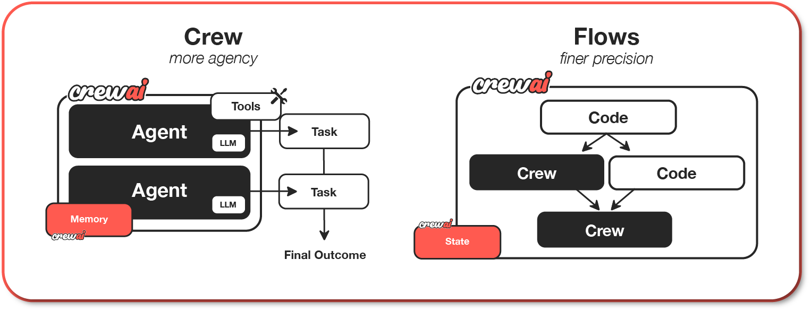

<p align="center">
  <a href="https://github.com/crewAIInc/crewAI">
    
  </a>
</p>
<p align="center" style="display: flex; justify-content: center; gap: 20px; align-items: center;">
  <a href="https://trendshift.io/repositories/11239" target="_blank">
    
  </a>
</p>

<p align="center">
  <a href="https://crewai.com">官方主页</a>
  ·
  <a href="https://crewai.com/open-source">开源版</a>
  ·
  <a href="https://docs.crewai.com">官方文档</a>
  ·
  <a href="https://app.crewai.com">免费试用云平台</a>
  ·
  <a href="https://blog.crewai.com">技术博客</a>
  ·
  <a href="https://community.crewai.com">社区论坛</a>
</p>

<p align="center">
  <a href="https://github.com/crewAIInc/crewAI">
    
  </a>
  <a href="https://github.com/crewAIInc/crewAI/network/members">
    
  </a>
  <a href="https://github.com/crewAIInc/crewAI/issues">
    
  </a>
  <a href="https://github.com/crewAIInc/crewAI/pulls">
    
  </a>
  <a href="https://opensource.org/licenses/MIT">
    
  </a>
</p>

<p align="center">
  <a href="https://pypi.org/project/crewai/">
    
  </a>
  <a href="https://pypi.org/project/crewai/">
    
  </a>
  <a href="https://twitter.com/crewAIInc">
    
  </a>
</p>

<p align="center">
  <a href="README.md">English</a> · <b>简体中文</b>
</p>

### 高效且灵活的多智能体自动化编排框架

> CrewAI 是一个开源的 Python 框架，提供高级抽象与底层 API，专为构建生产就绪的多智能体工作流打造。
> 它通过 **Crews（智能体团队）** 赋予开发者自主智能体协同能力，并通过 **Flows（事件流）** 实现精准的事件驱动控制。

- **CrewAI Crews（智能体团队）**：通过基于角色的 AI 智能体，最大化实现自主决策与群体协作智慧。
- **CrewAI Flows（工作流）**：构建事件驱动自动化，将精准的工作流控制、单次 LLM 调用与原生 Crews 团队协作无缝融合。

已有超过 100,000 名开发者通过我们在 [learn.crewai.com](https://learn.crewai.com) 的社区课程获得认证，CrewAI 正迅速成为生产级智能体自动化的业界标准。

# CrewAI AMP Suite 企业套件

针对需要企业级商业控制平面的组织，[CrewAI AMP Suite](https://crewai.com/amp) 增加了托管部署、全链路可观测性、合规治理、安全加固及企业级专属支持。

您可以免费体验套件中的 [Crew Control Plane 控制平面](https://app.crewai.com)。

## Crew Control Plane 核心特性：

- **追踪与可观测性（Tracing & Observability）**：实时监控和追踪 AI 智能体与工作流，涵盖详细指标、日志及执行调用链。
- **统一控制平面（Unified Control Plane）**：集中式平台，用于管理、监控和弹性扩展您的 AI 智能体与工作流。
- **无缝集成（Seamless Integrations）**：轻松连接现有的企业内部系统、数据源和主流云基础设施。
- **高级安全保障（Advanced Security）**：内置强健的安全与合规措施，确保安全部署与合规管控。
- **实时洞察（Actionable Insights）**：提供实时分析与报表，优化运行性能并辅助业务决策。
- **7x24 小时支持**：专属企业支持团队，确保系统不间断运行并快速排查问题。
- **私有化与云端部署**：根据安全合规需求，支持在企业本地私有化（On-premise）或云端环境部署 CrewAI AMP。

CrewAI AMP 专为寻求强大可靠解决方案的企业打造，助力将复杂的业务流程转化为高效、智能的自动化系统。

## 目录

- [借助 AI 辅助开发](#借助-ai-辅助开发)
- [为什么选择 CrewAI？](#为什么选择-crewai)
- [快速入门](#快速入门)
  - [学习资源](#学习资源)
  - [理解 Flows 与 Crews](#理解-flows-与-crews)
  - [1. 安装指南](#1-安装指南)
  - [2. 创建与配置 Crew 项目](#2-创建与配置-crew-项目)
  - [3. 运行你的 Crew](#3-运行你的-crew)
- [核心特性](#核心特性)
- [实战示例](#实战示例)
  - [快速教程视频](#快速教程视频)
  - [自动撰写岗位招聘需求](#自动撰写岗位招聘需求)
  - [智能旅行规划师](#智能旅行规划师)
  - [股票投资分析](#股票投资分析)
  - [结合使用 Crews 与 Flows](#结合使用-crews-与-flows)
- [连接模型](#连接模型)
- [何时选用 CrewAI](#何时选用-crewai)
- [参与贡献](#参与贡献)
- [遥测数据说明](#遥测数据说明)
- [开源许可证](#开源许可证)
- [常见问题解答 (FAQ)](#常见问题解答-faq)

## 借助 AI 辅助开发

正在使用 AI 编程助手？仅需一行命令即可为其装载 CrewAI 官方最佳实践技能包：

**Claude Code:**
```shell
/plugin marketplace add crewAIInc/skills
/plugin install crewai-skills@crewai-plugins
/reload-plugins
```
四大技能在提问相关 CrewAI 问题时将自动激活：

| 技能名称 | 激活场景 |
|-------|--------------|
| `getting-started` | 脚手架新建项目、在 `LLM.call()` / `Agent` / `Crew` / `Flow` 间选型、编写 `crew.jsonc` / `main.py` |
| `design-agent` | 配置智能体 — 角色 (Role)、目标 (Goal)、背景故事 (Backstory)、工具集、LLM、记忆机制与护栏 |
| `design-task` | 编写任务描述、依赖关系、结构化输出 (`output_pydantic`, `output_json`) 与人工审核（Human review） |
| `ask-docs` | 查询最新的 [CrewAI 文档 MCP 服务器](https://docs.crewai.com/mcp) 获取前沿 API 细节 |

**Cursor、Codex、Windsurf 及其他编辑器 ([skills.sh](https://skills.sh/crewaiinc/skills)):**
```shell
npx skills add crewaiinc/skills
```

这会安装官方的 [CrewAI Skills](https://github.com/crewAIInc/skills) —— 提供结构化规范，指导编码助手如何脚手架搭建 Flows、配置 Crews、设计智能体与任务，并遵循 CrewAI 官方模式。

## 为什么选择 CrewAI？

<div align="center" style="margin-bottom: 30px;">
  
</div>

CrewAI 释放多智能体自动化的真正潜力，通过协作智能体团队与事件驱动 Flows 提供卓越的速度、灵活性与控制力：

- **专为智能体编排打造**：轻量级 Python 核心，为真实世界的自动化设计了简洁、直观的原语。
- **极致性能**：针对执行速度和低资源开销进行深度优化。
- **灵活的底层自定义**：从工作流、系统架构到智能体行为、内部提示词与执行逻辑，拥有完全的定制自由。
- **全场景适用**：在简单任务、复杂工作流乃至企业生产级自动化中均得到实战验证。
- **庞大活跃社区**：拥有超过 **100,000 名认证开发者**的庞大生态，提供丰富的学习资源与技术支持。

CrewAI 赋能开发者与团队，在极简易用、高度灵活与生产级严谨控制之间实现完美平衡。

## 快速入门

跟随本教程搭建并运行你的第一个 CrewAI 智能体：

[](https://www.youtube.com/watch?v=-kSOTtYzgEw "CrewAI 入门教程视频")

### 学习资源

通过官方权威课程深入学习 CrewAI：

- [基于 CrewAI 的多 AI 智能体系统 (DeepLearning.AI)](https://www.deeplearning.ai/short-courses/multi-ai-agent-systems-with-crewai/) - 掌握多智能体系统的核心基础
- [实用多智能体实战与进阶用例 (DeepLearning.AI)](https://www.deeplearning.ai/short-courses/practical-multi-ai-agents-and-advanced-use-cases-with-crewai/) - 深度探索复杂业务落地

### 理解 Flows 与 Crews

CrewAI 提供两种强大、相辅相成的开发范式，无缝配合构建复杂的 AI 应用：

1. **Crews（智能体团队）**：具备高度自主性的智能体协作团队，通过明确的角色分工协同完成复杂目标。Crews 具备：
   - 智能体之间自主、自然的决策与沟通
   - 动态任务委托与协作
   - 具有明确目标和专业能力的专属角色
   - 灵活的问题解决路径

2. **Flows（事件驱动工作流）**：生产就绪的事件驱动工作流，为复杂自动化提供精准控制。Flows 提供：
   - 针对真实业务场景执行路径的细粒度控制
   - 任务间安全、一致的状态管理（State Management）
   - 将 AI 智能体与标准 Python 代码整洁解耦
   - 支持复杂业务逻辑的条件分支与路由

当 Crews 与 Flows 结合使用时，CrewAI 的真正实力得以全面释放：
- 构建企业级、生产就绪的大型应用
- 兼顾自主智能与精准确定性控制
- 优雅应对复杂真实的生产环境挑战
- 保持代码架构干净、高内聚低耦合且易于长期维护

### 1. 安装指南

CrewAI 要求运行环境为 `Python >=3.10 且 <3.14`。可通过以下命令检查版本：

```bash
python3 --version
```

CrewAI 推荐使用 [UV](https://docs.astral.sh/uv/) 进行依赖管理与环境隔离。若未安装 `uv`，请先执行安装：

**macOS / Linux:**
```shell
curl -LsSf https://astral.sh/uv/install.sh | sh
```

如果系统没有 `curl`，可以使用 `wget`：
```shell
wget -qO- https://astral.sh/uv/install.sh | sh
```

**Windows:**
```shell
powershell -ExecutionPolicy ByPass -c "irm https://astral.sh/uv/install.ps1 | iex"
```

安装完成后，全局安装 CrewAI CLI 工具：

```shell
uv tool install crewai
```

如遇到 `PATH` 环境变量警告，请运行：
```shell
uv tool update-shell
```

验证安装是否成功：
```shell
uv tool list
```

输出应类似于：
```shell
crewai v0.102.0
- crewai
```

后续升级全局 CLI 工具：
```shell
uv tool install crewai --upgrade
```

### 2. 创建与配置 Crew 项目

执行 `crewai create crew` 将创建一个 JSON-first 现代架构的项目。智能体定义在 `agents/*.jsonc`，任务与全局设置定义在 `crew.jsonc`，`crewai run` 可直接加载该定义：

```shell
crewai create crew <project_name>
```

该命令将生成如下项目目录结构：

```
my_project/
├── .gitignore
├── .env
├── agents/
│   └── researcher.jsonc
├── crew.jsonc
├── knowledge/
├── pyproject.toml
├── README.md
├── skills/
└── tools/
```

如果需要传统的 Python/YAML 模板（包含 `crew.py`、`config/agents.yaml` 和 `config/tasks.yaml`），请使用：
```shell
crewai create crew <project_name> --classic
```

#### 项目定制说明：
- 修改 `agents/*.jsonc` 自定义每个 Agent 的角色 (role)、目标 (goal)、背景故事 (backstory)、大模型 (llm)、工具集 (tools) 及参数。
- 修改 `crew.jsonc` 定义具体任务 (tasks)、执行流程 (process) 与输入默认值。
- 在 `tools/` 目录下编写自定义工具，并通过 `"custom:<name>"` 在配置中引用。
- 在 `knowledge/` 放入领域知识文档，在 `skills/` 放入扩展技能。
- 在 `.env` 中填入模型 API 密钥与服务 Token。

#### 顺序执行（Sequential Process）示例：

```shell
crewai create crew latest-ai-development
cd latest_ai_development
```

接着编辑生成的文件：

**agents/researcher.jsonc**
```jsonc
{
  "role": "{topic} 资深数据研究员",
  "goal": "发掘 {topic} 领域的最新前沿进展",
  "backstory": "你是一位资深研究专家，擅长从海量信息中挖掘核心数据并清晰呈现。",
  "llm": "openai/gpt-4o",
  "tools": ["SerperDevTool"],
  "settings": {
    "verbose": true
  }
}
```

**agents/reporting_analyst.jsonc**
```jsonc
{
  "role": "{topic} 研报分析师",
  "goal": "根据 {topic} 的数据分析和研究成果撰写详尽报告",
  "backstory": "你是一位细致严谨的分析师，擅长将复杂数据转化为结构清晰、重点突出的专业报告。",
  "llm": "openai/gpt-4o",
  "settings": {
    "verbose": true
  }
}
```

**crew.jsonc**
```jsonc
{
  "name": "Latest AI Development",
  "agents": ["researcher", "reporting_analyst"],
  "tasks": [
    {
      "name": "research_task",
      "description": "针对 {topic} 进行深入调研，搜集最新、最相关的权威资讯。",
      "expected_output": "包含 10 个核心要点的列表，总结 {topic} 的最新动态。",
      "agent": "researcher"
    },
    {
      "name": "reporting_task",
      "description": "审阅调研成果，并将每个主题扩展为完整章节的专业报告。",
      "expected_output": "一份结构完整的 Markdown 报告，每个主题包含详实信息。全文外层不要使用代码块包裹。",
      "agent": "reporting_analyst",
      "context": ["research_task"],
      "output_file": "output/report.md",
      "markdown": true
    }
  ],
  "process": "sequential",
  "verbose": true,
  "inputs": {
    "topic": "AI Agents"
  }
}
```

### 3. 运行你的 Crew

在运行前，请在 `.env` 文件中配置必要的密钥：
- 模型供应商 API 密钥（如 `OPENAI_API_KEY=...`）
- 若使用搜索工具需配置 Serper 密钥：`SERPER_API_KEY=YOUR_KEY_HERE`

然后在项目根目录下安装依赖并启动：

```shell
crewai install
crewai run
```

运行完成后，终端将实时展示执行过程，并在项目根目录生成 `output/report.md` 报告文件。

除顺序流程（Sequential）外，还可以使用**层级流程（Hierarchical Process）**，它会自动为 Crew 指定一名 Manager 协调各智能体之间的任务委派、协作与结果校验。[查看流程文档了解更多](https://docs.crewai.com/en/concepts/processes)。

## 核心特性

CrewAI 为开发者提供了构建从原型走向生产的完整基础设施：
- **Crews 赋予自主性**：通过角色、目标、工具和任务构建专业的 AI 智能体团队。
- **Flows 保障控制力**：构建带状态、条件分支、路由与生产业务逻辑的事件驱动工作流。
- **双剑合璧**：结合 Crews 与 Flows，打造应对复杂现实挑战的自动化应用。
- **原生 Python 定制**：自由定制提示词、工具、执行路径、状态与第三方集成。
- **生产级功能支撑**：开箱即用支持工具调用、短期/长期记忆、知识库、检查点快照、异步并发执行及 MCP / A2A 协议。
- **确定性生产模式**：随着系统规模扩大，轻松加入确定性步骤、人工审查介入与结构化 Pydantic 输出。
- **庞大活跃社区**：超 10 万名认证开发者与完备文档支持。

## 实战示例

更多丰富示例可在 [CrewAI-examples 官方示例库](https://github.com/crewAIInc/crewAI-examples) 中获取：

- [Landing Page 营销页生成器](https://github.com/crewAIInc/crewAI-examples/tree/main/crews/landing_page_generator)
- [Human-in-the-loop 人工审核介入](https://docs.crewai.com/en/learn/human-input-on-execution)
- [智能旅行规划师](https://github.com/crewAIInc/crewAI-examples/tree/main/crews/trip_planner)
- [股票投资分析](https://github.com/crewAIInc/crewAI-examples/tree/main/crews/stock_analysis)

### 结合使用 Crews 与 Flows

Flows 支持使用 `or_` 与 `and_` 逻辑运算符结合 `@start`、`@listen`、`@router` 装饰器构建复杂的触发条件：

```python
from crewai.flow.flow import Flow, listen, start, router, or_
from crewai import Crew, Agent, Task, Process
from pydantic import BaseModel

# 定义结构化状态实现精准状态控制
class MarketState(BaseModel):
    sentiment: str = "neutral"
    confidence: float = 0.0
    recommendations: list = []

class AdvancedAnalysisFlow(Flow[MarketState]):
    @start()
    def fetch_market_data(self):
        self.state.sentiment = "analyzing"
        return {"sector": "tech", "timeframe": "1W"}

    @listen(fetch_market_data)
    def analyze_with_crew(self, market_data):
        analyst = Agent(
            role="资深市场分析师",
            goal="运用专家洞察开展深度市场分析",
            backstory="你是一位以善于捕捉微妙市场模式而闻名的资深分析师"
        )
        researcher = Agent(
            role="数据研究员",
            goal="搜集并验证支撑市场分析的基础数据",
            backstory="你擅长从多个数据源交叉比对并提取证据"
        )

        analysis_task = Task(
            description="分析 {sector} 板块在过去 {timeframe} 的数据",
            expected_output="带有置信度评分的详细市场分析",
            agent=analyst
        )
        research_task = Task(
            description="寻找支撑数据以验证分析结论",
            expected_output="确凿的佐证与潜在的矛盾点",
            agent=researcher
        )

        analysis_crew = Crew(
            agents=[analyst, researcher],
            tasks=[analysis_task, research_task],
            process=Process.sequential,
            verbose=True
        )
        return analysis_crew.kickoff(inputs=market_data)

    @router(analyze_with_crew)
    def determine_next_steps(self):
        if self.state.confidence > 0.8:
            return "high_confidence"
        elif self.state.confidence > 0.5:
            return "medium_confidence"
        return "low_confidence"

    @listen("high_confidence")
    def execute_strategy(self):
        strategy_crew = Crew(
            agents=[
                Agent(role="策略专家", goal="制定最优市场投资执行策略")
            ],
            tasks=[
                Task(description="根据分析报告制定具体行动方案", expected_output="分步骤行动计划")
            ]
        )
        return strategy_crew.kickoff()

    @listen(or_("medium_confidence", "low_confidence"))
    def request_additional_analysis(self):
        self.state.recommendations.append("搜集更多数据")
        return "需补充进一步分析"
```

## 连接模型

CrewAI 支持丰富的模型连接方案。默认情况下使用 OpenAI API，但智能体也可以无缝对接本地模型（如通过 Ollama 或 LM Studio）以及 Anthropic、Groq、Google 等各类云端模型。详情请参考[连接 LLM 文档](https://docs.crewai.com/en/learn/llm-connections)。

## 何时选用 CrewAI

当您的场景超越单一提示词或对话机器人时（如：多步骤协作、垂直专业分工、工具调用、结构化数据输出、人工介入审核或需要将自主推理与明确业务规则融合），CrewAI 是理想的选择。

## 参与贡献

CrewAI 秉持开源精神，热烈欢迎社区贡献！请参阅 [`.github/CONTRIBUTING.md`](.github/CONTRIBUTING.md) 了解环境搭建、分支规范与 PR 提交检查清单。

快速启动开发环境：

```bash
git clone https://github.com/crewAIInc/crewAI.git
cd crewAI
uv sync --all-groups --all-extras
uv run pre-commit install
```

```bash
# 运行单元测试
uv run pytest lib/crewai/tests/ -x -q

# 类型检查
uv run mypy lib/
```

## 遥测数据说明

CrewAI 收集匿名遥测数据以帮助改进最常用的功能与集成。**绝对不会收集**提示词内容、任务描述、智能体背景、API 响应或任何凭据敏感信息。可以通过设置环境变量 `OTEL_SDK_DISABLED=true` 完全关闭遥测。

## 开源许可证

CrewAI 遵循 [MIT 开源许可证](https://github.com/crewAIInc/crewAI/blob/main/LICENSE)。

## 常见问题解答 (FAQ)

### Q: CrewAI 究竟是什么？
A: CrewAI 是一个专门用于编排自主 AI 智能体与生产级智能体工作流的轻量、高效 Python 框架。

### Q: 如何安装 CrewAI？
A: 使用 UV 进行全局工具安装：`uv tool install crewai`。之后通过 `crewai create crew <项目名>` 快速创建项目。

### Q: CrewAI 是一个独立的框架吗？
A: 是的。CrewAI 是一个拥有自己独立 Agent、Task、Crew、Flow 与 Tool 原语的完整 Python 框架。

### Q: Crews 与 Flows 有何区别？
A: Crews 侧重于**自主决策与群体协作**，适合多智能体动态协同；Flows 侧重于**确定性与事件驱动控制**，适合管理明确的执行路径与状态流转。二者可无缝协同。

### Q: CrewAI 可以配合本地大模型使用吗？
A: 完全可以！支持通过 Ollama、LM Studio 等工具无缝接入各类本地开源模型。
---

> 💡 **文档维护说明**：本中文文档由社区志愿者（@JasonYeYuhe）翻译维护，最后同步更新于 2026年8月31日。如发现内容与官方英文原版存在差异或新特性滞后，欢迎提交 PR 共同完善！
