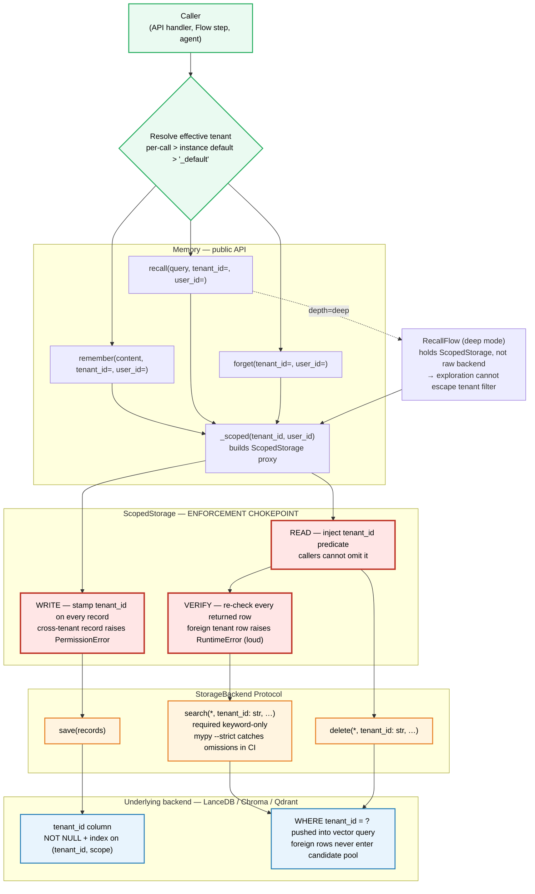

# DD-0001 — Per-Tenant Memory Isolation

| | |
|---|---|
| **Status** | Draft — for maintainer review |
| **Scope** | `crewai.memory` (unified `Memory` + `StorageBackend`), `crewai.rag` (legacy `BaseRAGStorage`) |
| **Touches** | `lib/crewai/src/crewai/memory/`, `lib/crewai/src/crewai/rag/storage/`, `lib/cli/src/crewai_cli/` |
| **Backward compatible** | Yes (default tenant `_default`; existing call sites unchanged) |
| **Security-relevant** | Yes — see [Security Model](#security-model) |

---

## TL;DR

CrewAI's memory subsystem persists across sessions but does not partition by user or tenant identity. In any multi-user deployment, every user's memories land in the same collection and `recall()` mixes them. This is the single reason teams disable built-in memory in production and bolt on an external provider.

This document specifies per-tenant memory isolation as a **security property** enforced at the storage boundary. It threads a `tenant_id` (and optional `user_id`) through the entire save → store → recall path, makes it a required predicate on every read in `StorageBackend`, and centralizes enforcement in a `ScopedStorage` proxy so no agent code path can bypass it.

---

## The Invariant

> **A `recall()` scoped to tenant A can never return a memory written by tenant B — under any ranking, embedding collision, query depth, deep-recall exploration round, or backend.**

Everything in this document exists to make that one sentence true and to make it stay true. It is the **first** thing reviewers should evaluate any change against.

---

## The Gap Today

Two relevant code paths exist in the current tree:

1. **Unified memory** (the live path): `lib/crewai/src/crewai/memory/unified_memory.py` + `StorageBackend` protocol at `lib/crewai/src/crewai/memory/storage/backend.py`. `MemoryRecord.source` (a free-form string) and `MemoryRecord.private` (a bool) exist as provenance hints. The recall path applies them as a **post-query Python filter**:

   ```python
   # unified_memory.py:704-709 (current)
   if not include_private:
       raw = [(r, s) for r, s in raw
              if not r.private or r.source == source]
   ```

   This is not isolation. A `private=False` row from user B with a strong semantic match is returned to user A and only `private=True` rows are filtered. Even for `private=True`, the row was *retrieved* from the vector store before being filtered — meaning it counted against ranking, against the oversample budget, and was visible inside `RecallFlow`'s exploration LLM prompts.

2. **Legacy RAG memory**: `BaseRAGStorage` at `lib/crewai/src/crewai/rag/storage/base_rag_storage.py` has no per-user concept at all. Subclasses (ChromaDB, etc.) take an `embedder_config` and a `crew` but no identity.

Both paths leak. Both must be closed in the same PR or one of them keeps shipping a vulnerability. This document targets the unified `StorageBackend` boundary primarily; the legacy `BaseRAGStorage` fix is mechanically the same (a `tenant_id` field in the `where` clause) and is sketched in [Legacy RAG Path](#legacy-rag-path).

---

## Non-Goals (what this PR is *not*)

The role this fix occupies sits between three things that look similar and are not:

| Need | Solved by | Not this PR |
|---|---|---|
| Survives restart | SQLite + Chroma/LanceDB persistence | Already shipped |
| Shared across crews / cross-session knowledge graph | External memory provider (mem0, etc.) | Out of scope |
| **Per-user data isolation** | **This PR** | — |

Specifically excluded from this PR (each is its own ticket):

- **A mem0 replacement.** Long-term consolidation, decay heuristics, cross-crew knowledge sharing — that is the external provider's job. Adding it here turns a security fix into a 3000-line feature and it never merges.
- **Per-tenant encryption.** Different ticket. Isolation is necessary but not sufficient for "encrypted at rest per tenant."
- **Per-tenant collection sprawl (Option B partitioning).** Documented below as a follow-up; not the default.
- **Multi-tenant rate limiting / quota.** Not a memory concern.

---

## Design

### Identity model

Two fields are added to `MemoryRecord`:

| Field | Type | Default | Role |
|---|---|---|---|
| `tenant_id` | `str` | `"_default"` | **The security boundary.** Every record is owned by exactly one tenant. Storage filters on this unconditionally. |
| `user_id` | `str \| None` | `None` | Sub-tenant refinement *inside* a tenant. A `user_id` filter is a soft partition (org admin can recall across users in the same tenant); `tenant_id` is the hard wall. |

Why two and not one:

- A SaaS deployment has tenants (customers) and users (people inside the customer). They are different trust boundaries: the customer-admin role is allowed to query across their users; no customer is ever allowed to query across other customers. Collapsing them into a single field forces every operator to pick the wrong granularity.
- `tenant_id` is non-null because the invariant says "every row has an owner." `user_id` is nullable because plenty of records (system summaries, agent-emitted reflections) legitimately belong to a tenant but not to a user.
- Default `tenant_id="_default"` is what keeps single-user setups working unchanged. Existing rows read back as `_default`; the default `Memory()` constructor uses `_default`; no caller has to change.

`source` and `private` stay on the record for provenance, but they are **no longer load-bearing for isolation**. The `recall()` post-filter at `unified_memory.py:704-709` is deleted. The migration guide tells anyone who used `source="user_42"` for isolation purposes to move to `tenant_id="user_42"`.

### Identity propagation path



Two structural properties the diagram is meant to make obvious:

1. **The red band is the only place isolation is enforced.** Everything above it routes through it; everything below it inherits a filter it cannot remove. Audit lives in one file.
2. **`RecallFlow` re-enters through `ScopedStorage`, not around it.** Deep-recall LLM exploration is safe by construction — the flow does not hold a reference to the raw backend.

### The `StorageBackend` Protocol change

`tenant_id` becomes a **required keyword-only parameter** on every read method:

```python
@runtime_checkable
class StorageBackend(Protocol):
    def save(self, records: list[MemoryRecord]) -> None: ...

    def search(
        self,
        query_embedding: list[float],
        *,
        tenant_id: str,                          # required, no default
        user_id: str | None = None,
        scope_prefix: str | None = None,
        categories: list[str] | None = None,
        metadata_filter: dict[str, Any] | None = None,
        limit: int = 10,
        min_score: float = 0.0,
    ) -> list[tuple[MemoryRecord, float]]: ...

    def delete(self, *, tenant_id: str, user_id: str | None = None, …) -> int: ...
    def get_record(self, record_id: str, *, tenant_id: str) -> MemoryRecord | None: ...
    def list_records(self, *, tenant_id: str, …) -> list[MemoryRecord]: ...
    def list_scopes(self, *, tenant_id: str, parent: str = "/") -> list[str]: ...
    def list_categories(self, *, tenant_id: str, …) -> dict[str, int]: ...
    def count(self, *, tenant_id: str, scope_prefix: str | None = None) -> int: ...
    def reset(self, *, tenant_id: str, scope_prefix: str | None = None) -> None: ...

    async def asearch(self, …, *, tenant_id: str, …) -> …: ...
    # … all async variants mirror the sync ones
```

Why keyword-only and required:

- Required (no default) means **mypy `--strict` (which this repo already enforces) turns any forgotten caller into a CI failure.** Static enforcement of the invariant beats every code review.
- Keyword-only means it cannot accidentally swap with a positional `scope_prefix` arg.
- `save()` does **not** take `tenant_id`. The tenant is on the record itself; a separate parameter would invite "record says A, param says B" mismatches. Single source of truth.
- `reset()` cannot wipe everything. There is no "reset all tenants" path. An operator who wants that calls `reset(tenant_id="_default")` deliberately, and to wipe other tenants they iterate. This is intentional friction — accidental cross-tenant wipes are a recovery nightmare.

### The `ScopedStorage` wrapper

This is the single most important file in the PR. It is the chokepoint the invariant rides on.

```python
# lib/crewai/src/crewai/memory/storage/scoped_storage.py

class ScopedStorage:
    """Wraps any StorageBackend and enforces tenant isolation.

    A ScopedStorage is bound to exactly one tenant_id (and optionally one user_id)
    at construction. Every read it issues to the underlying backend carries that
    tenant_id as a non-optional predicate. Every record it writes is stamped with
    that tenant_id, overwriting whatever the caller put on the record.

    This class is the single chokepoint for the isolation invariant:
        a recall bound to tenant A NEVER returns a row written by tenant B.

    If you add a new read method, it MUST go through the tenant predicate.
    If you add a new write method, it MUST go through _stamp().
    """
```

Three contracts the wrapper holds and any reviewer must confirm:

1. **Stamp on write.** Every record passed to `save()` or `update()` is `model_copy()`'d with `tenant_id` set to the wrapper's tenant. If the caller supplies a record already stamped with a *different* tenant, the wrapper raises `PermissionError` — silent relabel is a footgun.

2. **Inject on read.** Every read method passes `tenant_id` to the underlying backend. The wrapper has no API surface to omit it; callers cannot opt out.

3. **Double-check on return.** After the backend returns rows, the wrapper re-verifies `r.tenant_id == self._tenant_id` for every row. If any row fails the check, it raises `RuntimeError` — not "silently filter and return the clean ones." A broken backend filter must be **loud** so the next test run catches it. Quiet filtering is exactly how the original bug shipped.

The wrapper is cheap to construct (two strings; one reference). `Memory` builds a fresh one per call rather than caching, so a single long-lived `Memory` instance can serve many tenants concurrently without leaking state between them.

### `Memory` API surface

```python
class Memory(BaseModel):
    tenant_id: str = Field(default="_default")
    user_id: str | None = Field(default=None)
    # … existing fields

    def remember(
        self,
        content: str,
        *,
        tenant_id: str | None = None,   # per-call override
        user_id: str | None = None,     # per-call override
        scope: str | None = None,
        # … existing args (categories, metadata, importance, source, …)
    ) -> MemoryRecord | None: ...

    def recall(
        self,
        query: str,
        *,
        tenant_id: str | None = None,
        user_id: str | None = None,
        # … existing args
    ) -> list[MemoryMatch]: ...

    def forget(
        self,
        *,
        tenant_id: str | None = None,
        user_id: str | None = None,
        # … existing args
    ) -> int: ...
```

Resolution order for the effective tenant: **per-call kwarg > instance default > `"_default"`**. Same for `user_id`. The per-call override is the multi-tenant SaaS pattern (one `Memory` instance, many requests). The instance default is the single-user CLI pattern (set once in `Memory()`).

`crew.kickoff()` grows an analogous pair of kwargs that thread down to the agents' memory access:

```python
crew.kickoff(inputs={...}, tenant_id="customer_42", user_id="alice")
```

Agents do not see `tenant_id` directly. They get a memory handle that is already bound to the right tenant. This matters: prompt-injected agents cannot recover a tenant they were never given.

### Partitioning strategy: Option A vs Option B

Two ways to physically partition data:

| | **Option A — Metadata filter (default)** | **Option B — Per-tenant namespace** |
|---|---|---|
| **Storage layout** | One collection / one table. Every row has `tenant_id`. Reads push `tenant_id = ?` into the backend's filter. | One collection / namespace per tenant. Reads route to the right namespace. |
| **Isolation strength** | Strong **with centralized enforcement** (the `ScopedStorage` wrapper + required protocol kwargs + the double-check). Weaker if enforcement is left to ad-hoc callers. | Stronger by construction: no shared index, cross-tenant queries impossible. |
| **"Right to be forgotten"** | A range delete. Cheap row-wise but the underlying vector index does not always shrink — periodic compaction needed. | Drop the namespace. O(1). |
| **Cold-start cost** | None. | A collection per tenant means N collections; many vector DBs amortize poorly at high N. |
| **Operational complexity** | Low. | High at scale — collection sprawl, per-collection embedder warmups, backend-specific quirks. |
| **Recommended for** | Default. Most CrewAI deployments. | Strict-isolation deployments (regulated industries, single-tenant-per-namespace contracts). |

**Decision: ship Option A as the default, with the `ScopedStorage` wrapper holding the invariant.** Document Option B as a `Storage(strategy="namespace")` flavor that lands in a follow-up PR. Reviewers who want Option B as the default should engage on this section specifically — that is the one architectural call worth re-litigating.

### Backend changes

Each `StorageBackend` implementation gains:

1. A `tenant_id` column / field with a NOT NULL constraint at the schema level wherever the backend supports it. The Protocol's required kwarg is the Python enforcement; the column constraint is the database enforcement. Defense in depth.
2. An index on `(tenant_id)` and a composite index on `(tenant_id, scope)` because the hot read path is always `WHERE tenant_id = ? AND scope LIKE ? || '%'`.
3. The `tenant_id = ?` predicate pushed into whatever the backend's filter syntax is:

   ```python
   # LanceDB (current default)
   where = f"tenant_id = {_quote(tenant_id)}"
   if user_id is not None:
       where += f" AND user_id = {_quote(user_id)}"
   ```

   ```python
   # ChromaDB (legacy RAG path)
   filter_clause = {"tenant_id": tenant_id}
   if user_id is not None:
       filter_clause["user_id"] = user_id
   collection.query(query_embeddings=[…], where=filter_clause, …)
   ```

   ```python
   # Qdrant (qdrant_edge_storage)
   must = [FieldCondition(key="tenant_id", match=MatchValue(value=tenant_id))]
   if user_id is not None:
       must.append(FieldCondition(key="user_id", match=MatchValue(value=user_id)))
   ```

`_quote` is the escape helper. Never f-string a raw `tenant_id` from request context into SQL — Bandit's `S608` rule will catch it in CI.

### Legacy RAG path

`BaseRAGStorage` at `lib/crewai/src/crewai/rag/storage/base_rag_storage.py` is the older boundary used by entity/short-term memory built before the unified `Memory` class. The same changes apply:

- Add `tenant_id` parameter (keyword-only, required) to `save`, `search`, `reset`.
- A subclass-side `ScopedRAGStorage` wrapper mirrors `ScopedStorage`.
- ChromaDB's `where={"tenant_id": tenant_id}` is the enforcement push-down.

Combining the unified and legacy fixes in one PR keeps the changelog honest: "memory" is one user-visible concept and shipping isolation for half of it is misleading.

### Migration

Existing unscoped data must not be silently orphaned. Two mechanisms:

1. **One-shot backfill CLI**: `crewai memory migrate`
   ```
   crewai memory migrate \
     --storage-dir $CREWAI_STORAGE_DIR \
     --default-tenant _default \
     [--default-user-id <id>] \
     [--dry-run]
   ```
   - Scans every storage file under `CREWAI_STORAGE_DIR`.
   - For rows where `tenant_id IS NULL OR tenant_id = ''`, stamps `_default`.
   - Idempotent. Prints `migrated N rows`.
   - `--dry-run` is mandatory in the docs example. Somebody will run this against prod by accident.

2. **Startup warning**: `Memory.model_post_init` issues a one-line `WARNING` log if it detects any unstamped rows in the underlying store. It does **not** auto-migrate. Auto-migration on a shared DB is how teams get paged at 3am. The warning is the nudge to run the CLI deliberately during a maintenance window.

3. **Schema migration**: For LanceDB and SQLite-backed stores, adding the `tenant_id` column on existing tables uses each backend's `ALTER` path with `DEFAULT '_default' NOT NULL`. Existing rows pick up the default at the storage layer in a single transaction.

---

## Security Model

**Threat model.**

| Threat | Mitigation |
|---|---|
| Caller forgets to pass `tenant_id` | Required keyword-only kwarg on every Protocol read method; mypy `--strict` fails CI. Plus runtime default `"_default"` so the **fallback is a non-leaking single-tenant bucket, never the union of all data**. |
| Caller passes wrong `tenant_id` | Out of scope — that is the caller's responsibility. We do not authenticate the caller; we enforce the predicate they pass. Auth lives upstream (FastAPI dep, agent runtime, etc.). |
| Backend filter is broken or miscompiled | `ScopedStorage` re-verifies `r.tenant_id == self._tenant_id` on every returned row; raises `RuntimeError` on mismatch. **Loud over silent.** |
| Prompt-injected agent tries to recall cross-tenant | Agents receive a `Memory` handle pre-bound to a tenant; the wrapper provides no API to widen scope. The agent can ask, but the storage refuses. |
| Embedding collision returns a near-identical neighbor from another tenant | Filter is pushed into the vector search itself (LanceDB `WHERE`, Chroma `where=`, Qdrant `must`), not applied post-retrieval. Cross-tenant rows never enter the candidate pool. |
| Operator runs `forget()` and wipes other tenants | `forget()` requires a tenant scope. There is no "wipe everything." |
| Backup / dump exposes one tenant to another | Out of scope for this PR; dump tooling lives elsewhere. Documented as a follow-up. |

**Embedder is shared across tenants.** Embeddings are not a security boundary; they are a content-addressable hash function. Per-tenant embedders would be a meaningless cost without changing the threat surface.

---

## Test Contract

A test file titled `test_tenant_isolation.py` lives in `lib/crewai/tests/memory/`. The features below define "done." If any one of these is missing or passes vacuously, the PR is unfinished.

| Test | What it pins |
|---|---|
| `test_cross_tenant_recall_returns_nothing` | The core invariant. Two tenants save near-identical content with the same embedding region, scope, and categories. Each tenant's `recall()` returns only its own row. |
| `test_default_tenant_backcompat` | A caller passing no `tenant_id` still gets `recall()` working and reads back rows with `tenant_id="_default"`. Single-user setups unchanged. |
| `test_deep_recall_honors_tenant` | The `depth="deep"` path goes through `RecallFlow` with LLM exploration. Isolation must hold there too, not just `depth="shallow"`. |
| `test_delete_is_scoped` | `forget(tenant_id="alice")` deletes only Alice's rows; Bob's survive. |
| `test_save_rejects_cross_tenant_record` | If a caller hands `ScopedStorage(tenant="alice")` a `MemoryRecord(tenant_id="bob")`, the wrapper raises `PermissionError`. No silent relabel. |
| `test_backend_leak_is_loud` | Monkeypatched backend returns a foreign-tenant row. `ScopedStorage` raises `RuntimeError`, not a quietly-filtered empty list. |
| `test_legacy_rag_storage_honors_tenant` | Mirror of the first test against `BaseRAGStorage` so the legacy ChromaDB path is covered. |

These tests use the repo's existing VCR cassette infrastructure for the embedder/LLM calls (`pytest-recording`); the repo's `--block-network` default means a missing cassette is a hard failure, not a silent network hit.

**Tests that do NOT count as the isolation contract:**

- "stores and recalls" — that test already exists and never caught the bug.
- "private flag works" — `private` is being demoted to provenance; tests on it test the wrong thing.
- "save round-trips through serialization" — orthogonal.

---

## Public API Diff (what changes for end users)

```python
# Before
crew.kickoff(inputs={"topic": "X"})

# After (single-user; unchanged behavior)
crew.kickoff(inputs={"topic": "X"})

# After (multi-tenant SaaS pattern)
crew.kickoff(inputs={"topic": "X"}, tenant_id="customer_42", user_id="alice")
```

```python
# Direct Memory usage
mem = Memory()
mem.remember("note", tenant_id="alice")
mem.recall("question", tenant_id="alice")
mem.forget(tenant_id="alice")
```

No existing call site breaks. The `source` / `private` / `include_private` arguments still accept their old values; a `DeprecationWarning` fires if a caller is clearly using them for isolation (`source` non-null + `private=True` is the pattern that gets the warning).

---

## Rollout / Merge Order

Each row is a separate PR. Earlier PRs land green and ship value independently; the merge of #4 is the moment isolation becomes real.

| # | PR | What it does | Risk |
|---|---|---|---|
| 1 | `feat(memory): add tenant_id/user_id to MemoryRecord` | Adds the two fields with `_default`. Backends ignore them. Schema migrations land. No behavior change. | Low — additive. |
| 2 | `refactor(memory): tenant_id keyword in StorageBackend protocol` | Adds required keyword-only `tenant_id` to every read method on `StorageBackend` and every implementation. mypy `--strict` catches forgotten call sites. Still no behavior change because `Memory` always passes `"_default"`. | Medium — touches every storage backend, but mechanical. |
| 3 | `feat(memory): ScopedStorage wrapper + isolation tests` | Adds `ScopedStorage` and the test file. Tests are written to **fail** until #4 lands. | Low. |
| 4 | `feat(memory): wire ScopedStorage through Memory and Flows` | Memory grows `tenant_id`/`user_id` fields and per-call kwargs. Every internal call routes through `_scoped(...)`. The `private`/`source` post-filter is deleted. Tests from #3 go green. This is the load-bearing PR. | High — security-relevant change to live code path. |
| 5 | `feat(cli): crewai memory migrate command` | One-shot backfill CLI + docs page. Startup warning lands here. | Low. |
| 6 | `docs(memory): per-tenant isolation guide` | Mintlify page at `docs/en/concepts/memory-isolation.mdx` (+ translations) with the API surface, threat model, and migration steps. | None. |
| 7 *(optional, follow-up)* | `feat(memory): namespace partitioning strategy` | `ScopedStorage(strategy="namespace")` for Option B deployments. | Medium. |

`llm-generated` label on every PR per `.github/CONTRIBUTING.md`.

---

## Open Questions

1. **Is `"_default"` the right default tenant string?** Alternatives: empty string (collides with NULL handling), `None` (forces every backend to handle two-typed filters), the literal `"default"` (collision risk with a real tenant). `"_default"` is unambiguous and sorts predictably. Open to bikeshed; just want a maintainer to call it.

2. **Per-call override on `Memory` vs. context-managed scope.** Current design uses a kwarg. An alternative is:
   ```python
   with memory.as_tenant("customer_42", user_id="alice"):
       memory.recall("...")
   ```
   I prefer the kwarg because it cannot leak across an exception or a forgotten `__exit__`. The context-manager form is sugar and could land in a follow-up.

3. **Should `Crew` carry `tenant_id` at construction or only at `kickoff()`?** `kickoff()` is the right surface for SaaS (per-request); construction is the right surface for single-tenant. Proposal: both, with `kickoff()` winning if both are set.

4. **Telemetry.** The repo emits anonymous telemetry; `tenant_id` values must never appear in telemetry payloads. A hash or a `"present"`/`"absent"` boolean is the most we should emit. Confirming with whoever owns `crewai/telemetry/`.

5. **Legacy `BaseRAGStorage` deprecation timeline.** Now that the unified path is the live one, is there a release where legacy `BaseRAGStorage` can be removed entirely? Out of scope for this PR but the answer informs how much effort goes into legacy-path tests.

---

## Appendix: Code references

- Current leaky filter: `lib/crewai/src/crewai/memory/unified_memory.py:704-709`
- `StorageBackend` Protocol: `lib/crewai/src/crewai/memory/storage/backend.py`
- `MemoryRecord`: `lib/crewai/src/crewai/memory/types.py:20-73`
- Default storage (LanceDB): `lib/crewai/src/crewai/memory/storage/lancedb_storage.py`
- Qdrant storage: `lib/crewai/src/crewai/memory/storage/qdrant_edge_storage.py`
- Legacy RAG boundary: `lib/crewai/src/crewai/rag/storage/base_rag_storage.py`
- ChromaDB factory used by legacy path: `lib/crewai/src/crewai/rag/chromadb/`
- Storage dir env var: `CREWAI_STORAGE_DIR` (handled in `crewai-core`)
