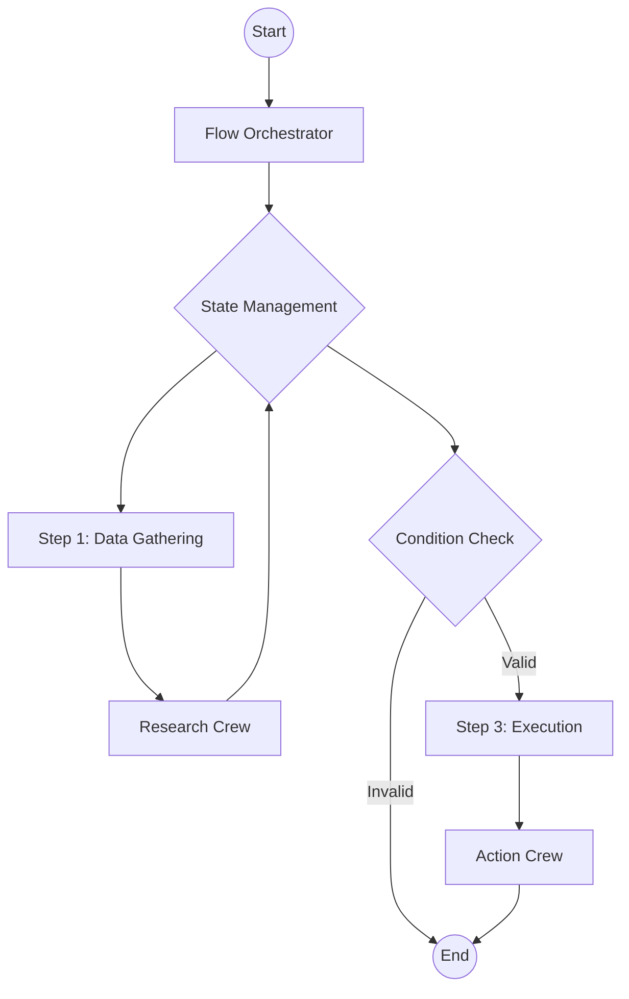

# عقلية التدفق أولاً

عند بناء تطبيقات ذكاء اصطناعي إنتاجية مع CrewAI، **نوصي بالبدء بتدفق (Flow)**.

بينما يمكن تشغيل أطقم أو وكلاء فرديين، فإن تغليفهم في تدفق يوفر الهيكل اللازم لتطبيق متين وقابل للتوسع.

## لماذا التدفقات؟

1. **إدارة الحالة**: توفر التدفقات طريقة مدمجة لإدارة الحالة عبر مراحل مختلفة من تطبيقك. هذا ضروري لتمرير البيانات بين الأطقم والحفاظ على السياق ومعالجة مدخلات المستخدم.
2. **التحكم**: تتيح لك التدفقات تحديد مسارات تنفيذ دقيقة، بما في ذلك الحلقات والشرطيات ومنطق التفريع. هذا أساسي لمعالجة الحالات الاستثنائية وضمان سلوك تطبيقك بشكل متوقع.
3. **المراقبة**: توفر التدفقات هيكلًا واضحًا يسهّل تتبع التنفيذ وتصحيح الأخطاء ومراقبة الأداء. نوصي باستخدام [تتبع CrewAI](/ar/observability/tracing) للحصول على رؤى تفصيلية. ما عليك سوى تشغيل `crewai login` لتفعيل ميزات المراقبة المجانية.

## البنية

يبدو تطبيق CrewAI الإنتاجي النموذجي هكذا:



### 1. فئة التدفق
فئة `Flow` هي نقطة الدخول. تحدد مخطط الحالة والطرق التي تنفذ منطقك.

```python
from crewai.flow.flow import Flow, listen, start
from pydantic import BaseModel

class AppState(BaseModel):
    user_input: str = ""
    research_results: str = ""
    final_report: str = ""

class ProductionFlow(Flow[AppState]):
    @start()
    def gather_input(self):
        # ... منطق الحصول على المدخلات ...
        pass

    @listen(gather_input)
    def run_research_crew(self):
        # ... تشغيل طاقم ...
        pass
```

### 2. إدارة الحالة
استخدم نماذج Pydantic لتعريف حالتك. يضمن هذا أمان الأنواع ويوضح البيانات المتاحة في كل مرحلة.

- **اجعلها بسيطة**: خزّن فقط ما تحتاجه للاستمرار بين المراحل.
- **استخدم بيانات منظمة**: تجنب القواميس غير المنظمة قدر الإمكان.

### 3. الأطقم كوحدات عمل
فوّض المهام المعقدة إلى الأطقم. يجب أن يكون الطاقم مركّزًا على هدف محدد (مثل "البحث في موضوع"، "كتابة مقال مدونة").

- **لا تبالغ في هندسة الأطقم**: اجعلها مركّزة.
- **مرر الحالة بشكل صريح**: مرر البيانات الضرورية من حالة التدفق إلى مدخلات الطاقم.

```python
    @listen(gather_input)
    def run_research_crew(self):
        crew = ResearchCrew()
        result = crew.kickoff(inputs={"topic": self.state.user_input})
        self.state.research_results = result.raw
```

## عناصر التحكم الأولية

استفد من عناصر التحكم الأولية في CrewAI لإضافة المتانة والتحكم إلى أطقمك.

### 1. حواجز المهام
استخدم [حواجز المهام](/ar/concepts/tasks#task-guardrails) للتحقق من مخرجات المهام قبل قبولها. يضمن هذا أن وكلاءك ينتجون نتائج عالية الجودة.

```python
def validate_content(result: TaskOutput) -> Tuple[bool, Any]:
    if len(result.raw) < 100:
        return (False, "Content is too short. Please expand.")
    return (True, result.raw)

task = Task(
    ...,
    guardrail=validate_content
)
```

### 2. المخرجات المنظمة
استخدم دائمًا المخرجات المنظمة (`output_pydantic` أو `output_json`) عند تمرير البيانات بين المهام أو إلى تطبيقك. يمنع هذا أخطاء التحليل ويضمن أمان الأنواع.

```python
class ResearchResult(BaseModel):
    summary: str
    sources: List[str]

task = Task(
    ...,
    output_pydantic=ResearchResult
)
```

### 3. خطافات LLM
استخدم [خطافات LLM](/ar/learn/llm-hooks) لفحص أو تعديل الرسائل قبل إرسالها إلى LLM، أو لتنقية الاستجابات.

```python
@before_llm_call
def log_request(context):
    print(f"Agent {context.agent.role} is calling the LLM...")
```

## أنماط النشر

عند نشر تدفقك، ضع في اعتبارك ما يلي:

### CrewAI Enterprise
أسهل طريقة لنشر تدفقك هي استخدام CrewAI Enterprise. تتعامل مع البنية التحتية والمصادقة والمراقبة نيابة عنك.

راجع [دليل النشر](/ar/enterprise/guides/deploy-to-amp) للبدء.

```bash
crewai deploy create
```

### التنفيذ غير المتزامن
للمهام طويلة التشغيل، استخدم `kickoff_async` لتجنب حظر واجهتك البرمجية.

### الاستمرارية
استخدم مزيّن `@persist` لحفظ حالة تدفقك في قاعدة بيانات. يتيح لك هذا استئناف التنفيذ إذا تعطلت العملية أو إذا كنت بحاجة لانتظار مدخلات بشرية.

```python
@persist
class ProductionFlow(Flow[AppState]):
    # ...
```

## الخلاصة

- **ابدأ بتدفق.**
- **حدد حالة واضحة.**
- **استخدم الأطقم للمهام المعقدة.**
- **انشر مع API واستمرارية.**
