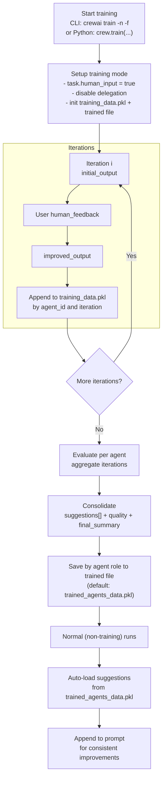

## نظرة عامة

تتيح لك ميزة التدريب في CrewAI تدريب وكلاء الذكاء الاصطناعي باستخدام واجهة سطر الأوامر (CLI).
بتشغيل الأمر `crewai train -n <n_iterations>`، يمكنك تحديد عدد التكرارات لعملية التدريب.

أثناء التدريب، يستخدم CrewAI تقنيات لتحسين أداء وكلائك مع التغذية الراجعة البشرية.
يساعد هذا الوكلاء على تحسين فهمهم واتخاذ القرارات وحل المشكلات.

### تدريب طاقمك باستخدام CLI

لاستخدام ميزة التدريب، اتبع الخطوات التالية:

1. افتح الطرفية أو موجه الأوامر.
2. انتقل إلى المجلد حيث يقع مشروع CrewAI.
3. شغّل الأمر التالي:

```shell
crewai train -n <n_iterations> -f <filename.pkl>
```
<Tip>
  استبدل `<n_iterations>` بعدد تكرارات التدريب المرغوب و`<filename>` باسم الملف المناسب المنتهي بـ `.pkl`.
</Tip>

<Note>
  إذا حذفت `-f`، فإن المخرجات تُحفظ افتراضيًا في `trained_agents_data.pkl` في مجلد العمل الحالي. يمكنك تمرير مسار مطلق للتحكم في مكان كتابة الملف.
</Note>

### تدريب طاقمك برمجيًا

لتدريب طاقمك برمجيًا، استخدم الخطوات التالية:

1. حدد عدد التكرارات للتدريب.
2. حدد معاملات الإدخال لعملية التدريب.
3. نفّذ أمر التدريب داخل كتلة try-except للتعامل مع الأخطاء المحتملة.

```python Code
n_iterations = 2
inputs = {"topic": "CrewAI Training"}
filename = "your_model.pkl"

try:
    YourCrewName_Crew().crew().train(
      n_iterations=n_iterations,
      inputs=inputs,
      filename=filename
    )

except Exception as e:
    raise Exception(f"An error occurred while training the crew: {e}")
```

## كيف تُستخدم بيانات التدريب من قبل الوكلاء

يستخدم CrewAI مخرجات التدريب بطريقتين: أثناء التدريب لدمج ملاحظاتك البشرية، وبعد التدريب لتوجيه الوكلاء باقتراحات موحدة.

### تدفق بيانات التدريب



### أثناء تشغيلات التدريب

- في كل تكرار، يسجل النظام لكل وكيل:
  - `initial_output`: الإجابة الأولى للوكيل
  - `human_feedback`: ملاحظاتك المضمّنة عند الطلب
  - `improved_output`: إجابة المتابعة للوكيل بعد الملاحظات
- تُخزن هذه البيانات في ملف عمل باسم `training_data.pkl` مفهرس بمعرّف الوكيل الداخلي والتكرار.
- أثناء نشاط التدريب، يُلحق الوكيل تلقائيًا ملاحظاتك البشرية السابقة بأمره لتطبيق تلك التعليمات في المحاولات اللاحقة ضمن جلسة التدريب.
  التدريب تفاعلي: تُعيّن المهام `human_input = true`، لذا سيتوقف التشغيل في بيئة غير تفاعلية بانتظار مدخلات المستخدم.

### بعد اكتمال التدريب

- عند انتهاء `train(...)`، يقيّم CrewAI بيانات التدريب المجمعة لكل وكيل وينتج نتيجة موحدة تحتوي على:
  - `suggestions`: تعليمات واضحة وقابلة للتنفيذ مستخلصة من ملاحظاتك والفرق بين المخرجات الأولية/المحسنة
  - `quality`: درجة من 0-10 تعكس التحسن
  - `final_summary`: مجموعة خطوات عمل تفصيلية للمهام المستقبلية
- تُحفظ هذه النتائج الموحدة في اسم الملف الذي تمرره إلى `train(...)` (الافتراضي عبر CLI هو `trained_agents_data.pkl`). تُفهرس الإدخالات بدور الوكيل `role` لتطبيقها عبر الجلسات.
- أثناء التنفيذ العادي (غير التدريب)، يحمّل كل وكيل تلقائيًا `suggestions` الموحدة ويلحقها بأمر المهمة كتعليمات إلزامية. يمنحك هذا تحسينات متسقة بدون تغيير تعريفات الوكلاء.

### ملخص الملفات

- `training_data.pkl` (مؤقت، لكل جلسة):
  - الهيكل: `agent_id -> { iteration_number: { initial_output, human_feedback, improved_output } }`
  - الغرض: التقاط البيانات الخام والملاحظات البشرية أثناء التدريب
  - الموقع: يُحفظ في مجلد العمل الحالي (CWD)
- `trained_agents_data.pkl` (أو اسم ملفك المخصص):
  - الهيكل: `agent_role -> { suggestions: string[], quality: number, final_summary: string }`
  - الغرض: استمرار التوجيه الموحد للتشغيلات المستقبلية
  - الموقع: يُكتب في CWD افتراضيًا؛ استخدم `-f` لتعيين مسار مخصص (بما في ذلك المطلق)

## اعتبارات نماذج اللغة الصغيرة

<Warning>
  عند استخدام نماذج لغة أصغر (≤7 مليار معامل) لتقييم بيانات التدريب، كن على علم أنها قد تواجه تحديات في إنتاج مخرجات منظمة واتباع التعليمات المعقدة.
</Warning>

### قيود النماذج الصغيرة في تقييم التدريب

<CardGroup cols={2}>
  <Card title="دقة مخرجات JSON" icon="triangle-exclamation">
    غالبًا ما تواجه النماذج الأصغر صعوبة في إنتاج استجابات JSON صالحة مطلوبة لتقييمات التدريب المنظمة، مما يؤدي إلى أخطاء تحليل وبيانات غير مكتملة.
  </Card>
  <Card title="جودة التقييم" icon="chart-line">
    قد توفر النماذج تحت 7 مليار معامل تقييمات أقل دقة مع عمق استدلال محدود مقارنة بالنماذج الأكبر.
  </Card>
  <Card title="اتباع التعليمات" icon="list-check">
    قد لا تُتبع معايير تقييم التدريب المعقدة بالكامل أو تُراعى من قبل النماذج الأصغر.
  </Card>
  <Card title="الاتساق" icon="rotate">
    قد تفتقر التقييمات عبر تكرارات تدريب متعددة إلى الاتساق مع النماذج الأصغر.
  </Card>
</CardGroup>

### توصيات للتدريب

<Tabs>
  <Tab title="أفضل ممارسة">
    لجودة تدريب مثالية وتقييمات موثوقة، نوصي بشدة باستخدام نماذج بحد أدنى 7 مليار معامل أو أكبر:

    ```python
    from crewai import Agent, Crew, Task, LLM

    # الحد الأدنى الموصى به لتقييم التدريب
    llm = LLM(model="mistral/open-mistral-7b")

    # خيارات أفضل لتقييم تدريب موثوق
    llm = LLM(model="anthropic/claude-3-sonnet-20240229-v1:0")
    llm = LLM(model="gpt-4o")

    # استخدم هذا LLM مع وكلائك
    agent = Agent(
        role="Training Evaluator",
        goal="Provide accurate training feedback",
        llm=llm
    )
    ```

    <Tip>
      توفر النماذج الأكثر قوة ملاحظات أعلى جودة مع استدلال أفضل، مما يؤدي إلى تكرارات تدريب أكثر فعالية.
    </Tip>
  </Tab>
  <Tab title="استخدام النماذج الصغيرة">
    إذا كان يجب عليك استخدام نماذج أصغر لتقييم التدريب، كن على علم بهذه القيود:

    ```python
    # استخدام نموذج أصغر (توقع بعض القيود)
    llm = LLM(model="huggingface/microsoft/Phi-3-mini-4k-instruct")
    ```

    <Warning>
      بينما يتضمن CrewAI تحسينات للنماذج الصغيرة، توقع نتائج تقييم أقل موثوقية ودقة قد تتطلب تدخلاً بشريًا أكبر أثناء التدريب.
    </Warning>
  </Tab>
</Tabs>

### نقاط مهمة يجب ملاحظتها

- **متطلب العدد الصحيح الموجب:** تأكد من أن عدد التكرارات (`n_iterations`) هو عدد صحيح موجب. سيرمي الكود `ValueError` إذا لم يتحقق هذا الشرط.
- **متطلب اسم الملف:** تأكد من أن اسم الملف ينتهي بـ `.pkl`. سيرمي الكود `ValueError` إذا لم يتحقق هذا الشرط.
- **معالجة الأخطاء:** يتعامل الكود مع أخطاء العمليات الفرعية والاستثناءات غير المتوقعة، ويوفر رسائل خطأ للمستخدم.
- يُطبق التوجيه المدرّب في وقت الأمر؛ لا يعدّل تهيئة وكيل Python/YAML.
- يحمّل الوكلاء تلقائيًا الاقتراحات المدربة من ملف باسم `trained_agents_data.pkl` الموجود في مجلد العمل الحالي. إذا درّبت إلى اسم ملف مختلف، أعد تسميته إلى `trained_agents_data.pkl` قبل التشغيل، أو اضبط المحمّل في الكود.
- يمكنك تغيير اسم ملف المخرجات عند استدعاء `crewai train` بـ `-f/--filename`. المسارات المطلقة مدعومة إذا أردت الحفظ خارج CWD.

من المهم ملاحظة أن عملية التدريب قد تستغرق بعض الوقت، اعتمادًا على تعقيد وكلائك وستتطلب أيضًا ملاحظاتك في كل تكرار.

بمجرد اكتمال التدريب، سيكون وكلاؤك مجهزين بقدرات ومعرفة محسّنة، وجاهزين لمعالجة المهام المعقدة وتقديم رؤى أكثر اتساقًا وقيمة.

تذكر تحديث وإعادة تدريب وكلائك بانتظام لضمان بقائهم على اطلاع بأحدث المعلومات والتطورات في المجال.
