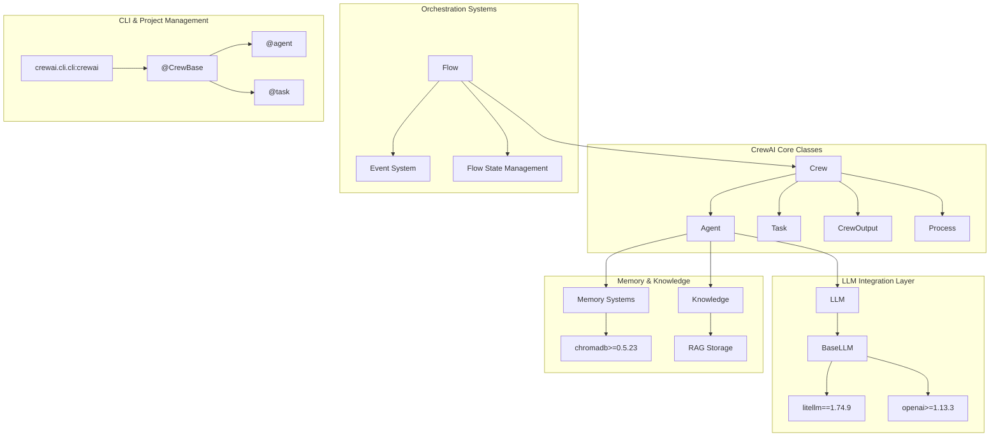
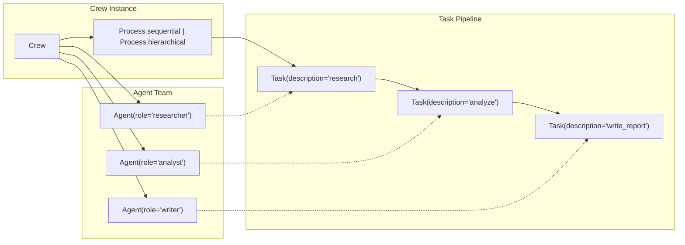
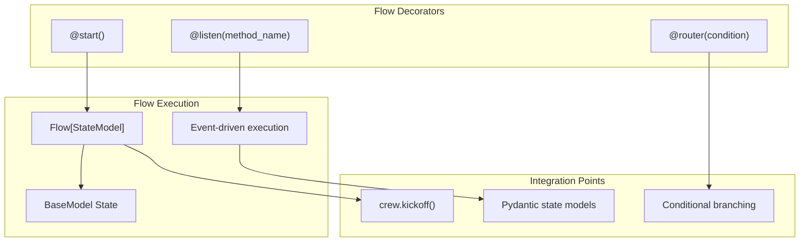
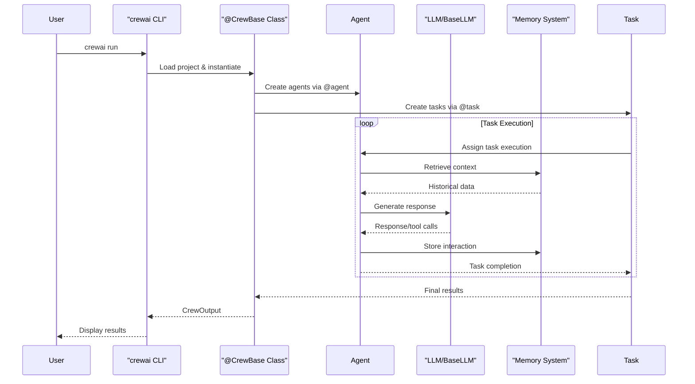

# Introduction to CrewAI

<details>
<summary>Relevant source files</summary>

The following files were used as context for generating this wiki page:

- [README.md](https://github.com/crewAIInc/crewAI/blob/81bd81e5/README.md)
- [pyproject.toml](https://github.com/crewAIInc/crewAI/blob/81bd81e5/pyproject.toml)
- [src/crewai/__init__.py](https://github.com/crewAIInc/crewAI/blob/81bd81e5/src/crewai/__init__.py)
- [src/crewai/cli/create_crew.py](https://github.com/crewAIInc/crewAI/blob/81bd81e5/src/crewai/cli/create_crew.py)
- [src/crewai/cli/templates/crew/pyproject.toml](https://github.com/crewAIInc/crewAI/blob/81bd81e5/src/crewai/cli/templates/crew/pyproject.toml)
- [src/crewai/cli/templates/flow/pyproject.toml](https://github.com/crewAIInc/crewAI/blob/81bd81e5/src/crewai/cli/templates/flow/pyproject.toml)
- [src/crewai/cli/templates/tool/pyproject.toml](https://github.com/crewAIInc/crewAI/blob/81bd81e5/src/crewai/cli/templates/tool/pyproject.toml)
- [uv.lock](https://github.com/crewAIInc/crewAI/blob/81bd81e5/uv.lock)

</details>


## Purpose and Scope

This document provides a comprehensive overview of the CrewAI framework, a standalone Python library designed for orchestrating autonomous AI agents in multi-agent systems. CrewAI offers two primary orchestration paradigms: **Crews** for autonomous agent collaboration and **Flows** for event-driven workflow control.

This introduction covers the framework's core architecture, main components, and orchestration approaches. For specific implementation details about individual components, see [Core Components](#2). For advanced workflow management, see [Flow System](#3). For memory and knowledge management capabilities, see [Memory System](#4) and [Knowledge Integration](#5).

## Framework Overview

CrewAI is a lean, high-performance Python framework built entirely from scratch, independent of LangChain or other agent frameworks. The framework supports Python versions 3.10 through 3.13 and provides both high-level simplicity and precise low-level control for creating AI agent automations.

### Key Characteristics

| Aspect | Description |
|--------|-------------|
| **Architecture** | Standalone framework with no external agent framework dependencies |
| **Orchestration** | Dual approach: autonomous Crews and precise Flows |
| **Performance** | Optimized for speed with minimal resource usage |
| **Flexibility** | Complete customization from high-level workflows to internal prompts |
| **Integration** | Native LLM provider support via `LiteLLM` and direct API connections |

The framework's main exports include `Agent`, `Crew`, `Task`, `Flow`, `Process`, `Knowledge`, and `LLM` classes, providing the building blocks for sophisticated AI agent systems.

**Sources:** [pyproject.toml:1-50](https://github.com/crewAIInc/crewAI/blob/81bd81e5/pyproject.toml#L1-L50), [README.md:54-118](https://github.com/crewAIInc/crewAI/blob/81bd81e5/README.md#L54-L118), [src/crewai/__init__.py:6-17](https://github.com/crewAIInc/crewAI/blob/81bd81e5/src/crewai/__init__.py#L6-L17)

## Core Architecture

The following diagram illustrates CrewAI's core architecture, showing how the main code entities relate to each other:



**Sources:** [src/crewai/__init__.py:6-17](https://github.com/crewAIInc/crewAI/blob/81bd81e5/src/crewai/__init__.py#L6-L17), [pyproject.toml:10-43](https://github.com/crewAIInc/crewAI/blob/81bd81e5/pyproject.toml#L10-L43), [src/crewai/cli/create_crew.py:134-250](https://github.com/crewAIInc/crewAI/blob/81bd81e5/src/crewai/cli/create_crew.py#L134-L250)

## Two Main Orchestration Approaches

CrewAI provides two complementary approaches for orchestrating AI agents, each suited to different use cases and control requirements.

### Crews: Autonomous Agent Collaboration

Crews represent teams of AI agents working together autonomously to accomplish complex tasks. Each `Crew` contains multiple `Agent` instances, each with specific roles and capabilities, and manages `Task` execution through different `Process` types.



**Key Features:**
- **Autonomous Decision-Making**: Agents make decisions based on their roles and goals
- **Dynamic Task Delegation**: Tasks can be reassigned based on agent capabilities
- **Role-Based Collaboration**: Each agent has specialized expertise and backstory
- **Flexible Problem-Solving**: Agents adapt their approach based on context

**Sources:** [README.md:138-143](https://github.com/crewAIInc/crewAI/blob/81bd81e5/README.md#L138-L143), [src/crewai/__init__.py:7-8](https://github.com/crewAIInc/crewAI/blob/81bd81e5/src/crewai/__init__.py#L7-L8)

### Flows: Event-Driven Workflow Control

Flows provide precise, programmatic control over execution paths using event-driven patterns. The `Flow` class enables complex conditional logic and state management for production-grade applications.



**Key Features:**
- **Fine-Grained Control**: Precise execution path management
- **State Management**: Secure, typed state persistence using Pydantic models
- **Event-Driven Architecture**: Methods triggered by events and conditions
- **Crew Integration**: Seamless integration of Crews within Flow steps

**Sources:** [README.md:144-150](https://github.com/crewAIInc/crewAI/blob/81bd81e5/README.md#L144-L150), [README.md:458-538](https://github.com/crewAIInc/crewAI/blob/81bd81e5/README.md#L458-L538)

## Execution Flow

The following diagram shows how CrewAI processes execute from initialization to completion:



The execution begins when users run `crewai run` from the CLI, which loads the project's `@CrewBase` decorated class. This class uses `@agent` and `@task` decorators to define the crew structure, then orchestrates execution through the specified `Process` type.

**Sources:** [src/crewai/cli/create_crew.py:134-250](https://github.com/crewAIInc/crewAI/blob/81bd81e5/src/crewai/cli/create_crew.py#L134-L250), [README.md:384-401](https://github.com/crewAIInc/crewAI/blob/81bd81e5/README.md#L384-L401), [pyproject.toml:98-100](https://github.com/crewAIInc/crewAI/blob/81bd81e5/pyproject.toml#L98-L100)

## Getting Started Overview

CrewAI projects follow a standardized structure created through the CLI. The framework uses decorator-based project definitions combined with YAML configuration files for agent and task specifications.

### Project Structure

When created via `crewai create crew <project_name>`, projects follow this structure:

```
project_name/
├── pyproject.toml          # Project dependencies and scripts
├── .env                    # Environment variables (API keys)
├── src/project_name/
│   ├── main.py            # Entry point with inputs
│   ├── crew.py            # @CrewBase class definition  
│   ├── tools/             # Custom tool implementations
│   └── config/
│       ├── agents.yaml    # Agent role definitions
│       └── tasks.yaml     # Task specifications
```

### Core Project Elements

| Component | Purpose | Code Entity |
|-----------|---------|-------------|
| **CrewBase Class** | Main crew orchestration | `@CrewBase` decorator with `@agent`, `@task`, `@crew` methods |
| **Configuration** | Agent/task definitions | YAML files loaded into `agents_config`, `tasks_config` |
| **Environment** | API keys and model settings | `.env` file with `OPENAI_API_KEY`, `MODEL` variables |
| **Entry Point** | Execution trigger | `main.py` calling `crew().kickoff(inputs=inputs)` |

The CLI provides scripts for common operations: `crewai run` for execution, `crewai install` for dependencies, and `crewai update` for framework updates.

**Sources:** [README.md:199-401](https://github.com/crewAIInc/crewAI/blob/81bd81e5/README.md#L199-L401), [src/crewai/cli/templates/crew/pyproject.toml:1-24](https://github.com/crewAIInc/crewAI/blob/81bd81e5/src/crewai/cli/templates/crew/pyproject.toml#L1-L24), [src/crewai/cli/create_crew.py:16-91](https://github.com/crewAIInc/crewAI/blob/81bd81e5/src/crewai/cli/create_crew.py#L16-L91)

## Framework Dependencies and Integration

CrewAI's architecture relies on carefully selected dependencies to provide its core functionality while maintaining independence from other agent frameworks.

### Key Dependencies

| Category | Dependencies | Purpose |
|----------|-------------|---------|
| **LLM Integration** | `openai>=1.13.3`, `litellm==1.74.9`, `instructor>=1.3.3` | Multi-provider LLM support |
| **Data Management** | `chromadb>=0.5.23`, `pydantic>=2.4.2` | Vector storage and data validation |
| **Observability** | `opentelemetry-api>=1.30.0`, `opentelemetry-sdk>=1.30.0` | Telemetry and monitoring |
| **Document Processing** | `pdfplumber>=0.11.4`, `tokenizers>=0.20.3` | Content ingestion and processing |
| **CLI Tools** | `click>=8.1.7`, `uv>=0.4.25` | Command-line interface and package management |

The framework's independence from LangChain allows for faster execution and more predictable behavior while still supporting a wide range of LLM providers through `LiteLLM` integration.