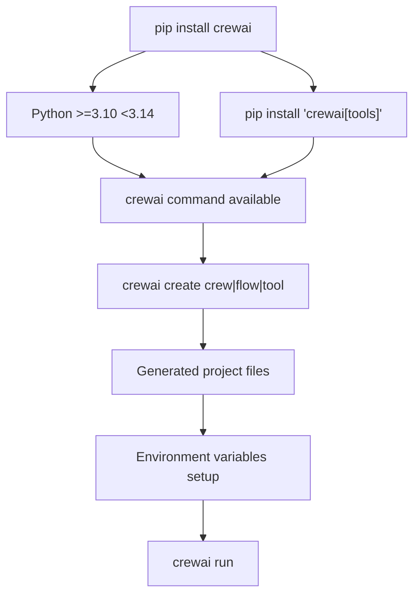
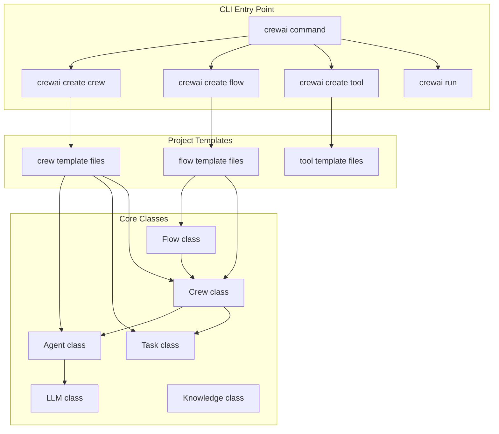
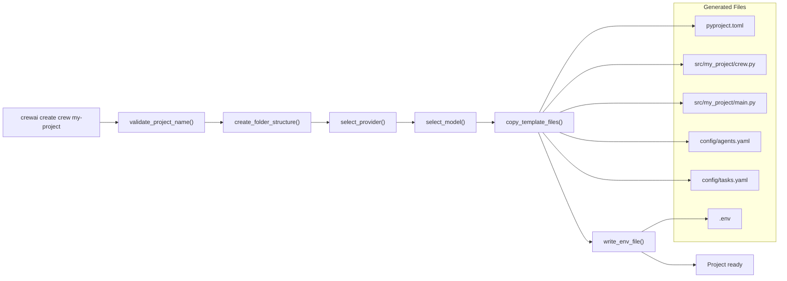
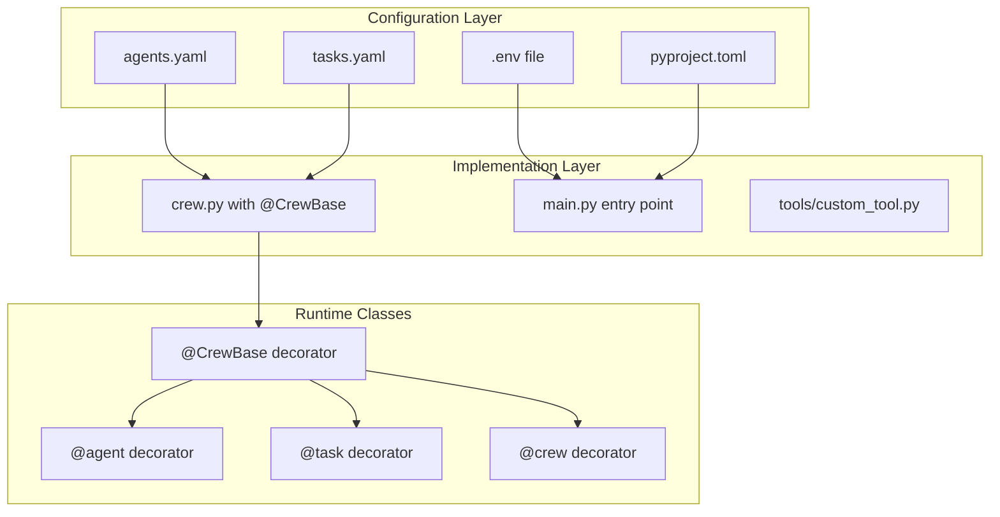

# Getting Started

<details>
<summary>Relevant source files</summary>

The following files were used as context for generating this wiki page:

- [README.md](https://github.com/crewAIInc/crewAI/blob/81bd81e5/README.md)
- [pyproject.toml](https://github.com/crewAIInc/crewAI/blob/81bd81e5/pyproject.toml)
- [src/crewai/__init__.py](https://github.com/crewAIInc/crewAI/blob/81bd81e5/src/crewai/__init__.py)
- [src/crewai/cli/cli.py](https://github.com/crewAIInc/crewAI/blob/81bd81e5/src/crewai/cli/cli.py)
- [src/crewai/cli/create_crew.py](https://github.com/crewAIInc/crewAI/blob/81bd81e5/src/crewai/cli/create_crew.py)
- [src/crewai/cli/plus_api.py](https://github.com/crewAIInc/crewAI/blob/81bd81e5/src/crewai/cli/plus_api.py)
- [src/crewai/cli/reset_memories_command.py](https://github.com/crewAIInc/crewAI/blob/81bd81e5/src/crewai/cli/reset_memories_command.py)
- [src/crewai/cli/templates/crew/pyproject.toml](https://github.com/crewAIInc/crewAI/blob/81bd81e5/src/crewai/cli/templates/crew/pyproject.toml)
- [src/crewai/cli/templates/flow/pyproject.toml](https://github.com/crewAIInc/crewAI/blob/81bd81e5/src/crewai/cli/templates/flow/pyproject.toml)
- [src/crewai/cli/templates/tool/pyproject.toml](https://github.com/crewAIInc/crewAI/blob/81bd81e5/src/crewai/cli/templates/tool/pyproject.toml)
- [src/crewai/cli/tools/main.py](https://github.com/crewAIInc/crewAI/blob/81bd81e5/src/crewai/cli/tools/main.py)
- [tests/cli/test_plus_api.py](https://github.com/crewAIInc/crewAI/blob/81bd81e5/tests/cli/test_plus_api.py)
- [tests/cli/tools/test_main.py](https://github.com/crewAIInc/crewAI/blob/81bd81e5/tests/cli/tools/test_main.py)
- [uv.lock](https://github.com/crewAIInc/crewAI/blob/81bd81e5/uv.lock)

</details>


This document covers the initial setup, installation, and first project creation with CrewAI. It provides a practical walkthrough of installing the framework, understanding the CLI tools, and creating your first autonomous agent system or event-driven workflow.

For detailed information about core components like agents and tasks, see [Core Components](#2). For advanced Flow system usage, see [Flow System](#3). For project configuration patterns, see [Project Structure and Configuration](#10).

## Installation and Setup

CrewAI requires Python >=3.10 and <3.14. The framework is distributed as a standalone package with no dependencies on LangChain or other agent frameworks.

### Basic Installation

Install CrewAI using pip:

```bash
pip install crewai
```

For additional tools and capabilities, install with the tools extra:

```bash
pip install 'crewai[tools]'
```

### Installation Flow Diagram



Sources: [README.md:164-178](https://github.com/crewAIInc/crewAI/blob/81bd81e5/README.md#L164-L178), [pyproject.toml:6](https://github.com/crewAIInc/crewAI/blob/81bd81e5/pyproject.toml#L6), [pyproject.toml:91-92](https://github.com/crewAIInc/crewAI/blob/81bd81e5/pyproject.toml#L91-L92)

## Understanding CrewAI's Dual Paradigm

CrewAI provides two complementary approaches for building AI automation systems:

| Paradigm | Purpose | Use Cases |
|----------|---------|-----------|
| **Crews** | Autonomous agent collaboration | Dynamic problem-solving, flexible decision-making |
| **Flows** | Event-driven workflow control | Precise execution paths, production workflows |

### Core Components Architecture



Sources: [src/crewai/__init__.py:5-16](https://github.com/crewAIInc/crewAI/blob/81bd81e5/src/crewai/__init__.py#L5-L16), [README.md:134-157](https://github.com/crewAIInc/crewAI/blob/81bd81e5/README.md#L134-L157)

## Creating Your First Project

The CrewAI CLI provides project scaffolding for different types of automation systems.

### Crew Project Creation

Create a new crew project with autonomous agents:

```bash
crewai create crew my-research-team
```

This command invokes the `create_crew` function and generates a complete project structure with:

- Configuration files (`agents.yaml`, `tasks.yaml`)
- Python implementation files (`crew.py`, `main.py`)
- Environment setup (`.env` file)
- Project metadata (`pyproject.toml`)

### Project Generation Process



Sources: [src/crewai/cli/create_crew.py:134-249](https://github.com/crewAIInc/crewAI/blob/81bd81e5/src/crewai/cli/create_crew.py#L134-L249), [src/crewai/cli/create_crew.py:16-90](https://github.com/crewAIInc/crewAI/blob/81bd81e5/src/crewai/cli/create_crew.py#L16-L90)

### Flow Project Creation

Create an event-driven flow project:

```bash
crewai create flow my-workflow
```

Flow projects focus on precise control over execution sequences using decorators like `@start`, `@listen`, and `@router`.

### Tool Creation

Create custom tools for agents:

```bash
crewai create tool my-custom-tool
```

This generates a tool template that can be published and shared across projects.

## Project Structure

CrewAI projects follow a standardized structure that separates configuration, implementation, and dependencies.

### Standard Crew Project Layout

```
my-project/
├── .gitignore
├── pyproject.toml              # Project metadata and dependencies
├── README.md
├── .env                        # Environment variables
├── knowledge/                  # Knowledge base files
│   └── user_preference.txt
├── tests/                      # Test files
└── src/
    └── my_project/
        ├── __init__.py
        ├── main.py             # Entry point
        ├── crew.py             # Crew definition with @CrewBase
        ├── tools/              # Custom tools
        │   ├── custom_tool.py
        │   └── __init__.py
        └── config/             # YAML configurations
            ├── agents.yaml     # Agent definitions
            └── tasks.yaml      # Task definitions
```

### Configuration Architecture



Sources: [src/crewai/cli/templates/crew/pyproject.toml:1-24](https://github.com/crewAIInc/crewAI/blob/81bd81e5/src/crewai/cli/templates/crew/pyproject.toml#L1-L24), [README.md:207-224](https://github.com/crewAIInc/crewAI/blob/81bd81e5/README.md#L207-L224)

## Environment Setup and Provider Configuration

CrewAI supports multiple LLM providers and requires API keys for external services.

### Provider Selection Process

The CLI guides you through provider setup during project creation:

1. **Provider Selection**: Choose from predefined providers (OpenAI, Anthropic, etc.) or browse all available options
2. **Model Selection**: Select specific models for your chosen provider
3. **API Key Configuration**: Provide API keys which are stored in `.env`

### Environment Variables Structure

Common environment variables include:

```bash
OPENAI_API_KEY=your_openai_key_here
MODEL=gpt-4
SERPER_API_KEY=your_serper_key_for_search
```

The `get_provider_data()` function in `provider.py` fetches the latest provider and model information from a remote JSON source, cached locally for 24 hours.

Sources: [src/crewai/cli/provider.py:208-231](https://github.com/crewAIInc/crewAI/blob/81bd81e5/src/crewai/cli/provider.py#L208-L231), [src/crewai/cli/create_crew.py:190-215](https://github.com/crewAIInc/crewAI/blob/81bd81e5/src/crewai/cli/create_crew.py#L190-L215)

## Running Your Project

### Local Development

Navigate to your project directory and run:

```bash
crewai run
```

This command executes the `main.py` entry point, which typically calls the crew's `kickoff()` method.

### Alternative Execution Methods

You can also run projects directly:

```bash
python src/my_project/main.py
```

Or use the generated scripts defined in `pyproject.toml`:

```bash
# For crew projects
run_crew
train  
replay
test

# For flow projects  
kickoff
plot
```

### Dependency Management

CrewAI uses UV for dependency management. Install project dependencies:

```bash
crewai install  # Optional, uses UV internally
```

Sources: [README.md:375-400](https://github.com/crewAIInc/crewAI/blob/81bd81e5/README.md#L375-L400), [src/crewai/cli/templates/crew/pyproject.toml:11-16](https://github.com/crewAIInc/crewAI/blob/81bd81e5/src/crewai/cli/templates/crew/pyproject.toml#L11-L16)

## Next Steps

After creating your first project:

1. **Configure Agents**: Edit `config/agents.yaml` to define agent roles, goals, and backstories
2. **Define Tasks**: Modify `config/tasks.yaml` to specify work assignments and expected outputs  
3. **Customize Implementation**: Update `crew.py` with custom logic, tools, and agent configurations
4. **Add Tools**: Create custom tools in the `tools/` directory for specialized capabilities
5. **Explore Flows**: For more complex workflows, learn about the Flow system with `@start`, `@listen`, and `@router` decorators

For detailed information about these topics, see:
- [Key Concepts](#1.2) for fundamental CrewAI concepts
- [Core Components](#2) for deep dives into agents, tasks, and crews  
- [Flow System](#3) for event-driven workflow orchestration
- [Tools and Extensibility](#7) for creating custom agent capabilities