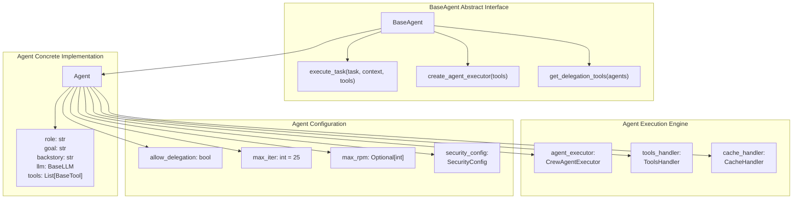
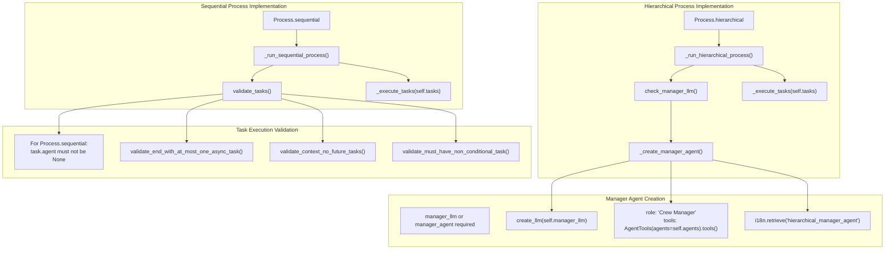
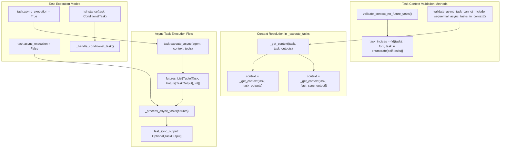
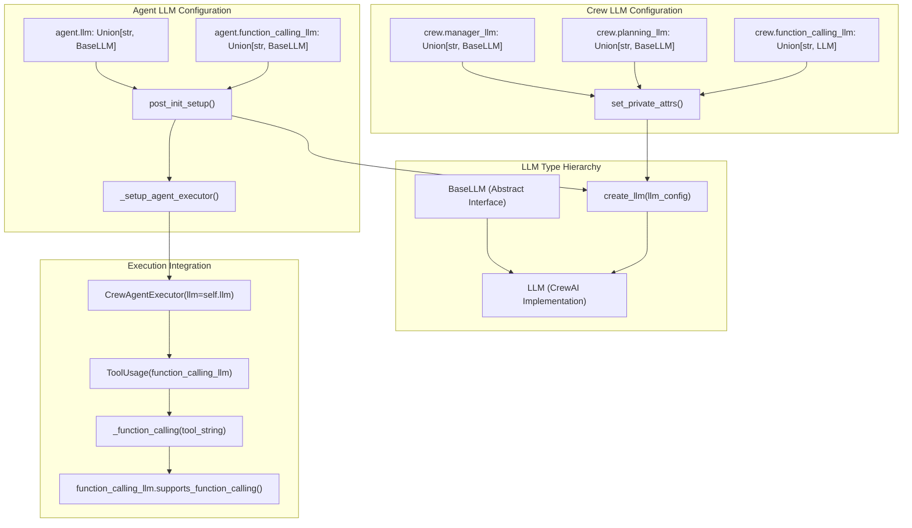
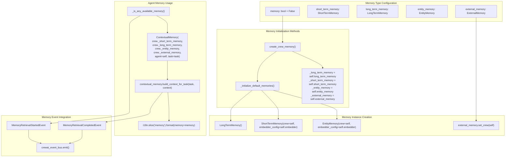
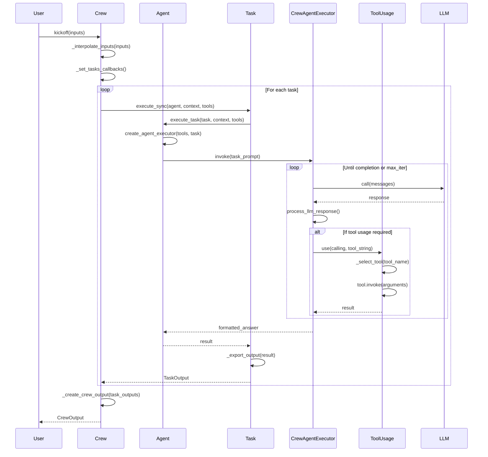

# Key Concepts

Relevant source files

The following files were used as context for generating this wiki page:

- [README.md](https://github.com/crewAIInc/crewAI/blob/81bd81e5/README.md)
- [src/crewai/agent.py](https://github.com/crewAIInc/crewAI/blob/81bd81e5/src/crewai/agent.py)
- [src/crewai/agents/agent_builder/base_agent.py](https://github.com/crewAIInc/crewAI/blob/81bd81e5/src/crewai/agents/agent_builder/base_agent.py)
- [src/crewai/crew.py](https://github.com/crewAIInc/crewAI/blob/81bd81e5/src/crewai/crew.py)
- [src/crewai/task.py](https://github.com/crewAIInc/crewAI/blob/81bd81e5/src/crewai/task.py)
- [src/crewai/tools/tool_usage.py](https://github.com/crewAIInc/crewAI/blob/81bd81e5/src/crewai/tools/tool_usage.py)
- [src/crewai/translations/en.json](https://github.com/crewAIInc/crewAI/blob/81bd81e5/src/crewai/translations/en.json)

This document covers the fundamental concepts that form the foundation of the CrewAI framework: Agents, Tasks, Crews, Tools, and their supporting systems. These concepts provide the building blocks for creating autonomous AI agent systems and multi-agent collaboration workflows.

For detailed implementation information about crew orchestration, see [Crew Orchestration](https://github.com/crewAIInc/crewAI/blob/81bd81e5/2.1). For the Flow system's event-driven approach, see [Flow System](https://github.com/crewAIInc/crewAI/blob/81bd81e5/3). For task management specifics, see [Task Management](https://github.com/crewAIInc/crewAI/blob/81bd81e5/2.3).

## Core Components

CrewAI's architecture is built around four primary components that work together to create autonomous AI systems: Agents, Tasks, Crews, and Flows.

### Agent Architecture

Agent Class Hierarchy and Core Components

The `Agent` class inherits from `BaseAgent` and represents an autonomous AI entity with a specific role, goal, and backstory. The `CrewAgentExecutor` handles the agent's task execution loop, while `ToolsHandler` manages tool usage and caching.

**Sources:** [src/crewai/agent.py:64-87](https://github.com/crewAIInc/crewAI/blob/81bd81e5/src/crewai/agent.py#L64-L87), [src/crewai/agents/agent_builder/base_agent.py:34-163](https://github.com/crewAIInc/crewAI/blob/81bd81e5/src/crewai/agents/agent_builder/base_agent.py#L34-L163), [src/crewai/agent.py:556-604](https://github.com/crewAIInc/crewAI/blob/81bd81e5/src/crewai/agent.py#L556-L604)

### Task Structure and Execution

Task Class Implementation and Execution Flow

```mermaid
graph TB
    subgraph "Task Class Core Fields"
        TaskClass["Task"]
        Description["description: str"]
        ExpectedOutput["expected_output: str"]
        Agent["agent: BaseAgent"]
        Context["context: List[Task] | None"]
        AsyncExecution["async_execution: bool = False"]
    end
    
    subgraph "Task Execution Methods"
        ExecuteSync["execute_sync(agent, context, tools)"]
        ExecuteAsync["execute_async(agent, context, tools)"]
        ExecuteCore["_execute_core(agent, context, tools)"]
        ExecuteTaskAsync["_execute_task_async()"]
    end
    
    subgraph "Task Output Configuration"
        OutputJSON["output_json: Type[BaseModel]"]
        OutputPydantic["output_pydantic: Type[BaseModel]"]
        OutputFile["output_file: str"]
        CreateDirectory["create_directory: bool = True"]
        ExportOutput["_export_output(result)"]
    end
    
    subgraph "Task Validation and Retry"
        Guardrail["guardrail: Callable | str"]
        GuardrailMaxRetries["guardrail_max_retries: int = 3"]
        RetryCount["retry_count: int = 0"]
        ProcessGuardrail["_process_guardrail(task_output)"]
    end
    
    subgraph "Task Lifecycle"
        StartTime["start_time: datetime"]
        EndTime["end_time: datetime"]
        ExecutionDuration["execution_duration property"]
        TaskOutput["output: TaskOutput"]
    end
    
    TaskClass --> Description
    TaskClass --> ExpectedOutput
    TaskClass --> Agent
    TaskClass --> Context
    TaskClass --> AsyncExecution
    ExecuteSync --> ExecuteCore
    ExecuteAsync --> ExecuteTaskAsync
    ExecuteTaskAsync --> ExecuteCore
    ExecuteCore --> ExportOutput
    ExecuteCore --> ProcessGuardrail
    TaskClass --> OutputJSON
    TaskClass --> OutputPydantic
    TaskClass --> OutputFile
    TaskClass --> CreateDirectory
    TaskClass --> Guardrail
    TaskClass --> GuardrailMaxRetries
    TaskClass --> RetryCount
    ExecuteCore --> StartTime
    ExecuteCore --> EndTime
    ExecuteCore --> TaskOutput
```

The `Task` class represents a unit of work executed by an agent. Tasks support both synchronous and asynchronous execution through `execute_sync()` and `execute_async()` methods, with the core logic handled by `_execute_core()`. Output validation is managed through guardrails with configurable retry logic.

**Sources:** [src/crewai/task.py:57-179](https://github.com/crewAIInc/crewAI/blob/81bd81e5/src/crewai/task.py#L57-L179), [src/crewai/task.py:374-381](https://github.com/crewAIInc/crewAI/blob/81bd81e5/src/crewai/task.py#L374-L381), [src/crewai/task.py:397-421](https://github.com/crewAIInc/crewAI/blob/81bd81e5/src/crewai/task.py#L397-L421), [src/crewai/task.py:423-530](https://github.com/crewAIInc/crewAI/blob/81bd81e5/src/crewai/task.py#L423-L530)

### Crew Orchestration Model

Crew Class Architecture and Execution Flow

```mermaid
graph TB
    subgraph "Crew Class Definition"
        CrewClass["Crew(FlowTrackable, BaseModel)"]
        Name["name: str = 'crew'"]
        Agents["agents: List[BaseAgent]"]
        Tasks["tasks: List[Task]"]
        Process["process: Process = Process.sequential"]
        Verbose["verbose: bool = False"]
    end
    
    subgraph "Process Implementation"
        ProcessSequential["Process.sequential"]
        ProcessHierarchical["Process.hierarchical"]
        RunSequentialProcess["_run_sequential_process()"]
        RunHierarchicalProcess["_run_hierarchical_process()"]
        ExecuteTasks["_execute_tasks(tasks, start_index, was_replayed)"]
    end
    
    subgraph "Manager Configuration"
        ManagerLLM["manager_llm: BaseLLM"]
        ManagerAgent["manager_agent: BaseAgent"]
        CreateManagerAgent["_create_manager_agent()"]
        AgentTools["AgentTools(agents=self.agents)"]
    end
    
    subgraph "Memory System Integration"
        Memory["memory: bool = False"]
        ShortTermMemory["_short_term_memory: ShortTermMemory"]
        LongTermMemory["_long_term_memory: LongTermMemory"]
        EntityMemory["_entity_memory: EntityMemory"]
        ExternalMemory["_external_memory: ExternalMemory"]
        InitializeDefaultMemories["_initialize_default_memories()"]
    end
    
    subgraph "Execution Entry Points"
        Kickoff["kickoff(inputs)"]
        KickoffForEach["kickoff_for_each(inputs)"]
        KickoffAsync["kickoff_async(inputs)"]
        KickoffForEachAsync["kickoff_for_each_async(inputs)"]
    end
    
    subgraph "Task Output Management"
        TaskOutputHandler["_task_output_handler: TaskOutputStorageHandler"]
        CreateCrewOutput["_create_crew_output(task_outputs)"]
        StoreExecutionLog["_store_execution_log(task, output, task_index)"]
    end
    
    CrewClass --> Name
    CrewClass --> Agents
    CrewClass --> Tasks
    CrewClass --> Process
    CrewClass --> Verbose
    Process --> ProcessSequential
    Process --> ProcessHierarchical
    ProcessSequential --> RunSequentialProcess
    ProcessHierarchical --> RunHierarchicalProcess
    RunSequentialProcess --> ExecuteTasks
    RunHierarchicalProcess --> ExecuteTasks
    CrewClass --> ManagerLLM
    CrewClass --> ManagerAgent
    RunHierarchicalProcess --> CreateManagerAgent
    CreateManagerAgent --> AgentTools
    CrewClass --> Memory
    Memory --> ShortTermMemory
    Memory --> LongTermMemory
    Memory --> EntityMemory
    Memory --> ExternalMemory
    Memory --> InitializeDefaultMemories
    Kickoff --> RunSequentialProcess
    Kickoff --> RunHierarchicalProcess
    CrewClass --> TaskOutputHandler
    ExecuteTasks --> CreateCrewOutput
    ExecuteTasks --> StoreExecutionLog
```

The `Crew` class orchestrates multiple agents working on a set of tasks. The `kickoff()` method initiates execution, which flows through either `_run_sequential_process()` or `_run_hierarchical_process()` depending on the configured `Process` type. All execution converges on `_execute_tasks()` which manages the task execution loop.

**Sources:** [src/crewai/crew.py:95-257](https://github.com/crewAIInc/crewAI/blob/81bd81e5/src/crewai/crew.py#L95-L257), [src/crewai/crew.py:612-684](https://github.com/crewAIInc/crewAI/blob/81bd81e5/src/crewai/crew.py#L612-L684), [src/crewai/crew.py:774-776](https://github.com/crewAIInc/crewAI/blob/81bd81e5/src/crewai/crew.py#L774-L776), [src/crewai/crew.py:778-806](https://github.com/crewAIInc/crewAI/blob/81bd81e5/src/crewai/crew.py#L778-L806), [src/crewai/crew.py:808-891](https://github.com/crewAIInc/crewAI/blob/81bd81e5/src/crewai/crew.py#L808-L891)

## Execution Models

CrewAI supports two primary execution models that determine how agents collaborate and tasks are distributed.

### Process Types and Execution Models

Process Implementation and Validation

| Process Type | Implementation Method | Manager Requirement | Task Assignment Model |
|--------------|----------------------|---------------------|---------------------|
| `Process.sequential` | `_run_sequential_process()` | None | Direct `task.agent` assignment |
| `Process.hierarchical` | `_run_hierarchical_process()` | `manager_llm` or `manager_agent` | Manager delegation via `AgentTools` |

**Sources:** [src/crewai/crew.py:774-776](https://github.com/crewAIInc/crewAI/blob/81bd81e5/src/crewai/crew.py#L774-L776), [src/crewai/crew.py:778-781](https://github.com/crewAIInc/crewAI/blob/81bd81e5/src/crewai/crew.py#L778-L781), [src/crewai/crew.py:783-806](https://github.com/crewAIInc/crewAI/blob/81bd81e5/src/crewai/crew.py#L783-L806), [src/crewai/crew.py:352-371](https://github.com/crewAIInc/crewAI/blob/81bd81e5/src/crewai/crew.py#L352-L371), [src/crewai/crew.py:395-405](https://github.com/crewAIInc/crewAI/blob/81bd81e5/src/crewai/crew.py#L395-L405), [src/crewai/crew.py:488-501](https://github.com/crewAIInc/crewAI/blob/81bd81e5/src/crewai/crew.py#L488-L501)

### Task Context and Dependencies

Task Dependency Management and Async Execution

Task context dependencies are validated through `validate_context_no_future_tasks()` and `validate_async_task_cannot_include_sequential_async_tasks_in_context()`. During execution, `_get_context()` builds context from previous task outputs, with special handling for async tasks that only receive the last synchronous output.

**Sources:** [src/crewai/crew.py:488-501](https://github.com/crewAIInc/crewAI/blob/81bd81e5/src/crewai/crew.py#L488-L501), [src/crewai/crew.py:467-485](https://github.com/crewAIInc/crewAI/blob/81bd81e5/src/crewai/crew.py#L467-L485), [src/crewai/crew.py:864-876](https://github.com/crewAIInc/crewAI/blob/81bd81e5/src/crewai/crew.py#L864-L876), [src/crewai/crew.py:893-917](https://github.com/crewAIInc/crewAI/blob/81bd81e5/src/crewai/crew.py#L893-L917), [src/crewai/crew.py:1406-1426](https://github.com/crewAIInc/crewAI/blob/81bd81e5/src/crewai/crew.py#L1406-L1426)

## Supporting Systems

### LLM Integration Architecture

LLM Configuration and Usage Patterns

LLM integration follows a pattern where string configurations are converted to `BaseLLM` instances via `create_llm()`. Agents maintain separate LLMs for reasoning (`agent.llm`) and function calling (`agent.function_calling_llm`), while crews can override these with `manager_llm` and `function_calling_llm` settings.

**Sources:** [src/crewai/agent.py:104-109](https://github.com/crewAIInc/crewAI/blob/81bd81e5/src/crewai/agent.py#L104-L109), [src/crewai/agent.py:188-204](https://github.com/crewAIInc/crewAI/blob/81bd81e5/src/crewai/agent.py#L188-L204), [src/crewai/crew.py:175-183](https://github.com/crewAIInc/crewAI/blob/81bd81e5/src/crewai/crew.py#L175-L183), [src/crewai/crew.py:298-300](https://github.com/crewAIInc/crewAI/blob/81bd81e5/src/crewai/crew.py#L298-L300), [src/crewai/crew.py:649-651](https://github.com/crewAIInc/crewAI/blob/81bd81e5/src/crewai/crew.py#L649-L651)

### Tool System Architecture

Tool Usage Flow and Event Integration

```mermaid
graph TB
    subgraph "Tool Class Hierarchy"
        BaseTool["BaseTool (Abstract Base)"]
        CrewStructuredTool["CrewStructuredTool"]
        ToolFromLangchain["Tool.from_langchain()"]
    end
    
    subgraph "ToolUsage Class Components"
        ToolUsageInit["ToolUsage.__init__(<br/>tools_handler, tools, task,<br/>function_calling_llm, agent)"]
        ToolsDescription["tools_description:<br/>render_text_description_and_args(tools)"]
        ToolsNames["tools_names: get_tool_names(tools)"]
        MaxParsingAttempts["_max_parsing_attempts: int"]
    end
    
    subgraph "Tool Calling Methods"
        ParseToolCalling["parse_tool_calling(tool_string)"]
        ToolCalling["_tool_calling(tool_string)"]
        OriginalToolCalling["_original_tool_calling(tool_string)"]
        FunctionCalling["_function_calling(tool_string)"]
        ValidateToolInput["_validate_tool_input(tool_input)"]
    end
    
    subgraph "Tool Selection and Execution"
        UseMethod["use(calling, tool_string)"]
        SelectTool["_select_tool(tool_name)"]
        SequenceMatcher["SequenceMatcher similarity > 0.85"]
        ToolInvoke["tool.invoke(input=arguments)"]
        CheckUsageLimit["_check_usage_limit(tool, tool_name)"]
    end
    
    subgraph "Tool Usage Events"
        ToolUsageStartedEvent["ToolUsageStartedEvent"]
        ToolUsageFinishedEvent["ToolUsageFinishedEvent"] 
        ToolUsageErrorEvent["ToolUsageErrorEvent"]
        ToolSelectionErrorEvent["ToolSelectionErrorEvent"]
        CrewaiEventBus["crewai_event_bus.emit()"]
    end
    
    BaseTool --> CrewStructuredTool
    ToolFromLangchain --> CrewStructuredTool
    ToolUsageInit --> ToolsDescription
    ToolUsageInit --> ToolsNames
    ParseToolCalling --> ToolCalling
    ToolCalling --> OriginalToolCalling
    ToolCalling --> FunctionCalling
    OriginalToolCalling --> ValidateToolInput
    UseMethod --> SelectTool
    SelectTool --> SequenceMatcher
    UseMethod --> ToolInvoke
    UseMethod --> CheckUsageLimit
    UseMethod --> ToolUsageStartedEvent
    UseMethod --> ToolUsageFinishedEvent
    SelectTool --> ToolSelectionErrorEvent
    ToolUsageStartedEvent --> CrewaiEventBus
    ToolUsageFinishedEvent --> CrewaiEventBus
    ToolUsageErrorEvent --> CrewaiEventBus
    ToolSelectionErrorEvent --> CrewaiEventBus
```

Tool execution is managed by the `ToolUsage` class which handles tool selection via fuzzy string matching (`SequenceMatcher`), input validation through multiple parsing attempts, and comprehensive event emission. Tool selection uses similarity scoring with a 0.85 threshold, and all tool operations emit events through `crewai_event_bus`.

**Sources:** [src/crewai/tools/tool_usage.py:55-93](https://github.com/crewAIInc/crewAI/blob/81bd81e5/src/crewai/tools/tool_usage.py#L55-L93), [src/crewai/tools/tool_usage.py:103-105](https://github.com/crewAIInc/crewAI/blob/81bd81e5/src/crewai/tools/tool_usage.py#L103-L105), [src/crewai/tools/tool_usage.py:107-144](https://github.com/crewAIInc/crewAI/blob/81bd81e5/src/crewai/tools/tool_usage.py#L107-L144), [src/crewai/tools/tool_usage.py:377-422](https://github.com/crewAIInc/crewAI/blob/81bd81e5/src/crewai/tools/tool_usage.py#L377-L422), [src/crewai/tools/tool_usage.py:489-511](https://github.com/crewAIInc/crewAI/blob/81bd81e5/src/crewai/tools/tool_usage.py#L489-L511)

### Memory Systems Integration

Memory System Architecture and Usage

Memory systems are initialized through the `create_crew_memory()` validator, which sets up private memory attributes. When `memory=True`, default instances are created via `_initialize_default_memories()`. During task execution, agents use `ContextualMemory` to build context from all available memory systems, with comprehensive event tracking for memory retrieval operations.

**Sources:** [src/crewai/crew.py:147-166](https://github.com/crewAIInc/crewAI/blob/81bd81e5/src/crewai/crew.py#L147-L166), [src/crewai/crew.py:313-328](https://github.com/crewAIInc/crewAI/blob/81bd81e5/src/crewai/crew.py#L313-L328), [src/crewai/crew.py:303-311](https://github.com/crewAIInc/crewAI/blob/81bd81e5/src/crewai/crew.py#L303-L311), [src/crewai/agent.py:229-242](https://github.com/crewAIInc/crewAI/blob/81bd81e5/src/crewai/agent.py#L229-L242), [src/crewai/agent.py:317-352](https://github.com/crewAIInc/crewAI/blob/81bd81e5/src/crewai/agent.py#L317-L352)

## Component Interactions

The following diagram shows how the core components interact during a typical execution cycle:

