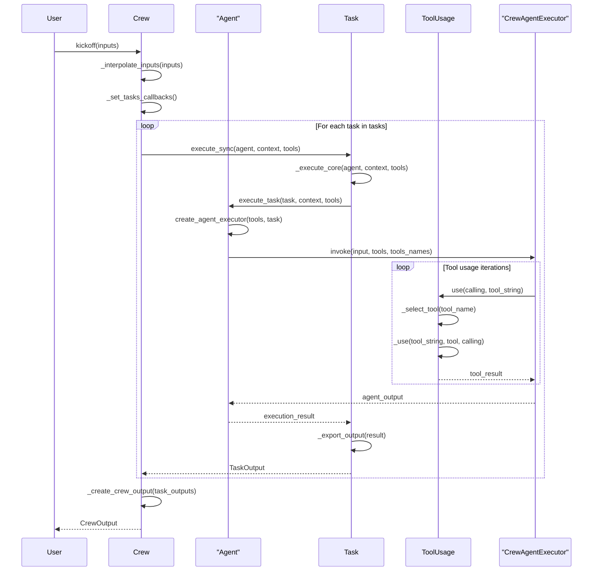
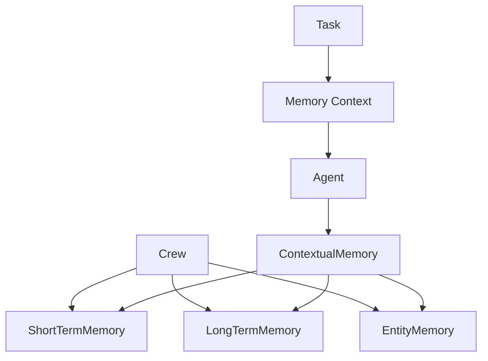

# Core Components

<details>
<summary>Relevant source files</summary>

The following files were used as context for generating this wiki page:

- [src/crewai/agent.py](https://github.com/crewAIInc/crewAI/blob/81bd81e5/src/crewai/agent.py)
- [src/crewai/agents/agent_builder/base_agent.py](https://github.com/crewAIInc/crewAI/blob/81bd81e5/src/crewai/agents/agent_builder/base_agent.py)
- [src/crewai/crew.py](https://github.com/crewAIInc/crewAI/blob/81bd81e5/src/crewai/crew.py)
- [src/crewai/task.py](https://github.com/crewAIInc/crewAI/blob/81bd81e5/src/crewai/task.py)
- [src/crewai/tools/tool_usage.py](https://github.com/crewAIInc/crewAI/blob/81bd81e5/src/crewai/tools/tool_usage.py)
- [src/crewai/translations/en.json](https://github.com/crewAIInc/crewAI/blob/81bd81e5/src/crewai/translations/en.json)

</details>


## Purpose and Scope

This document covers the fundamental building blocks of the CrewAI framework that enable multi-agent orchestration and task execution. The core components include the `Crew` orchestration system, `Agent` execution engines, `Task` management, and `Tool` usage patterns that work together to coordinate AI agents in collaborative workflows.

For detailed information about specific orchestration patterns, see [Crew Orchestration](#2.1). For agent execution patterns and lifecycle management, see [Agent Execution](#2.2). For task definition and management, see [Task Management](#2.3). For process execution types, see [Process Types](#2.4). For tool integration and usage, see [Tools and Agent Actions](#2.5).

## Core Architecture Overview

The CrewAI framework is built around four primary components that work in concert to enable multi-agent collaboration:

### Core Component Class Hierarchy

```mermaid
classDiagram
    class Crew {
        +List~BaseAgent~ agents
        +List~Task~ tasks
        +Process process
        +BaseAgent manager_agent
        +kickoff() CrewOutput
        +_execute_tasks() CrewOutput
        +_run_sequential_process() CrewOutput
        +_run_hierarchical_process() CrewOutput
    }
    
    class BaseAgent {
        <<abstract>>
        +UUID4 id
        +str role
        +str goal  
        +str backstory
        +List~BaseTool~ tools
        +execute_task() str
        +create_agent_executor() void
        +get_delegation_tools() List~BaseTool~
    }
    
    class Agent {
        +CrewAgentExecutor agent_executor
        +BaseLLM llm
        +execute_task() str
        +create_agent_executor() void
        +_execute_with_timeout() str
        +_execute_without_timeout() str
    }
    
    class Task {
        +UUID4 id
        +str description
        +str expected_output
        +BaseAgent agent
        +List~Task~ context
        +bool async_execution
        +execute_sync() TaskOutput
        +execute_async() Future~TaskOutput~
        +_execute_core() TaskOutput
    }
    
    class ToolUsage {
        +ToolsHandler tools_handler
        +List~CrewStructuredTool~ tools
        +Task task
        +use() str
        +parse_tool_calling() ToolCalling
        +_select_tool() CrewStructuredTool
    }
    
    Crew ||--o{ BaseAgent : "manages"
    Crew ||--o{ Task : "executes"
    BaseAgent <|-- Agent : "implements"
    Agent ||--o{ Task : "executes"
    Agent ||--o{ ToolUsage : "uses"
    Task ||--o{ ToolUsage : "utilizes"
```

**Sources**: [src/crewai/crew.py:95-257](), [src/crewai/agents/agent_builder/base_agent.py:34-163](), [src/crewai/agent.py:64-181](), [src/crewai/task.py:57-180](), [src/crewai/tools/tool_usage.py:55-94]()

## Execution Flow Architecture

The core components interact through a well-defined execution pipeline that coordinates agent collaboration:

### Component Interaction Flow



**Sources**: [src/crewai/crew.py:612-684](), [src/crewai/task.py:374-530](), [src/crewai/agent.py:244-502](), [src/crewai/tools/tool_usage.py:107-327]()

## Component Definitions

### Crew Class

The `Crew` class serves as the central orchestration engine that manages the lifecycle of multi-agent workflows. Located in [src/crewai/crew.py](), it coordinates agent assignments, task dependencies, and execution processes.

| Attribute | Type | Purpose |
|-----------|------|---------|
| `agents` | `List[BaseAgent]` | Collection of agents participating in the crew |
| `tasks` | `List[Task]` | Sequential or hierarchical tasks to execute |
| `process` | `Process` | Execution strategy (sequential, hierarchical) |
| `manager_agent` | `BaseAgent` | Optional manager for hierarchical processes |
| `memory` | `bool` | Enable persistent memory across executions |

Key orchestration methods:
- `kickoff()` - Initiates crew execution with input interpolation
- `_execute_tasks()` - Core task execution loop with dependency management  
- `_run_sequential_process()` - Linear task execution pattern
- `_run_hierarchical_process()` - Manager-supervised execution pattern

### BaseAgent and Agent Classes

The agent system implements a two-tier architecture with `BaseAgent` as the abstract interface and `Agent` as the concrete implementation.

**BaseAgent** [src/crewai/agents/agent_builder/base_agent.py:34-367]() defines the agent contract:

| Attribute | Type | Purpose |
|-----------|------|---------|
| `role` | `str` | Agent's functional responsibility |
| `goal` | `str` | Primary objective guiding agent behavior |
| `backstory` | `str` | Context that shapes agent reasoning |
| `tools` | `List[BaseTool]` | Available capabilities for task execution |

**Agent** [src/crewai/agent.py:64-832]() provides the concrete implementation with:
- `CrewAgentExecutor` integration for LLM-based reasoning
- Tool usage coordination through `ToolUsage` class
- Memory integration for contextual awareness
- Timeout and retry mechanisms for robust execution

### Task Class

The `Task` class [src/crewai/task.py:57-830]() encapsulates work units with execution context and output specifications:

| Attribute | Type | Purpose |
|-----------|------|---------|
| `description` | `str` | Natural language task definition |
| `expected_output` | `str` | Success criteria and output format |
| `agent` | `BaseAgent` | Designated executor (optional for hierarchical) |
| `context` | `List[Task]` | Dependency tasks providing input context |
| `async_execution` | `bool` | Enable parallel execution capability |

Task execution follows a structured pipeline:
1. `execute_sync()` / `execute_async()` - Entry points for task execution
2. `_execute_core()` - Core execution logic with error handling
3. `_export_output()` - Format conversion for structured outputs

### Tool System

The tool system enables agents to interact with external systems and APIs through a structured interface:

**ToolUsage** [src/crewai/tools/tool_usage.py:55-685]() manages tool execution:
- `use()` - Primary tool execution interface with error handling
- `parse_tool_calling()` - LLM output parsing to structured tool calls
- `_select_tool()` - Fuzzy matching for tool selection
- `_validate_tool_input()` - Input validation and format conversion

**Tool Integration Patterns**:
- Function calling for compatible LLMs through `InstructorToolCalling`
- Fallback parsing for generic LLMs through `ToolCalling` 
- Caching layer for repeated tool invocations
- Usage limiting and monitoring capabilities

**Sources**: [src/crewai/crew.py:95-257](), [src/crewai/agents/agent_builder/base_agent.py:34-163](), [src/crewai/agent.py:64-181](), [src/crewai/task.py:57-180](), [src/crewai/tools/tool_usage.py:55-94]()

## Integration Patterns

### Memory Integration

Core components integrate with the memory system to provide context persistence:



**Sources**: [src/crewai/crew.py:303-328](), [src/crewai/agent.py:317-352]()

### Process Execution Modes

The `Process` enum defines execution strategies that alter component coordination:

| Process Type | Coordination Pattern | Manager Role |
|--------------|---------------------|--------------|
| `Process.sequential` | Linear task chain with context passing | None |  
| `Process.hierarchical` | Manager delegates to specialized agents | Required |

**Sequential Process** [src/crewai/crew.py:774-777]():
- Tasks execute in defined order
- Each task receives context from previous tasks
- Agent assignment must be explicit for each task

**Hierarchical Process** [src/crewai/crew.py:778-782]():
- Manager agent coordinates task delegation
- Dynamic agent selection based on task requirements
- Enhanced coordination through `AgentTools` delegation