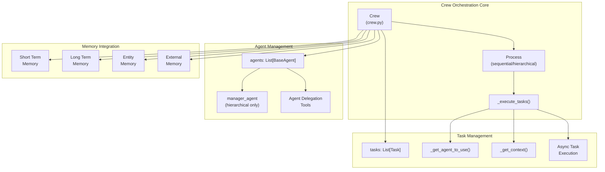
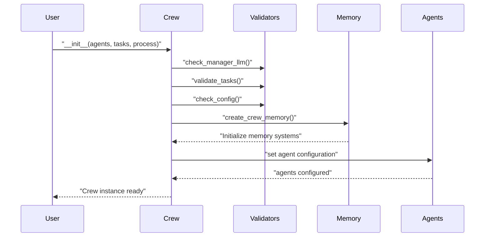
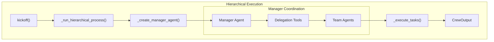
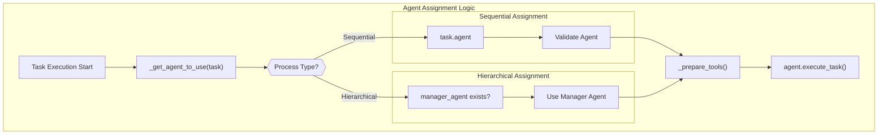
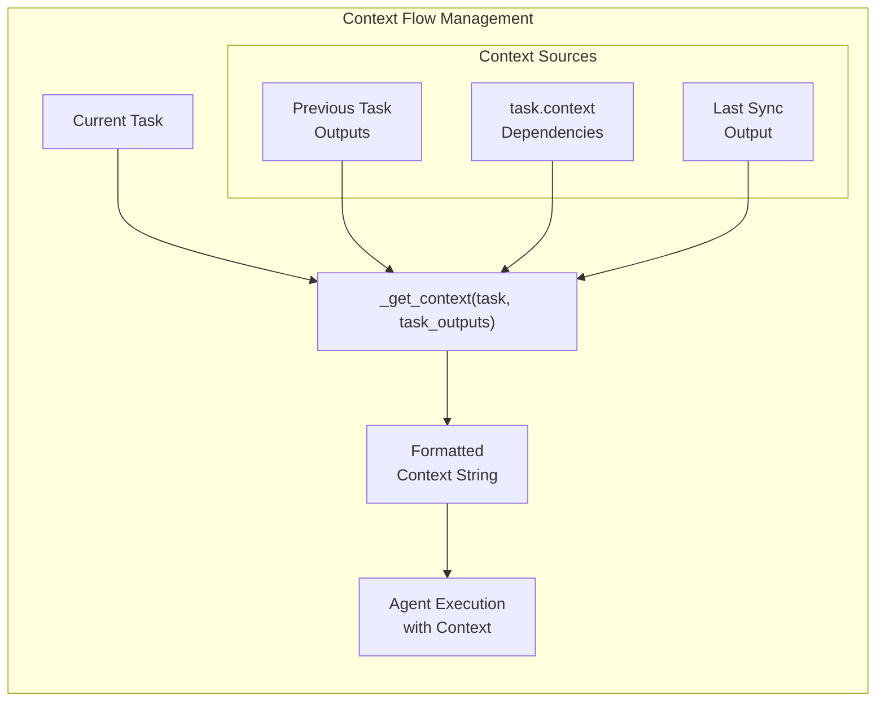
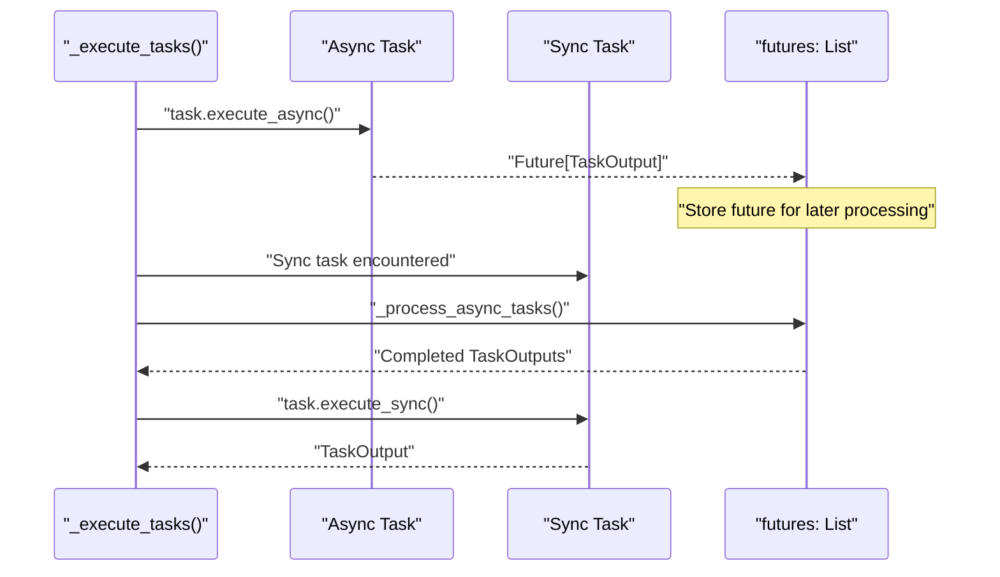
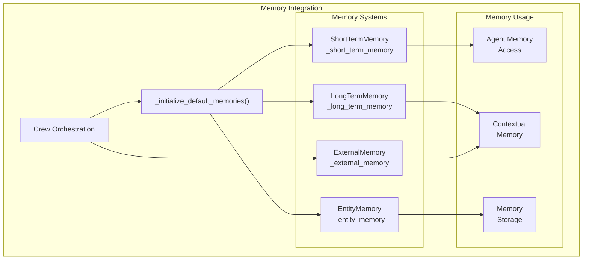
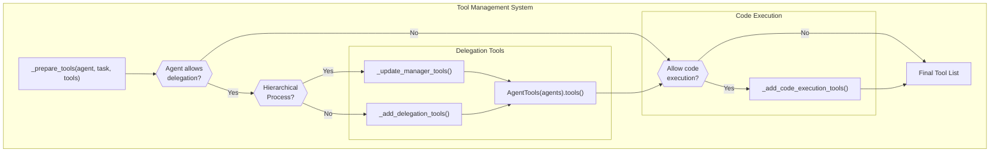
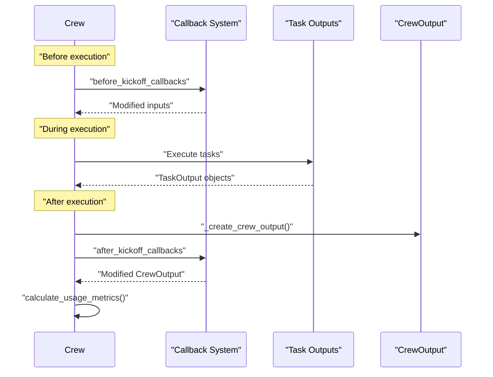

# Crew Orchestration

<details>
<summary>Relevant source files</summary>

The following files were used as context for generating this wiki page:

- [src/crewai/agent.py](https://github.com/crewAIInc/crewAI/blob/81bd81e5/src/crewai/agent.py)
- [src/crewai/agents/agent_builder/base_agent.py](https://github.com/crewAIInc/crewAI/blob/81bd81e5/src/crewai/agents/agent_builder/base_agent.py)
- [src/crewai/crew.py](https://github.com/crewAIInc/crewAI/blob/81bd81e5/src/crewai/crew.py)
- [src/crewai/task.py](https://github.com/crewAIInc/crewAI/blob/81bd81e5/src/crewai/task.py)
- [src/crewai/tools/tool_usage.py](https://github.com/crewAIInc/crewAI/blob/81bd81e5/src/crewai/tools/tool_usage.py)
- [src/crewai/translations/en.json](https://github.com/crewAIInc/crewAI/blob/81bd81e5/src/crewai/translations/en.json)

</details>


This document covers the core orchestration system that coordinates agents and tasks within CrewAI. Crew orchestration manages the execution flow, agent assignment, task dependencies, and process coordination. For information about individual agent behavior and execution patterns, see [Agent Execution](#2.2). For task-specific management and output handling, see [Task Management](#2.3). For process-specific coordination patterns, see [Process Types](#2.4).

## Overview and Architecture

The `Crew` class serves as the central orchestrator that manages collections of agents and tasks, coordinating their execution through defined processes. The orchestration system handles agent-task assignment, execution flow control, context passing between tasks, and integration with memory and knowledge systems.



Sources: [src/crewai/crew.py:95-257](https://github.com/crewAIInc/crewAI/blob/81bd81e5/src/crewai/crew.py#L95-L257), [src/crewai/crew.py:774-892](https://github.com/crewAIInc/crewAI/blob/81bd81e5/src/crewai/crew.py#L774-L892)

## Crew Initialization and Configuration

The `Crew` class initializes with agents, tasks, and configuration parameters that define how orchestration will proceed. Key initialization components include process type selection, memory system setup, and agent-task validation.

| Configuration | Type | Description |
|---------------|------|-------------|
| `agents` | `List[BaseAgent]` | List of agents available for task execution |
| `tasks` | `List[Task]` | Ordered list of tasks to be executed |
| `process` | `Process` | Execution process (sequential or hierarchical) |
| `memory` | `bool` | Enable memory systems for context retention |
| `manager_llm` | `BaseLLM` | Language model for manager agent in hierarchical process |
| `manager_agent` | `BaseAgent` | Custom manager agent for hierarchical coordination |



Sources: [src/crewai/crew.py:283-301](https://github.com/crewAIInc/crewAI/blob/81bd81e5/src/crewai/crew.py#L283-L301), [src/crewai/crew.py:313-349](https://github.com/crewAIInc/crewAI/blob/81bd81e5/src/crewai/crew.py#L313-L349), [src/crewai/crew.py:352-392](https://github.com/crewAIInc/crewAI/blob/81bd81e5/src/crewai/crew.py#L352-L392)

## Process Execution Flow

The orchestration system supports two main execution processes: sequential and hierarchical. The `kickoff()` method serves as the entry point for crew execution, coordinating the chosen process type.

### Sequential Process Flow

In sequential process, tasks execute in order with each task's output serving as context for subsequent tasks.

```mermaid
graph LR
    subgraph "Sequential Execution"
        kickoff["kickoff()"]
        interpolate["_interpolate_inputs()"]
        sequential["_run_sequential_process()"]
        execute["_execute_tasks()"]
        
        subgraph "Task Loop"
            task1["Task 1<br/>Agent A"]
            task2["Task 2<br/>Agent B"]  
            task3["Task 3<br/>Agent C"]
            context["Context<br/>Passing"]
        end
        
        output["CrewOutput"]
    end
    
    kickoff --> interpolate
    interpolate --> sequential
    sequential --> execute
    execute --> task1
    task1 --> context
    context --> task2
    task2 --> context
    context --> task3
    task3 --> output
```

Sources: [src/crewai/crew.py:612-683](https://github.com/crewAIInc/crewAI/blob/81bd81e5/src/crewai/crew.py#L612-L683), [src/crewai/crew.py:774-776](https://github.com/crewAIInc/crewAI/blob/81bd81e5/src/crewai/crew.py#L774-L776)

### Hierarchical Process Flow

In hierarchical process, a manager agent coordinates task delegation among team members.



Sources: [src/crewai/crew.py:778-806](https://github.com/crewAIInc/crewAI/blob/81bd81e5/src/crewai/crew.py#L778-L806), [src/crewai/translations/en.json:2-6](https://github.com/crewAIInc/crewAI/blob/81bd81e5/src/crewai/translations/en.json#L2-L6)

## Task Assignment and Agent Coordination

The orchestration system assigns agents to tasks using `_get_agent_to_use()` method, which handles both direct assignment and manager delegation scenarios.



Sources: [src/crewai/crew.py:838-851](https://github.com/crewAIInc/crewAI/blob/81bd81e5/src/crewai/crew.py#L838-L851), [src/crewai/crew.py:919-943](https://github.com/crewAIInc/crewAI/blob/81bd81e5/src/crewai/crew.py#L919-L943)

## Context Management and Task Dependencies

The orchestration system manages task context through `_get_context()` method, which aggregates outputs from previous tasks and specific context dependencies.

| Context Type | Source | Usage |
|--------------|--------|-------|
| Sequential Context | Previous task outputs | Automatic context passing |
| Explicit Context | `task.context` list | Specific task dependencies |
| Async Context | Last synchronous output | Context for async tasks |



Sources: [src/crewai/crew.py:951-974](https://github.com/crewAIInc/crewAI/blob/81bd81e5/src/crewai/crew.py#L951-L974), [src/crewai/crew.py:864-891](https://github.com/crewAIInc/crewAI/blob/81bd81e5/src/crewai/crew.py#L864-L891)

## Asynchronous Task Execution

The orchestration system supports asynchronous task execution through `Future` objects, managing both async and synchronous task coordination.



Sources: [src/crewai/crew.py:863-889](https://github.com/crewAIInc/crewAI/blob/81bd81e5/src/crewai/crew.py#L863-L889), [src/crewai/crew.py:976-988](https://github.com/crewAIInc/crewAI/blob/81bd81e5/src/crewai/crew.py#L976-L988)

## Memory Integration in Orchestration  

The crew orchestration integrates with multiple memory systems to maintain context across task executions and crew runs.



Sources: [src/crewai/crew.py:303-328](https://github.com/crewAIInc/crewAI/blob/81bd81e5/src/crewai/crew.py#L303-L328), [src/crewai/crew.py:147-166](https://github.com/crewAIInc/crewAI/blob/81bd81e5/src/crewai/crew.py#L147-L166)

## Tool Management and Delegation

The orchestration system manages tool distribution and delegation capabilities across agents, with special handling for hierarchical processes.



Sources: [src/crewai/crew.py:919-950](https://github.com/crewAIInc/crewAI/blob/81bd81e5/src/crewai/crew.py#L919-L950), [src/crewai/translations/en.json:47-48](https://github.com/crewAIInc/crewAI/blob/81bd81e5/src/crewai/translations/en.json#L47-L48)

## Output Aggregation and Callbacks

The orchestration system aggregates task outputs and manages callback execution throughout the crew lifecycle.

