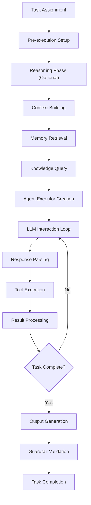
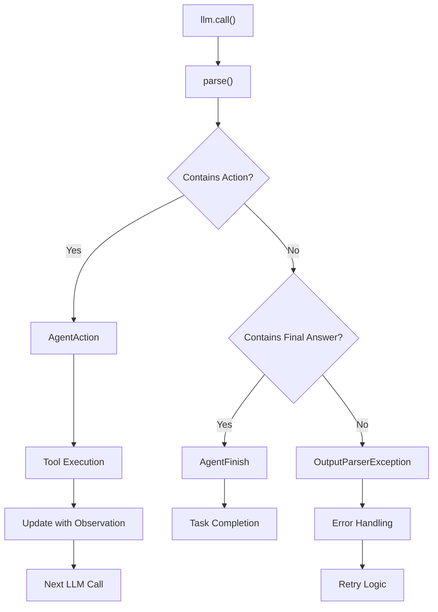
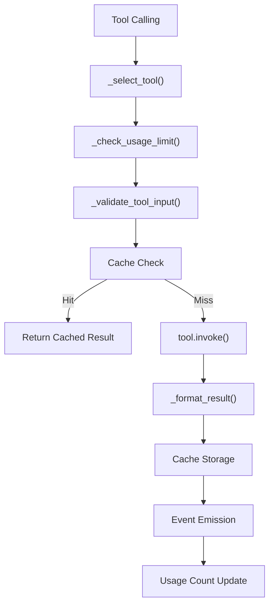
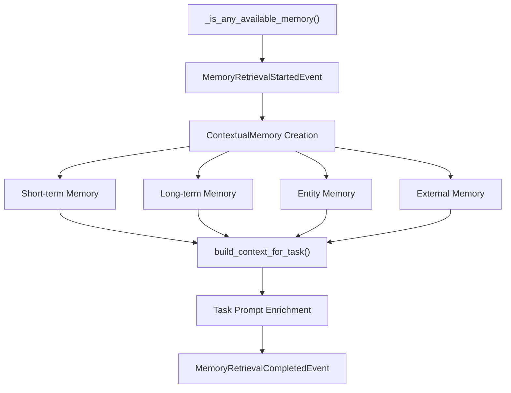
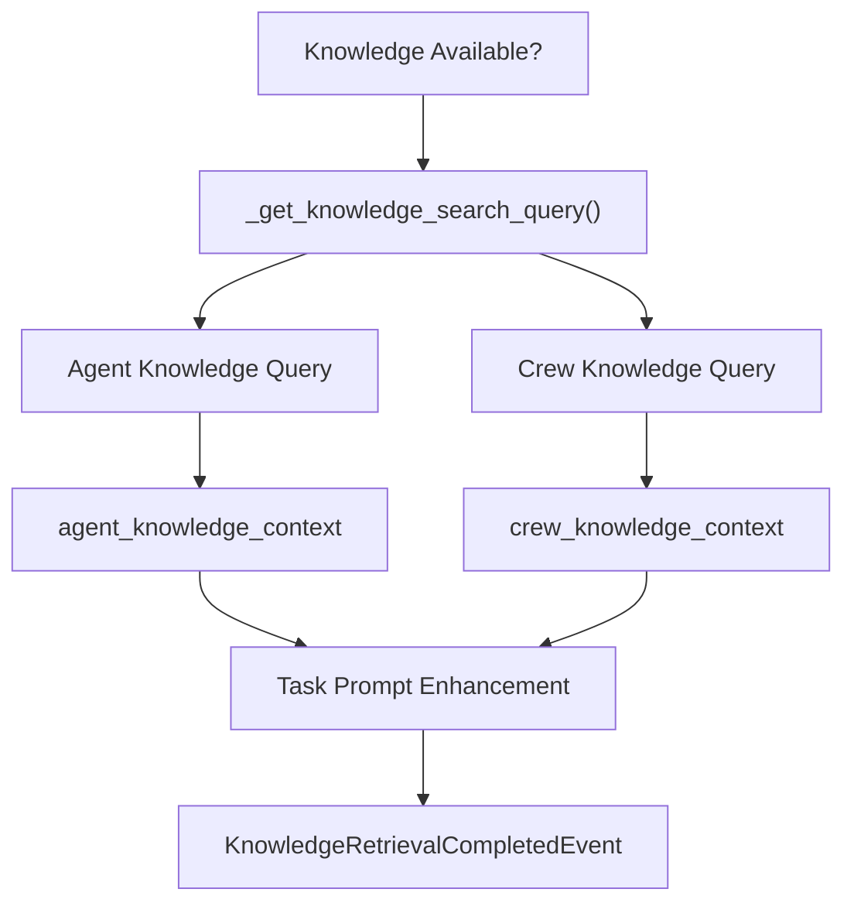
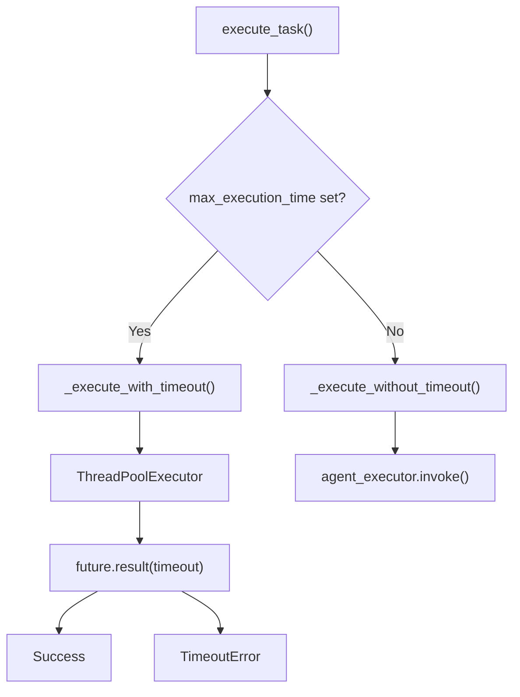
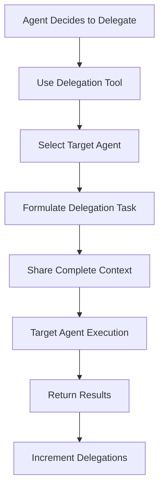

# Agent Execution

Relevant source files

The following files were used as context for generating this wiki page:

- [src/crewai/agent.py](https://github.com/crewAIInc/crewAI/blob/81bd81e5/src/crewai/agent.py)
- [src/crewai/agents/__init__.py](https://github.com/crewAIInc/crewAI/blob/81bd81e5/src/crewai/agents/__init__.py)
- [src/crewai/agents/agent_builder/base_agent.py](https://github.com/crewAIInc/crewAI/blob/81bd81e5/src/crewai/agents/agent_builder/base_agent.py)
- [src/crewai/agents/constants.py](https://github.com/crewAIInc/crewAI/blob/81bd81e5/src/crewai/agents/constants.py)
- [src/crewai/agents/parser.py](https://github.com/crewAIInc/crewAI/blob/81bd81e5/src/crewai/agents/parser.py)
- [src/crewai/agents/tools_handler.py](https://github.com/crewAIInc/crewAI/blob/81bd81e5/src/crewai/agents/tools_handler.py)
- [src/crewai/cli/crew_chat.py](https://github.com/crewAIInc/crewAI/blob/81bd81e5/src/crewai/cli/crew_chat.py)
- [src/crewai/crew.py](https://github.com/crewAIInc/crewAI/blob/81bd81e5/src/crewai/crew.py)
- [src/crewai/task.py](https://github.com/crewAIInc/crewAI/blob/81bd81e5/src/crewai/task.py)
- [src/crewai/tools/tool_usage.py](https://github.com/crewAIInc/crewAI/blob/81bd81e5/src/crewai/tools/tool_usage.py)
- [src/crewai/translations/en.json](https://github.com/crewAIInc/crewAI/blob/81bd81e5/src/crewai/translations/en.json)
- [src/crewai/utilities/agent_utils.py](https://github.com/crewAIInc/crewAI/blob/81bd81e5/src/crewai/utilities/agent_utils.py)
- [src/crewai/utilities/llm_utils.py](https://github.com/crewAIInc/crewAI/blob/81bd81e5/src/crewai/utilities/llm_utils.py)
- [tests/agents/test_crew_agent_parser.py](https://github.com/crewAIInc/crewAI/blob/81bd81e5/tests/agents/test_crew_agent_parser.py)

Agent execution is the core process by which individual agents in CrewAI perform their assigned tasks, interact with tools, and communicate with other agents. This document covers the execution lifecycle, LLM interactions, tool usage, memory integration, and error handling mechanisms that enable agents to complete complex tasks autonomously.

For information about how multiple agents are orchestrated together, see [Crew Orchestration](#2.1). For details about task definition and management, see [Task Management](#2.3).

## Agent Execution Lifecycle

The agent execution process follows a structured lifecycle from task assignment through completion. The primary entry point is through the `execute_task` method in the `Agent` class.

The execution begins when `execute_task` is called on an agent instance. The method handles timeout management, reasoning (if enabled), and orchestrates the entire execution flow.

Sources: [src/crewai/agent.py:244-502](https://github.com/crewAIInc/crewAI/blob/81bd81e5/src/crewai/agent.py#L244-L502), [src/crewai/task.py:374-530](https://github.com/crewAIInc/crewAI/blob/81bd81e5/src/crewai/task.py#L374-L530)

## Task Execution Methods

CrewAI provides both synchronous and asynchronous task execution capabilities through the `Task` class. Tasks can be executed individually or as part of a crew workflow.

### Synchronous Execution

```mermaid
graph LR
    TaskSync["execute_sync()"] --> ExecuteCore["_execute_core()"]
    ExecuteCore --> AgentSetup["Agent Setup"]
    AgentSetup --> ToolPreparation["Tool Preparation"]
    ToolPreparation --> AgentExecuteTask["agent.execute_task()"]
    AgentExecuteTask --> OutputExport["_export_output()"]
    OutputExport --> TaskOutput["TaskOutput Creation"]
    TaskOutput --> GuardrailCheck["Guardrail Processing"]
    GuardrailCheck --> FileOutput["File Output (Optional)"]
    FileOutput --> EventEmission["Event Emission"]
```

### Asynchronous Execution

The `execute_async` method creates a `Future` object and runs the task in a separate thread, allowing for non-blocking execution in crew workflows.

Sources: [src/crewai/task.py:374-421](https://github.com/crewAIInc/crewAI/blob/81bd81e5/src/crewai/task.py#L374-L421), [src/crewai/task.py:423-530](https://github.com/crewAIInc/crewAI/blob/81bd81e5/src/crewai/task.py#L423-L530)

## LLM Interaction and Response Parsing

Agent execution relies heavily on LLM interactions to generate responses and determine actions. The system uses a structured approach to parse LLM outputs into actionable commands.

The parsing system uses regular expressions to extract structured information from LLM responses, handling various formats and edge cases.

Sources: [src/crewai/agents/parser.py:63-134](https://github.com/crewAIInc/crewAI/blob/81bd81e5/src/crewai/agents/parser.py#L63-L134), [src/crewai/agents/constants.py:8-27](https://github.com/crewAIInc/crewAI/blob/81bd81e5/src/crewai/agents/constants.py#L8-L27)

## Tool Integration and Usage

Tool execution is a critical component of agent execution, allowing agents to perform actions beyond text generation. The `ToolUsage` class manages tool selection, validation, and execution.

### Tool Usage Flow

### Tool Selection and Validation

The system uses fuzzy matching to select the most appropriate tool when exact matches are not found, with a similarity threshold of 0.85.

Sources: [src/crewai/tools/tool_usage.py:55-327](https://github.com/crewAIInc/crewAI/blob/81bd81e5/src/crewai/tools/tool_usage.py#L55-L327), [src/crewai/tools/tool_usage.py:377-422](https://github.com/crewAIInc/crewAI/blob/81bd81e5/src/crewai/tools/tool_usage.py#L377-L422)

## Memory and Knowledge Integration

Agent execution integrates with multiple memory systems to provide context and maintain state across interactions.

### Memory Integration Flow

### Knowledge Integration

The system queries both agent-specific and crew-level knowledge sources to enrich task context.

Sources: [src/crewai/agent.py:317-418](https://github.com/crewAIInc/crewAI/blob/81bd81e5/src/crewai/agent.py#L317-L418), [src/crewai/agent.py:353-418](https://github.com/crewAIInc/crewAI/blob/81bd81e5/src/crewai/agent.py#L353-L418)

## Error Handling and Retry Logic

The agent execution system includes comprehensive error handling and retry mechanisms to ensure robust task completion.

### Retry Mechanisms

| Error Type | Retry Strategy | Max Attempts | Implementation |
|------------|----------------|--------------|----------------|
| Tool Usage Errors | Incremental retry with tool re-selection | 3 (configurable via `max_parsing_attempts`) | `ToolUsage._run_attempts` |
| Agent Execution Errors | Task-level retry | Configurable via `max_retry_limit` | `Agent._times_executed` |
| Guardrail Failures | Task re-execution with error context | Configurable via `guardrail_max_retries` | `Task.retry_count` |
| Timeout Errors | No retry (immediate failure) | 1 | `Agent._execute_with_timeout` |

### Timeout Management

Agents support maximum execution time limits to prevent runaway processes:

Sources: [src/crewai/agent.py:504-536](https://github.com/crewAIInc/crewAI/blob/81bd81e5/src/crewai/agent.py#L504-L536), [src/crewai/agent.py:454-487](https://github.com/crewAIInc/crewAI/blob/81bd81e5/src/crewai/agent.py#L454-L487), [src/crewai/task.py:463-486](https://github.com/crewAIInc/crewAI/blob/81bd81e5/src/crewai/task.py#L463-L486)

## Agent Delegation and Communication

Agents can delegate tasks to other agents within the crew through specialized delegation tools when `allow_delegation` is enabled.

### Delegation Flow

### Tool-Based Communication

The system provides two primary communication tools:
- **Delegate work to coworker**: For assigning specific tasks
- **Ask question to coworker**: For seeking information or clarification

Sources: [src/crewai/task.py:684-688](https://github.com/crewAIInc/crewAI/blob/81bd81e5/src/crewai/task.py#L684-L688), [src/crewai/tools/tool_usage.py:218-227](https://github.com/crewAIInc/crewAI/blob/81bd81e5/src/crewai/tools/tool_usage.py#L218-L227)

## Code Entity Mapping

The following table maps key agent execution concepts to their corresponding code entities:

| Concept | Primary Class | Key Methods | File Location |
|---------|---------------|-------------|---------------|
| Agent Execution | `Agent` | `execute_task()`, `create_agent_executor()` | [src/crewai/agent.py]() |
| Task Execution | `Task` | `execute_sync()`, `execute_async()`, `_execute_core()` | [src/crewai/task.py]() |
| Response Parsing | `parser` module | `parse()`, `_extract_thought()`, `_clean_action()` | [src/crewai/agents/parser.py]() |
| Tool Usage | `ToolUsage` | `use()`, `_select_tool()`, `_validate_tool_input()` | [src/crewai/tools/tool_usage.py]() |
| Agent Executor | `CrewAgentExecutor` | `invoke()` | Referenced in agent creation |
| Memory Integration | `ContextualMemory` | `build_context_for_task()` | [src/crewai/memory/contextual/]() |