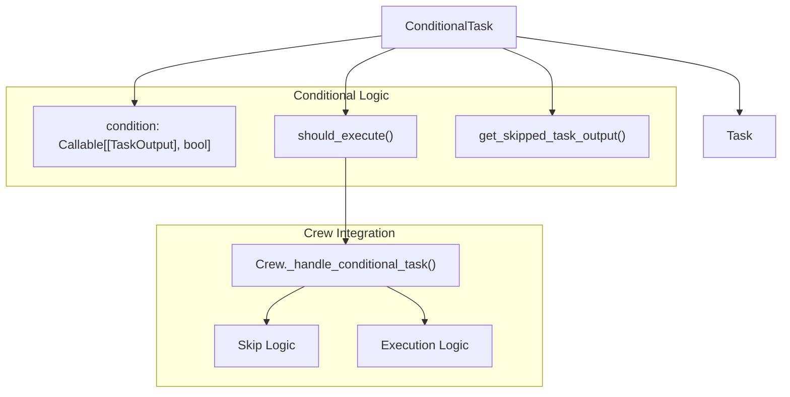
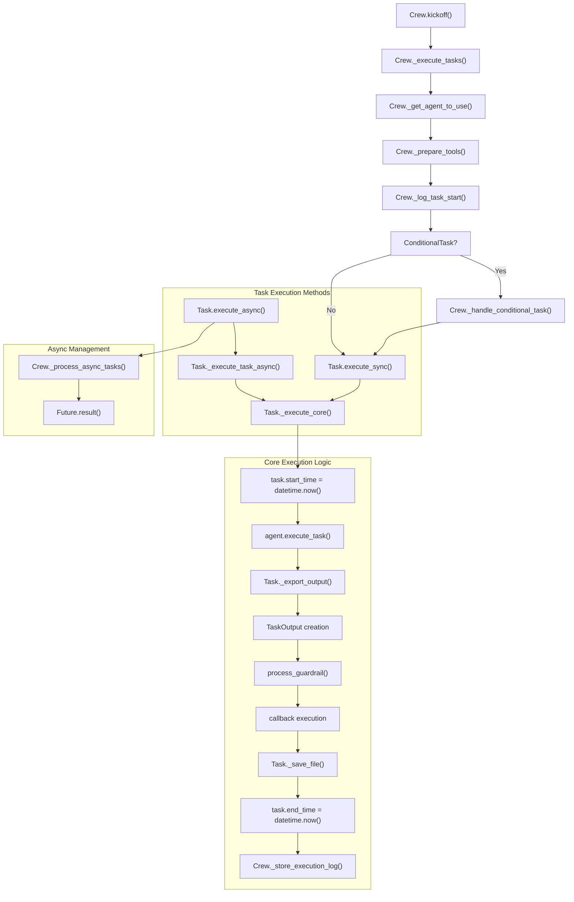
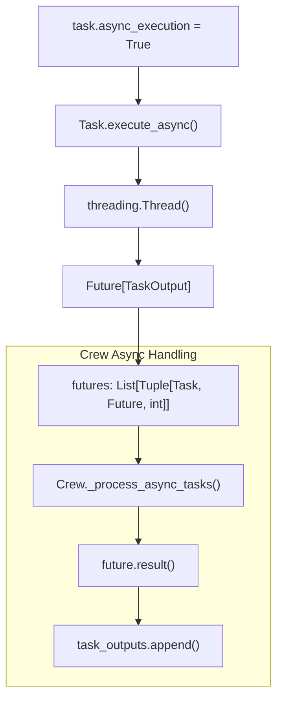
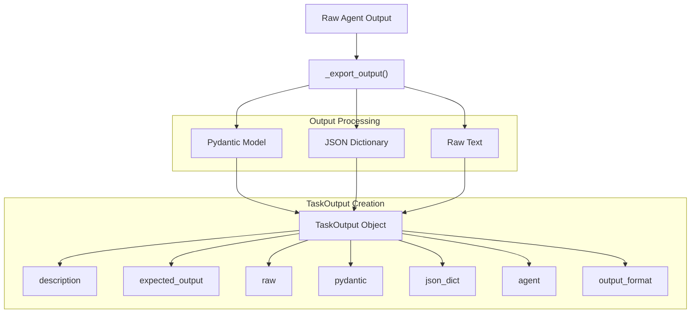
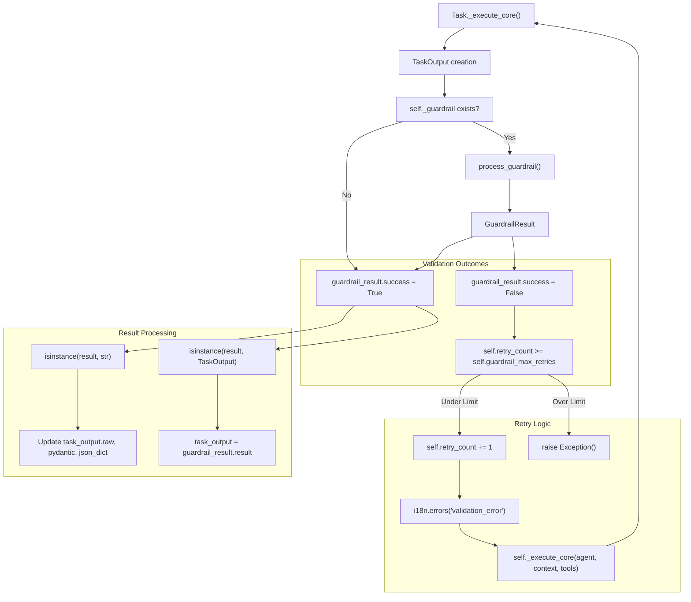

# Task Management

<details>
<summary>Relevant source files</summary>

The following files were used as context for generating this wiki page:

- [src/crewai/agent.py](https://github.com/crewAIInc/crewAI/blob/81bd81e5/src/crewai/agent.py)
- [src/crewai/agents/agent_builder/base_agent.py](https://github.com/crewAIInc/crewAI/blob/81bd81e5/src/crewai/agents/agent_builder/base_agent.py)
- [src/crewai/crew.py](https://github.com/crewAIInc/crewAI/blob/81bd81e5/src/crewai/crew.py)
- [src/crewai/task.py](https://github.com/crewAIInc/crewAI/blob/81bd81e5/src/crewai/task.py)
- [src/crewai/tools/tool_usage.py](https://github.com/crewAIInc/crewAI/blob/81bd81e5/src/crewai/tools/tool_usage.py)
- [src/crewai/translations/en.json](https://github.com/crewAIInc/crewAI/blob/81bd81e5/src/crewai/translations/en.json)

</details>


Task management in CrewAI handles the definition, execution, and orchestration of individual work units within a crew. This system provides comprehensive task lifecycle management, including execution patterns, output formatting, dependency handling, and validation mechanisms.

For information about crew-level orchestration and process types, see [Crew Orchestration](#2.1) and [Process Types](#2.4). For details about agent execution patterns, see [Agent Execution](#2.2).

## Task Definition and Structure

The `Task` class serves as the fundamental unit of work in CrewAI, encapsulating all necessary information for task execution and output handling. Tasks can be standard tasks or conditional tasks that execute based on previous task outcomes.

### Core Task Structure

```mermaid
graph TB
    Task["Task"]
    ConditionalTask["ConditionalTask"]
    
    subgraph "Core Attributes"
        id["id: UUID4"]
        name["name: Optional[str]"]
        description["description: str"]
        expected_output["expected_output: str"] 
        agent["agent: Optional[BaseAgent]"]
        tools["tools: Optional[List[BaseTool]]"]
    end
    
    subgraph "Execution Control"
        async_execution["async_execution: bool"]
        context["context: Union[List[Task], None, _NotSpecified]"]
        callback["callback: Optional[Any]"]
        guardrail["guardrail: Optional[Union[Callable, str]]"]
        human_input["human_input: bool"]
        markdown["markdown: bool"]
    end
    
    subgraph "Output Configuration"
        output_json["output_json: Optional[Type[BaseModel]]"]
        output_pydantic["output_pydantic: Optional[Type[BaseModel]]"] 
        output_file["output_file: Optional[str]"]
        create_directory["create_directory: bool"]
        converter_cls["converter_cls: Optional[Type[Converter]]"]
    end
    
    subgraph "Runtime State"
        output["output: Optional[TaskOutput]"]
        start_time["start_time: Optional[datetime]"]
        end_time["end_time: Optional[datetime]"]
        processed_by_agents["processed_by_agents: Set[str]"]
        used_tools["used_tools: int"]
        tools_errors["tools_errors: int"]
        delegations["delegations: int"]
    end
    
    Task --> id
    Task --> name
    Task --> description
    Task --> expected_output
    Task --> agent
    Task --> tools
    Task --> async_execution
    Task --> context
    Task --> callback
    Task --> guardrail
    Task --> human_input
    Task --> markdown
    Task --> output_json
    Task --> output_pydantic
    Task --> output_file
    Task --> create_directory
    Task --> converter_cls
    Task --> output
    Task --> start_time
    Task --> end_time
    Task --> processed_by_agents
    Task --> used_tools
    Task --> tools_errors
    Task --> delegations
    
    ConditionalTask --> Task
```



### Conditional Tasks

`ConditionalTask` extends the base `Task` class to provide conditional execution based on previous task outputs:



Sources: [src/crewai/task.py:57-179](https://github.com/crewAIInc/crewAI/blob/81bd81e5/src/crewai/task.py#L57-L179), [src/crewai/tasks/conditional_task.py](https://github.com/crewAIInc/crewAI/blob/81bd81e5/src/crewai/tasks/conditional_task.py), [src/crewai/crew.py:893-917](https://github.com/crewAIInc/crewAI/blob/81bd81e5/src/crewai/crew.py#L893-L917)

## Task Execution Lifecycle

Tasks follow a well-defined execution lifecycle managed by the crew system, with support for both synchronous and asynchronous execution patterns.

### Task Execution Flow



### Async Task Management



Sources: [src/crewai/task.py:374-421](https://github.com/crewAIInc/crewAI/blob/81bd81e5/src/crewai/task.py#L374-L421), [src/crewai/task.py:423-529](https://github.com/crewAIInc/crewAI/blob/81bd81e5/src/crewai/task.py#L423-L529), [src/crewai/crew.py:808-891](https://github.com/crewAIInc/crewAI/blob/81bd81e5/src/crewai/crew.py#L808-L891), [src/crewai/crew.py:874-889](https://github.com/crewAIInc/crewAI/blob/81bd81e5/src/crewai/crew.py#L874-L889)

## Synchronous vs Asynchronous Execution

Tasks can be executed either synchronously or asynchronously, with the crew managing the orchestration of mixed execution patterns.

### Synchronous Execution

Synchronous tasks execute immediately and block until completion:

```python
task_output = task.execute_sync(
    agent=agent,
    context=context,
    tools=tools
)
```

The `execute_sync` method directly calls `_execute_core` and returns a `TaskOutput` object immediately.

### Asynchronous Execution  

Asynchronous tasks return a `Future` object and execute in a separate thread:

```python
future = task.execute_async(
    agent=agent,
    context=context, 
    tools=tools
)
task_output = future.result()  # Blocks until completion
```

The crew system manages asynchronous task execution through the `_process_async_tasks` method, which handles futures and collects results.

Sources: [src/crewai/task.py:349-396](https://github.com/crewAIInc/crewAI/blob/81bd81e5/src/crewai/task.py#L349-L396), [src/crewai/crew.py:878-894](https://github.com/crewAIInc/crewAI/blob/81bd81e5/src/crewai/crew.py#L878-L894)

## Output Formats and Processing

Tasks support multiple output formats with automatic conversion capabilities.

| Output Type | Configuration | Result Type | File Output |
|-------------|---------------|-------------|-------------|
| Raw Text | Default | `str` | Optional via `output_file` |
| JSON | `output_json=ModelClass` | `Dict` | Automatic JSON serialization |
| Pydantic | `output_pydantic=ModelClass` | `ModelClass` | Model serialization |

The `_export_output` method handles conversion between formats:



Sources: [src/crewai/task.py:426-436](https://github.com/crewAIInc/crewAI/blob/81bd81e5/src/crewai/task.py#L426-L436), [src/crewai/task.py:641-692](https://github.com/crewAIInc/crewAI/blob/81bd81e5/src/crewai/task.py#L641-L692)

## Context Dependencies and Data Flow

Tasks can depend on the output of other tasks through the `context` attribute, enabling complex workflows with data dependencies.

### Context Resolution

The crew system resolves task contexts by collecting outputs from dependent tasks:

```python
context = self._get_context(task, task_outputs)
```

The `_get_context` method in the crew aggregates outputs from context tasks and formats them for the executing agent.

### Context Validation

Several validation rules ensure proper context dependencies:

- **No Future Dependencies**: Tasks cannot reference tasks that execute later in the sequence
- **Sequential Async Constraints**: Asynchronous tasks cannot reference other sequential async tasks without a synchronous task barrier

Sources: [src/crewai/crew.py:497-510](https://github.com/crewAIInc/crewAI/blob/81bd81e5/src/crewai/crew.py#L497-L510), [src/crewai/crew.py:477-494](https://github.com/crewAIInc/crewAI/blob/81bd81e5/src/crewai/crew.py#L477-L494)

## Task Validation and Guardrails

Tasks support validation through guardrails that can validate and potentially modify task outputs before completion.

### Guardrail Configuration

Guardrails can be defined as functions or string descriptions. Function guardrails receive a `TaskOutput` object and return a tuple of `(bool, Any)` indicating validation success and potentially modified output:

| Guardrail Type | Configuration | Processing |
|----------------|---------------|------------|
| Function | `Callable[[TaskOutput], Tuple[bool, Any]]` | Direct function execution |
| String | `str` description | Converted to `LLMGuardrail` using agent's LLM |

```python
# Function guardrail
def validate_output(task_output: TaskOutput) -> Tuple[bool, Any]:
    if "required_keyword" in task_output.raw:
        return (True, task_output)
    return (False, "Output missing required keyword")

# String guardrail
task = Task(
    description="...",
    expected_output="...",
    guardrail=validate_output,  # Function
    # OR
    guardrail="Ensure output contains specific requirements",  # String
    guardrail_max_retries=3
)
```

The `ensure_guardrail_is_callable` validator converts string guardrails to `LLMGuardrail` instances using the assigned agent's LLM.

### Guardrail Execution

The `Task._execute_core` method processes guardrails after task execution using the `process_guardrail` utility function:



Sources: [src/crewai/task.py:463-501](https://github.com/crewAIInc/crewAI/blob/81bd81e5/src/crewai/task.py#L463-L501), [src/crewai/utilities/guardrail.py](https://github.com/crewAIInc/crewAI/blob/81bd81e5/src/crewai/utilities/guardrail.py)

## Tool Integration and Management

Tasks inherit tools from their assigned agents but can also specify task-specific tools that take precedence.

### Tool Resolution Hierarchy

1. **Task-specific tools** (highest priority): Tools defined directly on the task
2. **Agent tools**: Tools available to the assigned agent
3. **Crew-level tools**: Additional tools provided during execution

The crew's `_prepare_tools` method handles tool resolution and preparation:

```python
tools_for_task = task.tools or agent_to_use.tools or []
tools_for_task = self._prepare_tools(agent_to_use, task, tools_for_task)
```

### Tool Usage Tracking

Tasks track tool usage through several metrics:

- `used_tools`: Number of tool invocations
- `tools_errors`: Number of tool execution errors
- `delegations`: Number of delegation attempts

Sources: [src/crewai/crew.py:848-855](https://github.com/crewAIInc/crewAI/blob/81bd81e5/src/crewai/crew.py#L848-L855), [src/crewai/task.py:79-81](https://github.com/crewAIInc/crewAI/blob/81bd81e5/src/crewai/task.py#L79-L81)

## Integration with Crew Execution

Tasks are executed within the context of a crew, which manages orchestration, agent assignment, and process flow.

### Crew Task Management

The crew system provides several key management capabilities:

- **Process Selection**: Sequential vs hierarchical execution patterns
- **Agent Assignment**: Automatic agent selection for unassigned tasks  
- **Context Management**: Inter-task data flow and dependency resolution
- **Async Coordination**: Management of mixed sync/async task execution
- **Error Handling**: Retry logic and error propagation

### Task Storage and Logging

The crew maintains execution logs through the `TaskOutputStorageHandler`:

```python
self._store_execution_log(task, task_output, task_index, was_replayed)
```

This enables task replay capabilities and execution auditing.