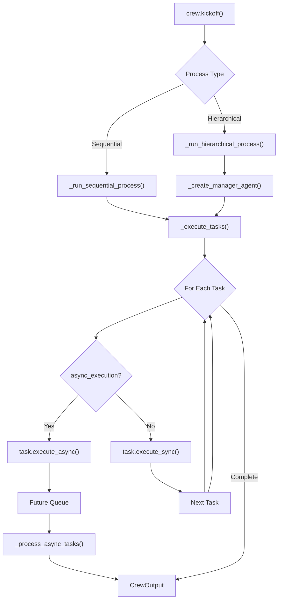
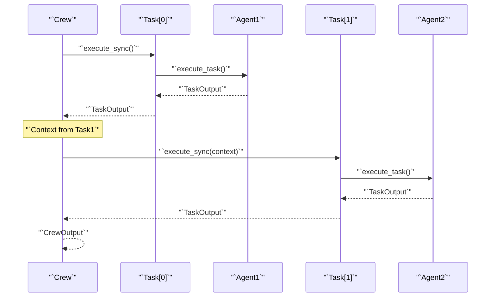
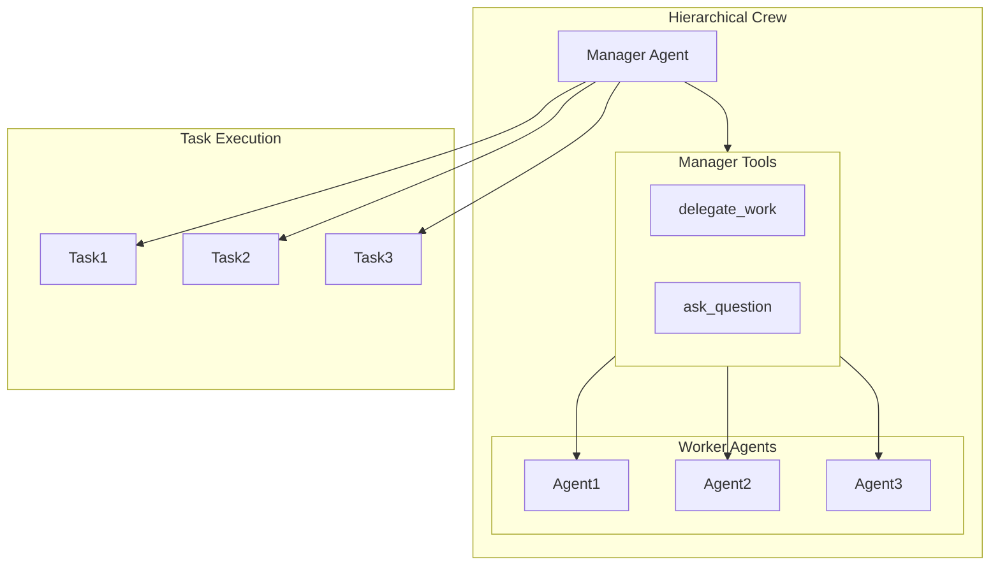
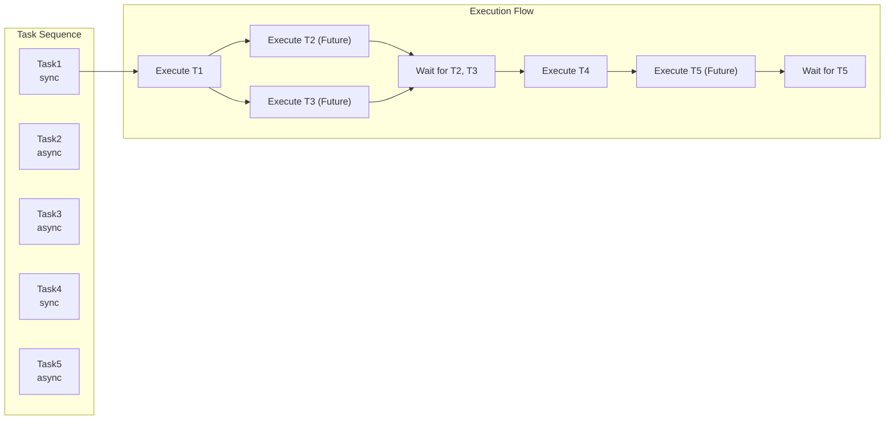
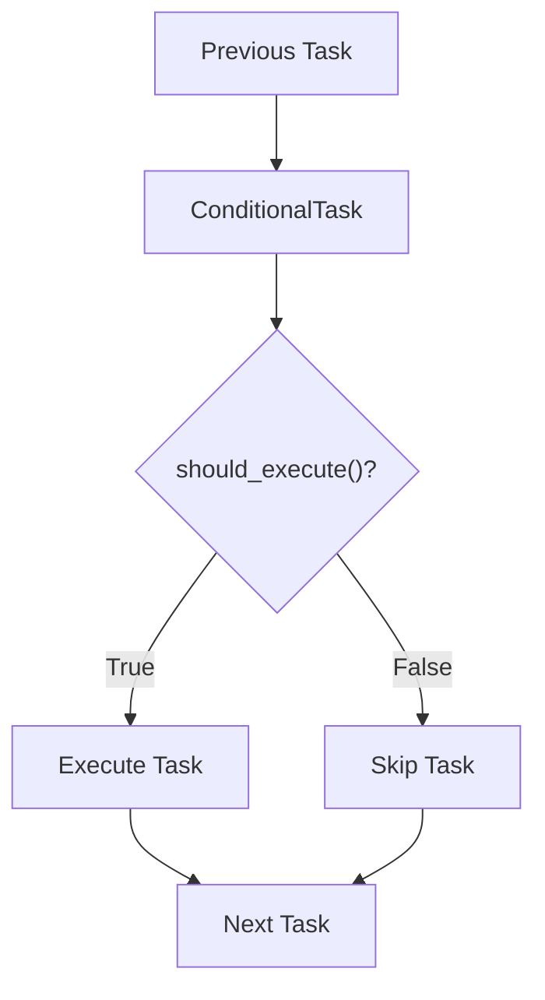
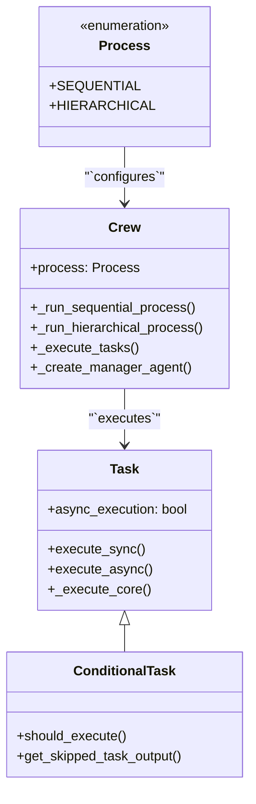

# Process Types

<details>
<summary>Relevant source files</summary>

The following files were used as context for generating this wiki page:

- [src/crewai/agent.py](https://github.com/crewAIInc/crewAI/blob/81bd81e5/src/crewai/agent.py)
- [src/crewai/agents/agent_builder/base_agent.py](https://github.com/crewAIInc/crewAI/blob/81bd81e5/src/crewai/agents/agent_builder/base_agent.py)
- [src/crewai/crew.py](https://github.com/crewAIInc/crewAI/blob/81bd81e5/src/crewai/crew.py)
- [src/crewai/task.py](https://github.com/crewAIInc/crewAI/blob/81bd81e5/src/crewai/task.py)
- [src/crewai/tools/tool_usage.py](https://github.com/crewAIInc/crewAI/blob/81bd81e5/src/crewai/tools/tool_usage.py)
- [src/crewai/translations/en.json](https://github.com/crewAIInc/crewAI/blob/81bd81e5/src/crewai/translations/en.json)

</details>


This document covers the different process types available in CrewAI for coordinating agent and task execution. Process types determine how crews orchestrate agents to complete tasks, including the order of execution, delegation patterns, and concurrency models.

For information about task definition and management, see [Task Management](#2.3). For details about agent orchestration, see [Crew Orchestration](#2.1).

## Overview

CrewAI supports multiple process types that define how tasks are executed and agents coordinate with each other. The core process types include **Sequential**, **Hierarchical**, and **Asynchronous** execution patterns. Each process type has specific characteristics, constraints, and use cases.

The process type is configured at the crew level and affects task execution order, agent delegation capabilities, and concurrency patterns.

**Process Types Execution Flow**



Sources: [src/crewai/crew.py:612-693](https://github.com/crewAIInc/crewAI/blob/81bd81e5/src/crewai/crew.py#L612-L693), [src/crewai/crew.py:774-781](https://github.com/crewAIInc/crewAI/blob/81bd81e5/src/crewai/crew.py#L774-L781)

## Sequential Process

Sequential process is the default execution pattern where tasks are executed one after another in the order they are defined. Each task must complete before the next one begins, ensuring a predictable execution flow.

### Characteristics

- **Ordered Execution**: Tasks execute in the sequence defined in the crew's task list
- **Agent Assignment**: Each task requires an explicit agent assignment via the `agent` field
- **Context Propagation**: Task outputs automatically become available as context for subsequent tasks
- **Synchronization Points**: Async tasks are synchronized before proceeding to sync tasks

### Implementation

The sequential process is implemented in the `_run_sequential_process()` method, which delegates to `_execute_tasks()` for the actual execution logic.

**Sequential Process Flow**



### Validation Rules

Sequential process enforces specific validation rules to ensure proper execution:

```python
# Each task must have an assigned agent
if task.agent is None:
    raise PydanticCustomError("missing_agent_in_task", ...)
```

Sources: [src/crewai/crew.py:774-776](https://github.com/crewAIInc/crewAI/blob/81bd81e5/src/crewai/crew.py#L774-L776), [src/crewai/crew.py:396-404](https://github.com/crewAIInc/crewAI/blob/81bd81e5/src/crewai/crew.py#L396-L404)

## Hierarchical Process

Hierarchical process introduces a manager agent that coordinates task execution and can delegate work to other agents. This pattern enables more complex orchestration where the manager makes decisions about task assignment and execution order.

### Characteristics

- **Manager Agent**: A dedicated agent coordinates task execution and delegation
- **Dynamic Assignment**: The manager can assign tasks to different agents based on context
- **Delegation Tools**: Manager has access to `AgentTools` for delegating work
- **Tool Restrictions**: Manager agents cannot have custom tools beyond delegation tools

### Manager Agent Creation

The hierarchical process automatically creates a manager agent if one is not provided:

**Hierarchical Process Architecture**



### Manager Requirements

The hierarchical process requires either a `manager_llm` or a `manager_agent` to be specified:

```python
if self.process == Process.hierarchical:
    if not self.manager_llm and not self.manager_agent:
        raise PydanticCustomError("missing_manager_llm_or_manager_agent", ...)
```

Sources: [src/crewai/crew.py:778-781](https://github.com/crewAIInc/crewAI/blob/81bd81e5/src/crewai/crew.py#L778-L781), [src/crewai/crew.py:352-371](https://github.com/crewAIInc/crewAI/blob/81bd81e5/src/crewai/crew.py#L352-L371), [src/crewai/crew.py:783-806](https://github.com/crewAIInc/crewAI/blob/81bd81e5/src/crewai/crew.py#L783-L806)

## Asynchronous Execution

Asynchronous execution allows tasks to run concurrently, improving performance for independent or I/O-bound operations. Tasks marked with `async_execution=True` execute in parallel until a synchronous task is encountered.

### Async Task Patterns

**Async Execution Flow**



### Async Validation Rules

Several validation rules ensure proper async task usage:

1. **Final Task Limit**: At most one async task can be at the end of the task sequence
2. **Context Dependencies**: Async tasks cannot reference other async tasks in their context unless separated by a sync task
3. **Future Task References**: Tasks cannot reference future tasks in their context

```python
# At most one final async task
final_async_task_count = 0
for task in reversed(self.tasks):
    if task.async_execution:
        final_async_task_count += 1
    else:
        break
```

### Async Implementation

Async tasks are executed using `threading.Thread` and return `Future` objects that are collected and processed:

```python
# Async execution
future = task.execute_async(agent=agent_to_use, context=context, tools=tools)
futures.append((task, future, task_index))

# Synchronization
if futures:
    task_outputs = self._process_async_tasks(futures, was_replayed)
```

Sources: [src/crewai/crew.py:863-872](https://github.com/crewAIInc/crewAI/blob/81bd81e5/src/crewai/crew.py#L863-L872), [src/crewai/crew.py:408-426](https://github.com/crewAIInc/crewAI/blob/81bd81e5/src/crewai/crew.py#L408-L426), [src/crewai/task.py:397-410](https://github.com/crewAIInc/crewAI/blob/81bd81e5/src/crewai/task.py#L397-L410)

## Conditional Tasks

Conditional tasks provide branching logic in the execution flow through `ConditionalTask` instances that can be skipped based on previous task outputs.

### Conditional Logic

**Conditional Task Flow**



### Implementation Details

Conditional tasks are processed within the main execution loop:

```python
if isinstance(task, ConditionalTask):
    skipped_task_output = self._handle_conditional_task(
        task, task_outputs, futures, task_index, was_replayed
    )
    if skipped_task_output:
        task_outputs.append(skipped_task_output)
        continue
```

### Conditional Task Constraints

- **Position Restriction**: The first task cannot be a `ConditionalTask`
- **Async Restriction**: `ConditionalTask` instances cannot have `async_execution=True`
- **Required Regular Tasks**: At least one non-conditional task must exist in the crew

Sources: [src/crewai/crew.py:855-862](https://github.com/crewAIInc/crewAI/blob/81bd81e5/src/crewai/crew.py#L855-L862), [src/crewai/crew.py:429-442](https://github.com/crewAIInc/crewAI/blob/81bd81e5/src/crewai/crew.py#L429-L442), [src/crewai/crew.py:456-465](https://github.com/crewAIInc/crewAI/blob/81bd81e5/src/crewai/crew.py#L456-L465)

## Process Validation and Constraints

CrewAI enforces several validation rules to ensure process integrity and proper execution flow.

### Core Process Constraints

| Constraint | Description | Validation Method |
|------------|-------------|-------------------|
| **Agent Assignment** | Sequential tasks require agent assignment | `validate_tasks()` |
| **Manager Requirements** | Hierarchical process needs manager_llm or manager_agent | `check_manager_llm()` |
| **Async Task Limits** | At most one final async task allowed | `validate_end_with_at_most_one_async_task()` |
| **Context Dependencies** | No future task references in context | `validate_context_no_future_tasks()` |
| **First Task Type** | First task cannot be conditional | `validate_first_task()` |
| **Conditional Async** | Conditional tasks cannot be async | `validate_async_tasks_not_async()` |

### Process Type Code Mapping

**Process Types to Code Entities**



The validation system ensures that process configurations are consistent and executable, preventing runtime errors and ensuring predictable behavior across different execution patterns.