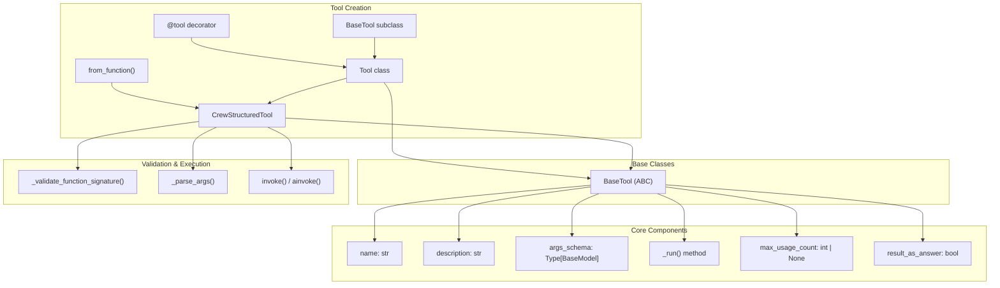
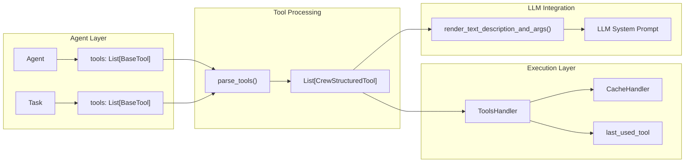
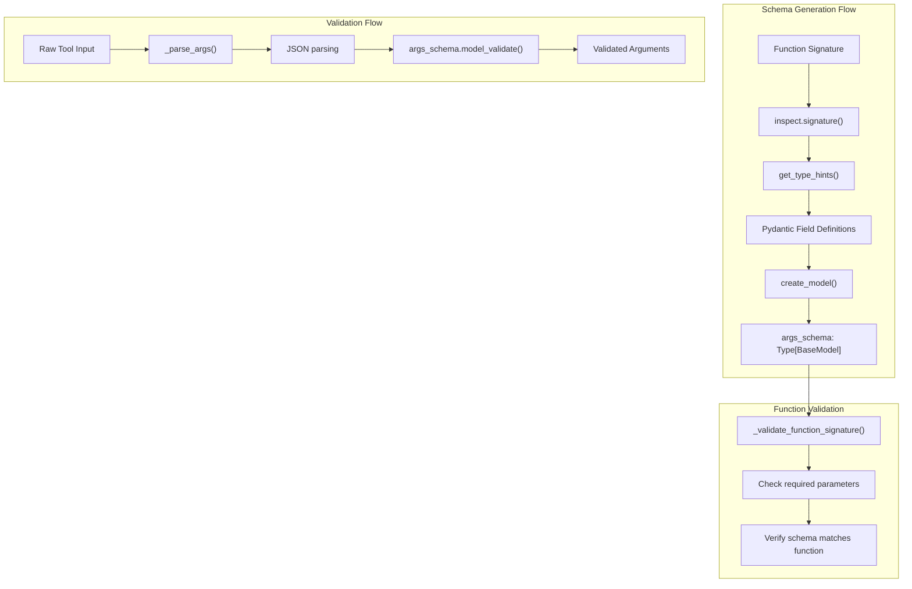
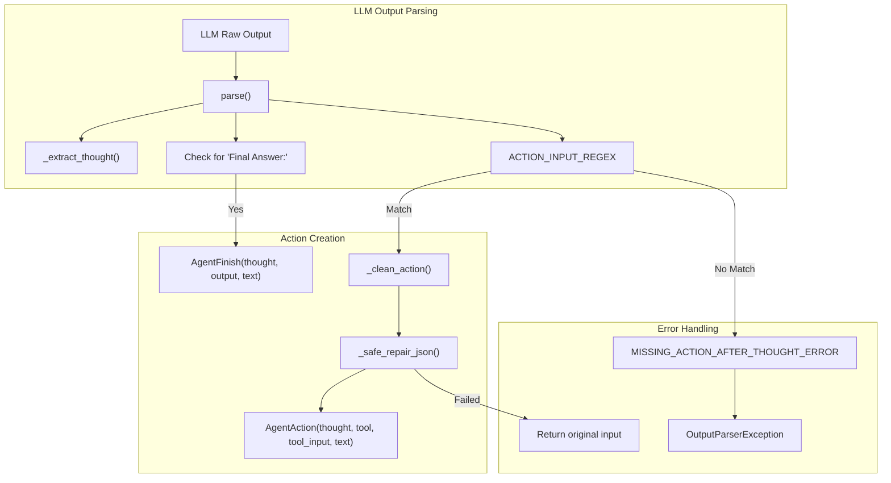
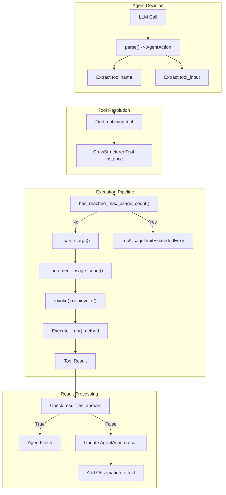
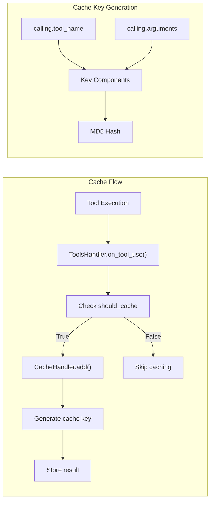
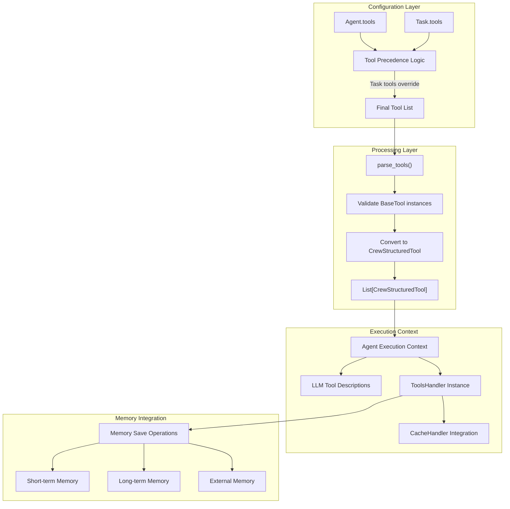

# Tools and Agent Actions

<details>
<summary>Relevant source files</summary>

The following files were used as context for generating this wiki page:

- [docs/en/tools/overview.mdx](https://github.com/crewAIInc/crewAI/blob/81bd81e5/docs/en/tools/overview.mdx)
- [src/crewai/agents/__init__.py](https://github.com/crewAIInc/crewAI/blob/81bd81e5/src/crewai/agents/__init__.py)
- [src/crewai/agents/agent_builder/base_agent_executor_mixin.py](https://github.com/crewAIInc/crewAI/blob/81bd81e5/src/crewai/agents/agent_builder/base_agent_executor_mixin.py)
- [src/crewai/agents/constants.py](https://github.com/crewAIInc/crewAI/blob/81bd81e5/src/crewai/agents/constants.py)
- [src/crewai/agents/parser.py](https://github.com/crewAIInc/crewAI/blob/81bd81e5/src/crewai/agents/parser.py)
- [src/crewai/agents/tools_handler.py](https://github.com/crewAIInc/crewAI/blob/81bd81e5/src/crewai/agents/tools_handler.py)
- [src/crewai/cli/crew_chat.py](https://github.com/crewAIInc/crewAI/blob/81bd81e5/src/crewai/cli/crew_chat.py)
- [src/crewai/tools/base_tool.py](https://github.com/crewAIInc/crewAI/blob/81bd81e5/src/crewai/tools/base_tool.py)
- [src/crewai/tools/structured_tool.py](https://github.com/crewAIInc/crewAI/blob/81bd81e5/src/crewai/tools/structured_tool.py)
- [src/crewai/utilities/agent_utils.py](https://github.com/crewAIInc/crewAI/blob/81bd81e5/src/crewai/utilities/agent_utils.py)
- [src/crewai/utilities/llm_utils.py](https://github.com/crewAIInc/crewAI/blob/81bd81e5/src/crewai/utilities/llm_utils.py)
- [tests/agents/test_crew_agent_parser.py](https://github.com/crewAIInc/crewAI/blob/81bd81e5/tests/agents/test_crew_agent_parser.py)
- [tests/cassettes/test_ensure_exchanged_messages_are_propagated_to_external_memory.yaml](https://github.com/crewAIInc/crewAI/blob/81bd81e5/tests/cassettes/test_ensure_exchanged_messages_are_propagated_to_external_memory.yaml)
- [tests/cassettes/test_get_knowledge_search_query.yaml](https://github.com/crewAIInc/crewAI/blob/81bd81e5/tests/cassettes/test_get_knowledge_search_query.yaml)
- [tests/cassettes/test_max_usage_count_is_respected.yaml](https://github.com/crewAIInc/crewAI/blob/81bd81e5/tests/cassettes/test_max_usage_count_is_respected.yaml)
- [tests/test_crew.py](https://github.com/crewAIInc/crewAI/blob/81bd81e5/tests/test_crew.py)
- [tests/test_task.py](https://github.com/crewAIInc/crewAI/blob/81bd81e5/tests/test_task.py)
- [tests/tools/test_base_tool.py](https://github.com/crewAIInc/crewAI/blob/81bd81e5/tests/tools/test_base_tool.py)
- [tests/tools/test_structured_tool.py](https://github.com/crewAIInc/crewAI/blob/81bd81e5/tests/tools/test_structured_tool.py)
- [tests/tools/test_tool_usage_limit.py](https://github.com/crewAIInc/crewAI/blob/81bd81e5/tests/tools/test_tool_usage_limit.py)

</details>


This document covers the tools system and agent actions in CrewAI, including tool definition, creation, execution, and integration with agents. Tools are the primary mechanism by which agents interact with external systems and perform specific actions. Agent actions represent the parsed instructions from LLMs that determine which tools to use and how.

For information about task execution and management, see [Task Management](#2.3). For details about agent execution patterns, see [Agent Execution](#2.2).

## Tool Architecture Overview

CrewAI's tool system is built around a hierarchical architecture that supports both simple function-based tools and complex structured tools with validation and usage tracking.

### Tool Creation and Inheritance Hierarchy



Sources: [src/crewai/tools/base_tool.py:25-330](https://github.com/crewAIInc/crewAI/blob/81bd81e5/src/crewai/tools/base_tool.py#L25-L330), [src/crewai/tools/structured_tool.py:21-303](https://github.com/crewAIInc/crewAI/blob/81bd81e5/src/crewai/tools/structured_tool.py#L21-L303)

### Tool Integration with Agent System



Sources: [src/crewai/utilities/agent_utils.py:29-60](https://github.com/crewAIInc/crewAI/blob/81bd81e5/src/crewai/utilities/agent_utils.py#L29-L60), [src/crewai/agents/tools_handler.py:8-45](https://github.com/crewAIInc/crewAI/blob/81bd81e5/src/crewai/agents/tools_handler.py#L8-L45)

## Tool Definition and Creation

### BaseTool Class Structure

The `BaseTool` class serves as the foundation for all tools in CrewAI. It defines the core interface and provides automatic schema generation.

Key properties defined in [src/crewai/tools/base_tool.py:25-51]():
- `name`: Unique tool identifier
- `description`: Instructions for LLM on when/how to use the tool
- `args_schema`: Pydantic model defining input parameters
- `max_usage_count`: Optional limit on tool usage
- `result_as_answer`: Whether tool output becomes the final agent answer
- `cache_function`: Function determining if results should be cached

### Tool Creation Methods

**Decorator-based Creation**
```python
@tool("tool_name", result_as_answer=False, max_usage_count=None)
def my_tool(param: str) -> str:
    """Tool description for the LLM."""
    return f"Result: {param}"
```

**Class-based Creation**
```python
class MyTool(BaseTool):
    name: str = "my_tool"
    description: str = "Tool description"
    
    def _run(self, param: str) -> str:
        return f"Result: {param}"
```

**Function-based Creation**
```python
tool = CrewStructuredTool.from_function(
    func=my_function,
    name="tool_name",
    description="Description"
)
```

Sources: [src/crewai/tools/base_tool.py:283-330](https://github.com/crewAIInc/crewAI/blob/81bd81e5/src/crewai/tools/base_tool.py#L283-L330), [src/crewai/tools/structured_tool.py:64-124](https://github.com/crewAIInc/crewAI/blob/81bd81e5/src/crewai/tools/structured_tool.py#L64-L124)

### Schema Generation and Validation

CrewAI automatically generates Pydantic schemas from function signatures. The schema generation process is handled in [src/crewai/tools/base_tool.py:52-69]() and [src/crewai/tools/structured_tool.py:125-164]().



Sources: [src/crewai/tools/structured_tool.py:165-190](https://github.com/crewAIInc/crewAI/blob/81bd81e5/src/crewai/tools/structured_tool.py#L165-L190), [src/crewai/tools/structured_tool.py:191-213](https://github.com/crewAIInc/crewAI/blob/81bd81e5/src/crewai/tools/structured_tool.py#L191-L213)

## Agent Actions and LLM Integration

### Action Types and Parsing

CrewAI uses a ReAct (Reasoning and Acting) format for agent actions. The system parses LLM outputs into structured action objects.

**Core Action Classes** defined in [src/crewai/agents/parser.py:26-44]():
- `AgentAction`: Represents a tool usage action
- `AgentFinish`: Represents the final answer



Sources: [src/crewai/agents/parser.py:63-134](https://github.com/crewAIInc/crewAI/blob/81bd81e5/src/crewai/agents/parser.py#L63-L134), [src/crewai/agents/constants.py:8-27](https://github.com/crewAIInc/crewAI/blob/81bd81e5/src/crewai/agents/constants.py#L8-L27)

### Tool Execution Flow

The tool execution process involves multiple layers of validation, caching, and result handling.



Sources: [src/crewai/tools/structured_tool.py:258-280](https://github.com/crewAIInc/crewAI/blob/81bd81e5/src/crewai/tools/structured_tool.py#L258-L280), [src/crewai/utilities/agent_utils.py:187-223](https://github.com/crewAIInc/crewAI/blob/81bd81e5/src/crewai/utilities/agent_utils.py#L187-L223)

## Usage Management and Limits

### Usage Tracking System

Tools support usage limits to prevent excessive calls. The tracking system is implemented across both `BaseTool` and `CrewStructuredTool`.

**Usage Count Management** in [src/crewai/tools/base_tool.py:94-101]():
- `current_usage_count`: Tracks actual usage
- `max_usage_count`: Optional limit (None = unlimited)
- `reset_usage_count()`: Resets counter to zero

**Usage Limit Enforcement** in [src/crewai/tools/structured_tool.py:281-293]():
```python
def has_reached_max_usage_count(self) -> bool:
    return (
        self.max_usage_count is not None
        and self.current_usage_count >= self.max_usage_count
    )
```

### Cache Integration

The `ToolsHandler` class manages tool result caching through integration with `CacheHandler`.



Sources: [src/crewai/agents/tools_handler.py:25-45](https://github.com/crewAIInc/crewAI/blob/81bd81e5/src/crewai/agents/tools_handler.py#L25-L45)

## Tool Integration Architecture

### Agent-Task-Tool Relationship



Sources: [src/crewai/utilities/agent_utils.py:29-39](https://github.com/crewAIInc/crewAI/blob/81bd81e5/src/crewai/utilities/agent_utils.py#L29-L39), [tests/test_task.py:22-73](https://github.com/crewAIInc/crewAI/blob/81bd81e5/tests/test_task.py#L22-L73), [src/crewai/agents/agent_builder/base_agent_executor_mixin.py:28-71](https://github.com/crewAIInc/crewAI/blob/81bd81e5/src/crewai/agents/agent_builder/base_agent_executor_mixin.py#L28-L71)

### LLM Tool Description Format

Tools are presented to LLMs through formatted descriptions generated by `render_text_description_and_args()` in [src/crewai/utilities/agent_utils.py:47-61]().

The format includes:
- Tool name and description from `BaseTool.description`
- Argument schema with types and descriptions
- Usage instructions and constraints

**Example Tool Description Pattern**:
```
Tool Name: tool_name
Tool Arguments: {'param': {'description': 'Parameter description', 'type': 'str'}}
Tool Description: What this tool does and when to use it
```

### Error Handling and Recovery

The system includes comprehensive error handling for tool execution failures:

**Parser Error Recovery** in [src/crewai/utilities/agent_utils.py:247-282]():
- `OutputParserException` handling with retry logic
- JSON repair for malformed tool inputs
- Context length management with summarization

**Execution Error Handling** in [src/crewai/utilities/agent_utils.py:225-246]():
- Unknown error logging and user notification  
- LLM context length exceeded detection and handling
- Graceful degradation for tool failures