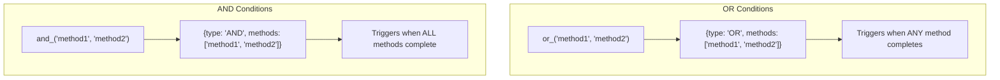
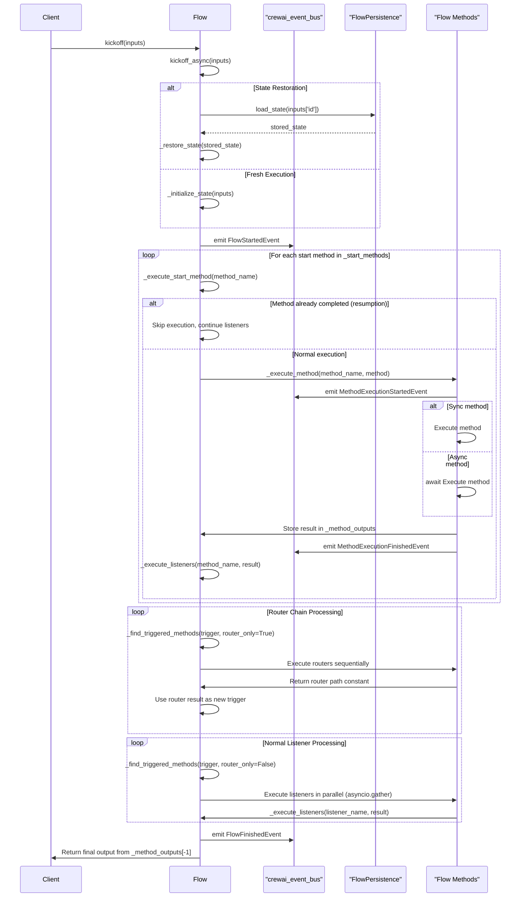
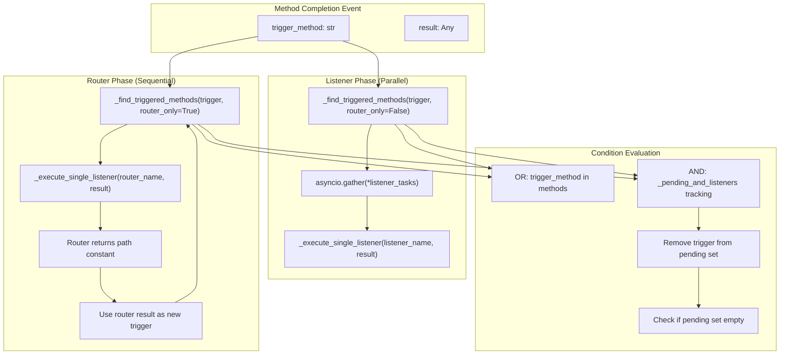
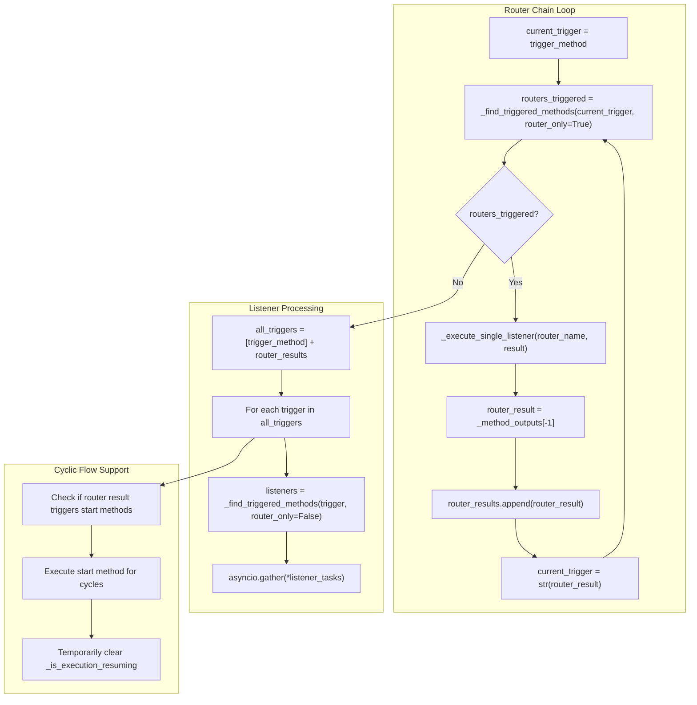
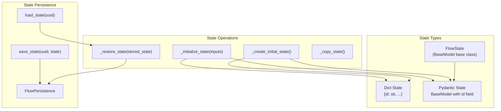
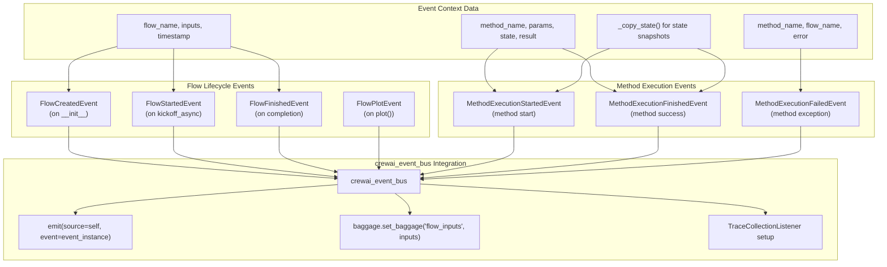
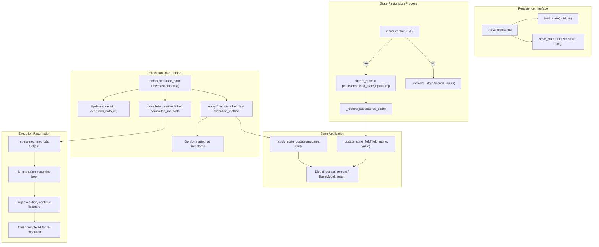

# Flow System

<details>
<summary>Relevant source files</summary>

The following files were used as context for generating this wiki page:

- [src/crewai/flow/flow.py](https://github.com/crewAIInc/crewAI/blob/81bd81e5/src/crewai/flow/flow.py)
- [tests/test_multimodal_validation.py](https://github.com/crewAIInc/crewAI/blob/81bd81e5/tests/test_multimodal_validation.py)
- [tests/utilities/test_events.py](https://github.com/crewAIInc/crewAI/blob/81bd81e5/tests/utilities/test_events.py)

</details>


## Purpose and Scope

The Flow System provides event-driven workflow orchestration for precise control over execution sequences in CrewAI. Unlike the autonomous agent-driven approach of Crews (see [Core Components](#2)), Flows use declarative decorators to define exact execution paths, conditional branching, and state transitions. This system enables deterministic workflows where method execution is triggered by specific events and conditions.

For autonomous multi-agent coordination, see [Crew Orchestration](#2.1). For memory management within flows, see [Memory System](#4).

## Core Architecture

The Flow system is built around a metaclass-driven architecture that automatically discovers and registers decorated methods at class creation time. The `FlowMeta` metaclass processes method attributes to build internal registries during class construction.

### Flow Architecture Diagram

```mermaid
graph TB
    subgraph "Metaclass Processing"
        FlowMeta["FlowMeta"]
        MethodDiscovery["Method Discovery"]
        AttributeRegistry["Attribute Registry Building"]
    end
    
    subgraph "Flow Base Classes"
        FlowState["FlowState"]
        FlowGeneric["Flow[T]"]
        TypeVarT["TypeVar T"]
    end
    
    subgraph "Method Decorators"
        StartDecorator["@start()"]
        ListenDecorator["@listen()"]
        RouterDecorator["@router()"]
    end
    
    subgraph "Flow Instance Attributes"
        Methods["_methods: Dict[str, Callable]"]
        State["_state: T"]
        StartMethods["_start_methods: List[str]"]
        Listeners["_listeners: Dict[str, tuple]"]
        Routers["_routers: Set[str]"]
        RouterPaths["_router_paths: Dict[str, List[str]]"]
        Persistence["_persistence: FlowPersistence"]
        CompletedMethods["_completed_methods: Set[str]"]
        MethodOutputs["_method_outputs: List[Any]"]
        ExecutionCounts["_method_execution_counts: Dict[str, int]"]
        PendingAndListeners["_pending_and_listeners: Dict[str, Set[str]]"]
    end
    
    FlowMeta --> FlowGeneric
    FlowMeta --> MethodDiscovery
    MethodDiscovery --> AttributeRegistry
    AttributeRegistry --> StartMethods
    AttributeRegistry --> Listeners
    AttributeRegistry --> Routers
    AttributeRegistry --> RouterPaths
    
    FlowState --> FlowGeneric
    TypeVarT --> FlowGeneric
    
    StartDecorator --> Methods
    ListenDecorator --> Methods
    RouterDecorator --> Methods
    
    FlowGeneric --> Methods
    FlowGeneric --> State
    FlowGeneric --> StartMethods
    FlowGeneric --> Listeners
    FlowGeneric --> Routers
    FlowGeneric --> RouterPaths
    FlowGeneric --> Persistence
    FlowGeneric --> CompletedMethods
    FlowGeneric --> MethodOutputs
    FlowGeneric --> ExecutionCounts
    FlowGeneric --> PendingAndListeners
```


Sources: [src/crewai/flow/flow.py:392-433](https://github.com/crewAIInc/crewAI/blob/81bd81e5/src/crewai/flow/flow.py#L392-L433), [src/crewai/flow/flow.py:436-449](https://github.com/crewAIInc/crewAI/blob/81bd81e5/src/crewai/flow/flow.py#L436-L449), [src/crewai/flow/flow.py:49-56](https://github.com/crewAIInc/crewAI/blob/81bd81e5/src/crewai/flow/flow.py#L49-L56), [src/crewai/flow/flow.py:458-512](https://github.com/crewAIInc/crewAI/blob/81bd81e5/src/crewai/flow/flow.py#L458-L512)

### Flow Class Hierarchy

The `Flow` class uses a generic type parameter to support both structured (Pydantic models) and unstructured (dictionary) state management:

| Component | Purpose | Key Attributes |
|-----------|---------|----------------|
| `FlowMeta` | Metaclass for method discovery and registration | `_start_methods`, `_listeners`, `_routers`, `_router_paths` |
| `Flow[T]` | Base flow class with generic state type | `state: T`, `_methods: Dict`, `_persistence`, `tracing: bool` |
| `FlowState` | Base state model with UUID | `id: str` (auto-generated via `uuid4()`) |

The `FlowMeta` metaclass processes method attributes during class creation, scanning for:
- `__is_start_method__` - marks methods as flow entry points
- `__trigger_methods__` and `__condition_type__` - defines listener conditions  
- `__is_router__` - marks methods as routing decisions
- Router return constants via `get_possible_return_constants()`

The generic type parameter `T` is bound to `Union[Dict[str, Any], BaseModel]` allowing flexible state management approaches.

Sources: [src/crewai/flow/flow.py:392-433](https://github.com/crewAIInc/crewAI/blob/81bd81e5/src/crewai/flow/flow.py#L392-L433), [src/crewai/flow/flow.py:436-449](https://github.com/crewAIInc/crewAI/blob/81bd81e5/src/crewai/flow/flow.py#L436-L449), [src/crewai/flow/flow.py:49-56](https://github.com/crewAIInc/crewAI/blob/81bd81e5/src/crewai/flow/flow.py#L49-L56), [src/crewai/flow/flow.py:58-65](https://github.com/crewAIInc/crewAI/blob/81bd81e5/src/crewai/flow/flow.py#L58-L65)

## Flow Decorators and Conditions

### Core Decorators

The Flow system provides three primary decorators for method registration:

#### `@start()` Decorator
Marks methods as flow entry points. Can be unconditional or conditional based on other method completions:

```python
@start()  # Unconditional start
def begin_flow(self):
    pass

@start("method_name")  # Conditional start
def conditional_start(self):
    pass
```

Sources: [src/crewai/flow/flow.py:98-162](https://github.com/crewAIInc/crewAI/blob/81bd81e5/src/crewai/flow/flow.py#L98-L162)

#### `@listen()` Decorator
Creates listeners that execute when specified conditions are met:

```python
@listen("process_data")  # Single method trigger
def handle_data(self):
    pass

@listen(or_("success", "failure"))  # Multiple method triggers
def handle_completion(self):
    pass
```

Sources: [src/crewai/flow/flow.py:165-222](https://github.com/crewAIInc/crewAI/blob/81bd81e5/src/crewai/flow/flow.py#L165-L222)

#### `@router()` Decorator
Creates routing methods that dynamically determine flow paths:

```python
@router("check_status")
def route_based_on_status(self):
    if self.state.status == "success":
        return "SUCCESS_PATH"
    return "FAILURE_PATH"
```

Sources: [src/crewai/flow/flow.py:225-288](https://github.com/crewAIInc/crewAI/blob/81bd81e5/src/crewai/flow/flow.py#L225-L288)

### Condition Combinators

Complex triggering conditions are created using `or_()` and `and_()` combinators:

#### Condition Logic Diagram


Sources: [src/crewai/flow/flow.py:291-334](https://github.com/crewAIInc/crewAI/blob/81bd81e5/src/crewai/flow/flow.py#L291-L334), [src/crewai/flow/flow.py:337-380](https://github.com/crewAIInc/crewAI/blob/81bd81e5/src/crewai/flow/flow.py#L337-L380)

The `and_()` combinator uses a pending listener mechanism to track which conditions remain unfulfilled before triggering execution.

## Flow Execution Model

### Execution Lifecycle

Flow execution follows a structured async lifecycle with comprehensive state management and event emission:

#### Flow Execution Sequence Diagram


The execution model handles both synchronous and asynchronous methods via `asyncio.iscoroutinefunction()` checks, and maintains detailed execution state for resumption scenarios.

Sources: [src/crewai/flow/flow.py:795-903](https://github.com/crewAIInc/crewAI/blob/81bd81e5/src/crewai/flow/flow.py#L795-L903), [src/crewai/flow/flow.py:808-904](https://github.com/crewAIInc/crewAI/blob/81bd81e5/src/crewai/flow/flow.py#L808-L904), [src/crewai/flow/flow.py:905-938](https://github.com/crewAIInc/crewAI/blob/81bd81e5/src/crewai/flow/flow.py#L905-L938), [src/crewai/flow/flow.py:975-1027](https://github.com/crewAIInc/crewAI/blob/81bd81e5/src/crewai/flow/flow.py#L975-L1027)

### Method Triggering Logic

The flow execution engine uses a sophisticated triggering system that separates router and listener execution phases:

#### Triggering Logic Flow


The `_find_triggered_methods()` function evaluates both OR and AND conditions:

| Condition Type | Evaluation Logic | State Management |
|----------------|------------------|------------------|
| OR | `trigger_method in methods` | Immediate execution when any condition met |
| AND | Track completion in `_pending_and_listeners[listener_name]` | Execute when `pending_set` becomes empty |
| Router Separation | `router_only` parameter distinguishes execution phases | Routers execute sequentially, listeners in parallel |

Sources: [src/crewai/flow/flow.py:1110-1168](https://github.com/crewAIInc/crewAI/blob/81bd81e5/src/crewai/flow/flow.py#L1110-L1168), [src/crewai/flow/flow.py:1029-1109](https://github.com/crewAIInc/crewAI/blob/81bd81e5/src/crewai/flow/flow.py#L1029-L1109), [src/crewai/flow/flow.py:1170-1226](https://github.com/crewAIInc/crewAI/blob/81bd81e5/src/crewai/flow/flow.py#L1170-L1226)

### Router Execution Pattern

Routers execute sequentially in chains, with each router's output becoming a new trigger for subsequent routers and listeners. The router chain continues until no more routers are triggered:

#### Router Chain Execution Flow


The router chain supports cyclic flows where router results can re-trigger start methods that were previously completed, enabling complex branching and looping patterns.

Sources: [src/crewai/flow/flow.py:1052-1109](https://github.com/crewAIInc/crewAI/blob/81bd81e5/src/crewai/flow/flow.py#L1052-L1109), [src/crewai/flow/flow.py:1092-1108](https://github.com/crewAIInc/crewAI/blob/81bd81e5/src/crewai/flow/flow.py#L1092-L1108)

## State Management

The Flow system supports both structured (Pydantic) and unstructured (dictionary) state management with automatic UUID generation.

### State Architecture Diagram


Sources: [src/crewai/flow/flow.py:497-577](https://github.com/crewAIInc/crewAI/blob/81bd81e5/src/crewai/flow/flow.py#L497-L577), [src/crewai/flow/flow.py:624-676](https://github.com/crewAIInc/crewAI/blob/81bd81e5/src/crewai/flow/flow.py#L624-L676), [src/crewai/flow/flow.py:678-710](https://github.com/crewAIInc/crewAI/blob/81bd81e5/src/crewai/flow/flow.py#L678-L710)

### State Initialization

State initialization follows a priority order:
1. Restore from persistence if `id` provided
2. Apply input parameters
3. Ensure UUID is present
4. Validate structured state models

The `_create_initial_state()` method handles type detection and UUID generation automatically.

Sources: [src/crewai/flow/flow.py:497-577](https://github.com/crewAIInc/crewAI/blob/81bd81e5/src/crewai/flow/flow.py#L497-L577)

### State Access Patterns

| Access Method | Return Type | Use Case |
|---------------|-------------|----------|
| `flow.state` | `T` (generic) | Direct state access |
| `flow.flow_id` | `str` | Safe UUID access |
| `flow._copy_state()` | `T` | Event emission snapshots |

The `flow_id` property provides safe access to the state UUID regardless of state type (dict or BaseModel).

Sources: [src/crewai/flow/flow.py:582-623](https://github.com/crewAIInc/crewAI/blob/81bd81e5/src/crewai/flow/flow.py#L582-L623)

### Event Emission and Observability

The Flow system provides comprehensive observability through the `crewai_event_bus` with detailed event emission at every execution stage:

#### Flow Event Emission Architecture


The Flow system supports tracing integration via the `tracing` parameter and OpenTelemetry baggage for context propagation. The `_copy_state()` method creates deep copies for event snapshots to prevent state mutation.

Sources: [src/crewai/flow/flow.py:28-42](https://github.com/crewAIInc/crewAI/blob/81bd81e5/src/crewai/flow/flow.py#L28-L42), [src/crewai/flow/flow.py:489-496](https://github.com/crewAIInc/crewAI/blob/81bd81e5/src/crewai/flow/flow.py#L489-L496), [src/crewai/flow/flow.py:866-899](https://github.com/crewAIInc/crewAI/blob/81bd81e5/src/crewai/flow/flow.py#L866-L899), [src/crewai/flow/flow.py:978-1026](https://github.com/crewAIInc/crewAI/blob/81bd81e5/src/crewai/flow/flow.py#L978-L1026), [src/crewai/flow/flow.py:1254-1262](https://github.com/crewAIInc/crewAI/blob/81bd81e5/src/crewai/flow/flow.py#L1254-L1262)

### Event Data Structure

Each event provides comprehensive execution context for observability and debugging:

| Event Type | Key Fields | Emission Context |
|------------|------------|------------------|
| `FlowCreatedEvent` | `flow_name`, `timestamp`, `type="flow_created"` | Flow instance initialization |
| `FlowStartedEvent` | `flow_name`, `inputs`, `timestamp`, `type="flow_started"` | `kickoff_async()` entry |
| `MethodExecutionStartedEvent` | `method_name`, `flow_name`, `params`, `state`, `type="method_execution_started"` | Before method execution in `_execute_method()` |
| `MethodExecutionFinishedEvent` | `method_name`, `flow_name`, `state`, `result`, `type="method_execution_finished"` | After successful method execution |
| `MethodExecutionFailedEvent` | `method_name`, `flow_name`, `error`, `type="method_execution_failed"` | Exception handling in `_execute_method()` |
| `FlowFinishedEvent` | `flow_name`, `result`, `timestamp`, `type="flow_finished"` | Flow completion with final output |
| `FlowPlotEvent` | `flow_name`, `type="flow_plot"` | `plot()` method invocation |

Event emission uses `crewai_event_bus.emit(self, event_instance)` where `self` is the Flow instance as the event source. State snapshots are created via `self._copy_state()` to prevent mutation during event processing.

The comprehensive event structure enables integration with observability platforms, debugging tools, and real-time flow monitoring systems.

Sources: [src/crewai/flow/flow.py:489-496](https://github.com/crewAIInc/crewAI/blob/81bd81e5/src/crewai/flow/flow.py#L489-L496), [src/crewai/flow/flow.py:866-899](https://github.com/crewAIInc/crewAI/blob/81bd81e5/src/crewai/flow/flow.py#L866-L899), [src/crewai/flow/flow.py:982-1013](https://github.com/crewAIInc/crewAI/blob/81bd81e5/src/crewai/flow/flow.py#L982-L1013), [src/crewai/flow/flow.py:1018-1026](https://github.com/crewAIInc/crewAI/blob/81bd81e5/src/crewai/flow/flow.py#L1018-L1026), [tests/utilities/test_events.py:436-510](https://github.com/crewAIInc/crewAI/blob/81bd81e5/tests/utilities/test_events.py#L436-L510)

## Visualization and Persistence

### Flow Visualization

The `plot()` method generates visual representations of flow structure using the `plot_flow()` function:

```python
flow.plot("my_flow_diagram")  # Generates flow visualization
```

This emits a `FlowPlotEvent` and creates graphical representations showing method dependencies and execution paths.

Sources: [src/crewai/flow/flow.py:1075-1083](https://github.com/crewAIInc/crewAI/blob/81bd81e5/src/crewai/flow/flow.py#L1075-L1083), [src/crewai/flow/flow_visualizer.py:22](https://github.com/crewAIInc/crewAI/blob/81bd81e5/src/crewai/flow/flow_visualizer.py#L22)

### Flow Persistence and Restoration

Flow state persistence enables resuming interrupted executions through the `FlowPersistence` interface and the `reload()` mechanism:

#### Flow Persistence and Reload Architecture


The persistence system supports two restoration modes:
1. **Simple State Restoration**: Using `inputs['id']` during `kickoff_async()` 
2. **Execution Data Reload**: Using `reload(execution_data)` with complete execution history

State restoration handles both dictionary and BaseModel state types through `_restore_state()`, while execution resumption uses `_completed_methods` tracking to skip already-executed methods.

Sources: [src/crewai/flow/flow.py:694-727](https://github.com/crewAIInc/crewAI/blob/81bd81e5/src/crewai/flow/flow.py#L694-L727), [src/crewai/flow/flow.py:728-793](https://github.com/crewAIInc/crewAI/blob/81bd81e5/src/crewai/flow/flow.py#L728-L793), [src/crewai/flow/flow.py:779-793](https://github.com/crewAIInc/crewAI/blob/81bd81e5/src/crewai/flow/flow.py#L779-L793), [src/crewai/flow/flow.py:846-863](https://github.com/crewAIInc/crewAI/blob/81bd81e5/src/crewai/flow/flow.py#L846-L863), [src/crewai/flow/flow.py:925-932](https://github.com/crewAIInc/crewAI/blob/81bd81e5/src/crewai/flow/flow.py#L925-L932)