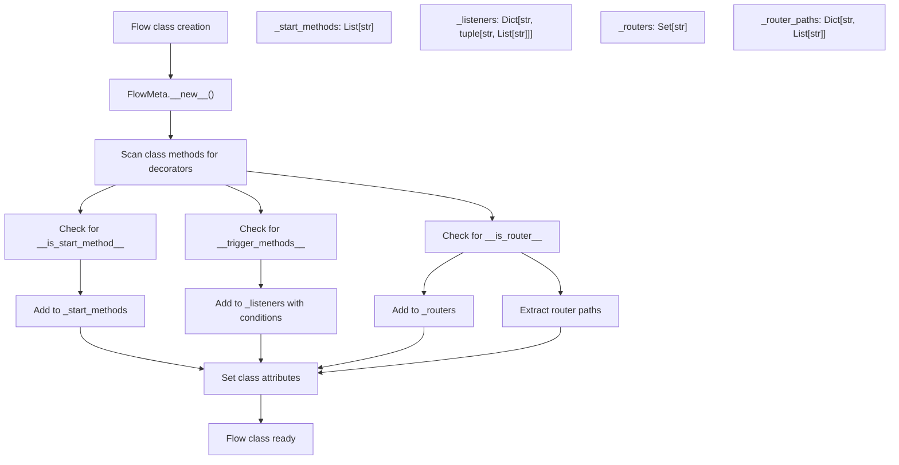
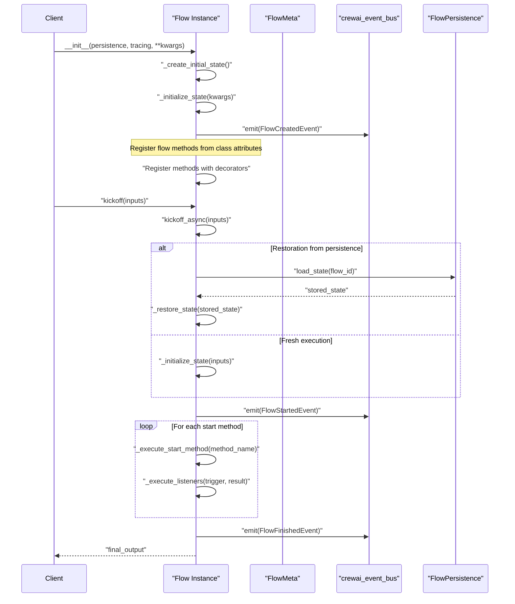
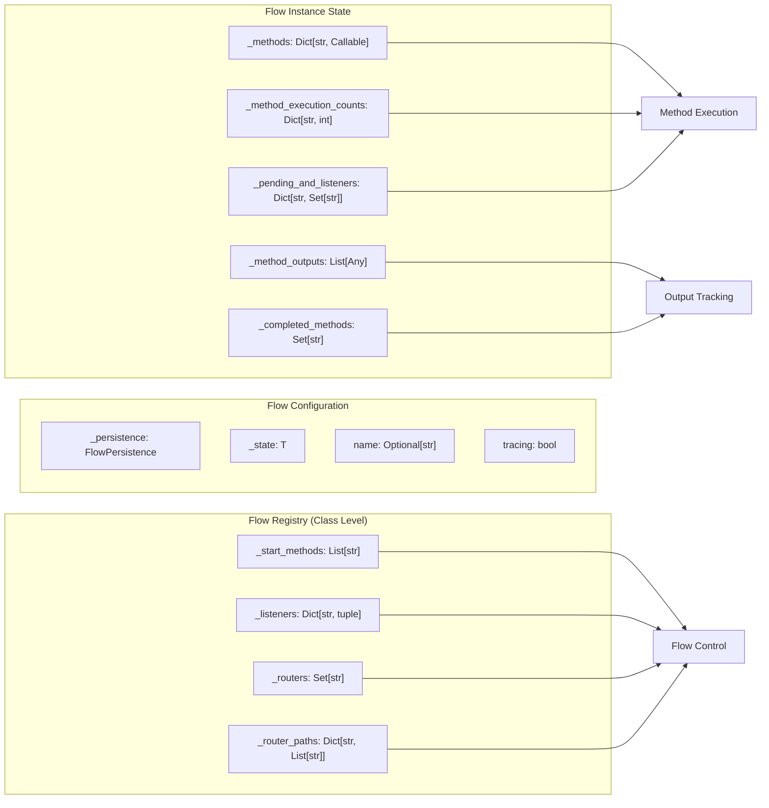

# Flow Creation and Structure

<details>
<summary>Relevant source files</summary>

The following files were used as context for generating this wiki page:

- [src/crewai/flow/flow.py](https://github.com/crewAIInc/crewAI/blob/81bd81e5/src/crewai/flow/flow.py)
- [tests/test_multimodal_validation.py](https://github.com/crewAIInc/crewAI/blob/81bd81e5/tests/test_multimodal_validation.py)
- [tests/utilities/test_events.py](https://github.com/crewAIInc/crewAI/blob/81bd81e5/tests/utilities/test_events.py)

</details>


This document covers the foundational aspects of creating and structuring flows in CrewAI, including the `Flow` base class, method organization patterns, and flow lifecycle management. For detailed information about flow decorators (`@start`, `@listen`, `@router`), see [Flow Decorators](#3.2). For state management and persistence, see [State Management](#3.3). For visualization and event handling, see [Flow Visualization and Events](#3.4).

## Flow Class Architecture

The CrewAI flow system is built around the `Flow` base class, which uses a metaclass pattern to automatically discover and register flow methods. All flows inherit from `Flow[T]` where `T` represents the state type.

```mermaid
classDiagram
    class Flow~T~ {
        +Generic[T] state_type
        +FlowMeta metaclass
        +str name
        +bool tracing
        +_methods: Dict[str, Callable]
        +_start_methods: List[str]
        +_listeners: Dict[str, tuple]
        +_routers: Set[str]
        +kickoff(inputs) Any
        +kickoff_async(inputs) Any
        +plot(filename) None
    }
    
    class FlowMeta {
        +__new__(mcs, name, bases, dct)
        +_discover_start_methods()
        +_discover_listeners()
        +_discover_routers()
    }
    
    class FlowState {
        +str id
        +BaseModel
    }
    
    Flow~T~ --> FlowMeta : "uses metaclass"
    Flow~T~ --> FlowState : "T bound to BaseModel or dict"
    Flow~T~ --> "method_registry" : "_methods"
    
    note for Flow~T~ "Base class for all flows\nGeneric type T for state typing"
    note for FlowMeta "Metaclass processes decorators\nBuilds method registry"
```

**Flow Class Structure**

| Component | Purpose | Code Location |
|-----------|---------|---------------|
| `Flow[T]` | Base class with generic state typing | [src/crewai/flow/flow.py:436-439]() |
| `FlowMeta` | Metaclass for method discovery | [src/crewai/flow/flow.py:392-433]() |
| `FlowState` | Base model for flow states with UUID | [src/crewai/flow/flow.py:49-56]() |

Sources: [src/crewai/flow/flow.py:436-456](https://github.com/crewAIInc/crewAI/blob/81bd81e5/src/crewai/flow/flow.py#L436-L456), [src/crewai/flow/flow.py:392-433](https://github.com/crewAIInc/crewAI/blob/81bd81e5/src/crewai/flow/flow.py#L392-L433), [src/crewai/flow/flow.py:49-56](https://github.com/crewAIInc/crewAI/blob/81bd81e5/src/crewai/flow/flow.py#L49-L56)

## Method Organization and Discovery

Flows organize their execution logic through decorated methods that are automatically discovered by the `FlowMeta` metaclass during class creation.



**Method Registration Process**

The metaclass processes flow methods by examining their attributes:

| Attribute | Purpose | Registered To |
|-----------|---------|---------------|
| `__is_start_method__` | Marks entry points | `_start_methods` |
| `__trigger_methods__` | Defines trigger conditions | `_listeners` |
| `__is_router__` | Identifies routing methods | `_routers` |
| `__condition_type__` | Specifies AND/OR logic | `_listeners` tuple |

Sources: [src/crewai/flow/flow.py:401-431](https://github.com/crewAIInc/crewAI/blob/81bd81e5/src/crewai/flow/flow.py#L401-L431), [src/crewai/flow/flow.py:443-446](https://github.com/crewAIInc/crewAI/blob/81bd81e5/src/crewai/flow/flow.py#L443-L446)

## Flow Lifecycle Management

The flow execution lifecycle is managed through initialization, method registration, and asynchronous execution phases.



**Lifecycle Phases**

| Phase | Key Methods | Purpose |
|-------|-------------|---------|
| **Initialization** | `__init__`, `_create_initial_state` | Set up flow instance and state |
| **Method Registration** | `FlowMeta.__new__` | Discover and register decorated methods |
| **Execution** | `kickoff`, `kickoff_async` | Execute flow logic asynchronously |
| **State Management** | `_restore_state`, `_initialize_state` | Handle state persistence and updates |

Sources: [src/crewai/flow/flow.py:458-512](https://github.com/crewAIInc/crewAI/blob/81bd81e5/src/crewai/flow/flow.py#L458-L512), [src/crewai/flow/flow.py:795-903](https://github.com/crewAIInc/crewAI/blob/81bd81e5/src/crewai/flow/flow.py#L795-L903), [src/crewai/flow/flow.py:808-889](https://github.com/crewAIInc/crewAI/blob/81bd81e5/src/crewai/flow/flow.py#L808-L889)

## Type Safety and State Typing

Flows use Python generics to provide type safety for state management. The generic type parameter `T` must be either `Dict[str, Any]` or a `BaseModel` subclass.

```mermaid
graph TD
    FlowGeneric["Flow[T]"] --> StateValidation["ensure_state_type()"]
    
    StateValidation --> CheckDict["T is dict?"]
    StateValidation --> CheckBaseModel["T is BaseModel?"]
    
    CheckDict -->|Yes| DictValidation["isinstance(state, dict)"]
    CheckBaseModel -->|Yes| ModelValidation["isinstance(state, BaseModel)"]
    
    DictValidation -->|Pass| CastDict["cast(StateT, state)"]
    ModelValidation -->|Pass| CastModel["cast(StateT, state)"]
    
    DictValidation -->|Fail| TypeError1["TypeError: Expected dict"]
    ModelValidation -->|Fail| TypeError2["TypeError: Expected BaseModel"]
    
    CastDict --> ValidatedState["Validated State"]
    CastModel --> ValidatedState
    
    class TypeBounds {
        T bound to Union[Dict[str, Any], BaseModel]
        StateT bound to Union[Dict[str, Any], BaseModel]
    }
```

**State Type Configuration Examples**

```python
# Dictionary-based state
class MyFlow(Flow[dict]):
    def __init__(self):
        super().__init__()

# Pydantic model state  
class MyState(BaseModel):
    user_id: str
    status: str

class MyFlow(Flow[MyState]):
    initial_state = MyState
```

**Type Validation Functions**

| Function | Purpose | Location |
|----------|---------|----------|
| `ensure_state_type` | Validates state matches expected type | [src/crewai/flow/flow.py:67-104]() |
| `_create_initial_state` | Creates typed initial state with UUID | [src/crewai/flow/flow.py:513-593]() |
| `_initialize_state` | Updates state with type checking | [src/crewai/flow/flow.py:640-692]() |

Sources: [src/crewai/flow/flow.py:58-65](https://github.com/crewAIInc/crewAI/blob/81bd81e5/src/crewai/flow/flow.py#L58-L65), [src/crewai/flow/flow.py:67-104](https://github.com/crewAIInc/crewAI/blob/81bd81e5/src/crewai/flow/flow.py#L67-L104), [src/crewai/flow/flow.py:513-593](https://github.com/crewAIInc/crewAI/blob/81bd81e5/src/crewai/flow/flow.py#L513-L593)

## Flow Instance Management

Flow instances maintain execution state, method registries, and handle persistence across executions.



**Instance Attributes by Category**

| Category | Attributes | Purpose |
|----------|------------|---------|
| **Method Registry** | `_methods`, `_method_execution_counts` | Track bound methods and execution counts |
| **Execution State** | `_pending_and_listeners`, `_completed_methods` | Manage AND conditions and completion tracking |
| **Output Management** | `_method_outputs` | Store results from all executed methods |
| **Configuration** | `_persistence`, `tracing`, `name` | Flow-level configuration options |

Sources: [src/crewai/flow/flow.py:471-477](https://github.com/crewAIInc/crewAI/blob/81bd81e5/src/crewai/flow/flow.py#L471-L477), [src/crewai/flow/flow.py:498-511](https://github.com/crewAIInc/crewAI/blob/81bd81e5/src/crewai/flow/flow.py#L498-L511), [src/crewai/flow/flow.py:443-449](https://github.com/crewAIInc/crewAI/blob/81bd81e5/src/crewai/flow/flow.py#L443-L449)

## Flow Creation Patterns

Common patterns for creating flows demonstrate different approaches to state management and method organization.

**Pattern 1: Dictionary State Flow**
```python
class SimpleFlow(Flow[dict]):
    @start()
    def begin_process(self):
        self.state["step"] = "started"
        return "initialized"
    
    @listen("begin_process")
    def process_data(self):
        return "processed"
```

**Pattern 2: Structured State Flow**
```python
class ProcessState(FlowState):
    user_id: str
    status: str = "pending"
    
class StructuredFlow(Flow[ProcessState]):
    initial_state = ProcessState
    
    @start()
    def initialize(self):
        self.state.status = "running"
        return "started"
```

**Pattern 3: Named Flow with Persistence**
```python
class ProductionFlow(Flow[dict]):
    name = "production_workflow"
    
    def __init__(self, persistence_backend):
        super().__init__(persistence=persistence_backend)
```