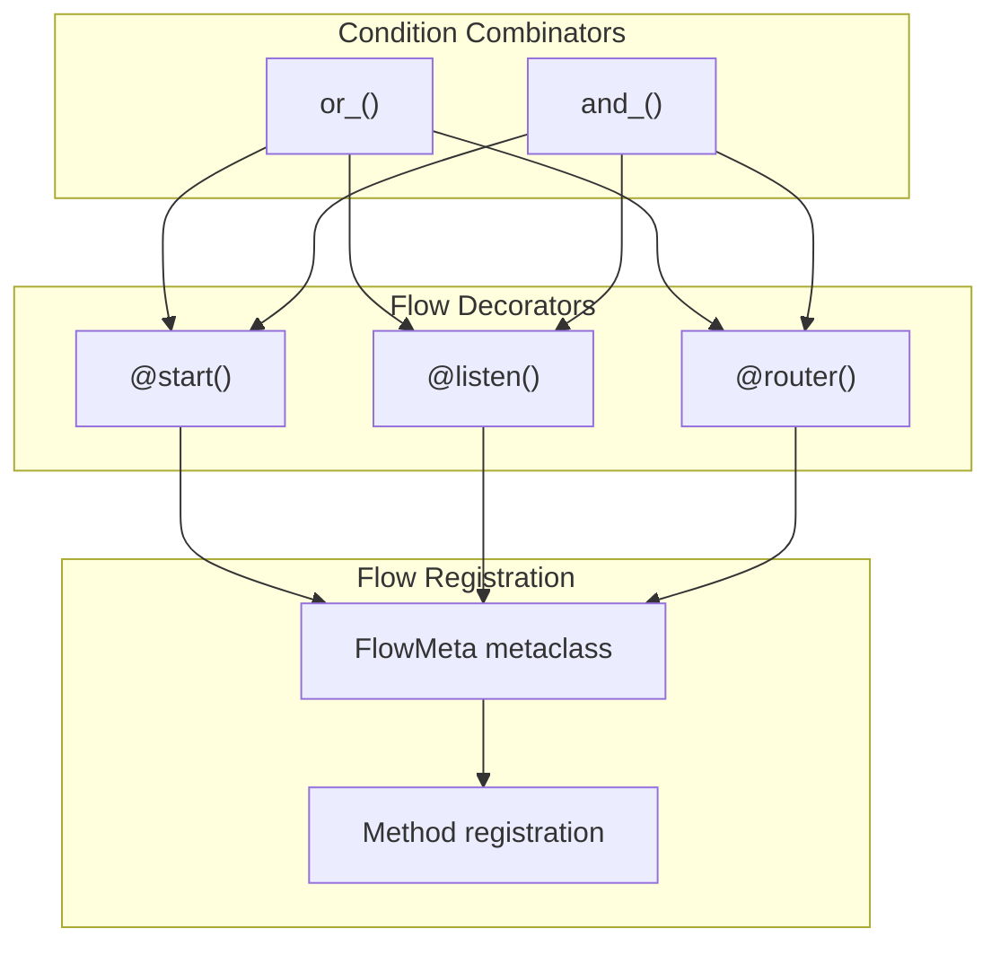
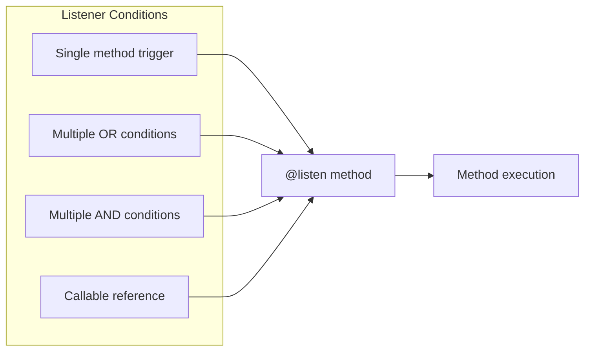
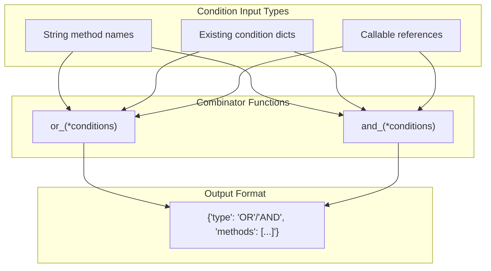
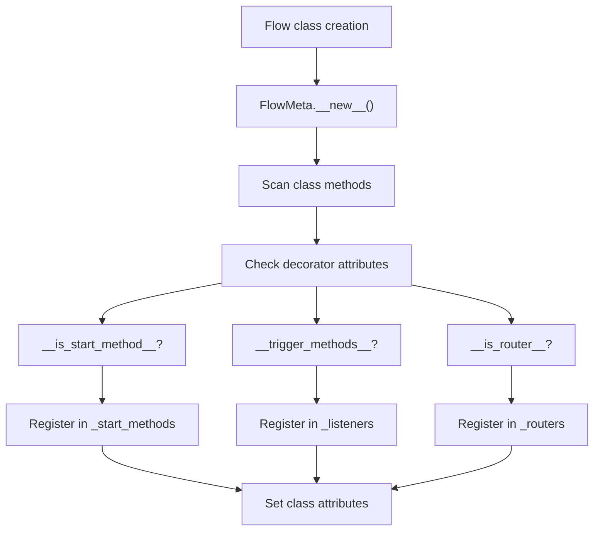
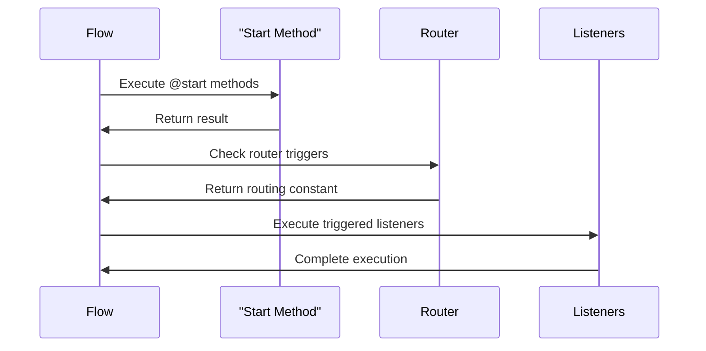

# Flow Decorators

<details>
<summary>Relevant source files</summary>

The following files were used as context for generating this wiki page:

- [src/crewai/flow/flow.py](https://github.com/crewAIInc/crewAI/blob/81bd81e5/src/crewai/flow/flow.py)
- [tests/test_multimodal_validation.py](https://github.com/crewAIInc/crewAI/blob/81bd81e5/tests/test_multimodal_validation.py)
- [tests/utilities/test_events.py](https://github.com/crewAIInc/crewAI/blob/81bd81e5/tests/utilities/test_events.py)

</details>


This document covers the decorator-based system for defining flow control in CrewAI's Flow framework. Flow decorators enable event-driven workflow orchestration by marking methods as entry points, listeners, and routers with conditional triggering logic.

For information about flow structure and lifecycle management, see [Flow Creation and Structure](#3.1). For state management within flows, see [State Management](#3.3).

## Overview

Flow decorators provide a declarative way to define workflow execution patterns through method annotations. The system includes three primary decorators (`@start`, `@listen`, `@router`) and two condition combinators (`or_()`, `and_()`) that enable complex triggering logic.

### Core Decorator Functions

The flow decorator system consists of these primary components:



Sources: [src/crewai/flow/flow.py:107-389](https://github.com/crewAIInc/crewAI/blob/81bd81e5/src/crewai/flow/flow.py#L107-L389), [src/crewai/flow/flow.py:392-433](https://github.com/crewAIInc/crewAI/blob/81bd81e5/src/crewai/flow/flow.py#L392-L433)

## Start Decorator

The `@start` decorator marks methods as flow entry points. These methods execute when the flow begins or when specified trigger conditions are met.

### Basic Usage

```python
@start()  # Unconditional start
def begin_flow(self):
    pass

@start("method_name")  # Start after specific method
def conditional_start(self):
    pass
```

### Implementation Details

The `start` decorator function processes conditions and sets method attributes:

| Attribute | Purpose | Type |
|-----------|---------|------|
| `__is_start_method__` | Marks method as start point | `bool` |
| `__trigger_methods__` | List of triggering methods | `List[str]` |
| `__condition_type__` | Logic type ("AND"/"OR") | `str` |

Sources: [src/crewai/flow/flow.py:107-171](https://github.com/crewAIInc/crewAI/blob/81bd81e5/src/crewai/flow/flow.py#L107-L171)

## Listen Decorator

The `@listen` decorator creates methods that execute in response to other method completions. Listeners support both simple and complex triggering conditions.

### Condition Types



### Parameter Handling

Listeners can optionally receive results from triggering methods. The system uses signature inspection to determine parameter compatibility:

```python
@listen("process_data")
def handle_processed_data(self, result):  # Receives trigger result
    pass

@listen("process_data")  
def handle_completion(self):  # No parameters
    pass
```

Sources: [src/crewai/flow/flow.py:174-231](https://github.com/crewAIInc/crewAI/blob/81bd81e5/src/crewai/flow/flow.py#L174-L231), [src/crewai/flow/flow.py:1207-1226](https://github.com/crewAIInc/crewAI/blob/81bd81e5/src/crewai/flow/flow.py#L1207-L1226)

## Router Decorator

The `@router` decorator creates conditional branching points in flows. Routers execute when triggered and return values that determine subsequent flow paths.

### Router Return Values

Routers use return constants to direct flow execution:

```python
@router("check_status")
def route_based_on_status(self):
    if self.state.status == "success":
        return SUCCESS  # Triggers methods listening to "SUCCESS"
    return FAILURE      # Triggers methods listening to "FAILURE"
```

### Router Processing

The flow system handles routers differently from regular listeners:

1. **Sequential Execution**: Routers execute sequentially to maintain flow control
2. **Result Propagation**: Router return values become new trigger methods
3. **Chaining Support**: Router results can trigger other routers or listeners

Sources: [src/crewai/flow/flow.py:234-297](https://github.com/crewAIInc/crewAI/blob/81bd81e5/src/crewai/flow/flow.py#L234-L297), [src/crewai/flow/flow.py:1052-1076](https://github.com/crewAIInc/crewAI/blob/81bd81e5/src/crewai/flow/flow.py#L1052-L1076)

## Condition Combinators

The `or_()` and `and_()` functions combine multiple conditions for complex triggering logic.

### Condition Structure

Both combinators return dictionary structures that the decorators process:



### Usage Examples

```python
@listen(or_("success", "timeout"))  # Triggers on either condition
def handle_completion(self):
    pass

@listen(and_("validated", "processed"))  # Requires both conditions
def handle_complete_data(self):
    pass
```

Sources: [src/crewai/flow/flow.py:300-343](https://github.com/crewAIInc/crewAI/blob/81bd81e5/src/crewai/flow/flow.py#L300-L343), [src/crewai/flow/flow.py:346-389](https://github.com/crewAIInc/crewAI/blob/81bd81e5/src/crewai/flow/flow.py#L346-L389)

## Decorator Registration

The `FlowMeta` metaclass automatically discovers and registers decorated methods during class creation.

### Registration Process



### Class Attributes

The metaclass sets these class-level attributes for flow execution:

| Attribute | Content | Purpose |
|-----------|---------|---------|
| `_start_methods` | `List[str]` | Names of start methods |
| `_listeners` | `Dict[str, tuple[str, List[str]]]` | Listener conditions |
| `_routers` | `Set[str]` | Router method names |
| `_router_paths` | `Dict[str, List[str]]` | Router return constants |

Sources: [src/crewai/flow/flow.py:392-433](https://github.com/crewAIInc/crewAI/blob/81bd81e5/src/crewai/flow/flow.py#L392-L433)

## Execution Flow

The decorated methods integrate into the flow execution system through event-driven triggers.

### Method Execution Sequence



### Trigger Evaluation

The system evaluates triggers using condition logic:

- **OR Conditions**: Execute when any trigger method completes
- **AND Conditions**: Execute only when all trigger methods complete
- **Router Results**: Treated as new trigger methods for subsequent listeners

Sources: [src/crewai/flow/flow.py:1029-1091](https://github.com/crewAIInc/crewAI/blob/81bd81e5/src/crewai/flow/flow.py#L1029-L1091), [src/crewai/flow/flow.py:1110-1168](https://github.com/crewAIInc/crewAI/blob/81bd81e5/src/crewai/flow/flow.py#L1110-L1168)

## Error Handling

Flow decorators include validation for condition formats and method signatures:

```python
# Invalid condition raises ValueError
@listen(42)  # Not str, dict, or callable
def invalid_listener(self):
    pass

# Router execution errors are propagated
@router("trigger")
def failing_router(self):
    raise Exception("Router failure")
```

The system validates condition types and formats during decorator application, ensuring runtime reliability.