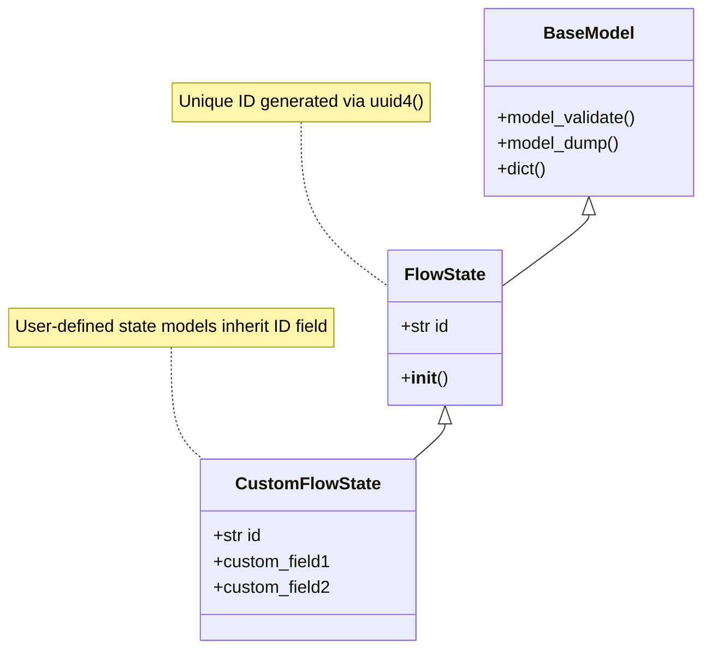
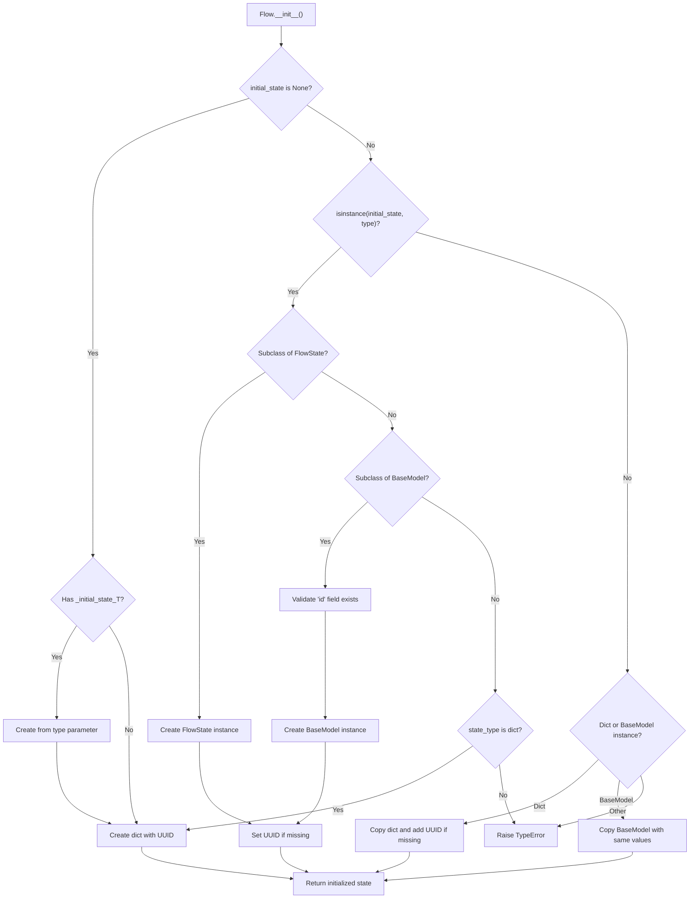
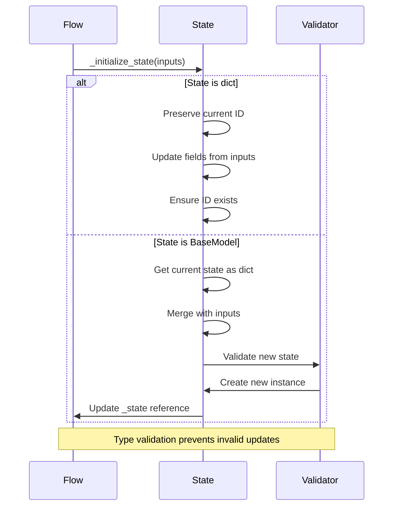
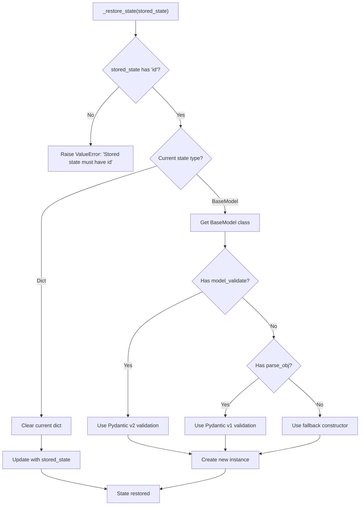
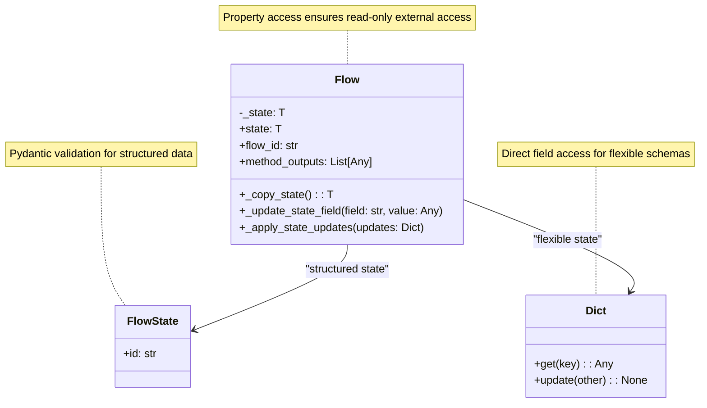
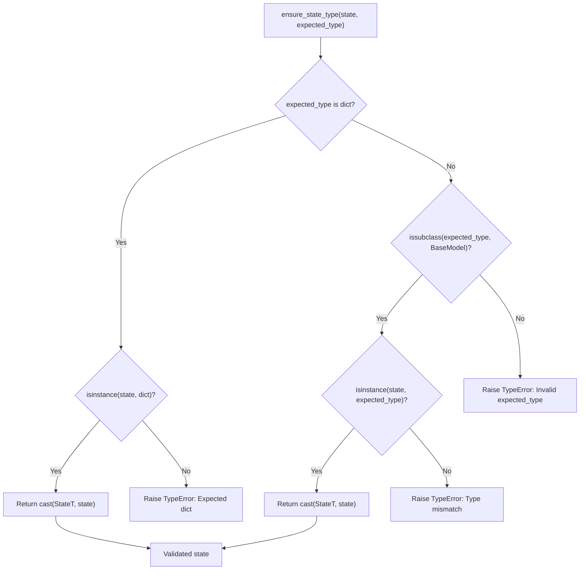
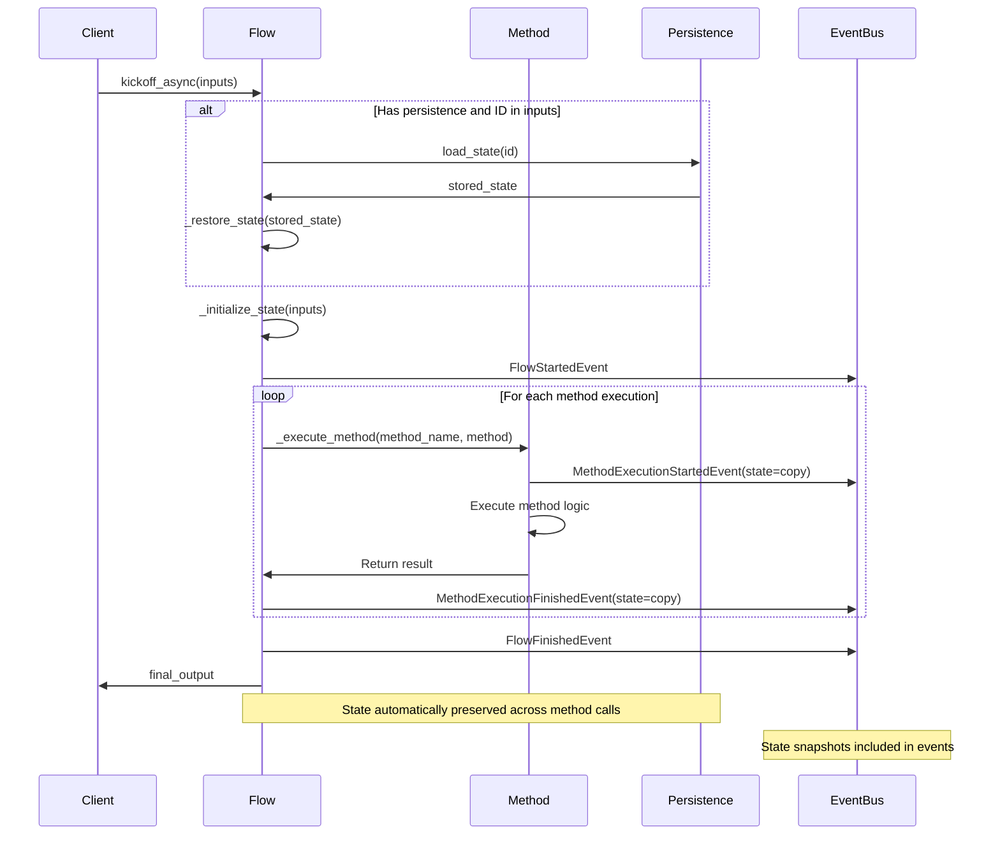

# State Management

<details>
<summary>Relevant source files</summary>

The following files were used as context for generating this wiki page:

- [src/crewai/flow/flow.py](https://github.com/crewAIInc/crewAI/blob/81bd81e5/src/crewai/flow/flow.py)
- [tests/test_multimodal_validation.py](https://github.com/crewAIInc/crewAI/blob/81bd81e5/tests/test_multimodal_validation.py)
- [tests/utilities/test_events.py](https://github.com/crewAIInc/crewAI/blob/81bd81e5/tests/utilities/test_events.py)

</details>


State management in CrewAI flows provides persistent data storage and retrieval capabilities that maintain flow context across method executions, restarts, and failures. The system supports both dictionary-based and strongly-typed Pydantic model states with automatic persistence, restoration, and type validation.

For information about flow creation and structure, see [Flow Creation and Structure](#3.1). For details about flow persistence backends, see [Flow Visualization and Events](#3.4).

## State Models and Types

The Flow system supports two primary state types: dictionary states for flexible data storage and Pydantic BaseModel states for structured, validated data.

### FlowState Base Class

The `FlowState` class serves as the foundation for all structured flow states, ensuring each state instance has a unique identifier.



Sources: [src/crewai/flow/flow.py:49-56](https://github.com/crewAIInc/crewAI/blob/81bd81e5/src/crewai/flow/flow.py#L49-L56)

### Generic Type Support

Flow classes use generic type parameters to enforce state type consistency throughout the flow lifecycle.

```mermaid
graph TB
    subgraph "Type Parameters"
        T["T: TypeVar bound to Union[Dict, BaseModel]"]
        StateT["StateT: TypeVar for validation"]
    end
    
    subgraph "Flow Generic Class"
        FlowGeneric["Flow[T]"]
        FlowDict["Flow[dict]"]
        FlowModel["Flow[CustomState]"]
    end
    
    subgraph "State Types"
        DictState["Dict[str, Any]"]
        ModelState["BaseModel subclass"]
    end
    
    T --> FlowGeneric
    FlowGeneric --> FlowDict
    FlowGeneric --> FlowModel
    FlowDict --> DictState
    FlowModel --> ModelState
    
    note for T "Ensures type consistency across flow methods"
    note for StateT "Used for runtime type validation"
```

Sources: [src/crewai/flow/flow.py:58-65](https://github.com/crewAIInc/crewAI/blob/81bd81e5/src/crewai/flow/flow.py#L58-L65), [src/crewai/flow/flow.py:436-456](https://github.com/crewAIInc/crewAI/blob/81bd81e5/src/crewai/flow/flow.py#L436-L456)

## State Lifecycle Management

State management follows a structured lifecycle from initialization through persistence, with automatic ID generation and type validation at each stage.

### State Initialization

The `_create_initial_state` method handles state creation with different initialization patterns based on the state type.



Sources: [src/crewai/flow/flow.py:513-594](https://github.com/crewAIInc/crewAI/blob/81bd81e5/src/crewai/flow/flow.py#L513-L594)

### State Updates and Modification

The `_initialize_state` method provides controlled state updates while preserving essential fields like the flow ID.



Sources: [src/crewai/flow/flow.py:640-693](https://github.com/crewAIInc/crewAI/blob/81bd81e5/src/crewai/flow/flow.py#L640-L693)

## State Persistence and Restoration

State management integrates with persistence backends to maintain flow state across executions and enable flow resumption after interruptions.

### Persistence Integration

The Flow class coordinates with `FlowPersistence` backends to save and restore state data.

```mermaid
graph LR
    subgraph "Flow Execution"
        Flow["Flow Instance"]
        State["_state: T"]
        FlowID["flow_id: str"]
    end
    
    subgraph "Persistence Layer"
        Persistence["FlowPersistence"]
        Storage["Storage Backend"]
    end
    
    subgraph "State Operations"
        Save["save_state()"]
        Load["load_state()"]
        Restore["_restore_state()"]
    end
    
    Flow --> State
    State --> FlowID
    Flow --> Persistence
    Persistence --> Storage
    
    Flow --> Save
    Save --> Persistence
    Load --> Persistence
    Restore --> Flow
    
    note for FlowID "UUID used as persistence key"
    note for Storage "Implementation-specific backend"
```

Sources: [src/crewai/flow/flow.py:476](https://github.com/crewAIInc/crewAI/blob/81bd81e5/src/crewai/flow/flow.py#L476), [src/crewai/flow/flow.py:694-727](https://github.com/crewAIInc/crewAI/blob/81bd81e5/src/crewai/flow/flow.py#L694-L727)

### State Restoration Process

The `_restore_state` method rebuilds flow state from persisted data with proper type validation.



Sources: [src/crewai/flow/flow.py:694-727](https://github.com/crewAIInc/crewAI/blob/81bd81e5/src/crewai/flow/flow.py#L694-L727)

## Flow State Access and Properties

The Flow class provides controlled access to state data through properties and methods that maintain type safety and consistency.

### State Access Patterns



Sources: [src/crewai/flow/flow.py:595-639](https://github.com/crewAIInc/crewAI/blob/81bd81e5/src/crewai/flow/flow.py#L595-L639), [src/crewai/flow/flow.py:779-794](https://github.com/crewAIInc/crewAI/blob/81bd81e5/src/crewai/flow/flow.py#L779-L794)

## Type Validation and Safety

The system includes comprehensive type validation to ensure state consistency and prevent runtime errors during flow execution.

### Type Validation Function

The `ensure_state_type` function provides runtime type checking for state objects.



Sources: [src/crewai/flow/flow.py:67-105](https://github.com/crewAIInc/crewAI/blob/81bd81e5/src/crewai/flow/flow.py#L67-L105)

## State Management in Flow Execution

State management integrates seamlessly with flow execution, providing automatic state capture and restoration during method execution.

### Execution Context Integration

