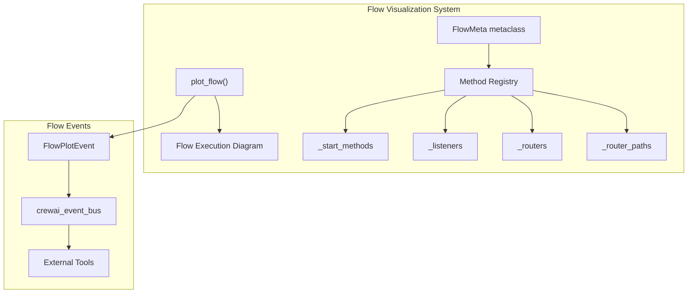
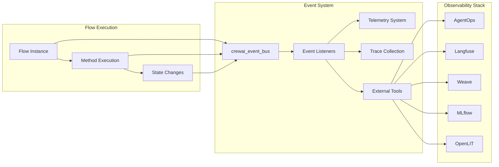
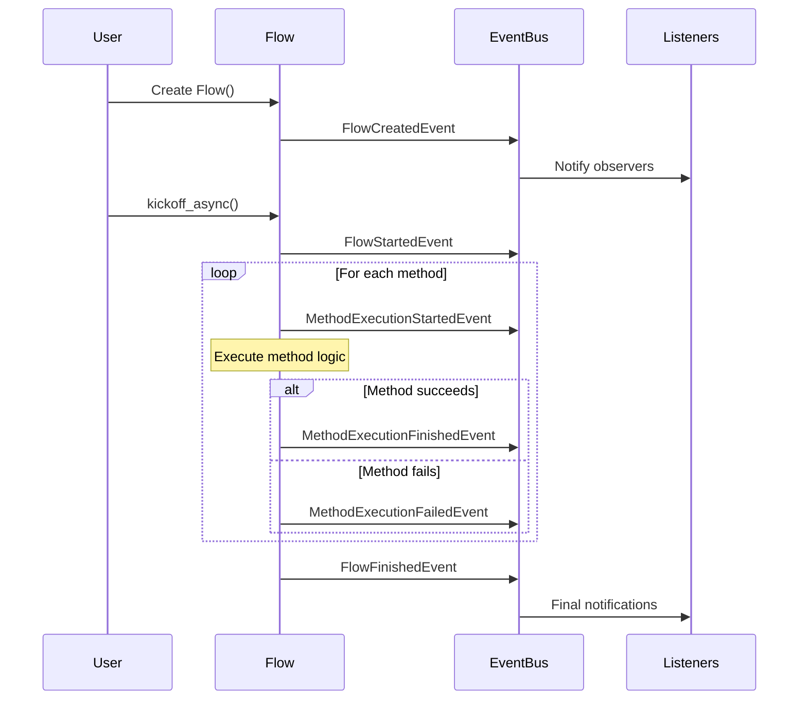
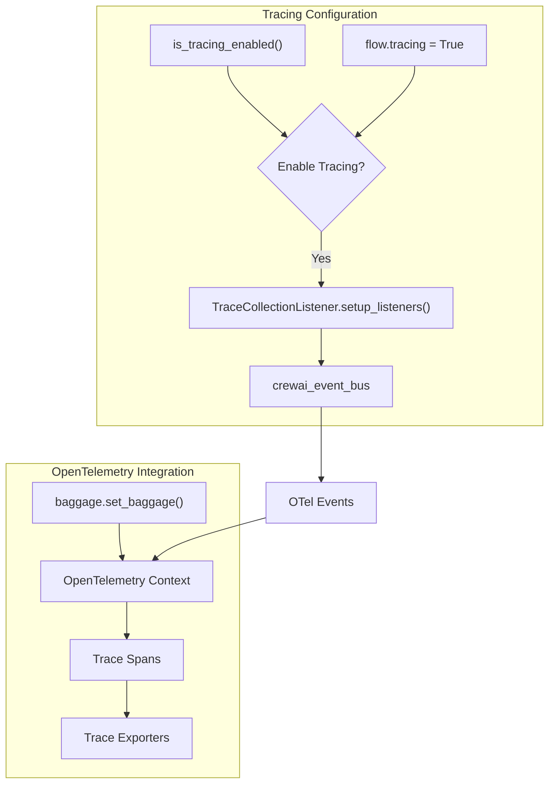
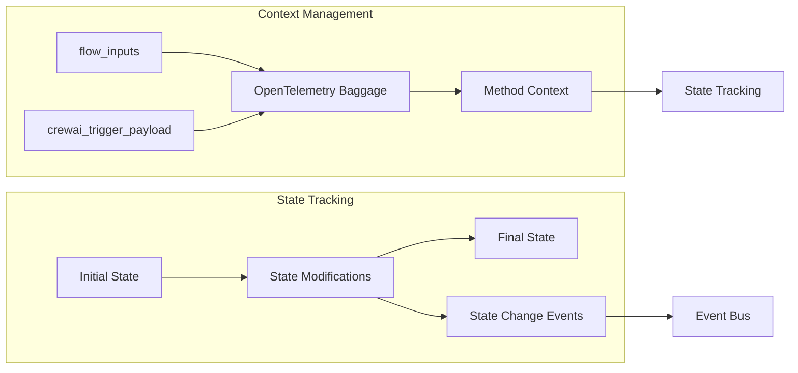
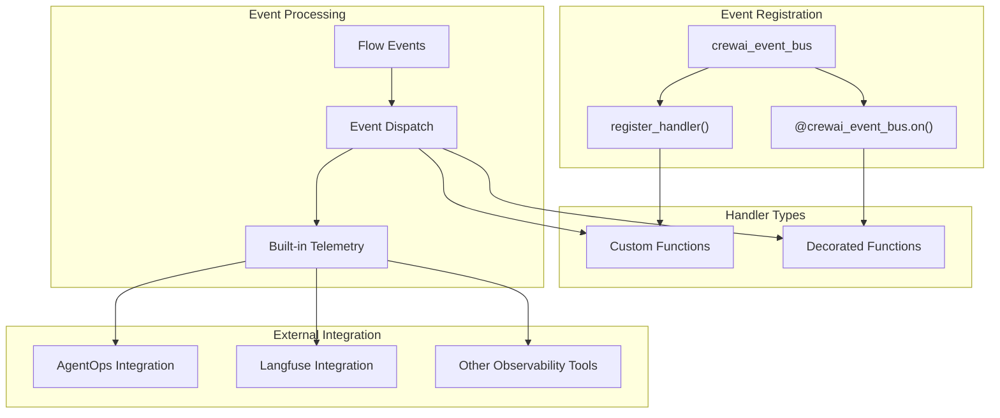

# Flow Visualization and Events

Relevant source files

The following files were used as context for generating this wiki page:

- [docs/images/mlflow-tracing.gif](https://github.com/crewAIInc/crewAI/blob/81bd81e5/docs/images/mlflow-tracing.gif)
- [docs/images/mlflow1.png](https://github.com/crewAIInc/crewAI/blob/81bd81e5/docs/images/mlflow1.png)
- [docs/images/weave-tracing.gif](https://github.com/crewAIInc/crewAI/blob/81bd81e5/docs/images/weave-tracing.gif)
- [docs/images/weave-tracing.png](https://github.com/crewAIInc/crewAI/blob/81bd81e5/docs/images/weave-tracing.png)
- [src/crewai/flow/flow.py](https://github.com/crewAIInc/crewAI/blob/81bd81e5/src/crewai/flow/flow.py)
- [tests/test_multimodal_validation.py](https://github.com/crewAIInc/crewAI/blob/81bd81e5/tests/test_multimodal_validation.py)
- [tests/utilities/test_events.py](https://github.com/crewAIInc/crewAI/blob/81bd81e5/tests/utilities/test_events.py)

This document covers CrewAI's flow visualization capabilities and comprehensive event system integration. It explains how flows generate visual representations of their execution paths, emit detailed events throughout their lifecycle, and integrate with tracing and observability tools for monitoring and debugging.

For general flow creation and structure, see [Flow Creation and Structure](#3.1). For flow state management, see [State Management](#3.3).

## Flow Visualization

CrewAI flows support automatic visualization through the `plot_flow` function, which generates visual representations of flow execution paths, method dependencies, and routing logic.

### Flow Plotting Functionality

The flow visualization system creates diagrams showing:
- Start methods and their triggers
- Listen method dependencies 
- Router method decision paths
- Method execution sequences

Sources: [src/crewai/flow/flow.py:24](https://github.com/crewAIInc/crewAI/blob/81bd81e5/src/crewai/flow/flow.py#L24), [src/crewai/flow/flow.py:32](https://github.com/crewAIInc/crewAI/blob/81bd81e5/src/crewai/flow/flow.py#L32), [src/crewai/flow/flow.py:392-433](https://github.com/crewAIInc/crewAI/blob/81bd81e5/src/crewai/flow/flow.py#L392-L433)

## Event System Integration

CrewAI flows are deeply integrated with the event system, emitting comprehensive events throughout their execution lifecycle for monitoring, debugging, and observability.

### Event Bus Architecture

Sources: [src/crewai/flow/flow.py:28](https://github.com/crewAIInc/crewAI/blob/81bd81e5/src/crewai/flow/flow.py#L28), [src/crewai/flow/flow.py:38-43](https://github.com/crewAIInc/crewAI/blob/81bd81e5/src/crewai/flow/flow.py#L38-L43), [tests/utilities/test_events.py:27-36](https://github.com/crewAIInc/crewAI/blob/81bd81e5/tests/utilities/test_events.py#L27-L36)

## Flow Event Types

### Flow Lifecycle Events

CrewAI flows emit events at key lifecycle stages:

| Event Type | Trigger | Purpose |
|------------|---------|---------|
| `FlowCreatedEvent` | Flow instantiation | Track flow creation and initialization |
| `FlowStartedEvent` | `kickoff()` or `kickoff_async()` called | Mark execution start with inputs |
| `FlowFinishedEvent` | Flow execution completion | Capture final results and duration |
| `FlowPlotEvent` | Flow visualization requested | Enable plot generation tracking |

### Method Execution Events

Each method execution within a flow generates detailed events:

| Event Type | Trigger | Captured Data |
|------------|---------|---------------|
| `MethodExecutionStartedEvent` | Method begins execution | Method name, parameters, initial state |
| `MethodExecutionFinishedEvent` | Method completes successfully | Result, final state, execution duration |
| `MethodExecutionFailedEvent` | Method execution fails | Error details, partial state, stack trace |

### Event Emission Points

Sources: [src/crewai/flow/flow.py:489-495](https://github.com/crewAIInc/crewAI/blob/81bd81e5/src/crewai/flow/flow.py#L489-L495), [src/crewai/flow/flow.py:866-873](https://github.com/crewAIInc/crewAI/blob/81bd81e5/src/crewai/flow/flow.py#L866-L873), [src/crewai/flow/flow.py:892-899](https://github.com/crewAIInc/crewAI/blob/81bd81e5/src/crewai/flow/flow.py#L892-L899), [src/crewai/flow/flow.py:982-990](https://github.com/crewAIInc/crewAI/blob/81bd81e5/src/crewai/flow/flow.py#L982-L990), [src/crewai/flow/flow.py:1004-1013](https://github.com/crewAIInc/crewAI/blob/81bd81e5/src/crewai/flow/flow.py#L1004-L1013), [src/crewai/flow/flow.py:1018-1027](https://github.com/crewAIInc/crewAI/blob/81bd81e5/src/crewai/flow/flow.py#L1018-L1027)

## Tracing and Observability

### Trace Collection Setup

Flow tracing is automatically enabled when either the global tracing flag is set or individual flows have tracing enabled:

Sources: [src/crewai/flow/flow.py:481-484](https://github.com/crewAIInc/crewAI/blob/81bd81e5/src/crewai/flow/flow.py#L481-L484), [src/crewai/flow/flow.py:38-43](https://github.com/crewAIInc/crewAI/blob/81bd81e5/src/crewai/flow/flow.py#L38-L43), [src/crewai/flow/flow.py:20-21](https://github.com/crewAIInc/crewAI/blob/81bd81e5/src/crewai/flow/flow.py#L20-L21), [src/crewai/flow/flow.py:823-825](https://github.com/crewAIInc/crewAI/blob/81bd81e5/src/crewai/flow/flow.py#L823-L825)

### State and Context Tracking

Flow execution context is preserved through OpenTelemetry baggage:

Sources: [src/crewai/flow/flow.py:823-825](https://github.com/crewAIInc/crewAI/blob/81bd81e5/src/crewai/flow/flow.py#L823-L825), [src/crewai/flow/flow.py:902-903](https://github.com/crewAIInc/crewAI/blob/81bd81e5/src/crewai/flow/flow.py#L902-L903), [src/crewai/flow/flow.py:940-957](https://github.com/crewAIInc/crewAI/blob/81bd81e5/src/crewai/flow/flow.py#L940-L957)

## Integration with External Observability Tools

### Event Handler Registration

External tools integrate with CrewAI flows by registering event handlers:

Sources: [tests/utilities/test_events.py:436-465](https://github.com/crewAIInc/crewAI/blob/81bd81e5/tests/utilities/test_events.py#L436-L465), [tests/utilities/test_events.py:105-108](https://github.com/crewAIInc/crewAI/blob/81bd81e5/tests/utilities/test_events.py#L105-L108), [tests/utilities/test_events.py:552-561](https://github.com/crewAIInc/crewAI/blob/81bd81e5/tests/utilities/test_events.py#L552-L561)

### Event Data Structure

Flow events contain rich metadata for observability:

| Field | Type | Description |
|-------|------|-------------|
| `type` | `str` | Event type identifier |
| `flow_name` | `str` | Flow class name or custom name |
| `timestamp` | `datetime` | Event generation time |
| `method_name` | `str` | Executing method name (method events) |
| `params` | `dict` | Method parameters (execution events) |
| `state` | `T` | Flow state snapshot |
| `result` | `Any` | Method result (completion events) |
| `error` | `Exception` | Error details (failure events) |