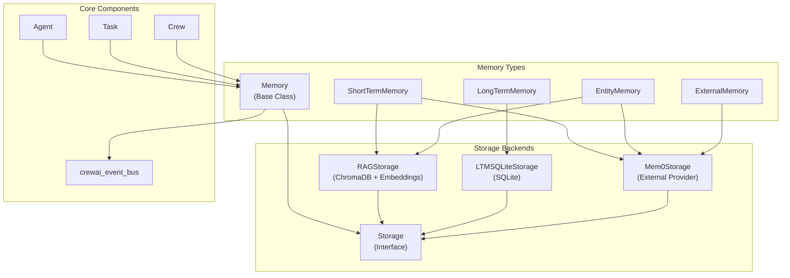
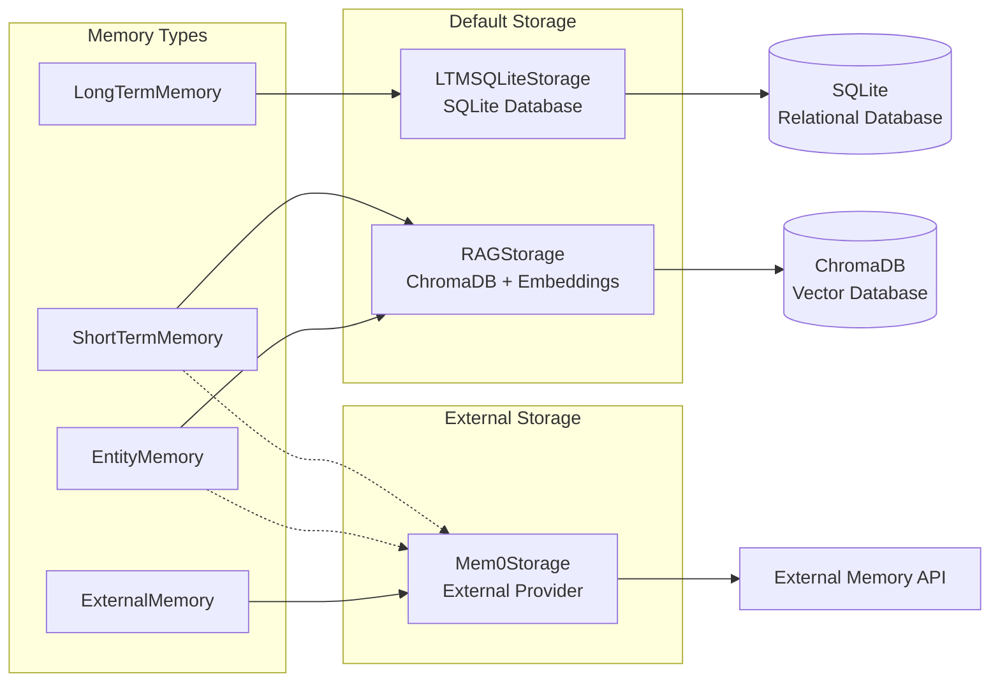
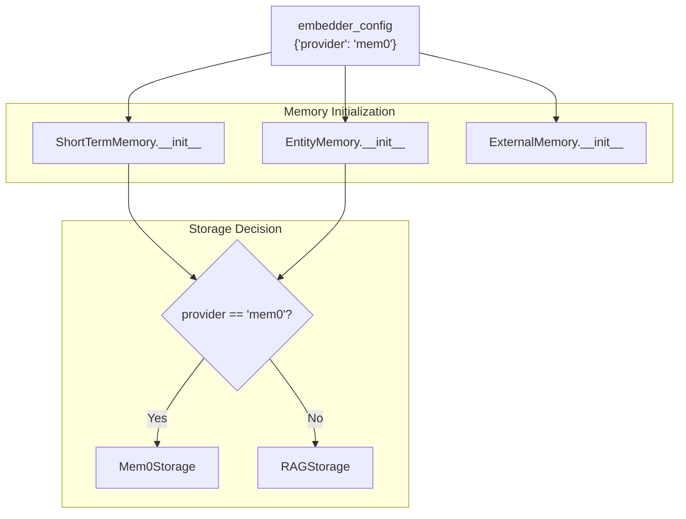
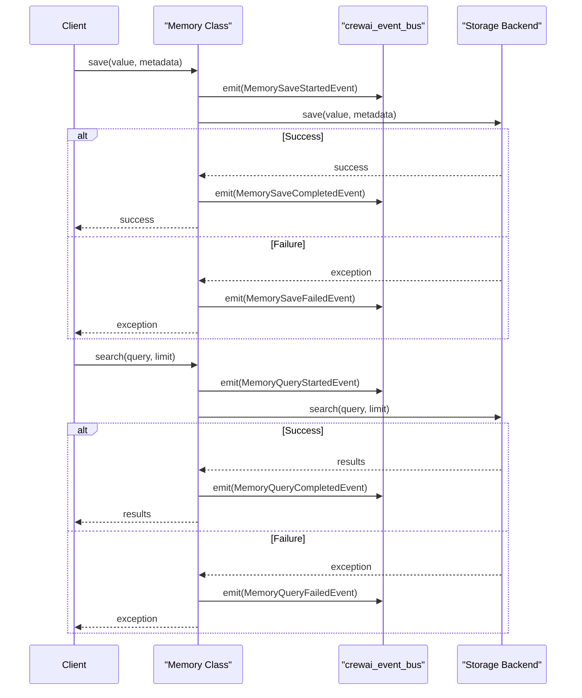

# Memory System

<details>
<summary>Relevant source files</summary>

The following files were used as context for generating this wiki page:

- [src/crewai/knowledge/storage/knowledge_storage.py](https://github.com/crewAIInc/crewAI/blob/81bd81e5/src/crewai/knowledge/storage/knowledge_storage.py)
- [src/crewai/memory/entity/entity_memory.py](https://github.com/crewAIInc/crewAI/blob/81bd81e5/src/crewai/memory/entity/entity_memory.py)
- [src/crewai/memory/external/external_memory.py](https://github.com/crewAIInc/crewAI/blob/81bd81e5/src/crewai/memory/external/external_memory.py)
- [src/crewai/memory/long_term/long_term_memory.py](https://github.com/crewAIInc/crewAI/blob/81bd81e5/src/crewai/memory/long_term/long_term_memory.py)
- [src/crewai/memory/memory.py](https://github.com/crewAIInc/crewAI/blob/81bd81e5/src/crewai/memory/memory.py)
- [src/crewai/memory/short_term/short_term_memory.py](https://github.com/crewAIInc/crewAI/blob/81bd81e5/src/crewai/memory/short_term/short_term_memory.py)
- [src/crewai/memory/storage/interface.py](https://github.com/crewAIInc/crewAI/blob/81bd81e5/src/crewai/memory/storage/interface.py)
- [src/crewai/memory/storage/rag_storage.py](https://github.com/crewAIInc/crewAI/blob/81bd81e5/src/crewai/memory/storage/rag_storage.py)

</details>


The Memory System provides comprehensive memory management capabilities for CrewAI agents and crews, enabling persistent storage and retrieval of information across different temporal scopes and data types. The system supports multiple memory types including short-term memory for recent interactions, long-term memory for cross-run persistence, entity memory for structured information, and external memory providers.

For information about Knowledge Integration and retrieval systems, see [Knowledge Integration](#5). For specific memory CLI management commands, see [Memory Management Commands](#7.4).

## Architecture Overview

The memory system is built around a hierarchical architecture with a base `Memory` class that provides common functionality, specialized memory implementations for different use cases, and pluggable storage backends that handle the actual data persistence.

### Memory System Architecture



Sources: [src/crewai/memory/memory.py:1-67](https://github.com/crewAIInc/crewAI/blob/81bd81e5/src/crewai/memory/memory.py#L1-L67), [src/crewai/memory/short_term/short_term_memory.py:20-54](https://github.com/crewAIInc/crewAI/blob/81bd81e5/src/crewai/memory/short_term/short_term_memory.py#L20-L54), [src/crewai/memory/long_term/long_term_memory.py:18-30](https://github.com/crewAIInc/crewAI/blob/81bd81e5/src/crewai/memory/long_term/long_term_memory.py#L18-L30), [src/crewai/memory/entity/entity_memory.py:20-54](https://github.com/crewAIInc/crewAI/blob/81bd81e5/src/crewai/memory/entity/entity_memory.py#L20-L54), [src/crewai/memory/external/external_memory.py:21-50](https://github.com/crewAIInc/crewAI/blob/81bd81e5/src/crewai/memory/external/external_memory.py#L21-L50)

## Base Memory Class

The `Memory` class serves as the foundation for all memory implementations, providing common properties and methods for storage operations, agent/task associations, and crew management.

### Key Properties and Methods

| Property/Method | Type | Description |
|-----------------|------|-------------|
| `storage` | `Any` | Storage backend instance |
| `agent` | `Optional[Agent]` | Associated agent |
| `task` | `Optional[Task]` | Associated task |
| `crew` | `Optional[Any]` | Associated crew |
| `save(value, metadata)` | `None` | Store data with optional metadata |
| `search(query, limit, score_threshold)` | `List[Any]` | Search stored data |
| `set_crew(crew)` | `Memory` | Associate memory with crew |

Sources: [src/crewai/memory/memory.py:10-67](https://github.com/crewAIInc/crewAI/blob/81bd81e5/src/crewai/memory/memory.py#L10-L67)

## Storage Backend System

The memory system uses a pluggable storage architecture where different backends can be used depending on the memory type and requirements.

### Storage Implementation Mapping



Sources: [src/crewai/memory/storage/rag_storage.py:17-66](https://github.com/crewAIInc/crewAI/blob/81bd81e5/src/crewai/memory/storage/rag_storage.py#L17-L66), [src/crewai/memory/storage/ltm_sqlite_storage.py](https://github.com/crewAIInc/crewAI/blob/81bd81e5/src/crewai/memory/storage/ltm_sqlite_storage.py), [src/crewai/memory/storage/mem0_storage.py](https://github.com/crewAIInc/crewAI/blob/81bd81e5/src/crewai/memory/storage/mem0_storage.py)

### RAGStorage Implementation

The `RAGStorage` class provides vector-based storage using ChromaDB with configurable embedding functions for similarity search capabilities.

**Key Components:**
- **ChromaDB Integration:** [src/crewai/memory/storage/rag_storage.py:58-66]()
- **Embedding Configuration:** [src/crewai/memory/storage/rag_storage.py:41-43]()
- **File Name Sanitization:** [src/crewai/memory/storage/rag_storage.py:68-86]()
- **Search with Score Threshold:** [src/crewai/memory/storage/rag_storage.py:96-126]()

**Default Embedding Function:**
```
OpenAIEmbeddingFunction(model_name="text-embedding-3-small")
```

Sources: [src/crewai/memory/storage/rag_storage.py:154-161](https://github.com/crewAIInc/crewAI/blob/81bd81e5/src/crewai/memory/storage/rag_storage.py#L154-L161)

## Memory Types Overview

The system provides four distinct memory types, each optimized for specific use cases and data persistence requirements.

### Memory Type Characteristics

| Memory Type | Storage Backend | Persistence | Use Case | Data Structure |
|-------------|----------------|-------------|-----------|----------------|
| Short-Term | `RAGStorage` or `Mem0Storage` | Session-based | Recent interactions, immediate context | `ShortTermMemoryItem` |
| Long-Term | `LTMSQLiteStorage` | Cross-run | Performance metrics, task evaluation | `LongTermMemoryItem` |
| Entity | `RAGStorage` or `Mem0Storage` | Session-based | Structured entity information | `EntityMemoryItem` |
| External | `Mem0Storage` | Provider-dependent | External memory services | `ExternalMemoryItem` |

### Provider Selection Logic

Each memory type can use different providers based on configuration:



Sources: [src/crewai/memory/short_term/short_term_memory.py:31-54](https://github.com/crewAIInc/crewAI/blob/81bd81e5/src/crewai/memory/short_term/short_term_memory.py#L31-L54), [src/crewai/memory/entity/entity_memory.py:29-54](https://github.com/crewAIInc/crewAI/blob/81bd81e5/src/crewai/memory/entity/entity_memory.py#L29-L54), [src/crewai/memory/external/external_memory.py:37-50](https://github.com/crewAIInc/crewAI/blob/81bd81e5/src/crewai/memory/external/external_memory.py#L37-L50)

## Event System Integration

The memory system is deeply integrated with CrewAI's event bus, emitting structured events for all memory operations to enable observability and monitoring.

### Memory Event Types

| Event Type | Trigger | Data Included |
|-----------|---------|---------------|
| `MemorySaveStartedEvent` | Before save operation | `value`, `metadata`, `source_type` |
| `MemorySaveCompletedEvent` | After successful save | `value`, `metadata`, `save_time_ms` |
| `MemorySaveFailedEvent` | On save failure | `value`, `metadata`, `error` |
| `MemoryQueryStartedEvent` | Before search operation | `query`, `limit`, `score_threshold` |
| `MemoryQueryCompletedEvent` | After successful search | `query`, `results`, `query_time_ms` |
| `MemoryQueryFailedEvent` | On search failure | `query`, `limit`, `error` |

### Event Emission Pattern



Sources: [src/crewai/memory/short_term/short_term_memory.py:61-110](https://github.com/crewAIInc/crewAI/blob/81bd81e5/src/crewai/memory/short_term/short_term_memory.py#L61-L110), [src/crewai/memory/entity/entity_memory.py:79-151](https://github.com/crewAIInc/crewAI/blob/81bd81e5/src/crewai/memory/entity/entity_memory.py#L79-L151), [src/crewai/memory/long_term/long_term_memory.py:33-81](https://github.com/crewAIInc/crewAI/blob/81bd81e5/src/crewai/memory/long_term/long_term_memory.py#L33-L81)

## Agent and Task Association

The memory system maintains associations with agents and tasks to provide context for memory operations and enable proper attribution in events and metadata.

### Context Management

The `Memory` base class provides properties for managing agent and task associations:

- **Agent Association:** [src/crewai/memory/memory.py:36-43]()
- **Task Association:** [src/crewai/memory/memory.py:26-34]()

These associations are automatically included in memory events and can be used for filtering and organization of stored data.

### Memory Item Integration

Each memory type uses specialized item classes that capture agent context:

- `ShortTermMemoryItem`: Includes agent role in metadata [src/crewai/memory/short_term/short_term_memory.py:74-78]()
- `EntityMemoryItem`: Contains entity-specific metadata structure
- `LongTermMemoryItem`: Includes agent, task, and performance evaluation data
- `ExternalMemoryItem`: Captures agent context for external storage

Sources: [src/crewai/memory/memory.py:19-43](https://github.com/crewAIInc/crewAI/blob/81bd81e5/src/crewai/memory/memory.py#L19-L43), [src/crewai/memory/short_term/short_term_memory.py:74-84](https://github.com/crewAIInc/crewAI/blob/81bd81e5/src/crewai/memory/short_term/short_term_memory.py#L74-L84)

## Reset and Cleanup Operations

All memory implementations support reset operations for clearing stored data, with each storage backend handling cleanup appropriate to its persistence model.

### Reset Implementation by Type

| Memory Type | Reset Method | Storage Cleanup |
|-------------|--------------|-----------------|
| Short-Term | `storage.reset()` | ChromaDB collection reset, directory removal |
| Long-Term | `storage.reset()` | SQLite database truncation |
| Entity | `storage.reset()` | ChromaDB collection reset, directory removal |
| External | `storage.reset()` | Provider-specific cleanup |

The `RAGStorage.reset()` method handles ChromaDB-specific cleanup including database reset and directory removal: [src/crewai/memory/storage/rag_storage.py:138-152]()