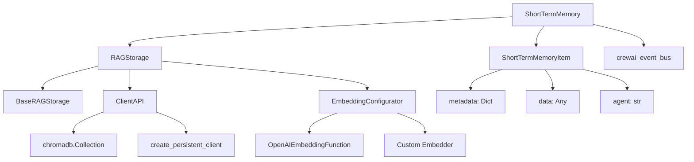
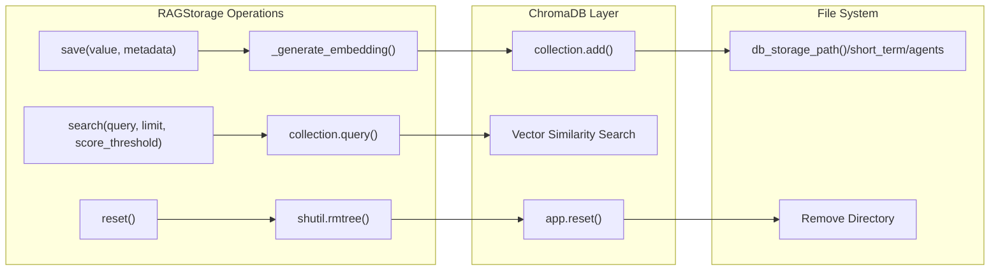
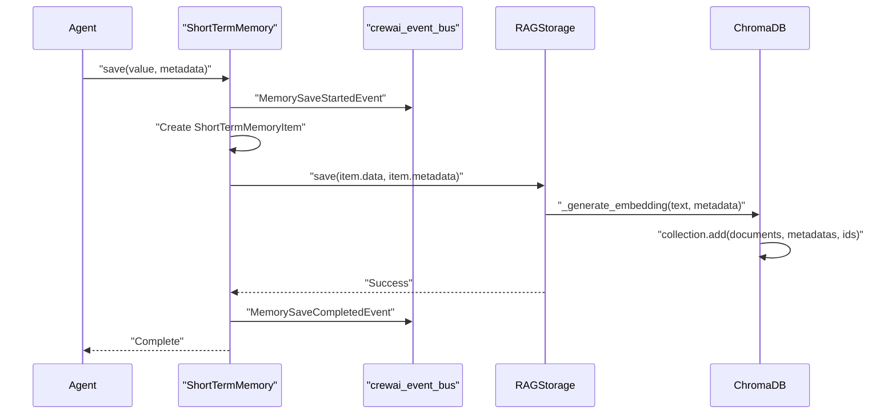
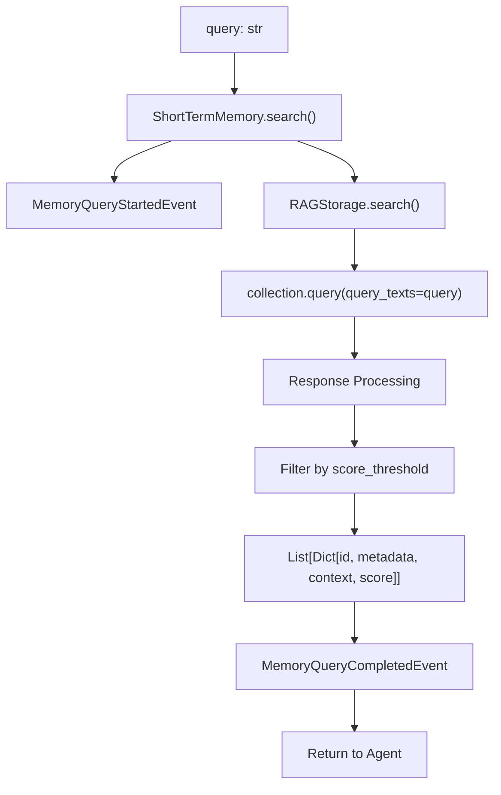
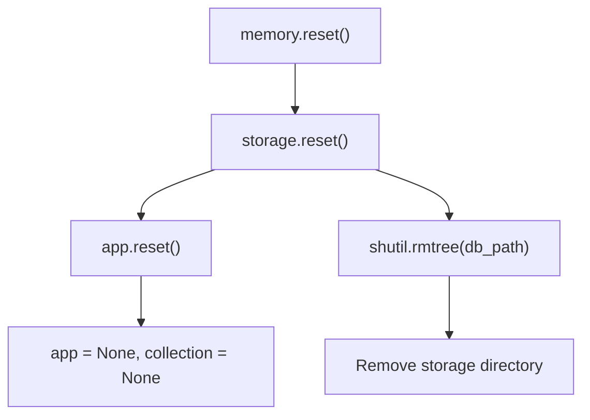

# Short-Term Memory

<details>
<summary>Relevant source files</summary>

The following files were used as context for generating this wiki page:

- [src/crewai/knowledge/storage/knowledge_storage.py](https://github.com/crewAIInc/crewAI/blob/81bd81e5/src/crewai/knowledge/storage/knowledge_storage.py)
- [src/crewai/memory/entity/entity_memory.py](https://github.com/crewAIInc/crewAI/blob/81bd81e5/src/crewai/memory/entity/entity_memory.py)
- [src/crewai/memory/long_term/long_term_memory.py](https://github.com/crewAIInc/crewAI/blob/81bd81e5/src/crewai/memory/long_term/long_term_memory.py)
- [src/crewai/memory/short_term/short_term_memory.py](https://github.com/crewAIInc/crewAI/blob/81bd81e5/src/crewai/memory/short_term/short_term_memory.py)
- [src/crewai/memory/storage/interface.py](https://github.com/crewAIInc/crewAI/blob/81bd81e5/src/crewai/memory/storage/interface.py)
- [src/crewai/memory/storage/rag_storage.py](https://github.com/crewAIInc/crewAI/blob/81bd81e5/src/crewai/memory/storage/rag_storage.py)

</details>


The Short-Term Memory system in CrewAI manages transient data related to immediate tasks and agent interactions using a RAG (Retrieval-Augmented Generation) approach with vector embeddings. This system stores recent conversation context, task results, and interaction data that agents can query to inform their current decision-making.

For information about persistent cross-run data storage, see [Long-Term Memory](#4.2). For structured entity relationship management, see [Entity Memory](#4.3). For external memory provider integration, see [External Memory](#4.4).

## Architecture Overview

The short-term memory system consists of three primary layers: the `ShortTermMemory` interface, the `RAGStorage` backend, and the ChromaDB vector database.

### Short-Term Memory Component Structure



Sources: [src/crewai/memory/short_term/short_term_memory.py:20-54](https://github.com/crewAIInc/crewAI/blob/81bd81e5/src/crewai/memory/short_term/short_term_memory.py#L20-L54), [src/crewai/memory/storage/rag_storage.py:17-66](https://github.com/crewAIInc/crewAI/blob/81bd81e5/src/crewai/memory/storage/rag_storage.py#L17-L66)

## Storage Implementation

### RAGStorage Backend

The `RAGStorage` class provides vector-based storage using ChromaDB for efficient similarity search. It manages embedding generation, collection management, and data persistence.



Sources: [src/crewai/memory/storage/rag_storage.py:88-153](https://github.com/crewAIInc/crewAI/blob/81bd81e5/src/crewai/memory/storage/rag_storage.py#L88-L153)

### Storage Path Configuration

The storage system organizes files by memory type and agent configuration:

| Component | Purpose | Path Pattern |
|-----------|---------|--------------|
| `db_storage_path()` | Base storage directory | `~/.crewai/storage/` |
| Type directory | Memory type separation | `short_term/` |
| Agent identifier | Multi-agent isolation | `{sanitized_agent_roles}` |

Sources: [src/crewai/memory/storage/rag_storage.py:74-86](https://github.com/crewAIInc/crewAI/blob/81bd81e5/src/crewai/memory/storage/rag_storage.py#L74-L86)

## Memory Operations

### Save Operation

The save operation converts input data into `ShortTermMemoryItem` objects and stores them with vector embeddings:



Sources: [src/crewai/memory/short_term/short_term_memory.py:56-110](https://github.com/crewAIInc/crewAI/blob/81bd81e5/src/crewai/memory/short_term/short_term_memory.py#L56-L110), [src/crewai/memory/storage/rag_storage.py:128-136](https://github.com/crewAIInc/crewAI/blob/81bd81e5/src/crewai/memory/storage/rag_storage.py#L128-L136)

### Search Operation

Search uses vector similarity to find relevant stored memories:



The search returns results with similarity scores above the configured threshold (default 0.35).

Sources: [src/crewai/memory/short_term/short_term_memory.py:112-162](https://github.com/crewAIInc/crewAI/blob/81bd81e5/src/crewai/memory/short_term/short_term_memory.py#L112-L162), [src/crewai/memory/storage/rag_storage.py:96-126](https://github.com/crewAIInc/crewAI/blob/81bd81e5/src/crewai/memory/storage/rag_storage.py#L96-L126)

## Configuration Options

### Memory Provider Selection

Short-term memory supports two storage backends:

```python
# Default RAGStorage with ChromaDB
embedder_config = None  # Uses OpenAI embeddings

# External Mem0 provider
embedder_config = {
    "provider": "mem0", 
    "config": {...}
}
```

Sources: [src/crewai/memory/short_term/short_term_memory.py:31-54](https://github.com/crewAIInc/crewAI/blob/81bd81e5/src/crewai/memory/short_term/short_term_memory.py#L31-L54)

### Embedding Configuration

The system uses `EmbeddingConfigurator` to set up embedding functions:

| Configuration | Default | Purpose |
|---------------|---------|---------|
| Provider | OpenAI | Embedding model provider |
| Model | `text-embedding-3-small` | Embedding model |
| API Key | `OPENAI_API_KEY` env var | Authentication |

Sources: [src/crewai/memory/storage/rag_storage.py:154-161](https://github.com/crewAIInc/crewAI/blob/81bd81e5/src/crewai/memory/storage/rag_storage.py#L154-L161)

## Event System Integration

Short-term memory emits events for observability and monitoring:

### Event Types

| Event | Trigger | Data |
|-------|---------|------|
| `MemorySaveStartedEvent` | Save operation begins | value, metadata, agent |
| `MemorySaveCompletedEvent` | Save operation succeeds | value, metadata, save_time_ms |
| `MemorySaveFailedEvent` | Save operation fails | value, metadata, error |
| `MemoryQueryStartedEvent` | Search operation begins | query, limit, score_threshold |
| `MemoryQueryCompletedEvent` | Search operation succeeds | query, results, query_time_ms |
| `MemoryQueryFailedEvent` | Search operation fails | query, error |

Sources: [src/crewai/memory/short_term/short_term_memory.py:9-17](https://github.com/crewAIInc/crewAI/blob/81bd81e5/src/crewai/memory/short_term/short_term_memory.py#L9-L17), [src/crewai/memory/short_term/short_term_memory.py:61-161](https://github.com/crewAIInc/crewAI/blob/81bd81e5/src/crewai/memory/short_term/short_term_memory.py#L61-L161)

## Memory Reset and Cleanup

The reset operation clears all stored data and reinitializes the storage:

