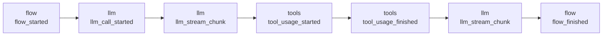

## Overview

Streaming lets your application receive execution updates while work is still running. Instead of waiting for the final result, you can render LLM tokens, tool activity, Flow lifecycle events, and conversation messages as they happen.

CrewAI has two streaming surfaces:

| Surface | Used by | Output |
|---------|---------|--------|
| Frame streaming | Flows, direct LLM calls, conversational turns | Ordered `StreamFrame` objects |
| Crew chunk streaming | Crews with `stream=True` | `CrewStreamingOutput` chunks |

For new runtime integrations, UIs, terminal apps, service bridges, and conversational surfaces, use frame streaming. It provides one stable event envelope across the runtime.

## StreamFrame

A `StreamFrame` is the common object emitted by streamable runtimes:

```python
frame.id           # unique frame id
frame.seq          # execution-local order, when available
frame.type         # source event type, such as "llm_stream_chunk"
frame.channel      # "llm", "flow", "tools", "messages", "lifecycle", or "custom"
frame.namespace    # source/runtime namespace
frame.timestamp    # event timestamp
frame.parent_id    # parent event id, when available
frame.previous_id  # previous event id, when available
frame.data         # structured event payload
frame.event        # alias for frame.data
frame.content      # printable text for token-like frames, otherwise ""
```

The important fields for most consumers are:

| Field | Use it for |
|-------|------------|
| `channel` | Routing frames to the right UI region |
| `type` | Handling a specific event inside a channel |
| `content` | Printing token-like text |
| `event` | Reading structured metadata, such as tool names or message roles |
| `seq` | Preserving execution order |

## Channels

Frames are grouped into high-level channels:

| Channel | Contains |
|---------|----------|
| `llm` | LLM call lifecycle, text chunks, and thinking chunks |
| `flow` | Flow lifecycle, method execution, routing, pause, and resume events |
| `tools` | Tool usage start, finish, and error events |
| `messages` | Conversation transcript events |
| `lifecycle` | Runtime lifecycle events that do not belong to another channel |
| `custom` | Events that do not map to a built-in channel |

The stream itself remains one ordered timeline. Channel projections let consumers focus on only part of that timeline.

### Tool Call Streaming

Tool calls appear in two places because there are two distinct phases:

| Phase | Channel | Event type | Meaning |
|-------|---------|------------|---------|
| Tool-call construction | `llm` | `llm_stream_chunk` | The model is streaming the tool name or arguments it intends to call |
| Tool execution | `tools` | `tool_usage_started`, `tool_usage_finished`, `tool_usage_error` | CrewAI is executing the tool and reporting the result |

For streamed tool-call arguments, the latest provider delta is available as `frame.data["chunk"]`. The accumulated argument string is available at `frame.data["tool_call"]["function"]["arguments"]`.

```python
with llm.stream_events("Check the weather in Paris.", tools=[weather_tool]) as stream:
    for frame in stream.llm:
        if frame.type != "llm_stream_chunk":
            continue

        tool_call = frame.data.get("tool_call")
        if tool_call:
            function = tool_call["function"]
            print("Tool:", function["name"])
            print("Latest argument delta:", frame.data["chunk"])
            print("Arguments so far:", function["arguments"])
        elif frame.content:
            print(frame.content, end="", flush=True)
```

Use the `tools` channel when you want to display that a tool actually started, completed, or failed. Use the `llm` channel when you want to observe the model constructing the tool call before execution.



## Stream Sessions

Frame streaming returns a stream session:

```python
stream = flow.stream_events(inputs={"topic": "AI agents"})
```

The session is both an iterator and the holder for the final result:

```python
with stream:
    for frame in stream:
        print(frame.content, end="", flush=True)

result = stream.result
```

Consume the stream before reading `stream.result`. Reading the result too early raises an error because the runtime may still be producing frames.

## Channel Projections

Use channel projections when you only need one kind of frame:

```python
with flow.stream_events(inputs={"topic": "AI agents"}) as stream:
    for frame in stream.llm:
        print(frame.content, end="", flush=True)

result = stream.result
```

Available projections:

| Projection | Frames |
|------------|--------|
| `stream.events` | All frames |
| `stream.llm` | LLM frames |
| `stream.flow` | Flow frames |
| `stream.tools` | Tool frames |
| `stream.messages` | Conversation message frames |
| `stream.interleave([...])` | Selected channels in relative order |

## Entrypoints

Use the entrypoint that matches the runtime you are streaming:

| Runtime | Streaming entrypoint |
|---------|----------------------|
| Flow | `flow.stream_events(...)` |
| Flow with `stream=True` | `flow.kickoff(...)` returns a stream session |
| Async Flow | `flow.astream(...)` or `await flow.kickoff_async(...)` when `stream=True` |
| Direct LLM call | `llm.stream_events(...)` |
| Conversational Flow turn | `flow.stream_turn(...)` |
| Crew | `Crew(..., stream=True).kickoff(...)` returns `CrewStreamingOutput` |

Direct `llm.call(...)` still returns the final assembled LLM result. Use `llm.stream_events(...)` when you want to iterate over LLM chunks as they arrive.

## Related Guides

- [Consuming Streams](/edge/en/learn/consuming-streams)
- [Streaming Runtime Contract](/edge/en/learn/streaming-runtime-contract)
- [Streaming Flow Execution](/edge/en/learn/streaming-flow-execution)
- [Streaming Crew Execution](/edge/en/learn/streaming-crew-execution)
