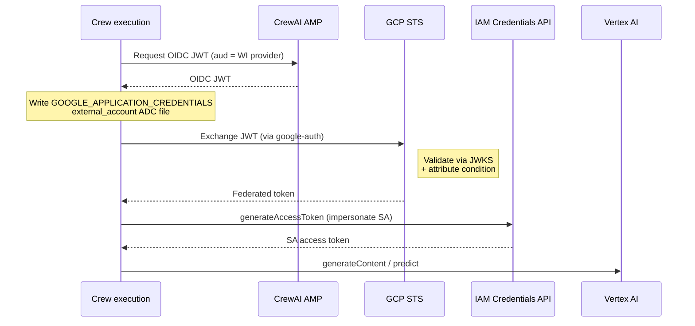

<Note>
Workload identity for LLM connections is currently available to enterprise SaaS customers on CrewAI AMP. Contact your CrewAI account team to enable it for your organization before starting this guide.
</Note>

## Version requirements

| Component | Required version | Notes |
|---|---|---|
| **CrewAI AMP** | Early access (per-organization feature flag) | Contact CrewAI support to enable **Workload Identity Configs** and **LLM workload identity** on your org. |
| **CrewAI Python SDK (`crewai`)** | **`1.14.3` or higher** | Crews built from this version (or later) include the OIDC token fetch and GCP credential setup needed for Vertex workload identity. |
| **LLM provider** | **Google Gen AI SDK** (`google/` model prefix) | Required. LiteLLM's `vertex_ai/*` provider is **not** supported with workload identity. Use the `google/` prefix on your LLM connection's model field — for example `google/gemini-2.5-pro`, `google/gemini-2.5-flash`, `google/gemini-2.0-flash`. |
| **Google Cloud APIs** | `iam.googleapis.com`, `iamcredentials.googleapis.com`, `sts.googleapis.com`, `aiplatform.googleapis.com` | All four must be enabled on the target project (see [Part 1, step 1](#part-1-gcp-setup)). |

<Warning>
**Use the `google/` model prefix, not `vertex_ai/`.** Workload identity requires the native Google Gen AI SDK route, which uses Application Default Credentials. The LiteLLM `vertex_ai/*` provider does not consume the ADC config the runtime writes, so calls will fail to authenticate.
</Warning>

## Overview

CrewAI AMP can authenticate to Google Vertex AI using **GCP Workload Identity Federation** instead of long-lived service account keys. At kickoff, your crew execution fetches a short-lived OIDC token from AMP scoped to your organization and writes a Google **Application Default Credentials (ADC)** `external_account` configuration that points at it. The Google Gen AI SDK (invoked via CrewAI's `google/` model prefix) then transparently exchanges that OIDC token at GCP STS, optionally impersonates a service account, and calls Vertex AI — all in-process inside the running crew.

The result:

- **No Google credentials stored in CrewAI AMP** — no service account JSON keys, no API keys. AMP holds only the OIDC signing key it uses to mint tokens.
- **Trust is anchored in your GCP project.** You decide which CrewAI organization can impersonate which service account.
- **The STS exchange happens inside the crew execution**, not in AMP's control plane. AMP only mints OIDC tokens; the Google credentials returned by GCP are never seen or persisted by AMP — they live and die inside a single execution.
- **Access tokens are refreshed automatically**, and the underlying OIDC subject token is rotated before expiry — long-running crews are supported (with one edge case noted below).

### How it works



GCP fetches AMP's public signing keys from a standard OIDC discovery endpoint and validates each token before exchanging it. AMP never sees your GCP service account key, and the federated/SA tokens minted by GCP stay inside the crew execution that requested them — they are not returned to or persisted by AMP's control plane.

---

## Prerequisites

- A GCP project with Vertex AI enabled (`aiplatform.googleapis.com`).
- The `gcloud` CLI authenticated as a user with IAM admin on that project. See [Appendix: minimum IAM](#appendix-minimum-iam-for-setup) for the specific roles required.
- Your **CrewAI organization UUID**. Find it in CrewAI AMP at **Settings → Organization** (use the UUID, not the numeric ID).
- Workload identity for LLM connections enabled on your AMP organization — contact CrewAI support.

The CrewAI AMP OIDC issuer URL is:

```
https://app.crewai.com
```

---

## Part 1 — GCP setup

<Steps>
  <Step title="Enable required APIs">
    ```bash
    gcloud services enable \
      iam.googleapis.com \
      iamcredentials.googleapis.com \
      sts.googleapis.com \
      aiplatform.googleapis.com \
      --project=PROJECT_ID
    ```
  </Step>

  <Step title="Create a workload identity pool">
    ```bash
    gcloud iam workload-identity-pools create crewai-amp \
      --project=PROJECT_ID \
      --location=global \
      --display-name="CrewAI AMP"
    ```
  </Step>

  <Step title="Create the OIDC provider inside the pool">
    The `attribute-condition` is the **critical security boundary** — it restricts which CrewAI organization can assume any identity from this pool. Replace `YOUR_ORG_UUID` with your AMP organization UUID.

    ```bash
    gcloud iam workload-identity-pools providers create-oidc crewai-amp-oidc \
      --project=PROJECT_ID \
      --location=global \
      --workload-identity-pool=crewai-amp \
      --issuer-uri="https://app.crewai.com" \
      --attribute-mapping="google.subject=assertion.sub,attribute.organization=assertion.organization_id" \
      --attribute-condition="assertion.organization_id == 'YOUR_ORG_UUID'"
    ```

    <Warning>
    `YOUR_ORG_UUID` must be your organization **UUID** (the same value used by `attribute.organization` in the principalSet binding below). A wrong value here is the most common cause of `PERMISSION_DENIED` failures during STS exchange.
    </Warning>

    Record the full provider resource name — you'll need it in Part 2:

    ```bash
    gcloud iam workload-identity-pools providers describe crewai-amp-oidc \
      --project=PROJECT_ID \
      --location=global \
      --workload-identity-pool=crewai-amp \
      --format="value(name)"
    # projects/PROJECT_NUMBER/locations/global/workloadIdentityPools/crewai-amp/providers/crewai-amp-oidc
    ```
  </Step>

  <Step title="Create a Vertex AI service account">
    `crewai-vertex` is an example name — pick anything that fits your naming conventions, but use the same value in the impersonation binding (next step) and on the LLM connection (Part 2).

    ```bash
    gcloud iam service-accounts create crewai-vertex \
      --project=PROJECT_ID \
      --display-name="CrewAI AMP — Vertex AI"

    gcloud projects add-iam-policy-binding PROJECT_ID \
      --member="serviceAccount:crewai-vertex@PROJECT_ID.iam.gserviceaccount.com" \
      --role="roles/aiplatform.user"
    ```

    `roles/aiplatform.user` is the minimum role needed for `generateContent` and `predict`. Tighten further with custom roles if your security policy requires it.
  </Step>

  <Step title="Allow the pool to impersonate the service account">
    This is the second security boundary: only federated identities whose `organization` attribute matches your org UUID can impersonate this SA.

    ```bash
    gcloud iam service-accounts add-iam-policy-binding \
      crewai-vertex@PROJECT_ID.iam.gserviceaccount.com \
      --project=PROJECT_ID \
      --role="roles/iam.workloadIdentityUser" \
      --member="principalSet://iam.googleapis.com/projects/PROJECT_NUMBER/locations/global/workloadIdentityPools/crewai-amp/attribute.organization/YOUR_ORG_UUID"
    ```
  </Step>
</Steps>

---

## Part 2 — CrewAI AMP setup

<Steps>
  <Step title="Create a Workload Identity Config">
    In AMP, go to **Settings → Workload Identity Configs → New** and fill in:

    | Field | Value |
    |---|---|
    | **Name** | A memorable label, e.g. `vertex-ai-prod` |
    | **Cloud provider** | `GCP` |
    | **GCP Workload Identity Provider** | The full resource name from Part 1, step 3 (`projects/PROJECT_NUMBER/locations/global/workloadIdentityPools/crewai-amp/providers/crewai-amp-oidc`) |
    | **Default for GCP** | Optional — marks this as the default GCP config for new connections |

    Creating workload identity configs requires a role with **manage** access to LLM connections (see [RBAC](/en/enterprise/features/rbac)).
  </Step>

  <Step title="Attach the config to a Vertex LLM connection">
    Go to **LLM Connections → New** (or edit an existing one) and select:

    - **Provider:** `Vertex`
    - **Workload Identity Config:** the config from the previous step
    - **GCP Service Account Email:** the SA you created in Part 1 (e.g., `crewai-vertex@PROJECT_ID.iam.gserviceaccount.com`)

    No `GOOGLE_API_KEY` environment variable is required — leave that empty. For region, add a single connection-scoped env var:

    - `GOOGLE_CLOUD_LOCATION=global` — recommended default. Vertex's `global` endpoint provides higher availability and is supported by current Gemini 2.x and 3.x models. Set a specific region (e.g. `us-central1`, `europe-west4`) if you need data residency (the global endpoint does **not** guarantee in-region processing) or if you plan to use Vertex features that don't run on `global` (notably **tuning**, **batch prediction** for Anthropic / OpenMaaS models, and **RAG corpus management** — RAG *requests* still work on global). For chat/completion crews, `global` is the right choice.

    <Note>
    Service account impersonation is configured per-connection (not per-config) so a single workload identity pool can be reused for multiple service accounts with different Vertex permissions.
    </Note>
  </Step>

  <Step title="Bind the connection to a crew or deployment">
    Attach the LLM connection to a crew, Studio project, or deployment exactly as you would any other LLM connection. At kickoff, the running crew will request an OIDC token from AMP for this connection's workload identity provider and exchange it for Vertex credentials in-process — no Google credentials are stored or pushed by AMP.
  </Step>
</Steps>

---

## Runtime behavior

For Vertex connections backed by workload identity, the crew does **not** receive a `GOOGLE_API_KEY` or service account JSON as a static deploy-time env var. Instead, at kickoff, the running crew:

1. Fetches an OIDC token from AMP, signed with AMP's private key and scoped to your organization (audience = your workload identity provider).
2. Writes the JWT to a temporary file in the execution environment.
3. Writes a Google **Application Default Credentials (ADC)** config of type `external_account` that references the JWT file, your STS audience, and (optionally) the service account impersonation URL.
4. Sets the following environment variables for the crew process:

   | Env var | Value |
   |---|---|
   | `GOOGLE_APPLICATION_CREDENTIALS` | Path to the temporary ADC `external_account` config file |
   | `GOOGLE_CLOUD_PROJECT` | Your GCP project number, parsed from the workload identity provider resource name (Google Gen AI SDK accepts either the project ID or the project number) |

   No `GOOGLE_API_KEY` and no `GOOGLE_CLOUD_LOCATION` are set automatically. Configure `GOOGLE_CLOUD_LOCATION` on your LLM connection in AMP (recommended default: `global`).

5. From this point on, **`google-auth`** (used by the Google Gen AI SDK) does the STS exchange and SA impersonation transparently on the first Vertex API call, and caches/refreshes the resulting access token automatically.

The crew SDK reads these like any other env var — no code changes required, provided your crew was deployed against **`crewai>=1.14.3`** (see [Version requirements](#version-requirements)).

### Long-running crews

Access tokens are **automatically refreshed**:

- **Vertex access tokens** (1-hour TTL) are refreshed by `google-auth` in-process, transparently to your crew code.
- **The underlying OIDC subject token** (also 1-hour TTL) is rotated before expiry on every kickoff entry point. The crew fetches a fresh OIDC JWT from AMP and rewrites the ADC token file; subsequent STS exchanges pick up the new JWT.

In practice this means:

- Crews that run for **less than 1 hour** never trigger a refresh — the initial token covers the whole execution.
- Crews that run for **multiple hours** continue to function as long as kickoff entry points (sync hops, agent steps, etc.) fire during the execution; the refresh buffer ensures the OIDC token is rotated before STS rejects it.
- If a single Vertex API call runs for more than 1 hour (very unusual — typical Gemini responses return in seconds), the OIDC token can expire mid-request and the call will fail. This is the one scenario where token refresh cannot help.

---

## Verification

Run a crew that uses the Vertex connection and tail the execution logs in AMP. A successful `generateContent` or `predict` call confirms the full chain — OIDC mint → STS exchange → SA impersonation → Vertex — is wired correctly.

If the crew fails, see [Troubleshooting](#troubleshooting) below. Most issues trace back to the GCP-side configuration — the OIDC provider's `attribute-condition` or the service account's `principalSet` binding.

### Inspecting on the GCP side

You can confirm tokens are being exchanged by looking at **Cloud Audit Logs** in your GCP project:

- Service: `sts.googleapis.com` → method `google.identity.sts.v1.SecurityTokenService.ExchangeToken`
- Service: `iamcredentials.googleapis.com` → method `GenerateAccessToken`

A short crew execution produces one `ExchangeToken` and one `GenerateAccessToken` entry; longer executions produce additional entries each time the OIDC token is rotated. The `protoPayload.authenticationInfo` includes the `sub` and `organization_id` claims, useful for audit and incident response.

---

## Troubleshooting

| Symptom | Likely cause |
|---|---|
| AMP UI doesn't show **Workload Identity Configs** | Feature isn't enabled for your organization — contact CrewAI support. |
| AMP UI rejects attaching a config to an LLM connection | The connection's provider must be `Vertex` (GCP). |
| GCP STS returns `PERMISSION_DENIED: The given credential is rejected by the attribute condition` | Org UUID mismatch — typically the numeric org ID was used instead of the UUID, or the UUID in the attribute condition is wrong. |
| GCP STS returns `INVALID_ARGUMENT: Invalid JWT` | Issuer URL in the provider doesn't match `https://app.crewai.com`, or GCP's JWKS cache is stale (wait up to 1 hour, or recreate the provider). |
| `generateAccessToken` returns `PERMISSION_DENIED` | The pool member is missing `roles/iam.workloadIdentityUser` on the service account, or the `principalSet` in the binding uses the wrong attribute path. |
| Vertex returns `PERMISSION_DENIED` on `generateContent` | The service account is missing `roles/aiplatform.user` (or an equivalent custom role) on the project. |
| Crew fails immediately with `DefaultCredentialsError: File <path> was not found` | The ADC token file was cleaned up — typically because the execution process was forked after credentials initialized. Re-kickoff the crew. If it persists, bump `crewai>=1.14.3` in your `pyproject.toml` and re-deploy. |
| Crew fails with `DefaultCredentialsError` and no `GOOGLE_APPLICATION_CREDENTIALS` is set in the execution env | Your crew was deployed against a pre-`1.14.3` `crewai`, so no ADC file was written and no API-key fallback exists for workload identity connections. Bump `crewai>=1.14.3` in your `pyproject.toml` and re-deploy. |
| Crew fails after ~1 hour with `invalid_grant` from STS | The OIDC subject token expired and refresh did not fire — typically because a single in-process call held the execution past the refresh buffer. If this reproduces, contact CrewAI support with the failing execution ID. |
| Vertex calls fail with `Unable to locate project` | `GOOGLE_CLOUD_PROJECT` was not parsed — your workload identity provider resource name in AMP doesn't match the `projects/PROJECT_NUMBER/...` format. Re-check the provider value copied from `gcloud iam workload-identity-pools providers describe`. |
| Vertex calls fail with `region`/`location` errors | `GOOGLE_CLOUD_LOCATION` isn't set on the LLM connection. Add it as a connection-scoped env var (`global` is the recommended default). |
| Vertex returns `model not found` or `not available in location` | The chosen region doesn't host the requested model. Switch the connection's `GOOGLE_CLOUD_LOCATION` to `global`, or pick a region known to host the model. |
| Vertex calls fail to authenticate despite a working WI config | The model identifier uses the `vertex_ai/` (LiteLLM) prefix instead of `google/`. Workload identity only works through the Google Gen AI SDK route — change the model to `google/<model-name>`. |

---

## Security notes

- **The `organization_id` claim is your security boundary.** Your GCP attribute condition **must** restrict to your organization UUID. Without it, any CrewAI AMP organization could exchange a token through your pool. The `sub` claim contains the same UUID prefixed with `organization:` — either could be used, but `organization_id` matches the bare-UUID form used in the `attribute.organization` mapping and `principalSet` binding.
- **Service account impersonation is the second boundary.** The `principalSet` binding restricts impersonation to identities whose `organization` attribute matches your UUID. Use it even when the attribute condition is set — defense in depth.
- **Issuer trust is one-way.** GCP fetches AMP's public JWKS over HTTPS. AMP never receives any GCP credential.

---

## Appendix: minimum IAM for setup

The user running the `gcloud` commands above needs, on the target project:

- `roles/iam.workloadIdentityPoolAdmin` — create pools and providers
- `roles/iam.serviceAccountAdmin` — create service accounts
- `roles/resourcemanager.projectIamAdmin` — bind project-level roles
- `roles/serviceusage.serviceUsageAdmin` — enable required APIs

Or, equivalently, `roles/owner` on the project.

---

## Related

- [Single Sign-On (SSO)](/en/enterprise/features/sso) — Authentication for the AMP UI and CLI (separate system from LLM workload identity)
- [Azure OpenAI Setup](/en/enterprise/guides/azure-openai-setup) — Static-key alternative for Azure OpenAI
- [GCP: Workload Identity Federation](https://cloud.google.com/iam/docs/workload-identity-federation) — Google's reference docs
