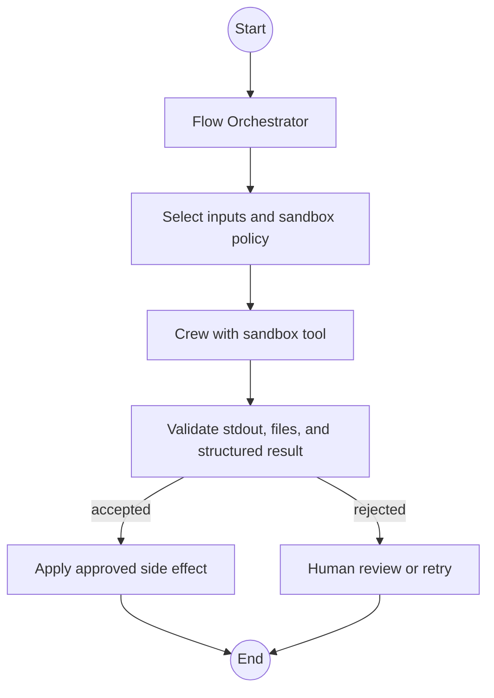

## Overview

Production crews sometimes need to run generated code: data analysis scripts, repository checks, file transforms, test commands, or short automation steps. Treat that capability as a high-risk tool, not as a normal Python helper.

The production default is:

1. Keep the CrewAI process on your trusted host.
2. Send generated code to an isolated sandbox.
3. Pass only the files, environment variables, and time budget the task needs.
4. Validate the result before it changes production state.

<Warning>
Do not run model-generated code directly on the host that contains your application, repository, credentials, or user data. The deprecated `CodeInterpreterTool`, `allow_code_execution`, and `code_execution_mode` paths are not the recommended production pattern. Use a dedicated sandbox service such as [E2B Sandbox Tools](/en/tools/ai-ml/e2bsandboxtools), or another sandbox that gives you equivalent isolation, quotas, logging, and cleanup.
</Warning>

## Choose an execution strategy

| Strategy | Use it when | Production tradeoffs |
| --- | --- | --- |
| No code execution | The task can be solved with normal tools, structured outputs, or deterministic Python you wrote yourself. | Safest and simplest, but limits agent autonomy. |
| Ephemeral remote sandbox | The agent needs to run one-off Python or shell commands. | Best default. Each call starts with a clean environment and minimizes state leakage. |
| Persistent remote sandbox | The task needs a session with imports, files, or variables reused across steps. | Faster for multi-step work, but state accumulates. Keep secrets out and close the sandbox when the run ends. |
| Existing managed sandbox | Another system creates and owns the sandbox lifecycle. | Useful for enterprise policy controls. CrewAI should attach with the narrowest permissions and should not assume it can clean up the sandbox. |
| Host execution | Only for fully trusted code written by your application team. | Do not expose this path to autonomous agents or untrusted prompts. |

## Recommended pattern with E2B

Use the E2B tools when agents need shell, Python, or filesystem access without exposing the host environment:

- `E2BPythonTool` for Python snippets, data analysis, and rich outputs.
- `E2BExecTool` for shell commands such as package checks or test commands.
- `E2BFileTool` for sandbox file reads and writes.

Install the E2B extra and configure the API key outside your prompt templates:

```shell
uv add "crewai-tools[e2b]"
export E2B_API_KEY="<your-e2b-api-key>"
```

<Tip>
Ephemeral mode is the safest default. Leave `persistent=False` unless the task really needs state across calls.
</Tip>

```python Code
from crewai import Agent, Crew, Process, Task
from crewai_tools import E2BPythonTool

python_sandbox = E2BPythonTool(
    # Fresh sandbox per call. Good default for untrusted generated code.
    persistent=False,
    # Idle timeout for the sandbox lifecycle.
    sandbox_timeout=120,
)

analyst = Agent(
    role="Sandboxed data analyst",
    goal="Run small Python checks in an isolated sandbox and report the result",
    backstory="You execute only the code needed for the task and summarize stdout, stderr, and errors.",
    tools=[python_sandbox],
    verbose=True,
)

analysis_task = Task(
    description=(
        "Use Python to compute the mean of [1, 2, 3, 4, 5]. "
        "Return the code you ran, stdout, and the final answer."
    ),
    expected_output="The computed mean plus the sandbox execution result.",
    agent=analyst,
)

crew = Crew(
    agents=[analyst],
    tasks=[analysis_task],
    process=Process.sequential,
)

result = crew.kickoff()
```

## Local repository and environment access

A sandbox should not automatically see your whole repository or process environment. Give it a small, explicit working set:

1. Select only the files the task needs.
2. Copy those files into the sandbox.
3. Run the command with per-call environment variables.
4. Copy back only the artifacts you expect.
5. Treat all outputs as untrusted until validated.

If one workflow must share files between shell and file tools, create or manage a sandbox outside the crew and pass the same `sandbox_id` to each tool. Do not assume two separate persistent tool instances share state unless they attach to the same sandbox.

```python Code
from crewai_tools import E2BExecTool, E2BFileTool

sandbox_id = "sbx_..."  # Created by your control plane or sandbox manager.

exec_tool = E2BExecTool(sandbox_id=sandbox_id, sandbox_timeout=300)
file_tool = E2BFileTool(sandbox_id=sandbox_id, sandbox_timeout=300)
```

## Production safety checklist

Before enabling generated-code execution in a crew, define these controls:

- **Isolation:** Run code outside the host process. Prefer a fresh sandbox per tool call.
- **File scope:** Copy in only the required files. Never mount the full repository by default.
- **Secrets:** Do not place long-lived credentials in prompts, task descriptions, or persistent sandboxes. Use short-lived credentials with the smallest possible scope.
- **Timeouts:** Set per-call tool timeouts and sandbox idle timeouts. Surface timeout failures to the crew instead of retrying forever.
- **Resource limits:** Configure CPU, memory, network, and filesystem limits in the sandbox provider or surrounding infrastructure.
- **Network policy:** Disable outbound network access unless the task needs it. If it does, allowlist destinations.
- **Package installs:** Pin dependencies or use prebuilt templates. Avoid letting agents install arbitrary packages in production.
- **Human review:** Require approval before sandbox output writes to production systems, deploys code, sends email, or performs irreversible actions.
- **Observability:** Log the task id, agent role, sandbox id, command/code hash, exit code, stdout/stderr summary, duration, and artifact paths. Use [CrewAI Tracing](/en/observability/tracing) to correlate tool calls with crew runs.
- **Cleanup:** Kill or expire sandboxes after use. Persistent sandboxes need an owner, max lifetime, and explicit close path.

## Failure handling

Generated-code tasks should fail closed. Design the surrounding Flow or application code so a sandbox failure returns a clear error instead of silently falling back to host execution.

Recommended error states:

| Failure | Response |
| --- | --- |
| Sandbox cannot start | Stop the task and report the provider error. |
| Timeout | Stop the command, preserve logs, and ask for narrower code or more resources. |
| Package install fails | Return the install error and require an approved dependency/template update. |
| Output validation fails | Reject the result and retry with the validation error as context. |
| Sandbox cleanup fails | Mark the run degraded, alert operations, and expire the sandbox from the provider console. |

## Flow-first production shape

For production systems, wrap code execution inside a Flow so you can keep policy, validation, and side effects outside the agent loop:



This keeps the agent responsible for proposing and running bounded code, while your application remains responsible for policy decisions, approvals, and production writes.

## Related docs

- [E2B Sandbox Tools](/en/tools/ai-ml/e2bsandboxtools)
- [Production Architecture](/en/concepts/production-architecture)
- [Task Guardrails](/en/concepts/tasks#task-guardrails)
- [Execution Hooks](/en/learn/execution-hooks)
- [CrewAI Tracing](/en/observability/tracing)
