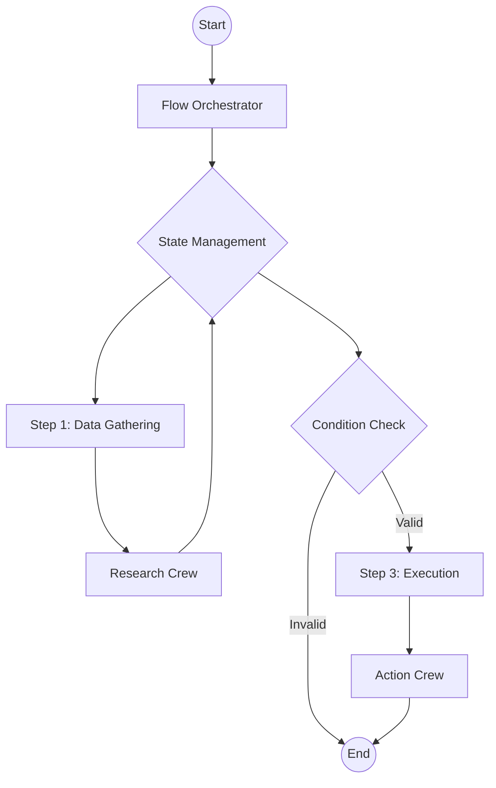

# The Flow-First Mindset

When building production AI applications with CrewAI, **we recommend starting with a Flow**.

While it's possible to run individual Crews or Agents, wrapping them in a Flow provides the necessary structure for a robust, scalable application.

## Why Flows?

1.  **State Management**: Flows provide a built-in way to manage state across different steps of your application. This is crucial for passing data between Crews, maintaining context, and handling user inputs.
2.  **Control**: Flows allow you to define precise execution paths, including loops, conditionals, and branching logic. This is essential for handling edge cases and ensuring your application behaves predictably.
3.  **Observability**: Flows provide a clear structure that makes it easier to trace execution, debug issues, and monitor performance. We recommend using [CrewAI Tracing](/en/observability/tracing) for detailed insights. Simply run `crewai login` to enable free observability features.

## The Architecture

A typical production CrewAI application looks like this:



### 1. The Flow Class
Your `Flow` class is the entry point. It defines the state schema and the methods that execute your logic.

```python
from crewai.flow.flow import Flow, listen, start
from pydantic import BaseModel

class AppState(BaseModel):
    user_input: str = ""
    research_results: str = ""
    final_report: str = ""

class ProductionFlow(Flow[AppState]):
    @start()
    def gather_input(self):
        # ... logic to get input ...
        pass

    @listen(gather_input)
    def run_research_crew(self):
        # ... trigger a Crew ...
        pass
```

### 2. State Management
Use Pydantic models to define your state. This ensures type safety and makes it clear what data is available at each step.

- **Keep it minimal**: Store only what you need to persist between steps.
- **Use structured data**: Avoid unstructured dictionaries when possible.

### 3. Crews as Units of Work
Delegate complex tasks to Crews. A Crew should be focused on a specific goal (e.g., "Research a topic", "Write a blog post").

- **Don't over-engineer Crews**: Keep them focused.
- **Pass state explicitly**: Pass the necessary data from the Flow state to the Crew inputs.

```python
    @listen(gather_input)
    def run_research_crew(self):
        crew = ResearchCrew()
        result = crew.kickoff(inputs={"topic": self.state.user_input})
        self.state.research_results = result.raw
```

## Control Primitives

Leverage CrewAI's control primitives to add robustness and control to your Crews.

### 1. Task Guardrails
Use [Task Guardrails](/en/concepts/tasks#task-guardrails) to validate task outputs before they are accepted. This ensures that your agents produce high-quality results.

```python
def validate_content(result: TaskOutput) -> Tuple[bool, Any]:
    if len(result.raw) < 100:
        return (False, "Content is too short. Please expand.")
    return (True, result.raw)

task = Task(
    ...,
    guardrail=validate_content
)
```

### 2. Structured Outputs
Always use structured outputs (`output_pydantic` or `output_json`) when passing data between tasks or to your application. This prevents parsing errors and ensures type safety.

```python
class ResearchResult(BaseModel):
    summary: str
    sources: List[str]

task = Task(
    ...,
    output_pydantic=ResearchResult
)
```

### 3. LLM Hooks
Use [LLM Hooks](/en/learn/llm-hooks) to inspect or modify messages before they are sent to the LLM, or to sanitize responses.

```python
@before_llm_call
def log_request(context):
    print(f"Agent {context.agent.role} is calling the LLM...")
```

## Deployment Patterns

When deploying your Flow, consider the following:

### CrewAI Enterprise
The easiest way to deploy your Flow is using CrewAI Enterprise. It handles the infrastructure, authentication, and monitoring for you.

Check out the [Deployment Guide](/en/enterprise/guides/deploy-crew) to get started.

```bash
crewai deploy create
```

### Async Execution
For long-running tasks, use `kickoff_async` to avoid blocking your API.

### Persistence
Use the `@persist` decorator to save the state of your Flow to a database. This allows you to resume execution if the process crashes or if you need to wait for human input.

```python
@persist
class ProductionFlow(Flow[AppState]):
    # ...
```

## Summary

- **Start with a Flow.**
- **Define a clear State.**
- **Use Crews for complex tasks.**
- **Deploy with an API and persistence.**
