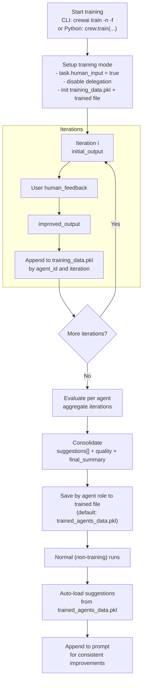

## Overview

The training feature in CrewAI allows you to train your AI agents using the command-line interface (CLI).
By running the command `crewai train -n <n_iterations>`, you can specify the number of iterations for the training process.

During training, CrewAI utilizes techniques to optimize the performance of your agents along with human feedback.
This helps the agents improve their understanding, decision-making, and problem-solving abilities.

### Training Your Crew Using the CLI

To use the training feature, follow these steps:

1. Open your terminal or command prompt.
2. Navigate to the directory where your CrewAI project is located.
3. Run the following command:

```shell
crewai train -n <n_iterations> -f <filename.pkl>
```
<Tip>
  Replace `<n_iterations>` with the desired number of training iterations and `<filename>` with the appropriate filename ending with `.pkl`.
</Tip>

<Note>
  If you omit `-f`, the output defaults to `trained_agents_data.pkl` in the current working directory. You can pass an absolute path to control where the file is written.
</Note>

### Training your Crew programmatically

To train your crew programmatically, use the following steps:

1. Define the number of iterations for training.
2. Specify the input parameters for the training process.
3. Execute the training command within a try-except block to handle potential errors.

```python Code
n_iterations = 2
inputs = {"topic": "CrewAI Training"}
filename = "your_model.pkl"

try:
    YourCrewName_Crew().crew().train(
      n_iterations=n_iterations,
      inputs=inputs,
      filename=filename
    )

except Exception as e:
    raise Exception(f"An error occurred while training the crew: {e}")
```

## How trained data is used by agents

CrewAI uses the training artifacts in two ways: during training to incorporate your human feedback, and after training to guide agents with consolidated suggestions.

### Training data flow



### During training runs

- On each iteration, the system records for every agent:
  - `initial_output`: the agent’s first answer
  - `human_feedback`: your inline feedback when prompted
  - `improved_output`: the agent’s follow-up answer after feedback
- This data is stored in a working file named `training_data.pkl` keyed by the agent’s internal ID and iteration.
- While training is active, the agent automatically appends your prior human feedback to its prompt to enforce those instructions on subsequent attempts within the training session.
  Training is interactive: tasks set `human_input = true`, so running in a non-interactive environment will block on user input.

### After training completes

- When `train(...)` finishes, CrewAI evaluates the collected training data per agent and produces a consolidated result containing:
  - `suggestions`: clear, actionable instructions distilled from your feedback and the difference between initial/improved outputs
  - `quality`: a 0–10 score capturing improvement
  - `final_summary`: a step-by-step set of action items for future tasks
- These consolidated results are saved to the filename you pass to `train(...)` (default via CLI is `trained_agents_data.pkl`). Entries are keyed by the agent’s `role` so they can be applied across sessions.
- During normal (non-training) execution, each agent automatically loads its consolidated `suggestions` and appends them to the task prompt as mandatory instructions. This gives you consistent improvements without changing your agent definitions.

### File summary

- `training_data.pkl` (ephemeral, per-session):
  - Structure: `agent_id -> { iteration_number: { initial_output, human_feedback, improved_output } }`
  - Purpose: capture raw data and human feedback during training
  - Location: saved in the current working directory (CWD)
- `trained_agents_data.pkl` (or your custom filename):
  - Structure: `agent_role -> { suggestions: string[], quality: number, final_summary: string }`
  - Purpose: persist consolidated guidance for future runs
  - Location: written to the CWD by default; use `-f` to set a custom (including absolute) path

## Small Language Model Considerations

<Warning>
  When using smaller language models (≤7B parameters) for training data evaluation, be aware that they may face challenges with generating structured outputs and following complex instructions.
</Warning>

### Limitations of Small Models in Training Evaluation

<CardGroup cols={2}>
  <Card title="JSON Output Accuracy" icon="triangle-exclamation">
    Smaller models often struggle with producing valid JSON responses needed for structured training evaluations, leading to parsing errors and incomplete data.
  </Card>
  <Card title="Evaluation Quality" icon="chart-line">
    Models under 7B parameters may provide less nuanced evaluations with limited reasoning depth compared to larger models.
  </Card>
  <Card title="Instruction Following" icon="list-check">
    Complex training evaluation criteria may not be fully followed or considered by smaller models.
  </Card>
  <Card title="Consistency" icon="rotate">
    Evaluations across multiple training iterations may lack consistency with smaller models.
  </Card>
</CardGroup>

### Recommendations for Training

<Tabs>
  <Tab title="Best Practice">
    For optimal training quality and reliable evaluations, we strongly recommend using models with at least 7B parameters or larger:

    ```python
    from crewai import Agent, Crew, Task, LLM

    # Recommended minimum for training evaluation
    llm = LLM(model="mistral/open-mistral-7b")

    # Better options for reliable training evaluation
    llm = LLM(model="anthropic/claude-3-sonnet-20240229-v1:0")
    llm = LLM(model="gpt-4o")

    # Use this LLM with your agents
    agent = Agent(
        role="Training Evaluator",
        goal="Provide accurate training feedback",
        llm=llm
    )
    ```

    <Tip>
      More powerful models provide higher quality feedback with better reasoning, leading to more effective training iterations.
    </Tip>
  </Tab>
  <Tab title="Small Model Usage">
    If you must use smaller models for training evaluation, be aware of these constraints:

    ```python
    # Using a smaller model (expect some limitations)
    llm = LLM(model="huggingface/microsoft/Phi-3-mini-4k-instruct")
    ```

    <Warning>
      While CrewAI includes optimizations for small models, expect less reliable and less nuanced evaluation results that may require more human intervention during training.
    </Warning>
  </Tab>
</Tabs>

### Key Points to Note

- **Positive Integer Requirement:** Ensure that the number of iterations (`n_iterations`) is a positive integer. The code will raise a `ValueError` if this condition is not met.
- **Filename Requirement:** Ensure that the filename ends with `.pkl`. The code will raise a `ValueError` if this condition is not met.
- **Error Handling:** The code handles subprocess errors and unexpected exceptions, providing error messages to the user.
- Trained guidance is applied at prompt time; it does not modify your Python/YAML agent configuration.
- Agents automatically load trained suggestions from a file named `trained_agents_data.pkl` located in the current working directory. If you trained to a different filename, either rename it to `trained_agents_data.pkl` before running, or adjust the loader in code.
- You can change the output filename when calling `crewai train` with `-f/--filename`. Absolute paths are supported if you want to save outside the CWD.

It is important to note that the training process may take some time, depending on the complexity of your agents and will also require your feedback on each iteration.

Once the training is complete, your agents will be equipped with enhanced capabilities and knowledge, ready to tackle complex tasks and provide more consistent and valuable insights.

Remember to regularly update and retrain your agents to ensure they stay up-to-date with the latest information and advancements in the field.
