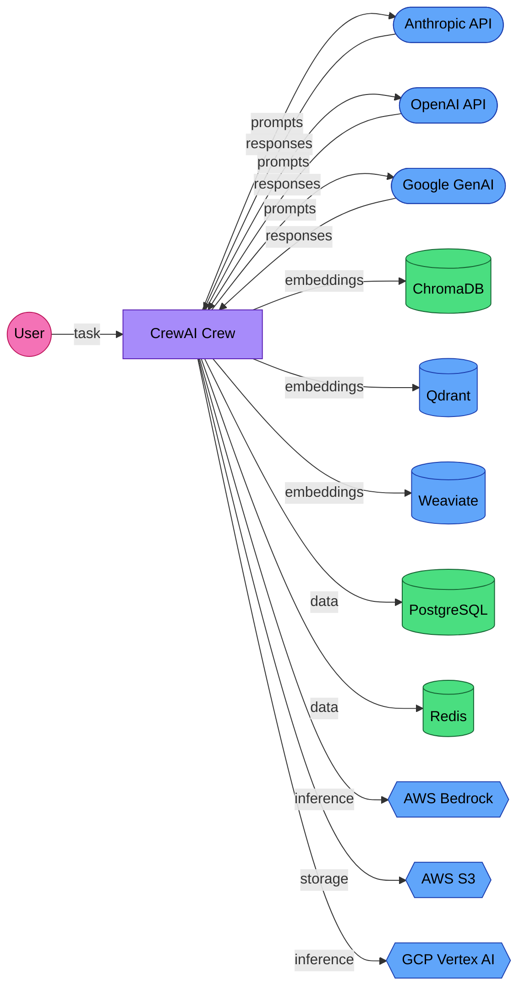

# EU AI Act Compliance Guide for CrewAI Deployers

CrewAI orchestrates autonomous AI agents that collaborate on complex tasks. Under the EU AI Act, autonomous agent systems face the highest regulatory scrutiny. This guide explains what that means for teams deploying CrewAI in the EU.

## Is your system in scope?

The detailed obligations in Articles 12, 13, and 14 only apply to **high-risk AI systems** as defined in Annex III of the EU AI Act. An autonomous agent system is high-risk if it is used for:

- **Recruitment and HR** — screening candidates, allocating tasks, evaluating employee performance
- **Credit scoring and insurance** — assessing creditworthiness or setting premiums
- **Law enforcement** — profiling, criminal risk assessment, border control
- **Critical infrastructure** — managing energy, water, transport, or telecommunications systems
- **Education assessment** — grading students, determining admissions
- **Essential public services** — evaluating eligibility for benefits, housing, or emergency services

Because CrewAI crews make autonomous decisions and can chain actions across multiple agents, use cases that touch these domains are especially likely to trigger high-risk classification. A crew that generates marketing copy is not high-risk. A crew that screens job applicants or processes loan decisions is.

If your crew does **not** fall into one of the categories above:

- **Article 50** (end-user transparency) still applies if users interact with your crew's output directly. See the [Article 50 section](#article-50-end-user-transparency) below.
- **GDPR** still applies if you process personal data.
- The high-risk obligations (Articles 9-15) are less likely to apply, but risk classification is context-dependent. **Do not self-classify without legal review.** Focus on Article 50 (transparency) and GDPR (data protection) as your baseline obligations.

If you are unsure whether your use case qualifies as high-risk, consult a qualified legal professional before proceeding.

## Why autonomous agents are different

The EU AI Act classifies AI systems by risk. Multi-agent systems that make autonomous decisions are more likely to be classified as high-risk under Article 6 and Annex III, particularly when used for:

- Employment and worker management (hiring, task allocation, performance evaluation)
- Access to essential services (insurance, credit, housing)
- Law enforcement or border control
- Critical infrastructure management
- Education and vocational training

A CrewAI crew that generates marketing copy is likely minimal risk. The same architecture making hiring recommendations or evaluating loan applications is high-risk. **The risk classification depends on your use case, not the framework.**

## Supported providers and services

CrewAI integrates with a broad range of external services. The following are the key ones relevant to compliance:

- **AI providers:** Anthropic, OpenAI, Google Generative AI, LangChain, LlamaIndex
- **Model identifiers include:** claude-3-opus, claude-3-5-sonnet, gpt-4o, gemini, and others
- **Vector databases:** ChromaDB, Qdrant, Weaviate
- **Traditional databases:** PostgreSQL, MySQL, MongoDB, Redis, SQLite
- **Cloud services:** AWS S3, AWS Bedrock, AWS Lambda, Azure OpenAI, GCP Vertex AI

CrewAI *supports* all of these. Your deployment will use a subset. Document which services are active in your system.

## Data flow diagram

**Legend:** Green = your organization is the controller (you own the data). Blue = the operating organization acts as processor (third party, requires Data Processing Agreement).

## GDPR role classification

Each external service has a different GDPR relationship depending on how it's deployed. Cloud AI providers are typically processors for customer-submitted data, but the exact role depends on each provider's terms of service and processing purpose. Deployers should review each provider's DPA.

| Service | Default Role | Why | Action Required |
|---------|-------------|-----|----------------|
| Anthropic API | Typically acts as processor | Cloud API; Anthropic processes prompts on your behalf | DPA required (Article 28); review Anthropic's DPA |
| OpenAI API | Typically acts as processor | Cloud API; same as above | DPA required; review OpenAI's DPA |
| Google GenAI | Typically acts as processor | Cloud API | DPA required; review Google's DPA |
| AWS Bedrock | Typically acts as processor | Managed inference; AWS processes on your behalf | DPA via AWS agreement |
| GCP Vertex AI | Typically acts as processor | Managed inference | DPA via GCP agreement |
| Pinecone / Qdrant Cloud | Typically acts as processor | Cloud-hosted vector storage | DPA required |
| ChromaDB | Your organization is controller | Typically self-hosted; data stays on your infrastructure | No third-party DPA |
| PostgreSQL / Redis / SQLite | Your organization is controller | Self-hosted databases | No third-party DPA |
| AWS S3 | Typically acts as processor | Cloud storage | DPA via AWS agreement |

If any of these services transfer data outside the EEA, additional safeguards are required (Standard Contractual Clauses or adequacy decisions).

## Article 14: Human oversight for autonomous agents

This is the most important article for CrewAI deployments. Article 14 requires that high-risk AI systems are designed to be "effectively overseen by natural persons."

For autonomous agent crews, this means:

### What CrewAI already provides

- **`human_input` parameter:** Agents can request human approval before proceeding. Use this for high-stakes decisions.
- **Callbacks:** Register callbacks on tasks and agents to monitor execution in real-time.
- **Delegation controls:** `allow_delegation` parameter controls whether agents can pass tasks to other agents. Restricting delegation reduces autonomous action.
- **Memory inspection:** CrewAI's memory system (short-term, long-term, entity memory) is inspectable. Regulators may ask what the system "remembers."

### What you need to add

- **Kill switch:** A mechanism to halt all agents immediately. CrewAI doesn't provide this natively; implement it at the infrastructure level (container orchestration, process management).
- **Decision logging:** Record every agent decision, tool call, and delegation with timestamps. Article 12 requires this for the system's lifetime.
- **Escalation rules:** Define which decisions require human approval. Don't let agents make irreversible decisions (sending emails, modifying databases, making purchases) without human confirmation.
- **Output review:** For high-risk applications, implement a human review step between the crew's output and any action taken on that output.

## Article 11: Technical documentation

High-risk systems need Annex IV technical documentation before market placement. Some sections can be derived from your codebase (providers, models, architecture), while the remaining sections require your input on intended purpose, risk assessment, and monitoring plans.

Key sections for CrewAI deployments:

| Section | CrewAI-specific considerations |
|---------|-------------------------------|
| General description | Document the crew structure: which agents, which roles, which tools, what decisions they can make |
| Development process | Document agent prompt design, tool selection rationale, and testing methodology |
| Human oversight | Document `human_input` configuration, callback implementation, and escalation rules |
| Risk management | Autonomous agent risks: hallucination cascades (agent A hallucinates, agent B acts on it), tool misuse, unbounded delegation loops |
| Performance metrics | Per-agent accuracy, task completion rate, delegation appropriateness, human override frequency |

## Article 12: Record-keeping

If you have LLM traces from your CrewAI deployment, audit them against Article 12 requirements. For CrewAI specifically, ensure you log:
- Every LLM call (model, tokens, input, output)
- Every tool invocation (which tool, inputs, outputs, success/failure)
- Every delegation event (which agent delegated to which, why)
- Every human intervention point (what was reviewed, what was approved/rejected)
- Memory reads and writes (what context influenced each decision)

**Retention periods:** The required retention period depends on your role under the Act. Article 18 requires **providers** of high-risk systems to retain logs and technical documentation for **10 years** after market placement. Article 26(6) requires **deployers** to retain logs for at least **6 months**. If you have substantially modified the CrewAI framework (custom agents, proprietary tools) such that you are marketing a complete AI system, you may be classified as a provider. Confirm the applicable retention period with legal counsel.

## Article 13: Transparency to deployers

Article 13 requires providers of high-risk AI systems to supply deployers with the information needed to understand and operate the system correctly. For CrewAI deployments, this means the upstream LLM providers (Anthropic, OpenAI, Google) must give you:

- Instructions for use, including intended purpose and known limitations
- Accuracy metrics and performance benchmarks
- Known or foreseeable risks and residual risks after mitigation
- Technical specifications: input/output formats, training data characteristics, model architecture details

As a deployer, collect model cards, system documentation, and accuracy reports from each AI provider your crew uses. Maintain these as part of your Annex IV technical documentation.

For multi-agent systems specifically, document how each agent uses provider models and how model limitations propagate through the crew's delegation chain.

## Article 50: End-user transparency

Article 50 requires deployers to inform end users that they are interacting with an AI system. This is a separate obligation from Article 13 and applies even to limited-risk systems.

For CrewAI deployments that produce user-facing output:
- Clearly disclose that the output was generated by an AI system (and specifically by autonomous AI agents)
- Disclose the system's capabilities and limitations in user-facing terms
- Identify AI-generated content as such

> **Note:** Article 50 applies to chatbots and systems interacting directly with natural persons. It has a separate scope from the high-risk designation under Annex III — it applies even to limited-risk systems.

## Specific risks for multi-agent systems

These risks are unique to autonomous agent architectures and should be addressed in your Annex IV Section 5 (risk management):

1. **Hallucination cascading:** Agent A produces incorrect output. Agent B treats it as ground truth and acts on it. In a crew, errors compound across agents rather than being caught.

2. **Unbounded tool use:** An agent with access to web search, code execution, and file writing can take actions with real-world consequences. Scope tool access to the minimum required for each agent's role.

3. **Delegation loops:** Agent A delegates to Agent B, which delegates back to Agent A. CrewAI has safeguards, but document your delegation policy and test edge cases.

4. **Prompt injection via tools:** If an agent retrieves external content (web pages, documents, API responses), that content can contain instructions that override the agent's system prompt. This is an active research area with no complete solution.

5. **Opacity of multi-step reasoning:** A single LLM call is auditable. A crew that passes context across 5 agents over 20 tool calls produces reasoning chains that are difficult for a human overseer to evaluate in real time.

## Resources

- [EU AI Act full text](https://artificialintelligenceact.eu/)
- [Article 14: Human oversight](https://artificialintelligenceact.eu/article/14/)
- [CrewAI human input docs](https://docs.crewai.com/concepts/tasks#task-with-human-input)
- [CrewAI callbacks](https://docs.crewai.com/concepts/tasks#task-callbacks)

---

*This is not legal advice. Consult a qualified professional for compliance decisions.*
