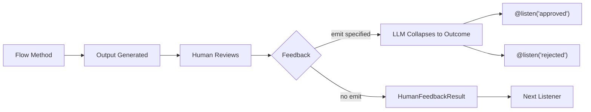

## Overview

The `@human_feedback` decorator enables human-in-the-loop (HITL) workflows directly within CrewAI Flows. It allows you to pause flow execution, present output to a human for review, collect their feedback, and optionally route to different listeners based on the feedback outcome.

This is particularly valuable for:

- **Quality assurance**: Review AI-generated content before it's used downstream
- **Decision gates**: Let humans make critical decisions in automated workflows
- **Approval workflows**: Implement approve/reject/revise patterns
- **Interactive refinement**: Collect feedback to improve outputs iteratively



## Quick Start

Here's the simplest way to add human feedback to a flow:

```python Code
from crewai.flow.flow import Flow, start, listen
from crewai.flow.human_feedback import human_feedback

class SimpleReviewFlow(Flow):
    @human_feedback(request="Please review this content:")
    @start()
    def generate_content(self):
        return "This is AI-generated content that needs review."

    @listen(generate_content)
    def process_feedback(self, result):
        print(f"Content: {result.output}")
        print(f"Human said: {result.feedback}")

flow = SimpleReviewFlow()
flow.kickoff()
```

When this flow runs, it will:
1. Execute `generate_content` and return the string
2. Display the output to the user with the request message
3. Wait for the user to type feedback (or press Enter to skip)
4. Pass a `HumanFeedbackResult` object to `process_feedback`

## The @human_feedback Decorator

### Parameters

| Parameter | Type | Required | Description |
|-----------|------|----------|-------------|
| `request` | `str` | Yes | The message shown to the human alongside the method output |
| `emit` | `Sequence[str]` | No | List of possible outcomes. Feedback is collapsed to one of these, which triggers `@listen` decorators |
| `llm` | `str \| BaseLLM` | When `emit` specified | LLM used to interpret feedback and map to an outcome |
| `default_outcome` | `str` | No | Outcome to use if no feedback provided. Must be in `emit` |
| `metadata` | `dict` | No | Additional data for enterprise integrations |

### Basic Usage (No Routing)

When you don't specify `emit`, the decorator simply collects feedback and passes a `HumanFeedbackResult` to the next listener:

```python Code
@human_feedback(request="What do you think of this analysis?")
@start()
def analyze_data(self):
    return "Analysis results: Revenue up 15%, costs down 8%"

@listen(analyze_data)
def handle_feedback(self, result):
    # result is a HumanFeedbackResult
    print(f"Analysis: {result.output}")
    print(f"Feedback: {result.feedback}")
```

### Routing with emit

When you specify `emit`, the decorator becomes a router. The human's free-form feedback is interpreted by an LLM and collapsed into one of the specified outcomes:

```python Code
@human_feedback(
    request="Do you approve this content for publication?",
    emit=["approved", "rejected", "needs_revision"],
    llm="gpt-4o-mini",
    default_outcome="needs_revision",
)
@start()
def review_content(self):
    return "Draft blog post content here..."

@listen("approved")
def publish(self, result):
    print(f"Publishing! User said: {result.feedback}")

@listen("rejected")
def discard(self, result):
    print(f"Discarding. Reason: {result.feedback}")

@listen("needs_revision")
def revise(self, result):
    print(f"Revising based on: {result.feedback}")
```

<Tip>
The LLM uses structured outputs (function calling) when available to guarantee the response is one of your specified outcomes. This makes routing reliable and predictable.
</Tip>

## HumanFeedbackResult

The `HumanFeedbackResult` dataclass contains all information about a human feedback interaction:

```python Code
from crewai.flow.human_feedback import HumanFeedbackResult

@dataclass
class HumanFeedbackResult:
    output: Any              # The original method output shown to the human
    feedback: str            # The raw feedback text from the human
    outcome: str | None      # The collapsed outcome (if emit was specified)
    timestamp: datetime      # When the feedback was received
    method_name: str         # Name of the decorated method
    metadata: dict           # Any metadata passed to the decorator
```

### Accessing in Listeners

When a listener is triggered by a `@human_feedback` method with `emit`, it receives the `HumanFeedbackResult`:

```python Code
@listen("approved")
def on_approval(self, result: HumanFeedbackResult):
    print(f"Original output: {result.output}")
    print(f"User feedback: {result.feedback}")
    print(f"Outcome: {result.outcome}")  # "approved"
    print(f"Received at: {result.timestamp}")
```

## Accessing Feedback History

The `Flow` class provides two attributes for accessing human feedback:

### last_human_feedback

Returns the most recent `HumanFeedbackResult`:

```python Code
@listen(some_method)
def check_feedback(self):
    if self.last_human_feedback:
        print(f"Last feedback: {self.last_human_feedback.feedback}")
```

### human_feedback_history

A list of all `HumanFeedbackResult` objects collected during the flow:

```python Code
@listen(final_step)
def summarize(self):
    print(f"Total feedback collected: {len(self.human_feedback_history)}")
    for i, fb in enumerate(self.human_feedback_history):
        print(f"{i+1}. {fb.method_name}: {fb.outcome or 'no routing'}")
```

<Warning>
Each `HumanFeedbackResult` is appended to `human_feedback_history`, so multiple feedback steps won't overwrite each other. Use this list to access all feedback collected during the flow.
</Warning>

## Complete Example: Content Approval Workflow

Here's a full example implementing a content review and approval workflow:

<CodeGroup>

```python Code
from crewai.flow.flow import Flow, start, listen
from crewai.flow.human_feedback import human_feedback, HumanFeedbackResult
from pydantic import BaseModel


class ContentState(BaseModel):
    topic: str = ""
    draft: str = ""
    final_content: str = ""
    revision_count: int = 0


class ContentApprovalFlow(Flow[ContentState]):
    """A flow that generates content and gets human approval."""

    @start()
    def get_topic(self):
        self.state.topic = input("What topic should I write about? ")
        return self.state.topic

    @listen(get_topic)
    def generate_draft(self, topic):
        # In real use, this would call an LLM
        self.state.draft = f"# {topic}\n\nThis is a draft about {topic}..."
        return self.state.draft

    @human_feedback(
        request="Please review this draft. Reply 'approved', 'rejected', or provide revision feedback:",
        emit=["approved", "rejected", "needs_revision"],
        llm="gpt-4o-mini",
        default_outcome="needs_revision",
    )
    @listen(generate_draft)
    def review_draft(self, draft):
        return draft

    @listen("approved")
    def publish_content(self, result: HumanFeedbackResult):
        self.state.final_content = result.output
        print("\n✅ Content approved and published!")
        print(f"Reviewer comment: {result.feedback}")
        return "published"

    @listen("rejected")
    def handle_rejection(self, result: HumanFeedbackResult):
        print("\n❌ Content rejected")
        print(f"Reason: {result.feedback}")
        return "rejected"

    @listen("needs_revision")
    def revise_content(self, result: HumanFeedbackResult):
        self.state.revision_count += 1
        print(f"\n📝 Revision #{self.state.revision_count} requested")
        print(f"Feedback: {result.feedback}")

        # In a real flow, you might loop back to generate_draft
        # For this example, we just acknowledge
        return "revision_requested"


# Run the flow
flow = ContentApprovalFlow()
result = flow.kickoff()
print(f"\nFlow completed. Revisions requested: {flow.state.revision_count}")
```

```text Output
What topic should I write about? AI Safety

==================================================
OUTPUT FOR REVIEW:
==================================================
# AI Safety

This is a draft about AI Safety...
==================================================

Please review this draft. Reply 'approved', 'rejected', or provide revision feedback:
(Press Enter to skip, or type your feedback)

Your feedback: Looks good, approved!

✅ Content approved and published!
Reviewer comment: Looks good, approved!

Flow completed. Revisions requested: 0
```

</CodeGroup>

## Combining with Other Decorators

The `@human_feedback` decorator works with other flow decorators. The order matters:

```python Code
# Correct: @human_feedback wraps the flow decorator
@human_feedback(request="Review this:")
@start()
def my_start_method(self):
    return "content"

@human_feedback(request="Review this too:")
@listen(other_method)
def my_listener(self, data):
    return f"processed: {data}"
```

<Tip>
Place `@human_feedback` as the outermost decorator (first/top) so it runs after the method completes and can capture the return value.
</Tip>

## Best Practices

### 1. Write Clear Request Messages

The `request` parameter is what the human sees. Make it actionable:

```python Code
# ✅ Good - clear and actionable
@human_feedback(request="Does this summary accurately capture the key points? Reply 'yes' or explain what's missing:")

# ❌ Bad - vague
@human_feedback(request="Review this:")
```

### 2. Choose Meaningful Outcomes

When using `emit`, pick outcomes that map naturally to human responses:

```python Code
# ✅ Good - natural language outcomes
emit=["approved", "rejected", "needs_more_detail"]

# ❌ Bad - technical or unclear
emit=["state_1", "state_2", "state_3"]
```

### 3. Always Provide a Default Outcome

Use `default_outcome` to handle cases where users press Enter without typing:

```python Code
@human_feedback(
    request="Approve? (press Enter to request revision)",
    emit=["approved", "needs_revision"],
    llm="gpt-4o-mini",
    default_outcome="needs_revision",  # Safe default
)
```

### 4. Use Feedback History for Audit Trails

Access `human_feedback_history` to create audit logs:

```python Code
@listen(final_step)
def create_audit_log(self):
    log = []
    for fb in self.human_feedback_history:
        log.append({
            "step": fb.method_name,
            "outcome": fb.outcome,
            "feedback": fb.feedback,
            "timestamp": fb.timestamp.isoformat(),
        })
    return log
```

### 5. Handle Both Routed and Non-Routed Feedback

When designing flows, consider whether you need routing:

| Scenario | Use |
|----------|-----|
| Simple review, just need the feedback text | No `emit` |
| Need to branch to different paths based on response | Use `emit` |
| Approval gates with approve/reject/revise | Use `emit` |
| Collecting comments for logging only | No `emit` |

## Related Documentation

- [Flows Overview](/en/concepts/flows) - Learn about CrewAI Flows
- [Flow State Management](/en/guides/flows/mastering-flow-state) - Managing state in flows
- [Routing with @router](/en/concepts/flows#router) - More about conditional routing
- [Human Input on Execution](/en/learn/human-input-on-execution) - Task-level human input
