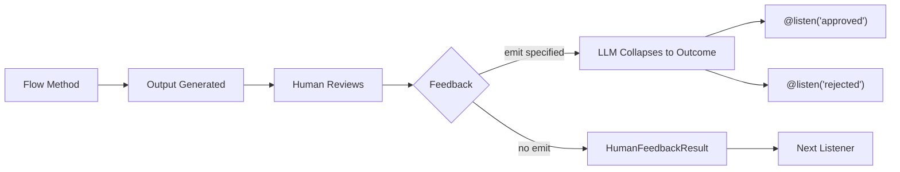

## Overview

<Note>
The `@human_feedback` decorator requires **CrewAI version 1.8.0 or higher**. Make sure to update your installation before using this feature.
</Note>

The `@human_feedback` decorator enables human-in-the-loop (HITL) workflows directly within CrewAI Flows. It allows you to pause flow execution, present output to a human for review, collect their feedback, and optionally route to different listeners based on the feedback outcome.

This is particularly valuable for:

- **Quality assurance**: Review AI-generated content before it's used downstream
- **Decision gates**: Let humans make critical decisions in automated workflows
- **Approval workflows**: Implement approve/reject/revise patterns
- **Interactive refinement**: Collect feedback to improve outputs iteratively



## Quick Start

Here's the simplest way to add human feedback to a flow:

```python Code
from crewai.flow.flow import Flow, start, listen
from crewai.flow.human_feedback import human_feedback

class SimpleReviewFlow(Flow):
    @start()
    @human_feedback(message="Please review this content:")
    def generate_content(self):
        return "This is AI-generated content that needs review."

    @listen(generate_content)
    def process_feedback(self, result):
        print(f"Content: {result.output}")
        print(f"Human said: {result.feedback}")

flow = SimpleReviewFlow()
flow.kickoff()
```

When this flow runs, it will:
1. Execute `generate_content` and return the string
2. Display the output to the user with the request message
3. Wait for the user to type feedback (or press Enter to skip)
4. Pass a `HumanFeedbackResult` object to `process_feedback`

## The @human_feedback Decorator

### Parameters

| Parameter | Type | Required | Description |
|-----------|------|----------|-------------|
| `message` | `str` | Yes | The message shown to the human alongside the method output |
| `emit` | `Sequence[str]` | No | List of possible outcomes. Feedback is collapsed to one of these, which triggers `@listen` decorators |
| `llm` | `str \| BaseLLM` | When `emit` specified | LLM used to interpret feedback and map to an outcome |
| `default_outcome` | `str` | No | Outcome to use if no feedback provided. Must be in `emit` |
| `metadata` | `dict` | No | Additional data for enterprise integrations |
| `provider` | `HumanFeedbackProvider` | No | Custom provider for async/non-blocking feedback. See [Async Human Feedback](#async-human-feedback-non-blocking) |
| `learn` | `bool` | No | Enable HITL learning: distill lessons from feedback and pre-review future output. Default `False`. See [Learning from Feedback](#learning-from-feedback) |
| `learn_limit` | `int` | No | Max past lessons to recall for pre-review. Default `5` |

### Basic Usage (No Routing)

When you don't specify `emit`, the decorator simply collects feedback and passes a `HumanFeedbackResult` to the next listener:

```python Code
@start()
@human_feedback(message="What do you think of this analysis?")
def analyze_data(self):
    return "Analysis results: Revenue up 15%, costs down 8%"

@listen(analyze_data)
def handle_feedback(self, result):
    # result is a HumanFeedbackResult
    print(f"Analysis: {result.output}")
    print(f"Feedback: {result.feedback}")
```

### Routing with emit

When you specify `emit`, the decorator becomes a router. The human's free-form feedback is interpreted by an LLM and collapsed into one of the specified outcomes:

```python Code
from crewai.flow.flow import Flow, start, listen, or_
from crewai.flow.human_feedback import human_feedback

class ReviewFlow(Flow):
    @start()
    def generate_content(self):
        return "Draft blog post content here..."

    @human_feedback(
        message="Do you approve this content for publication?",
        emit=["approved", "rejected", "needs_revision"],
        llm="gpt-4o-mini",
        default_outcome="needs_revision",
    )
    @listen(or_("generate_content", "needs_revision"))
    def review_content(self):
        return "Draft blog post content here..."

    @listen("approved")
    def publish(self, result):
        print(f"Publishing! User said: {result.feedback}")

    @listen("rejected")
    def discard(self, result):
        print(f"Discarding. Reason: {result.feedback}")
```

When the human says something like "needs more detail", the LLM collapses that to `"needs_revision"`, which triggers `review_content` again via `or_()` — creating a revision loop. The loop continues until the outcome is `"approved"` or `"rejected"`.

<Tip>
The LLM uses structured outputs (function calling) when available to guarantee the response is one of your specified outcomes. This makes routing reliable and predictable.
</Tip>

<Warning>
A `@start()` method only runs once at the beginning of the flow. If you need a revision loop, separate the start method from the review method and use `@listen(or_("trigger", "revision_outcome"))` on the review method to enable the self-loop.
</Warning>

## HumanFeedbackResult

The `HumanFeedbackResult` dataclass contains all information about a human feedback interaction:

```python Code
from crewai.flow.human_feedback import HumanFeedbackResult

@dataclass
class HumanFeedbackResult:
    output: Any              # The original method output shown to the human
    feedback: str            # The raw feedback text from the human
    outcome: str | None      # The collapsed outcome (if emit was specified)
    timestamp: datetime      # When the feedback was received
    method_name: str         # Name of the decorated method
    metadata: dict           # Any metadata passed to the decorator
```

### Accessing in Listeners

When a listener is triggered by a `@human_feedback` method with `emit`, it receives the `HumanFeedbackResult`:

```python Code
@listen("approved")
def on_approval(self, result: HumanFeedbackResult):
    print(f"Original output: {result.output}")
    print(f"User feedback: {result.feedback}")
    print(f"Outcome: {result.outcome}")  # "approved"
    print(f"Received at: {result.timestamp}")
```

## Accessing Feedback History

The `Flow` class provides two attributes for accessing human feedback:

### last_human_feedback

Returns the most recent `HumanFeedbackResult`:

```python Code
@listen(some_method)
def check_feedback(self):
    if self.last_human_feedback:
        print(f"Last feedback: {self.last_human_feedback.feedback}")
```

### human_feedback_history

A list of all `HumanFeedbackResult` objects collected during the flow:

```python Code
@listen(final_step)
def summarize(self):
    print(f"Total feedback collected: {len(self.human_feedback_history)}")
    for i, fb in enumerate(self.human_feedback_history):
        print(f"{i+1}. {fb.method_name}: {fb.outcome or 'no routing'}")
```

<Warning>
Each `HumanFeedbackResult` is appended to `human_feedback_history`, so multiple feedback steps won't overwrite each other. Use this list to access all feedback collected during the flow.
</Warning>

## Complete Example: Content Approval Workflow

Here's a full example implementing a content review and approval workflow with a revision loop:

<CodeGroup>

```python Code
from crewai.flow.flow import Flow, start, listen, or_
from crewai.flow.human_feedback import human_feedback, HumanFeedbackResult
from pydantic import BaseModel


class ContentState(BaseModel):
    draft: str = ""
    revision_count: int = 0
    status: str = "pending"


class ContentApprovalFlow(Flow[ContentState]):
    """A flow that generates content and loops until the human approves."""

    @start()
    def generate_draft(self):
        self.state.draft = "# AI Safety\n\nThis is a draft about AI Safety..."
        return self.state.draft

    @human_feedback(
        message="Please review this draft. Approve, reject, or describe what needs changing:",
        emit=["approved", "rejected", "needs_revision"],
        llm="gpt-4o-mini",
        default_outcome="needs_revision",
    )
    @listen(or_("generate_draft", "needs_revision"))
    def review_draft(self):
        self.state.revision_count += 1
        return f"{self.state.draft} (v{self.state.revision_count})"

    @listen("approved")
    def publish_content(self, result: HumanFeedbackResult):
        self.state.status = "published"
        print(f"Content approved and published! Reviewer said: {result.feedback}")
        return "published"

    @listen("rejected")
    def handle_rejection(self, result: HumanFeedbackResult):
        self.state.status = "rejected"
        print(f"Content rejected. Reason: {result.feedback}")
        return "rejected"


flow = ContentApprovalFlow()
result = flow.kickoff()
print(f"\nFlow completed. Status: {flow.state.status}, Reviews: {flow.state.revision_count}")
```

```text Output
==================================================
OUTPUT FOR REVIEW:
==================================================
# AI Safety

This is a draft about AI Safety... (v1)
==================================================

Please review this draft. Approve, reject, or describe what needs changing:
(Press Enter to skip, or type your feedback)

Your feedback: Needs more detail on alignment research

==================================================
OUTPUT FOR REVIEW:
==================================================
# AI Safety

This is a draft about AI Safety... (v2)
==================================================

Please review this draft. Approve, reject, or describe what needs changing:
(Press Enter to skip, or type your feedback)

Your feedback: Looks good, approved!

Content approved and published! Reviewer said: Looks good, approved!

Flow completed. Status: published, Reviews: 2
```

</CodeGroup>

The key pattern is `@listen(or_("generate_draft", "needs_revision"))` — the review method listens to both the initial trigger and its own revision outcome, creating a self-loop that repeats until the human approves or rejects.

## Combining with Other Decorators

The `@human_feedback` decorator works with `@start()`, `@listen()`, and `or_()`. Both decorator orderings work — the framework propagates attributes in both directions — but the recommended patterns are:

```python Code
# One-shot review at the start of a flow (no self-loop)
@start()
@human_feedback(message="Review this:", emit=["approved", "rejected"], llm="gpt-4o-mini")
def my_start_method(self):
    return "content"

# Linear review on a listener (no self-loop)
@listen(other_method)
@human_feedback(message="Review this too:", emit=["good", "bad"], llm="gpt-4o-mini")
def my_listener(self, data):
    return f"processed: {data}"

# Self-loop: review that can loop back for revisions
@human_feedback(message="Approve or revise?", emit=["approved", "revise"], llm="gpt-4o-mini")
@listen(or_("upstream_method", "revise"))
def review_with_loop(self):
    return "content for review"
```

### Self-loop pattern

To create a revision loop, the review method must listen to **both** an upstream trigger and its own revision outcome using `or_()`:

```python Code
@start()
def generate(self):
    return "initial draft"

@human_feedback(
    message="Approve or request changes?",
    emit=["revise", "approved"],
    llm="gpt-4o-mini",
    default_outcome="approved",
)
@listen(or_("generate", "revise"))
def review(self):
    return "content"

@listen("approved")
def publish(self):
    return "published"
```

When the outcome is `"revise"`, the flow routes back to `review` (because it listens to `"revise"` via `or_()`). When the outcome is `"approved"`, the flow continues to `publish`. This works because the flow engine exempts routers from the "fire once" rule, allowing them to re-execute on each loop iteration.

### Chained routers

A listener triggered by one router's outcome can itself be a router:

```python Code
@start()
def generate(self):
    return "draft content"

@human_feedback(message="First review:", emit=["approved", "rejected"], llm="gpt-4o-mini")
@listen("generate")
def first_review(self):
    return "draft content"

@human_feedback(message="Final review:", emit=["publish", "hold"], llm="gpt-4o-mini")
@listen("approved")
def final_review(self, prev):
    return "final content"

@listen("publish")
def on_publish(self, prev):
    return "published"

@listen("hold")
def on_hold(self, prev):
    return "held for later"
```

### Limitations

- **`@start()` methods run once**: A `@start()` method cannot self-loop. If you need a revision cycle, use a separate `@start()` method as the entry point and put the `@human_feedback` on a `@listen()` method.
- **No `@start()` + `@listen()` on the same method**: This is a Flow framework constraint. A method is either a start point or a listener, not both.

## Best Practices

### 1. Write Clear Request Messages

The `message` parameter is what the human sees. Make it actionable:

```python Code
# ✅ Good - clear and actionable
@human_feedback(message="Does this summary accurately capture the key points? Reply 'yes' or explain what's missing:")

# ❌ Bad - vague
@human_feedback(message="Review this:")
```

### 2. Choose Meaningful Outcomes

When using `emit`, pick outcomes that map naturally to human responses:

```python Code
# ✅ Good - natural language outcomes
emit=["approved", "rejected", "needs_more_detail"]

# ❌ Bad - technical or unclear
emit=["state_1", "state_2", "state_3"]
```

### 3. Always Provide a Default Outcome

Use `default_outcome` to handle cases where users press Enter without typing:

```python Code
@human_feedback(
    message="Approve? (press Enter to request revision)",
    emit=["approved", "needs_revision"],
    llm="gpt-4o-mini",
    default_outcome="needs_revision",  # Safe default
)
```

### 4. Use Feedback History for Audit Trails

Access `human_feedback_history` to create audit logs:

```python Code
@listen(final_step)
def create_audit_log(self):
    log = []
    for fb in self.human_feedback_history:
        log.append({
            "step": fb.method_name,
            "outcome": fb.outcome,
            "feedback": fb.feedback,
            "timestamp": fb.timestamp.isoformat(),
        })
    return log
```

### 5. Handle Both Routed and Non-Routed Feedback

When designing flows, consider whether you need routing:

| Scenario | Use |
|----------|-----|
| Simple review, just need the feedback text | No `emit` |
| Need to branch to different paths based on response | Use `emit` |
| Approval gates with approve/reject/revise | Use `emit` |
| Collecting comments for logging only | No `emit` |

## Async Human Feedback (Non-Blocking)

By default, `@human_feedback` blocks execution waiting for console input. For production applications, you may need **async/non-blocking** feedback that integrates with external systems like Slack, email, webhooks, or APIs.

### The Provider Abstraction

Use the `provider` parameter to specify a custom feedback collection strategy:

```python Code
from crewai.flow import Flow, start, human_feedback, HumanFeedbackProvider, HumanFeedbackPending, PendingFeedbackContext

class WebhookProvider(HumanFeedbackProvider):
    """Provider that pauses flow and waits for webhook callback."""

    def __init__(self, webhook_url: str):
        self.webhook_url = webhook_url

    def request_feedback(self, context: PendingFeedbackContext, flow: Flow) -> str:
        # Notify external system (e.g., send Slack message, create ticket)
        self.send_notification(context)

        # Pause execution - framework handles persistence automatically
        raise HumanFeedbackPending(
            context=context,
            callback_info={"webhook_url": f"{self.webhook_url}/{context.flow_id}"}
        )

class ReviewFlow(Flow):
    @start()
    @human_feedback(
        message="Review this content:",
        emit=["approved", "rejected"],
        llm="gpt-4o-mini",
        provider=WebhookProvider("https://myapp.com/api"),
    )
    def generate_content(self):
        return "AI-generated content..."

    @listen("approved")
    def publish(self, result):
        return "Published!"
```

<Tip>
The flow framework **automatically persists state** when `HumanFeedbackPending` is raised. Your provider only needs to notify the external system and raise the exception—no manual persistence calls required.
</Tip>

### Handling Paused Flows

When using an async provider, `kickoff()` returns a `HumanFeedbackPending` object instead of raising an exception:

```python Code
flow = ReviewFlow()
result = flow.kickoff()

if isinstance(result, HumanFeedbackPending):
    # Flow is paused, state is automatically persisted
    print(f"Waiting for feedback at: {result.callback_info['webhook_url']}")
    print(f"Flow ID: {result.context.flow_id}")
else:
    # Normal completion
    print(f"Flow completed: {result}")
```

### Resuming a Paused Flow

When feedback arrives (e.g., via webhook), resume the flow:

```python Code
# Sync handler:
def handle_feedback_webhook(flow_id: str, feedback: str):
    flow = ReviewFlow.from_pending(flow_id)
    result = flow.resume(feedback)
    return result

# Async handler (FastAPI, aiohttp, etc.):
async def handle_feedback_webhook(flow_id: str, feedback: str):
    flow = ReviewFlow.from_pending(flow_id)
    result = await flow.resume_async(feedback)
    return result
```

### Key Types

| Type | Description |
|------|-------------|
| `HumanFeedbackProvider` | Protocol for custom feedback providers |
| `PendingFeedbackContext` | Contains all info needed to resume a paused flow |
| `HumanFeedbackPending` | Returned by `kickoff()` when flow is paused for feedback |
| `ConsoleProvider` | Default blocking console input provider |

### PendingFeedbackContext

The context contains everything needed to resume:

```python Code
@dataclass
class PendingFeedbackContext:
    flow_id: str           # Unique identifier for this flow execution
    flow_class: str        # Fully qualified class name
    method_name: str       # Method that triggered feedback
    method_output: Any     # Output shown to the human
    message: str           # The request message
    emit: list[str] | None # Possible outcomes for routing
    default_outcome: str | None
    metadata: dict         # Custom metadata
    llm: str | None        # LLM for outcome collapsing
    requested_at: datetime
```

### Complete Async Flow Example

```python Code
from crewai.flow import (
    Flow, start, listen, human_feedback,
    HumanFeedbackProvider, HumanFeedbackPending, PendingFeedbackContext
)

class SlackNotificationProvider(HumanFeedbackProvider):
    """Provider that sends Slack notifications and pauses for async feedback."""

    def __init__(self, channel: str):
        self.channel = channel

    def request_feedback(self, context: PendingFeedbackContext, flow: Flow) -> str:
        # Send Slack notification (implement your own)
        slack_thread_id = self.post_to_slack(
            channel=self.channel,
            message=f"Review needed:\n\n{context.method_output}\n\n{context.message}",
        )

        # Pause execution - framework handles persistence automatically
        raise HumanFeedbackPending(
            context=context,
            callback_info={
                "slack_channel": self.channel,
                "thread_id": slack_thread_id,
            }
        )

class ContentPipeline(Flow):
    @start()
    @human_feedback(
        message="Approve this content for publication?",
        emit=["approved", "rejected"],
        llm="gpt-4o-mini",
        default_outcome="rejected",
        provider=SlackNotificationProvider("#content-reviews"),
    )
    def generate_content(self):
        return "AI-generated blog post content..."

    @listen("approved")
    def publish(self, result):
        print(f"Publishing! Reviewer said: {result.feedback}")
        return {"status": "published"}

    @listen("rejected")
    def archive(self, result):
        print(f"Archived. Reason: {result.feedback}")
        return {"status": "archived"}


# Starting the flow (will pause and wait for Slack response)
def start_content_pipeline():
    flow = ContentPipeline()
    result = flow.kickoff()

    if isinstance(result, HumanFeedbackPending):
        return {"status": "pending", "flow_id": result.context.flow_id}

    return result


# Resuming when Slack webhook fires (sync handler)
def on_slack_feedback(flow_id: str, slack_message: str):
    flow = ContentPipeline.from_pending(flow_id)
    result = flow.resume(slack_message)
    return result


# If your handler is async (FastAPI, aiohttp, Slack Bolt async, etc.)
async def on_slack_feedback_async(flow_id: str, slack_message: str):
    flow = ContentPipeline.from_pending(flow_id)
    result = await flow.resume_async(slack_message)
    return result
```

<Warning>
If you're using an async web framework (FastAPI, aiohttp, Slack Bolt async mode), use `await flow.resume_async()` instead of `flow.resume()`. Calling `resume()` from within a running event loop will raise a `RuntimeError`.
</Warning>

### Best Practices for Async Feedback

1. **Check the return type**: `kickoff()` returns `HumanFeedbackPending` when paused—no try/except needed
2. **Use the right resume method**: Use `resume()` in sync code, `await resume_async()` in async code
3. **Store callback info**: Use `callback_info` to store webhook URLs, ticket IDs, etc.
4. **Implement idempotency**: Your resume handler should be idempotent for safety
5. **Automatic persistence**: State is automatically saved when `HumanFeedbackPending` is raised and uses `SQLiteFlowPersistence` by default
6. **Custom persistence**: Pass a custom persistence instance to `from_pending()` if needed

## Learning from Feedback

The `learn=True` parameter enables a feedback loop between human reviewers and the memory system. When enabled, the system progressively improves its outputs by learning from past human corrections.

### How It Works

1. **After feedback**: The LLM extracts generalizable lessons from the output + feedback and stores them in memory with `source="hitl"`. If the feedback is just approval (e.g. "looks good"), nothing is stored.
2. **Before next review**: Past HITL lessons are recalled from memory and applied by the LLM to improve the output before the human sees it.

Over time, the human sees progressively better pre-reviewed output because each correction informs future reviews.

### Example

```python Code
class ArticleReviewFlow(Flow):
    @start()
    def generate_article(self):
        return self.crew.kickoff(inputs={"topic": "AI Safety"}).raw

    @human_feedback(
        message="Review this article draft:",
        emit=["approved", "needs_revision"],
        llm="gpt-4o-mini",
        learn=True,  # enable HITL learning
    )
    @listen(or_("generate_article", "needs_revision"))
    def review_article(self):
        return self.last_human_feedback.output if self.last_human_feedback else "article draft"

    @listen("approved")
    def publish(self):
        print(f"Publishing: {self.last_human_feedback.output}")
```

**First run**: The human sees the raw output and says "Always include citations for factual claims." The lesson is distilled and stored in memory.

**Second run**: The system recalls the citation lesson, pre-reviews the output to add citations, then shows the improved version. The human's job shifts from "fix everything" to "catch what the system missed."

### Configuration

| Parameter | Default | Description |
|-----------|---------|-------------|
| `learn` | `False` | Enable HITL learning |
| `learn_limit` | `5` | Max past lessons to recall for pre-review |

### Key Design Decisions

- **Same LLM for everything**: The `llm` parameter on the decorator is shared by outcome collapsing, lesson distillation, and pre-review. No need to configure multiple models.
- **Structured output**: Both distillation and pre-review use function calling with Pydantic models when the LLM supports it, falling back to text parsing otherwise.
- **Non-blocking storage**: Lessons are stored via `remember_many()` which runs in a background thread -- the flow continues immediately.
- **Graceful degradation**: If the LLM fails during distillation, nothing is stored. If it fails during pre-review, the raw output is shown. Neither failure blocks the flow.
- **No scope/categories needed**: When storing lessons, only `source` is passed. The encoding pipeline infers scope, categories, and importance automatically.

<Note>
`learn=True` requires the Flow to have memory available. Flows get memory automatically by default, but if you've disabled it with `_skip_auto_memory`, HITL learning will be silently skipped.
</Note>


## Related Documentation

- [Flows Overview](/en/concepts/flows) - Learn about CrewAI Flows
- [Flow State Management](/en/guides/flows/mastering-flow-state) - Managing state in flows
- [Flow Persistence](/en/concepts/flows#persistence) - Persisting flow state
- [Routing with @router](/en/concepts/flows#router) - More about conditional routing
- [Human Input on Execution](/en/learn/human-input-on-execution) - Task-level human input
- [Memory](/en/concepts/memory) - The unified memory system used by HITL learning
