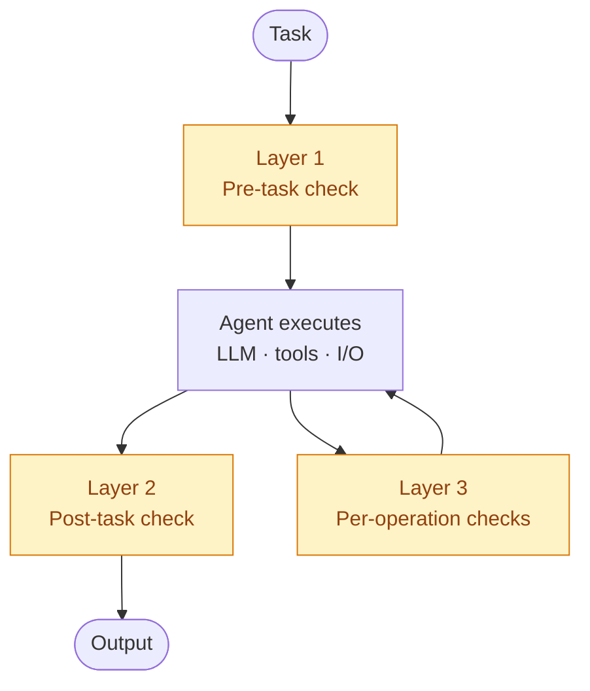

## Introduction

This guide shows how to integrate **OpenBox** with **CrewAI** to enforce runtime policies, redact PII in flight, and produce a signed audit trail of every governed agent action.

> **What is OpenBox?** [OpenBox](https://openbox.ai) is a runtime governance layer for AI agents. It intercepts agent actions — tasks, LLM calls, HTTP requests, database queries, and file I/O — and evaluates each against your policies before it runs. The Core returns one of four verdicts (`ALLOW`, `REQUIRE_APPROVAL`, `BLOCK`, `HALT`), which the SDK enforces.

## Why use OpenBox?

- **Enforcement, not just observation.** OpenBox blocks the call, halts the agent, or routes the decision to a human *before* the action runs — instead of logging a warning after the fact.
- **In-flight PII and secret redaction.** Sensitive task inputs and outputs are rewritten before the LLM or the next task sees them.
- **Per-agent signed identity.** Each `OpenBoxAgent` signs its governance events with its own key, producing a tamper-evident audit trail attributable to a specific agent — even for delegated sub-tasks.
- **Human-in-the-loop approval.** `REQUIRE_APPROVAL` verdicts pause the agent and poll for a human decision on sensitive actions.
- **OpenTelemetry-native.** The SDK emits standard OTel spans, so it sits alongside your existing tracing exporters without conflict.

Governance is opt-in per agent and per task — swap `Agent` for `OpenBoxAgent` and `Task` for `OpenBoxTask` on the work you want governed; everything else stays plain CrewAI.

## Installation & Setup

<Steps>
<Step title="Sign up for OpenBox" icon="user-plus">
Create an account at [openbox.ai](https://openbox.ai) and register an agent for each CrewAI agent you want to govern. For every registered agent you'll receive three credentials: an API key, a DID, and a private key. You'll drop these into `.env` in the next steps.
</Step>

<Step title="Install the SDK">
```bash
pip install openbox-crewai-sdk-python
```

<Note>
Requires Python 3.10+ and CrewAI >= 1.14.1.
</Note>
</Step>

<Step title="Configure environment variables" icon="lock">
Create a `.env` file at your project root with the OpenBox API URL and a per-agent API key for each governed agent.

Each `OpenBoxAgent` takes a single `env_prefix`. The SDK derives three env var names from it — `{prefix}_API_KEY`, `{prefix}_DID`, and `{prefix}_PRIVATE_KEY`.

```bash .env
OPENBOX_URL=https://api.openbox.ai

OPENBOX_RESEARCHER_API_KEY=obx_live_...
OPENBOX_RESEARCHER_DID=did:aip:...
OPENBOX_RESEARCHER_PRIVATE_KEY=...

OPENBOX_WRITER_API_KEY=obx_live_...
OPENBOX_WRITER_DID=did:aip:...
OPENBOX_WRITER_PRIVATE_KEY=...
```
</Step>

<Step title="Define the agent in `config/agents.yaml`">
```yaml config/agents.yaml
researcher:
  role: >
    Senior Research Analyst
  goal: >
    Uncover comprehensive, reliable information on {topic}
  backstory: >
    You are a seasoned research analyst with a talent for synthesising
    complex sources into clear, well-cited findings.
```
</Step>

<Step title="Define the task in `config/tasks.yaml`">
```yaml config/tasks.yaml
quick_research:
  description: >
    Conduct focused research on {topic}. Prioritise primary sources
    and recent developments.
  expected_output: >
    A concise markdown brief (300–500 words) with key findings and citations.
  agent: researcher
```
</Step>

<Step title="Define the crew">
Replace `Agent` with `OpenBoxAgent` and `Task` with `OpenBoxTask`. The crew itself stays a plain CrewAI `Crew`:

```python research_crew.py
from crewai import Crew, Process, Task
from crewai.agents.agent_builder.base_agent import BaseAgent
from crewai.project import CrewBase, agent, crew, task
from openbox import OpenBoxAgent, OpenBoxTask


@CrewBase
class ResearchCrew:
    agents: list[BaseAgent]
    tasks: list[Task]

    agents_config = "config/agents.yaml"
    tasks_config = "config/tasks.yaml"

    @agent
    def researcher(self) -> OpenBoxAgent:
        return OpenBoxAgent(
            config=self.agents_config["researcher"],
            env_prefix="OPENBOX_RESEARCHER",
        )

    @task
    def quick_research(self) -> OpenBoxTask:
        return OpenBoxTask(
            config=self.tasks_config["quick_research"],
            activity_type="research",
        )

    @crew
    def crew(self) -> Crew:
        return Crew(
            name="research-crew",
            agents=self.agents,
            tasks=self.tasks,
            process=Process.sequential,
        )
```
</Step>

<Step title="Run the crew under an OpenBoxEngine">
Open an `OpenBoxEngine` and pass the crew through `engine.govern(...)` before calling `kickoff()`:

```python
from openbox import create_openbox_engine

with create_openbox_engine() as engine:
    crew = ResearchCrew().crew()
    governed_crew = engine.govern(crew)
    result = governed_crew.kickoff()
```

That is the entire integration. Every task, LLM call, and tool operation inside the governed crew now goes through the OpenBox Core for evaluation. The `with` block tears down OTel and HTTP clients on exit.
</Step>
</Steps>

## Core Concepts

<CardGroup cols={2}>
  <Card title="OpenBoxAgent" icon="robot">
    Subclass of `crewai.Agent` with a per-agent `env_prefix` for credentials. Each agent runs inside its own OpenTelemetry root span and opens its own governance session on the Core.
  </Card>
  <Card title="OpenBoxTask" icon="list-check">
    Subclass of `crewai.Task` with an explicit `activity_type` field. The activity type is used for guardrail matching on the OpenBox platform (e.g. `"research"`, `"code-review"`, `"send-email"`).
  </Card>
  <Card title="create_openbox_engine()" icon="wand-magic-sparkles">
    Builds an `OpenBoxEngine` — a context manager that owns the shared governance configuration, OpenTelemetry instrumentation, and HTTP client. Call `engine.govern(crew)` to wrap any CrewAI `Crew` for governance.
  </Card>
  <Card title="GovernedCrew" icon="users-gear">
    Subclass of `crewai.Crew` returned by `engine.govern(crew)`. Owns the governance lifecycle for the run — validates per-agent API keys, assigns a `crew_execution_id`, opens and closes agent sessions, and ensures cleanup on exit.
  </Card>
</CardGroup>

### Mixed Governance

A crew may contain both `OpenBoxAgent` and plain `Agent` instances, and both `OpenBoxTask` and plain `Task` instances:

| Agent | Task | Governed? |
| :--- | :--- | :--- |
| `OpenBoxAgent` | `OpenBoxTask` | **Yes** — full three-layer governance |
| `OpenBoxAgent` | `Task` (plain) | **No** — task skips governance (useful for low-risk utility tasks) |
| `Agent` (plain) | any | **No** — plain agents are never governed |

`engine.govern(crew)` requires at least one `OpenBoxAgent` on the crew and raises `OpenBoxConfigError` otherwise, so mixed configurations are explicit, not accidental.

## Governance Model — Three Layers

OpenBox evaluates agent actions at three layers, each a distinct enforcement point:



### Layer 1 — Pre-Task Governance

Before the agent executes a task, the SDK sends an `ActivityStarted` event to the Core API carrying the agent role, `activity_type`, crew name, and session IDs. The Core returns a verdict:

- **ALLOW** — task proceeds.
- **BLOCK / HALT** — SDK raises `GovernanceHaltError` before any LLM call happens. The task never runs.
- **REQUIRE_APPROVAL** — SDK blocks the calling thread and polls `/api/v1/governance/approval` until a human decides.
- **Input redaction** — if a guardrail flags PII or other sensitive content, the task description is rewritten **before** reaching the LLM. This is how PII is stripped in flight.

Only `OpenBoxTask` instances assigned to `OpenBoxAgent` reach Layer 1. Plain `Task` objects on an `OpenBoxAgent` skip governance entirely.

### Layer 2 — Post-Task Governance

After the agent's task returns, the SDK sends an `ActivityCompleted` event with the serialized output. The event reuses the `activity_id` generated in Layer 1 so Core can pair the two events.

- **ALLOW** — output is returned to the caller.
- **BLOCK / HALT** — `GovernanceHaltError` is raised, bypassing CrewAI's retry loop (since the output is untrusted).
- **REQUIRE_APPROVAL** — synchronous HITL polling.
- **Output redaction** — if a guardrail flags content in the task output, the result is **rewritten before** being handed to the next task in the crew. Redaction happens before the output leaves the agent, so downstream consumers only ever see the redacted text.

### Layer 3 — Per-Operation Hooks

Every HTTP request, database query, file operation, and LLM call inside a governed task is evaluated at two stages:

- **`started`** — before the operation runs. Governs the request (method, URL, headers, body). `BLOCK` raises `GovernanceBlockedError` before the operation ever happens.
- **`completed`** — after the operation finishes. Governs the response (status code, body). `BLOCK` aborts the rest of the trace — subsequent operations and LLM calls in the same trace are blocked automatically.

Every child operation is correlated to its originating agent via the OTel `trace_id`, so payloads are authenticated with the correct per-agent API key — even for delegated sub-tasks.

## Signed Agent Identity

An API key tells OpenBox **which** agent is making a governance call. Signed agent identity lets OpenBox verify that a call **really came from that agent** and that the payload hasn't been tampered with in flight. Each governed agent gets its own decentralized identifier (DID) and signing key, and the SDK signs every governance request from that agent before it leaves the process.

Use it when you need tamper-evident, non-repudiable audit trails — typically regulated environments, multi-tenant deployments, or any setup where a leaked API key alone shouldn't be enough to impersonate an agent.

Generate the DID and signing key for each agent in the OpenBox console when you register the agent.

## Verdict System

| Verdict | Priority | Layer 1 (Pre-Task) | Layer 2 (Post-Task) | Layer 3 `started` | Layer 3 `completed` |
| :--- | :---: | :--- | :--- | :--- | :--- |
| `ALLOW`            | 1 | Task proceeds                      | Output passes through                        | Operation proceeds            | No action             |
| `REQUIRE_APPROVAL` | 3 | Block thread, poll HITL            | Block thread, poll HITL                      | Block thread, poll HITL       | Set abort + halt flag |
| `BLOCK`            | 4 | `GovernanceHaltError`              | `GovernanceHaltError` (bypasses retry)       | `GovernanceBlockedError`      | Set abort + halt flag |
| `HALT`             | 5 | `GovernanceHaltError`              | `GovernanceHaltError` (bypasses retry)       | `GovernanceBlockedError`      | Set abort + halt flag |

**Aggregation.** When multiple verdicts apply (e.g. several guardrails fire on the same event), the SDK picks the highest-priority verdict automatically.

**HALT is per-agent, not per-task.** When an `OpenBoxAgent` is halted, the SDK closes its session as halted and refuses to run any subsequent task for that agent for the remainder of the crew run. A halted agent is done.

**Backward-compatible strings.** Legacy Core verdicts `"continue"`, `"stop"`, `"require-approval"`, and `"request_approval"` map to the modern `Verdict` enum automatically.

## Production Features

### 1. Policy Enforcement & Guardrails

OpenBox policies live in the Core — not in your CrewAI code. You define policies (PII detection, allow-/block-listed domains, regulated-keyword filters, rate caps, etc.) once in the OpenBox console, and every CrewAI crew using the SDK is evaluated against them at runtime.

```python
from openbox import OpenBoxAgent, OpenBoxTask

analyst = OpenBoxAgent(
    role="Financial Analyst",
    env_prefix="OPENBOX_ANALYST",
    goal="Analyze earnings reports and summarize findings",
    backstory="You are a senior equity analyst.",
)

analyze = OpenBoxTask(
    description="Summarize the attached 10-K filing.",
    expected_output="A 500-word summary with key ratios.",
    agent=analyst,
    activity_type="financial-analysis",   # used for guardrail matching on Core
)
```

The `activity_type` is the join key — OpenBox guardrails target specific activity types, so you can require stricter controls on `"send-email"` than on `"research"` without touching your agent logic.

### 2. In-Flight PII & Secret Redaction

When a guardrail produces a redacted version of an input or output, the SDK substitutes it for the original — replacing the task description (Layer 1) or the task output (Layer 2) **before** it is delivered downstream. This prevents sensitive data from reaching either the LLM or the caller — without mutating your code.

```python
# Your task sends a raw customer email to the LLM:
#   "Customer john@example.com (SSN 123-45-6789) complained about the charge..."
#
# With an OpenBox PII guardrail on activity_type="support-triage",
# the LLM receives:
#   "Customer [REDACTED_EMAIL] (SSN [REDACTED_SSN]) complained..."
```

Redaction happens before the task description reaches the LLM and before the task output is passed to the next task, so downstream consumers only ever see the redacted text.

### 3. Human-in-the-Loop Approval

`REQUIRE_APPROVAL` verdicts block the agent thread and poll the Core for a human decision. Enable or tune on the engine:

```python
engine = create_openbox_engine(
    hitl_enabled=True,              # default
    hitl_poll_interval=5.0,         # seconds between polls
    exclude_crews_hitl={"bulk-crew"},  # crews that should BLOCK instead of polling
)
```

HITL endpoint: `POST {OPENBOX_URL}/api/v1/governance/approval`. If the approval expires before a decision, the SDK raises `GovernanceApprovalExpiredError`.

### 4. Per-Agent Identity & Audit

Every `OpenBoxAgent` owns its own session on the Core, authenticated with its own API key. Session events (`AgentSessionStarted`, `AgentSessionCompleted`) bracket the agent's work, and every governance event is attributable to a specific agent.

This matters for compliance: an auditor can answer "which agent made this call?" even for delegated sub-tasks, because OpenBox tracks delegations and threads the originating agent's trace context through them via OpenTelemetry.

### 5. OpenTelemetry-Native Observability

The SDK runs entirely on top of OpenTelemetry:

- Each governed agent runs inside an OpenTelemetry **root span**, with HTTP, DB, file, and LLM calls captured as **child spans** under the same trace.
- Governance payloads are built from span data and sent to the Core for evaluation.
- **Request and response bodies are kept separate from span attributes**, so they are never exported to third-party OTel backends like Jaeger or Datadog. You get governance without leaking raw payloads to your tracing pipeline.
- Calls to the OpenBox Core itself are excluded from instrumentation, so governance traffic never recurses.

### 6. Flow Support

Flows are orchestrators, not executors — so they are not governed directly, but governed crews inside a flow can be **correlated** by a flow-level execution ID. Pass the engine into your flow class so each `@start` / `@listen` step can call `engine.govern(crew)`:

```python
from crewai.flow.flow import Flow, listen, start
from openbox import OpenBoxEngine, create_openbox_engine, create_openbox_flow


class ResearchWritingFlow(Flow):
    def __init__(self, engine: OpenBoxEngine) -> None:
        super().__init__()
        self._engine = engine

    @start()
    def research_phase(self):
        return self._engine.govern(ResearchCrew().crew()).kickoff()

    @listen(research_phase)
    def writing_phase(self, research):
        return self._engine.govern(WritingCrew().crew()).kickoff(
            inputs={"findings": research.raw}
        )


with create_openbox_engine() as engine:
    flow = create_openbox_flow(ResearchWritingFlow, engine=engine)
    flow.kickoff()
# Every governed crew kicked off inside the flow attaches
# metadata.flow_execution_id to its governance payloads.
```

`create_openbox_flow(flow_class, **flow_kwargs)` instantiates `flow_class(**flow_kwargs)` and binds a `flow_execution_id` to the call. The Core uses that ID to group all agent sessions from the same flow run for downstream analysis.

## `create_openbox_engine()` Parameters

```python
engine = create_openbox_engine(
    # Core connection
    api_url="https://api.openbox.ai",       # or OPENBOX_URL env var
    governance_timeout=30.0,                # seconds

    # Error policy
    governance_policy="fail_open",          # or "fail_closed"
    on_fallback="log_warning",              # or "fail_closed"

    # Governance toggles
    send_task_start_event=True,             # Layer 1
    send_task_completed_event=True,         # Layer 2
    llm_level_governance=True,              # Layer 3 (LLM-level)

    # Human-in-the-loop
    hitl_enabled=True,
    hitl_poll_interval=5.0,
    exclude_crews_hitl=None,

    # OTel instrumentation
    instrument_databases=True,
    db_libraries=None,                      # all supported libraries by default
    instrument_file_io=False,

    debug_log=False,                        # per-agent trace logging
)
```

The engine is a context manager — use `with create_openbox_engine() as engine:` so OTel and HTTP clients are torn down cleanly. Crew/agent/task composition lives on the CrewAI `Crew` itself; the engine only owns governance configuration.

## Instrumentation Scope

<Tabs>
  <Tab title="HTTP (always on)">
    | Library | Capture |
    | :--- | :--- |
    | `requests`  | request + response |
    | `httpx`     | sync + async (request + response body) |
    | `urllib3`   | request + response |
    | `urllib`    | request body only |
  </Tab>

  <Tab title="Databases (opt-in, default on)">
    Controlled by `instrument_databases=True` and an optional `db_libraries` set.

    | Library | Support |
    | :--- | :--- |
    | `psycopg2` | Full |
    | `asyncpg` | Best-effort |
    | `mysql-connector-python` | Full |
    | `pymysql` | Best-effort |
    | `pymongo` | Best-effort |
    | `redis` | Best-effort |
    | `sqlalchemy` | Best-effort |
  </Tab>

  <Tab title="File I/O (opt-in, default off)">
    Set `instrument_file_io=True` to govern file operations. Captures `read`, `write`, `readline`, `readlines`, `writelines`, and `close` calls on Python's built-in `open()`.
  </Tab>

  <Tab title="LLM (always on when governed)">
    Every LLM call inside a governed task is evaluated by the Core before it runs. If a prior operation in the same trace was halted, subsequent LLM calls are blocked automatically — no extra round-trip required.
  </Tab>
</Tabs>

## Error Handling

| Error | Raised by | Retryable |
| :--- | :--- | :---: |
| `GovernanceHaltError`              | Layer 1 or Layer 2 BLOCK / HALT                        | No |
| `GovernanceBlockedError`           | Layer 3 `started` BLOCK / HALT (operation prevented)  | No |
| `GovernanceApprovalExpiredError`   | HITL approval timeout                                  | No |
| `GovernanceAPIError`               | Core unreachable + `fail_closed`                       | No |
| `OpenBoxConfigError`               | API key env var missing, invalid key format            | No |
| `OpenBoxAuthError`                 | Core rejected the API key                              | No |
| `OpenBoxInsecureURLError`          | HTTP (non-localhost) passed as `api_url`               | No |

`GovernanceHaltError` and `GovernanceBlockedError` carry `verdict`, `reason`, and `policy_id` attributes for programmatic handling, so you can route halted tasks to a dead-letter queue, surface the policy reason in a UI, or alert your on-call channel.

```python
from openbox import create_openbox_engine
from openbox.core.errors import GovernanceBlockedError, GovernanceHaltError

with create_openbox_engine() as engine:
    governed_crew = engine.govern(ResearchCrew().crew())
    try:
        governed_crew.kickoff()
    except GovernanceHaltError as e:
        notify_ops(
            f"Crew halted by policy {e.policy_id}: {e.reason}",
            verdict=e.verdict,
        )
    except GovernanceBlockedError as e:
        logger.warning("Operation blocked (%s): %s", e.hook_type, e.reason)
```

## Troubleshooting

### Core unreachable

If the Core API is unreachable, behaviour depends on `governance_policy`:

- `fail_open` (default) — the SDK logs a warning and lets the task run ungoverned. Useful in development; not recommended for production.
- `fail_closed` — the SDK raises `GovernanceAPIError` and the task fails. Use this when an unreviewed action is worse than a failed one.

To distinguish a network timeout from an auth failure, check the exception class: `GovernanceAPIError` wraps connection / timeout errors, while `OpenBoxAuthError` is raised when the Core rejects the API key.

### Confirming the SDK is intercepting calls

Every `OpenBoxAgent.execute_task()` call opens an OTel root span. If you don't see governance events in the OpenBox console, check that your trace exporter shows root spans tagged with the agent's role.

### `OpenBoxInsecureURLError`

Raised when `api_url` (or `OPENBOX_URL`) is an `http://` URL pointing at anything other than `localhost` or `127.0.0.1`. The SDK refuses to send signed agent identity over plaintext. Either use `https://`, or — if you're testing against a local Core — use `http://localhost:PORT`.

## Resources

<CardGroup cols={2}>
  <Card title="OpenBox" icon="shield-halved" href="https://openbox.ai">
    Platform home — sign up, configure guardrails, view traces.
  </Card>
  <Card title="CrewAI SDK on PyPI" icon="box" href="https://pypi.org/project/openbox-crewai-sdk-python/">
    Install instructions and release notes.
  </Card>
</CardGroup>
