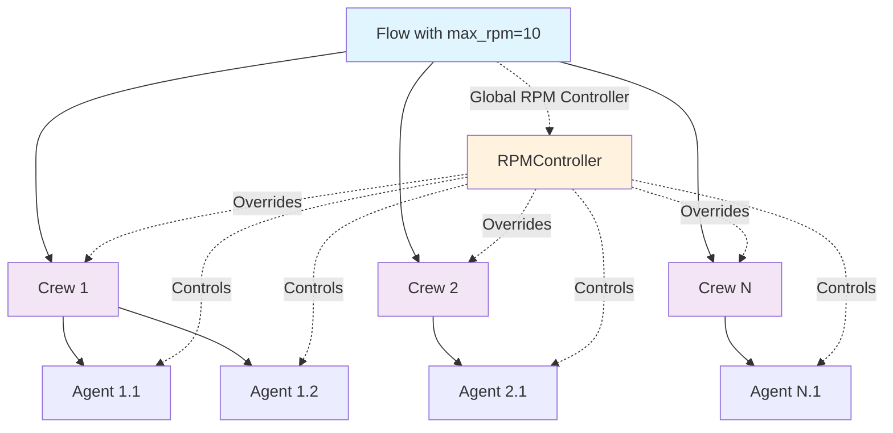

# Flow-Level RPM Control

> **Added in Version**: CrewAI v1.0.0+
> **Feature Status**: Production Ready

CrewAI now supports global RPM (Requests Per Minute) control at the Flow level, allowing you to set a single rate limit that applies across all Crews within a Flow. This feature is essential for complex applications that orchestrate multiple Crews and need precise control over API usage rates.

## Overview

Previously, CrewAI provided RPM control at the [Agent](../api/crewai.agent.Agent) and [Crew](../api/crewai.crew.Crew) levels independently. When working with [Flows](../api/crewai.flow.flow.Flow) that coordinate multiple Crews, there was no mechanism to control the overall request rate across all Crews within a Flow. This could lead to exceeding API rate limits when multiple Crews executed simultaneously.

With Flow-level RPM control, you can now:

- **Set a global RPM limit** for all Crews in a Flow
- **Prevent API rate limit errors** in complex multi-Crew workflows
- **Simplify rate management** across multiple Crews
- **Better control API costs** in production applications

## Key Features

✅ **Global Rate Limiting**: One RPM limit applies to all Crews within the Flow
✅ **Automatic Configuration**: Crews created within Flow methods are automatically configured
✅ **Thread-Safe**: Handles concurrent Crew execution safely
✅ **Override Behavior**: Flow-level limits override individual Crew and Agent RPM settings
✅ **Backward Compatible**: Existing Flows without RPM limits work unchanged
✅ **Resource Management**: Proper cleanup of RPM controllers

## Architecture Diagram



## Usage

### Basic Flow with RPM Control

```python
from crewai import Agent, Crew, Task
from crewai.flow.flow import Flow, start, listen

# Configuration constants
FLOW_GLOBAL_RPM = 10

class AnalysisFlow(Flow):
    def __init__(self) -> None:
        # Set global RPM limit for entire Flow
        super().__init__(max_rpm=FLOW_GLOBAL_RPM, verbose=True)

    @start()
    def initialize_analysis(self) -> dict:
        return {"status": "initialized"}

    @listen(initialize_analysis)
    def run_data_collection_crew(self, context: dict) -> Any:
        # Create agents
        data_analyst = Agent(
            role="Data Analyst",
            goal="Collect and validate data",
            backstory="Expert in data extraction",
            max_rpm=20  # ⚠️ This will be overridden by Flow's 10 RPM limit
        )

        # Create tasks
        collect_task = Task(
            description="Collect data from sources",
            agent=data_analyst,
            expected_output="Clean dataset"
        )

        # Create crew - automatically uses Flow's RPM limit
        data_crew = Crew(
            agents=[data_analyst],
            tasks=[collect_task],
            max_rpm=15  # ⚠️ This will be overridden by Flow's 10 RPM limit
        )

        return data_crew.kickoff()

# Execute the flow
flow = AnalysisFlow()
try:
    result = flow.kickoff()
finally:
    flow.cleanup_resources()  # Ensure proper cleanup
```

### Error Handling and Validation

```python
class RobustFlow(Flow):
    def __init__(self, environment: str = "development") -> None:
        # Validate environment and set appropriate RPM
        rpm_limits = {
            "development": 5,
            "staging": 20,
            "production": 60
        }

        if environment not in rpm_limits:
            raise ValueError(f"Invalid environment: {environment}")

        max_rpm = rpm_limits[environment]

        try:
            super().__init__(max_rpm=max_rpm, verbose=True)
        except ValueError as e:
            raise ValueError(f"Failed to initialize flow: {e}")

    @start()
    def validated_process(self) -> Any:
        # Flow methods with proper error handling
        try:
            crew = self._create_crew()
            return crew.kickoff()
        except Exception as e:
            self.cleanup_resources()
            raise RuntimeError(f"Flow execution failed: {e}")

    def _create_crew(self) -> Crew:
        """Helper method to create crew with validation."""
        agent = Agent(role="Validator", goal="Validate", backstory="Expert")
        task = Task(description="Validate", agent=agent, expected_output="Result")
        return Crew(agents=[agent], tasks=[task])
```

## API Reference

### Flow Class Extensions

#### Constructor

```python
class Flow:
    def __init__(
        self,
        persistence: Optional[FlowPersistence] = None,
        max_rpm: Optional[int] = None,
        verbose: bool = False,
        **kwargs: Any
    ) -> None:
        """
        Args:
            max_rpm: Maximum requests per minute for all Crews in this Flow
            verbose: Enable verbose logging for RPM operations

        Raises:
            ValueError: If max_rpm is not a positive integer
        """
```

#### New Methods

```python
def get_flow_rpm_controller(self) -> Optional[RPMController]:
    """Get the Flow's global RPM controller."""

def set_crew_rpm_controller(self, crew: Crew) -> None:
    """Manually configure a Crew to use Flow's global RPM controller."""

def cleanup_resources(self) -> None:
    """Clean up flow resources, particularly the RPM controller."""
```

### Crew Class Extensions

```python
def set_flow_rpm_controller(self, rpm_controller: RPMController) -> None:
    """Set an external RPM controller on this Crew.

    Raises:
        TypeError: If rpm_controller is not an RPMController instance
    """
```

## Advanced Usage

### Custom RPM Metrics and Monitoring

```python
import logging
from typing import Dict, Any

# Set up monitoring
logger = logging.getLogger("flow_rpm_monitor")

class MonitoredFlow(Flow):
    def __init__(self, max_rpm: int) -> None:
        super().__init__(max_rpm=max_rpm, verbose=True)
        self.request_count = 0

    @start()
    def monitored_execution(self) -> Any:
        controller = self.get_flow_rpm_controller()
        if controller:
            logger.info(f"Flow RPM limit: {controller.max_rpm}")
            logger.info(f"Current requests: {getattr(controller, '_current_rpm', 0)}")

        # Your flow logic here
        return self._execute_with_monitoring()

    def _execute_with_monitoring(self) -> Any:
        # Monitor request patterns
        start_time = time.time()

        try:
            crew = self._create_monitored_crew()
            result = crew.kickoff()

            execution_time = time.time() - start_time
            logger.info(f"Execution completed in {execution_time:.2f}s")

            return result
        except Exception as e:
            logger.error(f"Execution failed after {time.time() - start_time:.2f}s: {e}")
            raise
```

### Environment-Based Configuration

```python
import os
from enum import Enum

class Environment(Enum):
    DEVELOPMENT = "development"
    STAGING = "staging"
    PRODUCTION = "production"

class EnvironmentAwareFlow(Flow):
    RPM_LIMITS = {
        Environment.DEVELOPMENT: 5,
        Environment.STAGING: 25,
        Environment.PRODUCTION: 100
    }

    def __init__(self) -> None:
        env_str = os.getenv("ENVIRONMENT", "development")
        try:
            environment = Environment(env_str)
        except ValueError:
            raise ValueError(f"Invalid ENVIRONMENT: {env_str}")

        max_rpm = self.RPM_LIMITS[environment]
        super().__init__(max_rpm=max_rpm, verbose=environment != Environment.PRODUCTION)

        logger.info(f"Initialized flow for {environment.value} with {max_rpm} RPM")
```

## Best Practices

### 1. ✅ Resource Management

```python
class WellManagedFlow(Flow):
    def __init__(self) -> None:
        super().__init__(max_rpm=20)

    def execute_safely(self) -> Any:
        try:
            return self.kickoff()
        finally:
            self.cleanup_resources()  # Always cleanup

    # Or use context manager pattern
    def __enter__(self):
        return self

    def __exit__(self, exc_type, exc_val, exc_tb):
        self.cleanup_resources()

# Usage
with WellManagedFlow() as flow:
    result = flow.kickoff()  # Automatic cleanup
```

### 2. ✅ Validation and Error Handling

```python
def create_validated_flow(max_rpm: int, environment: str) -> Flow:
    """Factory function with validation."""
    if not isinstance(max_rpm, int) or max_rpm <= 0:
        raise ValueError("max_rpm must be a positive integer")

    if environment not in ["dev", "staging", "prod"]:
        raise ValueError("Invalid environment")

    class ValidatedFlow(Flow):
        def __init__(self):
            super().__init__(max_rpm=max_rpm, verbose=(environment != "prod"))

    return ValidatedFlow()
```

### 3. ✅ Testing with RPM Control

```python
import pytest
from unittest.mock import patch

class TestFlowRPM:
    def test_flow_respects_rpm_limit(self):
        """Test that flow properly enforces RPM limits."""
        flow = MyFlow(max_rpm=5)

        # Verify controller setup
        controller = flow.get_flow_rpm_controller()
        assert controller is not None
        assert controller.max_rpm == 5

        # Test crew configuration
        crew = self._create_test_crew()
        flow.set_crew_rpm_controller(crew)
        assert crew._rpm_controller is controller
```

## Migration Guide

### From Individual Crew RPM to Flow RPM

**Before (❌ Uncoordinated):**
```python
# No coordination between crews - potential for rate limit violations
crew1 = Crew(agents=[agent1], tasks=[task1], max_rpm=10)
crew2 = Crew(agents=[agent2], tasks=[task2], max_rpm=10)
# Total: potentially 20 RPM with no coordination
```

**After (✅ Coordinated):**
```python
class CoordinatedFlow(Flow):
    def __init__(self):
        super().__init__(max_rpm=15)  # Global limit for all crews

    @start()
    def run_crew1(self):
        crew1 = Crew(agents=[agent1], tasks=[task1])  # Uses global limit
        return crew1.kickoff()

    @listen(run_crew1)
    def run_crew2(self, context):
        crew2 = Crew(agents=[agent2], tasks=[task2])  # Uses global limit
        return crew2.kickoff()
```

## Troubleshooting

### Common Issues and Solutions

#### ❌ Issue: Crews Not Using Flow RPM Limit

**Problem**: Manually created Crews aren't using the Flow's RPM limit.

**Solution**:
```python
flow = MyFlow(max_rpm=10)
crew = Crew(agents=[agent], tasks=[task])

# Manual configuration required
flow.set_crew_rpm_controller(crew)
```

#### ❌ Issue: `ValueError: max_rpm must be a positive integer`

**Problem**: Invalid RPM value passed to Flow constructor.

**Solution**:
```python
# ❌ Wrong
flow = MyFlow(max_rpm=-1)    # Negative
flow = MyFlow(max_rpm=0)     # Zero
flow = MyFlow(max_rpm="10")  # String

# ✅ Correct
flow = MyFlow(max_rpm=10)    # Positive integer
```

#### ❌ Issue: Memory Leaks with RPM Controllers

**Problem**: RPM controllers not properly cleaned up.

**Solution**:
```python
flow = MyFlow(max_rpm=10)
try:
    result = flow.kickoff()
finally:
    flow.cleanup_resources()  # Explicit cleanup
```

### Debug Mode

```python
import logging

# Enable debug logging
logging.basicConfig(level=logging.DEBUG)

class DebugFlow(Flow):
    def __init__(self):
        super().__init__(max_rpm=10, verbose=True)

    @start()
    def debug_execution(self):
        # Log RPM controller state
        controller = self.get_flow_rpm_controller()
        print(f"Flow RPM controller: {controller}")
        print(f"Max RPM: {controller.max_rpm if controller else 'None'}")

        # Create and inspect crew
        crew = self._create_crew()
        print(f"Crew RPM controller: {crew._rpm_controller}")
        print(f"Same instance?: {crew._rpm_controller is controller}")

        return crew.kickoff()
```

## Performance Considerations

### RPM Limit Recommendations by API Provider

| Provider | Free Tier | Paid Tier | Recommended Flow RPM |
|----------|-----------|-----------|---------------------|
| OpenAI GPT-3.5 | 3 RPM | 3,500 RPM | 3-60 RPM |
| OpenAI GPT-4 | 3 RPM | 5,000 RPM | 3-100 RPM |
| Anthropic Claude | 5 RPM | 1,000 RPM | 5-200 RPM |
| Google Gemini | 15 RPM | 1,000 RPM | 10-300 RPM |

### Load Testing

```python
import asyncio
import time
from concurrent.futures import ThreadPoolExecutor

async def load_test_flow_rpm():
    """Test flow under concurrent load."""
    flow = MyFlow(max_rpm=30)

    def execute_flow():
        return flow.kickoff()

    start_time = time.time()

    # Execute multiple flows concurrently
    with ThreadPoolExecutor(max_workers=5) as executor:
        futures = [executor.submit(execute_flow) for _ in range(10)]
        results = [future.result() for future in futures]

    duration = time.time() - start_time
    print(f"Executed {len(results)} flows in {duration:.2f}s")
    print(f"Average: {duration/len(results):.2f}s per flow")

    flow.cleanup_resources()
```

## Related Documentation

- **[Flow Basics](./flows.md)** - Core Flow concepts and usage
- **[RPM Controller](./rpm_controller.md)** - Detailed RPM controller documentation
- **[Crew Configuration](./crews.md)** - Crew setup and management
- **[Agent Configuration](./agents.md)** - Agent configuration options
- **[API Reference](../api/)** - Complete API documentation

## Changelog

### Version 1.0.0
- ✅ Initial release of Flow-level RPM control
- ✅ Automatic crew configuration
- ✅ Thread-safe implementation
- ✅ Comprehensive test suite

---

**Need Help?**
- 📖 Check the [API Documentation](../api/crewai.flow.flow.Flow)
- 💬 Join our [Community Discord](https://discord.gg/crewai)
- 🐛 Report issues on [GitHub](https://github.com/crewAIInc/crewAI/issues)
