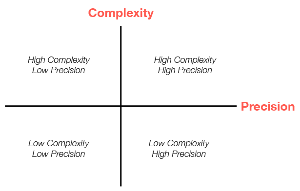

# Evaluating Use Cases for CrewAI

## Understanding the Decision Framework

When building AI applications with CrewAI, one of the most important decisions you'll make is choosing the right approach for your specific use case. Should you use a Crew? A Flow? A combination of both? This guide will help you evaluate your requirements and make informed architectural decisions.

At the heart of this decision is understanding the relationship between **complexity** and **precision** in your application:

<Frame caption="Complexity vs. Precision Matrix for CrewAI Applications">
  
</Frame>

This matrix helps visualize how different approaches align with varying requirements for complexity and precision. Let's explore what each quadrant means and how it guides your architectural choices.

## The Complexity-Precision Matrix Explained

### What is Complexity?

In the context of CrewAI applications, **complexity** refers to:

- The number of distinct steps or operations required
- The diversity of tasks that need to be performed
- The interdependencies between different components
- The need for conditional logic and branching
- The sophistication of the overall workflow

### What is Precision?

**Precision** in this context refers to:

- The accuracy required in the final output
- The need for structured, predictable results
- The importance of reproducibility
- The level of control needed over each step
- The tolerance for variation in outputs

### The Four Quadrants

#### 1. Low Complexity, Low Precision

**Characteristics:**
- Simple, straightforward tasks
- Tolerance for some variation in outputs
- Limited number of steps
- Creative or exploratory applications

**Recommended Approach:** Simple Crews with minimal agents

**Example Use Cases:**
- Basic content generation
- Idea brainstorming
- Simple summarization tasks
- Creative writing assistance

#### 2. Low Complexity, High Precision

**Characteristics:**
- Simple workflows that require exact, structured outputs
- Need for reproducible results
- Limited steps but high accuracy requirements
- Often involves data processing or transformation

**Recommended Approach:** Flows with direct LLM calls or simple Crews with structured outputs

**Example Use Cases:**
- Data extraction and transformation
- Form filling and validation
- Structured content generation (JSON, XML)
- Simple classification tasks

#### 3. High Complexity, Low Precision

**Characteristics:**
- Multi-stage processes with many steps
- Creative or exploratory outputs
- Complex interactions between components
- Tolerance for variation in final results

**Recommended Approach:** Complex Crews with multiple specialized agents

**Example Use Cases:**
- Research and analysis
- Content creation pipelines
- Exploratory data analysis
- Creative problem-solving

#### 4. High Complexity, High Precision

**Characteristics:**
- Complex workflows requiring structured outputs
- Multiple interdependent steps with strict accuracy requirements
- Need for both sophisticated processing and precise results
- Often mission-critical applications

**Recommended Approach:** Flows orchestrating multiple Crews with validation steps

**Example Use Cases:**
- Enterprise decision support systems
- Complex data processing pipelines
- Multi-stage document processing
- Regulated industry applications

## Choosing Between Crews and Flows

### When to Choose Crews

Crews are ideal when:

1. **You need collaborative intelligence** - Multiple agents with different specializations need to work together
2. **The problem requires emergent thinking** - The solution benefits from different perspectives and approaches
3. **The task is primarily creative or analytical** - The work involves research, content creation, or analysis
4. **You value adaptability over strict structure** - The workflow can benefit from agent autonomy
5. **The output format can be somewhat flexible** - Some variation in output structure is acceptable

```python
# Example: Research Crew for market analysis
from crewai import Agent, Crew, Process, Task

# Create specialized agents
researcher = Agent(
    role="Market Research Specialist",
    goal="Find comprehensive market data on emerging technologies",
    backstory="You are an expert at discovering market trends and gathering data."
)

analyst = Agent(
    role="Market Analyst",
    goal="Analyze market data and identify key opportunities",
    backstory="You excel at interpreting market data and spotting valuable insights."
)

# Define their tasks
research_task = Task(
    description="Research the current market landscape for AI-powered healthcare solutions",
    expected_output="Comprehensive market data including key players, market size, and growth trends",
    agent=researcher
)

analysis_task = Task(
    description="Analyze the market data and identify the top 3 investment opportunities",
    expected_output="Analysis report with 3 recommended investment opportunities and rationale",
    agent=analyst,
    context=[research_task]
)

# Create the crew
market_analysis_crew = Crew(
    agents=[researcher, analyst],
    tasks=[research_task, analysis_task],
    process=Process.sequential,
    verbose=True
)

# Run the crew
result = market_analysis_crew.kickoff()
```

### When to Choose Flows

Flows are ideal when:

1. **You need precise control over execution** - The workflow requires exact sequencing and state management
2. **The application has complex state requirements** - You need to maintain and transform state across multiple steps
3. **You need structured, predictable outputs** - The application requires consistent, formatted results
4. **The workflow involves conditional logic** - Different paths need to be taken based on intermediate results
5. **You need to combine AI with procedural code** - The solution requires both AI capabilities and traditional programming

```python
# Example: Customer Support Flow with structured processing
from crewai.flow.flow import Flow, listen, router, start
from pydantic import BaseModel
from typing import List, Dict

# Define structured state
class SupportTicketState(BaseModel):
    ticket_id: str = ""
    customer_name: str = ""
    issue_description: str = ""
    category: str = ""
    priority: str = "medium"
    resolution: str = ""
    satisfaction_score: int = 0

class CustomerSupportFlow(Flow[SupportTicketState]):
    @start()
    def receive_ticket(self):
        # In a real app, this might come from an API
        self.state.ticket_id = "TKT-12345"
        self.state.customer_name = "Alex Johnson"
        self.state.issue_description = "Unable to access premium features after payment"
        return "Ticket received"

    @listen(receive_ticket)
    def categorize_ticket(self, _):
        # Use a direct LLM call for categorization
        from crewai import LLM
        llm = LLM(model="openai/gpt-4o-mini")

        prompt = f"""
        Categorize the following customer support issue into one of these categories:
        - Billing
        - Account Access
        - Technical Issue
        - Feature Request
        - Other

        Issue: {self.state.issue_description}

        Return only the category name.
        """

        self.state.category = llm.call(prompt).strip()
        return self.state.category

    @router(categorize_ticket)
    def route_by_category(self, category):
        # Route to different handlers based on category
        return category.lower().replace(" ", "_")

    @listen("billing")
    def handle_billing_issue(self):
        # Handle billing-specific logic
        self.state.priority = "high"
        # More billing-specific processing...
        return "Billing issue handled"

    @listen("account_access")
    def handle_access_issue(self):
        # Handle access-specific logic
        self.state.priority = "high"
        # More access-specific processing...
        return "Access issue handled"

    # Additional category handlers...

    @listen("billing", "account_access", "technical_issue", "feature_request", "other")
    def resolve_ticket(self, resolution_info):
        # Final resolution step
        self.state.resolution = f"Issue resolved: {resolution_info}"
        return self.state.resolution

# Run the flow
support_flow = CustomerSupportFlow()
result = support_flow.kickoff()
```

### When to Combine Crews and Flows

The most sophisticated applications often benefit from combining Crews and Flows:

1. **Complex multi-stage processes** - Use Flows to orchestrate the overall process and Crews for complex subtasks
2. **Applications requiring both creativity and structure** - Use Crews for creative tasks and Flows for structured processing
3. **Enterprise-grade AI applications** - Use Flows to manage state and process flow while leveraging Crews for specialized work

```python
# Example: Content Production Pipeline combining Crews and Flows
from crewai.flow.flow import Flow, listen, start
from crewai import Agent, Crew, Process, Task
from pydantic import BaseModel
from typing import List, Dict

class ContentState(BaseModel):
    topic: str = ""
    target_audience: str = ""
    content_type: str = ""
    outline: Dict = {}
    draft_content: str = ""
    final_content: str = ""
    seo_score: int = 0

class ContentProductionFlow(Flow[ContentState]):
    @start()
    def initialize_project(self):
        # Set initial parameters
        self.state.topic = "Sustainable Investing"
        self.state.target_audience = "Millennial Investors"
        self.state.content_type = "Blog Post"
        return "Project initialized"

    @listen(initialize_project)
    def create_outline(self, _):
        # Use a research crew to create an outline
        researcher = Agent(
            role="Content Researcher",
            goal=f"Research {self.state.topic} for {self.state.target_audience}",
            backstory="You are an expert researcher with deep knowledge of content creation."
        )

        outliner = Agent(
            role="Content Strategist",
            goal=f"Create an engaging outline for a {self.state.content_type}",
            backstory="You excel at structuring content for maximum engagement."
        )

        research_task = Task(
            description=f"Research {self.state.topic} focusing on what would interest {self.state.target_audience}",
            expected_output="Comprehensive research notes with key points and statistics",
            agent=researcher
        )

        outline_task = Task(
            description=f"Create an outline for a {self.state.content_type} about {self.state.topic}",
            expected_output="Detailed content outline with sections and key points",
            agent=outliner,
            context=[research_task]
        )

        outline_crew = Crew(
            agents=[researcher, outliner],
            tasks=[research_task, outline_task],
            process=Process.sequential,
            verbose=True
        )

        # Run the crew and store the result
        result = outline_crew.kickoff()

        # Parse the outline (in a real app, you might use a more robust parsing approach)
        import json
        try:
            self.state.outline = json.loads(result.raw)
        except:
            # Fallback if not valid JSON
            self.state.outline = {"sections": result.raw}

        return "Outline created"

    @listen(create_outline)
    def write_content(self, _):
        # Use a writing crew to create the content
        writer = Agent(
            role="Content Writer",
            goal=f"Write engaging content for {self.state.target_audience}",
            backstory="You are a skilled writer who creates compelling content."
        )

        editor = Agent(
            role="Content Editor",
            goal="Ensure content is polished, accurate, and engaging",
            backstory="You have a keen eye for detail and a talent for improving content."
        )

        writing_task = Task(
            description=f"Write a {self.state.content_type} about {self.state.topic} following this outline: {self.state.outline}",
            expected_output="Complete draft content in markdown format",
            agent=writer
        )

        editing_task = Task(
            description="Edit and improve the draft content for clarity, engagement, and accuracy",
            expected_output="Polished final content in markdown format",
            agent=editor,
            context=[writing_task]
        )

        writing_crew = Crew(
            agents=[writer, editor],
            tasks=[writing_task, editing_task],
            process=Process.sequential,
            verbose=True
        )

        # Run the crew and store the result
        result = writing_crew.kickoff()
        self.state.final_content = result.raw

        return "Content created"

    @listen(write_content)
    def optimize_for_seo(self, _):
        # Use a direct LLM call for SEO optimization
        from crewai import LLM
        llm = LLM(model="openai/gpt-4o-mini")

        prompt = f"""
        Analyze this content for SEO effectiveness for the keyword "{self.state.topic}".
        Rate it on a scale of 1-100 and provide 3 specific recommendations for improvement.

        Content: {self.state.final_content[:1000]}... (truncated for brevity)

        Format your response as JSON with the following structure:
        {{
            "score": 85,
            "recommendations": [
                "Recommendation 1",
                "Recommendation 2",
                "Recommendation 3"
            ]
        }}
        """

        seo_analysis = llm.call(prompt)

        # Parse the SEO analysis
        import json
        try:
            analysis = json.loads(seo_analysis)
            self.state.seo_score = analysis.get("score", 0)
            return analysis
        except:
            self.state.seo_score = 50
            return {"score": 50, "recommendations": ["Unable to parse SEO analysis"]}

# Run the flow
content_flow = ContentProductionFlow()
result = content_flow.kickoff()
```

## Practical Evaluation Framework

To determine the right approach for your specific use case, follow this step-by-step evaluation framework:

### Step 1: Assess Complexity

Rate your application's complexity on a scale of 1-10 by considering:

1. **Number of steps**: How many distinct operations are required?
   - 1-3 steps: Low complexity (1-3)
   - 4-7 steps: Medium complexity (4-7)
   - 8+ steps: High complexity (8-10)

2. **Interdependencies**: How interconnected are the different parts?
   - Few dependencies: Low complexity (1-3)
   - Some dependencies: Medium complexity (4-7)
   - Many complex dependencies: High complexity (8-10)

3. **Conditional logic**: How much branching and decision-making is needed?
   - Linear process: Low complexity (1-3)
   - Some branching: Medium complexity (4-7)
   - Complex decision trees: High complexity (8-10)

4. **Domain knowledge**: How specialized is the knowledge required?
   - General knowledge: Low complexity (1-3)
   - Some specialized knowledge: Medium complexity (4-7)
   - Deep expertise in multiple domains: High complexity (8-10)

Calculate your average score to determine overall complexity.

### Step 2: Assess Precision Requirements

Rate your precision requirements on a scale of 1-10 by considering:

1. **Output structure**: How structured must the output be?
   - Free-form text: Low precision (1-3)
   - Semi-structured: Medium precision (4-7)
   - Strictly formatted (JSON, XML): High precision (8-10)

2. **Accuracy needs**: How important is factual accuracy?
   - Creative content: Low precision (1-3)
   - Informational content: Medium precision (4-7)
   - Critical information: High precision (8-10)

3. **Reproducibility**: How consistent must results be across runs?
   - Variation acceptable: Low precision (1-3)
   - Some consistency needed: Medium precision (4-7)
   - Exact reproducibility required: High precision (8-10)

4. **Error tolerance**: What is the impact of errors?
   - Low impact: Low precision (1-3)
   - Moderate impact: Medium precision (4-7)
   - High impact: High precision (8-10)

Calculate your average score to determine overall precision requirements.

### Step 3: Map to the Matrix

Plot your complexity and precision scores on the matrix:

- **Low Complexity (1-4), Low Precision (1-4)**: Simple Crews
- **Low Complexity (1-4), High Precision (5-10)**: Flows with direct LLM calls
- **High Complexity (5-10), Low Precision (1-4)**: Complex Crews
- **High Complexity (5-10), High Precision (5-10)**: Flows orchestrating Crews

### Step 4: Consider Additional Factors

Beyond complexity and precision, consider:

1. **Development time**: Crews are often faster to prototype
2. **Maintenance needs**: Flows provide better long-term maintainability
3. **Team expertise**: Consider your team's familiarity with different approaches
4. **Scalability requirements**: Flows typically scale better for complex applications
5. **Integration needs**: Consider how the solution will integrate with existing systems

## Conclusion

Choosing between Crews and Flows—or combining them—is a critical architectural decision that impacts the effectiveness, maintainability, and scalability of your CrewAI application. By evaluating your use case along the dimensions of complexity and precision, you can make informed decisions that align with your specific requirements.

Remember that the best approach often evolves as your application matures. Start with the simplest solution that meets your needs, and be prepared to refine your architecture as you gain experience and your requirements become clearer.

<Check>
You now have a framework for evaluating CrewAI use cases and choosing the right approach based on complexity and precision requirements. This will help you build more effective, maintainable, and scalable AI applications.
</Check>

## Next Steps

- Learn more about [crafting effective agents](/guides/agents/crafting-effective-agents)
- Explore [building your first crew](/guides/crews/first-crew)
- Dive into [mastering flow state management](/guides/flows/mastering-flow-state)
- Check out the [core concepts](/concepts/agents) for deeper understanding