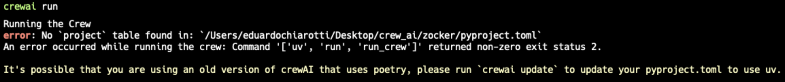
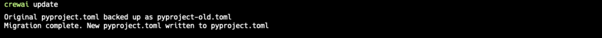

This guide will walk you through the installation process for CrewAI and its dependencies. 
CrewAI is a flexible and powerful AI framework that enables you to create and manage AI agents, tools, and tasks efficiently. 
Let's get started! 🚀

<Tip>
    Make sure you have `Python >=3.10 <=3.13` installed on your system before you proceed.
</Tip>

<Steps>
    <Step title="Install CrewAI">
    Install the main CrewAI package with the following command:
    <CodeGroup>
    ```shell Terminal
    pip install crewai
    ```
    </CodeGroup>
    You can also install the main CrewAI package and the tools package that include a series of helpful tools for your agents:
    <CodeGroup>
    ```shell Terminal
    pip install 'crewai[tools]'
    ```
    </CodeGroup>
    Alternatively, you can also use:
    <CodeGroup>
    ```shell Terminal
    pip install crewai crewai-tools
    ```
    </CodeGroup>
    </Step>
    <Step title="Upgrade CrewAI">
    To upgrade CrewAI and CrewAI Tools to the latest version, run the following command
    <CodeGroup>
    ```shell Terminal
    pip install --upgrade crewai crewai-tools
    ```
    </CodeGroup>
    <Note>
    1. If you're using an older version of CrewAI, you may receive a warning about using `Poetry` for dependency management. 
      

    2. In this case, you'll need to run the command below to update your project. 
      This command will migrate your project to use [UV](https://github.com/astral-sh/uv) and update the necessary files.
        ```shell Terminal
        crewai update
        ```
    3. After running the command above, you should see the following output:
      

    4. You're all set! You can now proceed to the next step! 🎉
    </Note>
    </Step>
    <Step title="Verify the installation">
    To verify that `crewai` and `crewai-tools` are installed correctly, run the following command
    <CodeGroup>
    ```shell Terminal
    pip freeze | grep crewai
    ```
    </CodeGroup>
    You should see the version number of `crewai` and `crewai-tools`.
    <CodeGroup>
    ```markdown Version
    crewai==X.X.X
    crewai-tools==X.X.X
    ```
    </CodeGroup>
    If you see the version number, then the installation was successful! 🎉
    </Step>
</Steps>

## Create a new CrewAI project

The next step is to create a new CrewAI project. 
We recommend using the YAML Template scaffolding to get started as it provides a structured approach to defining agents and tasks.

<Steps>
  <Step title="Create a new CrewAI project using the YAML Template Configuration">
  To create a new CrewAI project, run the following CLI (Command Line Interface) command:
  <CodeGroup>
      ```shell Terminal
      crewai create crew <project_name>
      ```
    </CodeGroup>
  This command creates a new project folder with the following structure:
    | File/Directory          | Description                                      |
    |:------------------------|:-------------------------------------------------|
    | `my_project/`           | Root directory of the project                    |
    | ├── `.gitignore`        | Specifies files and directories to ignore in Git |
    | ├── `pyproject.toml`    | Project configuration and dependencies           |
    | ├── `README.md`         | Project documentation                            |
    | ├── `.env`              | Environment variables                            |
    | └── `src/`              | Source code directory                            |
    | &nbsp;&nbsp;&nbsp;&nbsp;└── `my_project/` | Main application package                      |
    | &nbsp;&nbsp;&nbsp;&nbsp;&nbsp;&nbsp;&nbsp;&nbsp;├── `__init__.py` | Marks the directory as a Python package     |
    | &nbsp;&nbsp;&nbsp;&nbsp;&nbsp;&nbsp;&nbsp;&nbsp;├── `main.py`     | Main application script                    |
    | &nbsp;&nbsp;&nbsp;&nbsp;&nbsp;&nbsp;&nbsp;&nbsp;├── `crew.py`     | Crew-related functionalities                |
    | &nbsp;&nbsp;&nbsp;&nbsp;&nbsp;&nbsp;&nbsp;&nbsp;├── `tools/`      | Custom tools directory                      |
    | &nbsp;&nbsp;&nbsp;&nbsp;&nbsp;&nbsp;&nbsp;&nbsp;│   ├── `custom_tool.py` | Custom tool implementation              |
    | &nbsp;&nbsp;&nbsp;&nbsp;&nbsp;&nbsp;&nbsp;&nbsp;│   └── `__init__.py`    | Marks tools directory as a package       |
    | &nbsp;&nbsp;&nbsp;&nbsp;&nbsp;&nbsp;&nbsp;&nbsp;└── `config/`     | Configuration files directory               |
    | &nbsp;&nbsp;&nbsp;&nbsp;&nbsp;&nbsp;&nbsp;&nbsp;&nbsp;&nbsp;&nbsp;&nbsp;├── `agents.yaml`  | Agent configurations                    |
    | &nbsp;&nbsp;&nbsp;&nbsp;&nbsp;&nbsp;&nbsp;&nbsp;&nbsp;&nbsp;&nbsp;&nbsp;└── `tasks.yaml`   | Task configurations                      |

  You can now start developing your crew by editing the files in the `src/my_project` folder. 
  The `main.py` file is the entry point of the project, the `crew.py` file is where you define your crew, the `agents.yaml` file is where you define your agents, 
  and the `tasks.yaml` file is where you define your tasks.
  </Step>   
  <Step title="Customize your project">
  To customize your project, you can:
    - Modify `src/my_project/config/agents.yaml` to define your agents.
    - Modify `src/my_project/config/tasks.yaml` to define your tasks.
    - Modify `src/my_project/crew.py` to add your own logic, tools, and specific arguments.
    - Modify `src/my_project/main.py` to add custom inputs for your agents and tasks.
    - Add your environment variables into the `.env` file.
  </Step>
</Steps>

## Next steps

Now that you have installed `crewai` and `crewai-tools`, you're ready to spin up your first crew!

- 👨‍💻 Build your first agent with CrewAI by following the [Quickstart](/quickstart) guide.
- 💬 Join the [Community](https://community.crewai.com) to get help and share your feedback.
