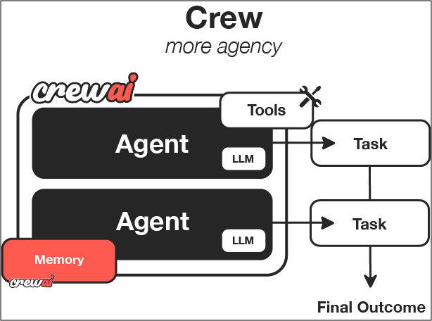
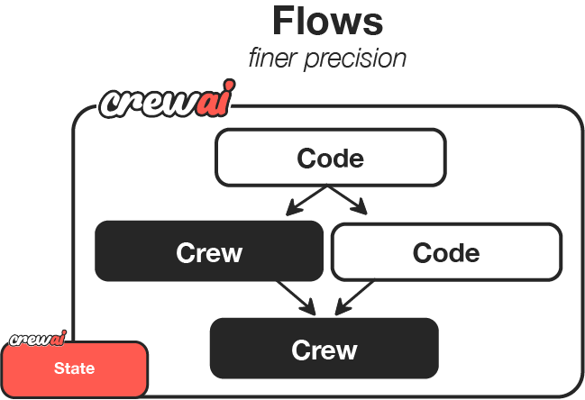

# What is CrewAI?

**CrewAI is a lean, lightning-fast Python framework built entirely from scratch—completely independent of LangChain or other agent frameworks.**

CrewAI empowers developers with both high-level simplicity and precise low-level control, ideal for creating autonomous AI agents tailored to any scenario:

- **[CrewAI Crews](/guides/crews/first-crew)**: Optimize for autonomy and collaborative intelligence, enabling you to create AI teams where each agent has specific roles, tools, and goals.
- **[CrewAI Flows](/guides/flows/first-flow)**: Enable granular, event-driven control, single LLM calls for precise task orchestration and supports Crews natively.

With over 100,000 developers certified through our community courses, CrewAI is rapidly becoming the standard for enterprise-ready AI automation.

## How Crews Work

<Note>
  Just like a company has departments (Sales, Engineering, Marketing) working together under leadership to achieve business goals, CrewAI helps you create an organization of AI agents with specialized roles collaborating to accomplish complex tasks.
</Note>

<Frame caption="CrewAI Framework Overview">
  
</Frame>

| Component | Description | Key Features |
|:----------|:-----------:|:------------|
| **Crew** | The top-level organization | • Manages AI agent teams • Oversees workflows • Ensures collaboration • Delivers outcomes |
| **AI Agents** | Specialized team members | • Have specific roles (researcher, writer) • Use designated tools • Can delegate tasks • Make autonomous decisions |
| **Process** | Workflow management system | • Defines collaboration patterns • Controls task assignments • Manages interactions • Ensures efficient execution |
| **Tasks** | Individual assignments | • Have clear objectives • Use specific tools • Feed into larger process • Produce actionable results |

### How It All Works Together

1. The **Crew** organizes the overall operation
2. **AI Agents** work on their specialized tasks
3. The **Process** ensures smooth collaboration
4. **Tasks** get completed to achieve the goal

## Key Features

<CardGroup cols={2}>
  <Card title="Role-Based Agents" icon="users">
    Create specialized agents with defined roles, expertise, and goals - from researchers to analysts to writers
  </Card>
  <Card title="Flexible Tools" icon="screwdriver-wrench">
    Equip agents with custom tools and APIs to interact with external services and data sources
  </Card>
  <Card title="Intelligent Collaboration" icon="people-arrows">
    Agents work together, sharing insights and coordinating tasks to achieve complex objectives
  </Card>
  <Card title="Task Management" icon="list-check">
    Define sequential or parallel workflows, with agents automatically handling task dependencies
  </Card>
</CardGroup>

## How Flows Work

<Note>
  While Crews excel at autonomous collaboration, Flows provide structured automations, offering granular control over workflow execution. Flows ensure tasks are executed reliably, securely, and efficiently, handling conditional logic, loops, and dynamic state management with precision. Flows integrate seamlessly with Crews, enabling you to balance high autonomy with exacting control.
</Note>

<Frame caption="CrewAI Framework Overview">
  
</Frame>

| Component | Description | Key Features |
|:----------|:-----------:|:------------|
| **Flow** | Structured workflow orchestration | • Manages execution paths • Handles state transitions • Controls task sequencing • Ensures reliable execution |
| **Events** | Triggers for workflow actions | • Initiate specific processes • Enable dynamic responses • Support conditional branching • Allow for real-time adaptation |
| **States** | Workflow execution contexts | • Maintain execution data • Enable persistence • Support resumability • Ensure execution integrity |
| **Crew Support** | Enhances workflow automation | • Injects pockets of agency when needed • Complements structured workflows • Balances automation with intelligence • Enables adaptive decision-making |

### Key Capabilities

<CardGroup cols={2}>
  <Card title="Event-Driven Orchestration" icon="bolt">
    Define precise execution paths responding dynamically to events
  </Card>
  <Card title="Fine-Grained Control" icon="sliders">
    Manage workflow states and conditional execution securely and efficiently
  </Card>
  <Card title="Native Crew Integration" icon="puzzle-piece">
    Effortlessly combine with Crews for enhanced autonomy and intelligence
  </Card>
  <Card title="Deterministic Execution" icon="route">
    Ensure predictable outcomes with explicit control flow and error handling
  </Card>
</CardGroup>

## When to Use Crews vs. Flows

<Note>
  Understanding when to use [Crews](/guides/crews/first-crew) versus [Flows](/guides/flows/first-flow) is key to maximizing the potential of CrewAI in your applications.
</Note>

| Use Case | Recommended Approach | Why? |
|:---------|:---------------------|:-----|
| **Open-ended research** | [Crews](/guides/crews/first-crew) | When tasks require creative thinking, exploration, and adaptation |
| **Content generation** | [Crews](/guides/crews/first-crew) | For collaborative creation of articles, reports, or marketing materials |
| **Decision workflows** | [Flows](/guides/flows/first-flow) | When you need predictable, auditable decision paths with precise control |
| **API orchestration** | [Flows](/guides/flows/first-flow) | For reliable integration with multiple external services in a specific sequence |
| **Hybrid applications** | Combined approach | Use [Flows](/guides/flows/first-flow) to orchestrate overall process with [Crews](/guides/crews/first-crew) handling complex subtasks |

### Decision Framework

- **Choose [Crews](/guides/crews/first-crew) when:** You need autonomous problem-solving, creative collaboration, or exploratory tasks
- **Choose [Flows](/guides/flows/first-flow) when:** You require deterministic outcomes, auditability, or precise control over execution
- **Combine both when:** Your application needs both structured processes and pockets of autonomous intelligence

## Why Choose CrewAI?

- 🧠 **Autonomous Operation**: Agents make intelligent decisions based on their roles and available tools
- 📝 **Natural Interaction**: Agents communicate and collaborate like human team members
- 🛠️ **Extensible Design**: Easy to add new tools, roles, and capabilities
- 🚀 **Production Ready**: Built for reliability and scalability in real-world applications
- 🔒 **Security-Focused**: Designed with enterprise security requirements in mind
- 💰 **Cost-Efficient**: Optimized to minimize token usage and API calls

## Ready to Start Building?

<CardGroup cols={2}>
  <Card
    title="Build Your First Crew"
    icon="users-gear"
    href="/guides/crews/first-crew"
  >
    Step-by-step tutorial to create a collaborative AI team that works together to solve complex problems.
  </Card>
  <Card
    title="Build Your First Flow"
    icon="diagram-project"
    href="/guides/flows/first-flow"
  >
    Learn how to create structured, event-driven workflows with precise control over execution.
  </Card>
</CardGroup>

<CardGroup cols={3}>
  <Card
    title="Install CrewAI"
    icon="wrench"
    href="/installation"
  >
    Get started with CrewAI in your development environment.
  </Card>
  <Card
    title="Quick Start"
    icon="bolt"
    href="/quickstart"
  >
    Follow our quickstart guide to create your first CrewAI agent and get hands-on experience.
  </Card>
  <Card
    title="Join the Community"
    icon="comments"
    href="https://community.crewai.com"
  >
    Connect with other developers, get help, and share your CrewAI experiences.
  </Card>
</CardGroup>