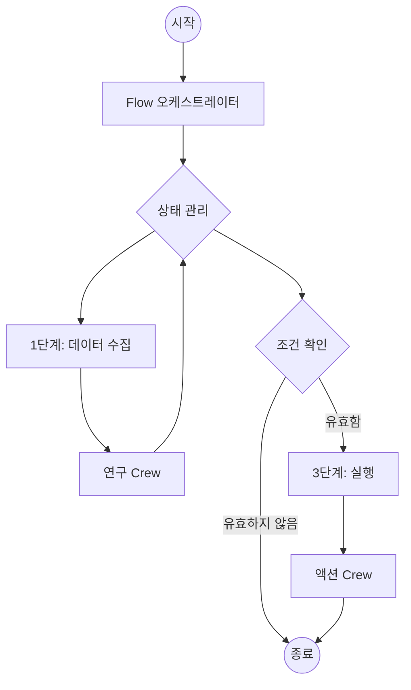

# Flow 우선 사고방식 (Flow-First Mindset)

CrewAI로 프로덕션 AI 애플리케이션을 구축할 때는 **Flow로 시작하는 것을 권장합니다**.

개별 Crews나 Agents를 실행하는 것도 가능하지만, 이를 Flow로 감싸면 견고하고 확장 가능한 애플리케이션에 필요한 구조를 제공합니다.

## 왜 Flows인가?

1.  **상태 관리 (State Management)**: Flows는 애플리케이션의 여러 단계에 걸쳐 상태를 관리하는 내장된 방법을 제공합니다. 이는 Crews 간에 데이터를 전달하고, 컨텍스트를 유지하며, 사용자 입력을 처리하는 데 중요합니다.
2.  **제어 (Control)**: Flows를 사용하면 루프, 조건문, 분기 로직을 포함한 정확한 실행 경로를 정의할 수 있습니다. 이는 예외 상황을 처리하고 애플리케이션이 예측 가능하게 동작하도록 보장하는 데 필수적입니다.
3.  **관측 가능성 (Observability)**: Flows는 실행을 추적하고, 문제를 디버깅하며, 성능을 모니터링하기 쉽게 만드는 명확한 구조를 제공합니다. 자세한 통찰력을 얻으려면 [CrewAI Tracing](/ko/observability/tracing)을 사용하는 것이 좋습니다. `crewai login`을 실행하여 무료 관측 가능성 기능을 활성화하세요.

## 아키텍처

일반적인 프로덕션 CrewAI 애플리케이션은 다음과 같습니다:



### 1. Flow 클래스
`Flow` 클래스는 진입점입니다. 상태 스키마와 로직을 실행하는 메서드를 정의합니다.

```python
from crewai.flow.flow import Flow, listen, start
from pydantic import BaseModel

class AppState(BaseModel):
    user_input: str = ""
    research_results: str = ""
    final_report: str = ""

class ProductionFlow(Flow[AppState]):
    @start()
    def gather_input(self):
        # ... 입력 받는 로직 ...
        pass

    @listen(gather_input)
    def run_research_crew(self):
        # ... Crew 트리거 ...
        pass
```

### 2. 상태 관리 (State Management)
Pydantic 모델을 사용하여 상태를 정의하세요. 이는 타입 안전성을 보장하고 각 단계에서 어떤 데이터를 사용할 수 있는지 명확하게 합니다.

- **최소한으로 유지**: 단계 간에 유지해야 할 것만 저장하세요.
- **구조화된 데이터 사용**: 가능하면 비구조화된 딕셔너리는 피하세요.

### 3. 작업 단위로서의 Crews
복잡한 작업은 Crews에게 위임하세요. Crew는 특정 목표(예: "주제 연구", "블로그 게시물 작성")에 집중해야 합니다.

- **Crews를 과도하게 설계하지 마세요**: 집중력을 유지하세요.
- **상태를 명시적으로 전달하세요**: Flow 상태에서 필요한 데이터를 Crew 입력으로 전달하세요.

```python
    @listen(gather_input)
    def run_research_crew(self):
        crew = ResearchCrew()
        result = crew.kickoff(inputs={"topic": self.state.user_input})
        self.state.research_results = result.raw
```

## Control Primitives

CrewAI의 Control Primitives를 활용하여 Crew에 견고함과 제어력을 더하세요.

### 1. Task Guardrails
[Task Guardrails](/ko/concepts/tasks#task-guardrails)를 사용하여 작업 결과가 수락되기 전에 유효성을 검사하세요. 이를 통해 agent가 고품질 결과를 생성하도록 보장할 수 있습니다.

```python
def validate_content(result: TaskOutput) -> Tuple[bool, Any]:
    if len(result.raw) < 100:
        return (False, "Content is too short. Please expand.")
    return (True, result.raw)

task = Task(
    ...,
    guardrail=validate_content
)
```

### 2. 구조화된 출력 (Structured Outputs)
작업 간에 데이터를 전달하거나 애플리케이션으로 전달할 때는 항상 구조화된 출력(`output_pydantic` 또는 `output_json`)을 사용하세요. 이는 파싱 오류를 방지하고 타입 안전성을 보장합니다.

```python
class ResearchResult(BaseModel):
    summary: str
    sources: List[str]

task = Task(
    ...,
    output_pydantic=ResearchResult
)
```

### 3. LLM Hooks
[LLM Hooks](/ko/learn/llm-hooks)를 사용하여 LLM으로 전송되기 전에 메시지를 검사하거나 수정하고, 응답을 정리(sanitize)하세요.

```python
@before_llm_call
def log_request(context):
    print(f"Agent {context.agent.role} is calling the LLM...")
```

## 배포 패턴

Flow를 배포할 때 다음을 고려하세요:

### CrewAI Enterprise
Flow를 배포하는 가장 쉬운 방법은 CrewAI Enterprise를 사용하는 것입니다. 인프라, 인증 및 모니터링을 대신 처리합니다.

시작하려면 [배포 가이드](/ko/enterprise/guides/deploy-to-amp)를 확인하세요.

```bash
crewai deploy create
```

### 비동기 실행 (Async Execution)
장기 실행 작업의 경우 `kickoff_async`를 사용하여 API 차단을 방지하세요.

### 지속성 (Persistence)
`@persist` 데코레이터를 사용하여 Flow의 상태를 데이터베이스에 저장하세요. 이를 통해 프로세스가 중단되거나 사람의 입력을 기다려야 할 때 실행을 재개할 수 있습니다.

```python
@persist
class ProductionFlow(Flow[AppState]):
    # ...
```

## 요약

- **Flow로 시작하세요.**
- **명확한 State를 정의하세요.**
- **복잡한 작업에는 Crews를 사용하세요.**
- **API와 지속성을 갖추어 배포하세요.**
