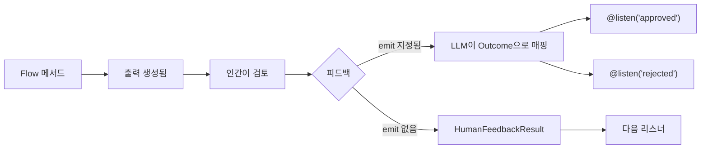

## 개요

`@human_feedback` 데코레이터는 CrewAI Flow 내에서 직접 human-in-the-loop(HITL) 워크플로우를 가능하게 합니다. Flow 실행을 일시 중지하고, 인간에게 검토를 위해 출력을 제시하고, 피드백을 수집하고, 선택적으로 피드백 결과에 따라 다른 리스너로 라우팅할 수 있습니다.

이는 특히 다음과 같은 경우에 유용합니다:

- **품질 보증**: AI가 생성한 콘텐츠를 다운스트림에서 사용하기 전에 검토
- **결정 게이트**: 자동화된 워크플로우에서 인간이 중요한 결정을 내리도록 허용
- **승인 워크플로우**: 승인/거부/수정 패턴 구현
- **대화형 개선**: 출력을 반복적으로 개선하기 위해 피드백 수집



## 빠른 시작

Flow에 인간 피드백을 추가하는 가장 간단한 방법은 다음과 같습니다:

```python Code
from crewai.flow.flow import Flow, start, listen
from crewai.flow.human_feedback import human_feedback

class SimpleReviewFlow(Flow):
    @human_feedback(request="이 콘텐츠를 검토해 주세요:")
    @start()
    def generate_content(self):
        return "검토가 필요한 AI 생성 콘텐츠입니다."

    @listen(generate_content)
    def process_feedback(self, result):
        print(f"콘텐츠: {result.output}")
        print(f"인간의 의견: {result.feedback}")

flow = SimpleReviewFlow()
flow.kickoff()
```

이 Flow를 실행하면:
1. `generate_content`를 실행하고 문자열을 반환합니다
2. 요청 메시지와 함께 사용자에게 출력을 표시합니다
3. 사용자가 피드백을 입력할 때까지 대기합니다 (또는 Enter를 눌러 건너뜁니다)
4. `HumanFeedbackResult` 객체를 `process_feedback`에 전달합니다

## @human_feedback 데코레이터

### 매개변수

| 매개변수 | 타입 | 필수 | 설명 |
|----------|------|------|------|
| `request` | `str` | 예 | 메서드 출력과 함께 인간에게 표시되는 메시지 |
| `emit` | `Sequence[str]` | 아니오 | 가능한 outcome 목록. 피드백이 이 중 하나로 매핑되어 `@listen` 데코레이터를 트리거합니다 |
| `llm` | `str \| BaseLLM` | `emit` 지정 시 | 피드백을 해석하고 outcome에 매핑하는 데 사용되는 LLM |
| `default_outcome` | `str` | 아니오 | 피드백이 제공되지 않을 때 사용할 outcome. `emit`에 있어야 합니다 |
| `metadata` | `dict` | 아니오 | 엔터프라이즈 통합을 위한 추가 데이터 |

### 기본 사용법 (라우팅 없음)

`emit`을 지정하지 않으면, 데코레이터는 단순히 피드백을 수집하고 다음 리스너에 `HumanFeedbackResult`를 전달합니다:

```python Code
@human_feedback(request="이 분석에 대해 어떻게 생각하시나요?")
@start()
def analyze_data(self):
    return "분석 결과: 매출 15% 증가, 비용 8% 감소"

@listen(analyze_data)
def handle_feedback(self, result):
    # result는 HumanFeedbackResult입니다
    print(f"분석: {result.output}")
    print(f"피드백: {result.feedback}")
```

### emit을 사용한 라우팅

`emit`을 지정하면, 데코레이터는 라우터가 됩니다. 인간의 자유 형식 피드백이 LLM에 의해 해석되어 지정된 outcome 중 하나로 매핑됩니다:

```python Code
@human_feedback(
    request="이 콘텐츠의 출판을 승인하시겠습니까?",
    emit=["approved", "rejected", "needs_revision"],
    llm="gpt-4o-mini",
    default_outcome="needs_revision",
)
@start()
def review_content(self):
    return "블로그 게시물 초안 내용..."

@listen("approved")
def publish(self, result):
    print(f"출판 중! 사용자 의견: {result.feedback}")

@listen("rejected")
def discard(self, result):
    print(f"폐기됨. 이유: {result.feedback}")

@listen("needs_revision")
def revise(self, result):
    print(f"다음을 기반으로 수정 중: {result.feedback}")
```

<Tip>
LLM은 가능한 경우 구조화된 출력(function calling)을 사용하여 응답이 지정된 outcome 중 하나임을 보장합니다. 이로 인해 라우팅이 신뢰할 수 있고 예측 가능해집니다.
</Tip>

## HumanFeedbackResult

`HumanFeedbackResult` 데이터클래스는 인간 피드백 상호작용에 대한 모든 정보를 포함합니다:

```python Code
from crewai.flow.human_feedback import HumanFeedbackResult

@dataclass
class HumanFeedbackResult:
    output: Any              # 인간에게 표시된 원래 메서드 출력
    feedback: str            # 인간의 원시 피드백 텍스트
    outcome: str | None      # 매핑된 outcome (emit이 지정된 경우)
    timestamp: datetime      # 피드백이 수신된 시간
    method_name: str         # 데코레이터된 메서드의 이름
    metadata: dict           # 데코레이터에 전달된 모든 메타데이터
```

### 리스너에서 접근하기

`emit`이 있는 `@human_feedback` 메서드에 의해 리스너가 트리거되면, `HumanFeedbackResult`를 받습니다:

```python Code
@listen("approved")
def on_approval(self, result: HumanFeedbackResult):
    print(f"원래 출력: {result.output}")
    print(f"사용자 피드백: {result.feedback}")
    print(f"Outcome: {result.outcome}")  # "approved"
    print(f"수신 시간: {result.timestamp}")
```

## 피드백 히스토리 접근하기

`Flow` 클래스는 인간 피드백에 접근하기 위한 두 가지 속성을 제공합니다:

### last_human_feedback

가장 최근의 `HumanFeedbackResult`를 반환합니다:

```python Code
@listen(some_method)
def check_feedback(self):
    if self.last_human_feedback:
        print(f"마지막 피드백: {self.last_human_feedback.feedback}")
```

### human_feedback_history

Flow 동안 수집된 모든 `HumanFeedbackResult` 객체의 리스트입니다:

```python Code
@listen(final_step)
def summarize(self):
    print(f"수집된 총 피드백: {len(self.human_feedback_history)}")
    for i, fb in enumerate(self.human_feedback_history):
        print(f"{i+1}. {fb.method_name}: {fb.outcome or '라우팅 없음'}")
```

<Warning>
각 `HumanFeedbackResult`는 `human_feedback_history`에 추가되므로, 여러 피드백 단계가 서로 덮어쓰지 않습니다. 이 리스트를 사용하여 Flow 동안 수집된 모든 피드백에 접근하세요.
</Warning>

## 완전한 예제: 콘텐츠 승인 워크플로우

콘텐츠 검토 및 승인 워크플로우를 구현하는 전체 예제입니다:

<CodeGroup>

```python Code
from crewai.flow.flow import Flow, start, listen
from crewai.flow.human_feedback import human_feedback, HumanFeedbackResult
from pydantic import BaseModel


class ContentState(BaseModel):
    topic: str = ""
    draft: str = ""
    final_content: str = ""
    revision_count: int = 0


class ContentApprovalFlow(Flow[ContentState]):
    """콘텐츠를 생성하고 인간의 승인을 받는 Flow입니다."""

    @start()
    def get_topic(self):
        self.state.topic = input("어떤 주제에 대해 글을 쓸까요? ")
        return self.state.topic

    @listen(get_topic)
    def generate_draft(self, topic):
        # 실제 사용에서는 LLM을 호출합니다
        self.state.draft = f"# {topic}\n\n{topic}에 대한 초안입니다..."
        return self.state.draft

    @human_feedback(
        request="이 초안을 검토해 주세요. 'approved', 'rejected'로 답하거나 수정 피드백을 제공해 주세요:",
        emit=["approved", "rejected", "needs_revision"],
        llm="gpt-4o-mini",
        default_outcome="needs_revision",
    )
    @listen(generate_draft)
    def review_draft(self, draft):
        return draft

    @listen("approved")
    def publish_content(self, result: HumanFeedbackResult):
        self.state.final_content = result.output
        print("\n✅ 콘텐츠가 승인되어 출판되었습니다!")
        print(f"검토자 코멘트: {result.feedback}")
        return "published"

    @listen("rejected")
    def handle_rejection(self, result: HumanFeedbackResult):
        print("\n❌ 콘텐츠가 거부되었습니다")
        print(f"이유: {result.feedback}")
        return "rejected"

    @listen("needs_revision")
    def revise_content(self, result: HumanFeedbackResult):
        self.state.revision_count += 1
        print(f"\n📝 수정 #{self.state.revision_count} 요청됨")
        print(f"피드백: {result.feedback}")

        # 실제 Flow에서는 generate_draft로 돌아갈 수 있습니다
        # 이 예제에서는 단순히 확인합니다
        return "revision_requested"


# Flow 실행
flow = ContentApprovalFlow()
result = flow.kickoff()
print(f"\nFlow 완료. 요청된 수정: {flow.state.revision_count}")
```

```text Output
어떤 주제에 대해 글을 쓸까요? AI 안전

==================================================
OUTPUT FOR REVIEW:
==================================================
# AI 안전

AI 안전에 대한 초안입니다...
==================================================

이 초안을 검토해 주세요. 'approved', 'rejected'로 답하거나 수정 피드백을 제공해 주세요:
(Press Enter to skip, or type your feedback)

Your feedback: 좋아 보입니다, 승인!

✅ 콘텐츠가 승인되어 출판되었습니다!
검토자 코멘트: 좋아 보입니다, 승인!

Flow 완료. 요청된 수정: 0
```

</CodeGroup>

## 다른 데코레이터와 결합하기

`@human_feedback` 데코레이터는 다른 Flow 데코레이터와 함께 작동합니다. 순서가 중요합니다:

```python Code
# 올바름: @human_feedback이 Flow 데코레이터를 감쌉니다
@human_feedback(request="이것을 검토해 주세요:")
@start()
def my_start_method(self):
    return "content"

@human_feedback(request="이것도 검토해 주세요:")
@listen(other_method)
def my_listener(self, data):
    return f"processed: {data}"
```

<Tip>
`@human_feedback`를 가장 바깥쪽 데코레이터(첫 번째/상단)로 배치하여 메서드가 완료된 후 실행되고 반환 값을 캡처할 수 있도록 하세요.
</Tip>

## 모범 사례

### 1. 명확한 요청 메시지 작성

`request` 매개변수는 인간이 보는 것입니다. 실행 가능하게 만드세요:

```python Code
# ✅ 좋음 - 명확하고 실행 가능
@human_feedback(request="이 요약이 핵심 포인트를 정확하게 캡처했나요? '예'로 답하거나 무엇이 빠졌는지 설명해 주세요:")

# ❌ 나쁨 - 모호함
@human_feedback(request="이것을 검토해 주세요:")
```

### 2. 의미 있는 Outcome 선택

`emit`을 사용할 때, 인간의 응답에 자연스럽게 매핑되는 outcome을 선택하세요:

```python Code
# ✅ 좋음 - 자연어 outcome
emit=["approved", "rejected", "needs_more_detail"]

# ❌ 나쁨 - 기술적이거나 불명확
emit=["state_1", "state_2", "state_3"]
```

### 3. 항상 기본 Outcome 제공

사용자가 입력 없이 Enter를 누르는 경우를 처리하기 위해 `default_outcome`을 사용하세요:

```python Code
@human_feedback(
    request="승인하시겠습니까? (수정 요청하려면 Enter 누르세요)",
    emit=["approved", "needs_revision"],
    llm="gpt-4o-mini",
    default_outcome="needs_revision",  # 안전한 기본값
)
```

### 4. 감사 추적을 위한 피드백 히스토리 사용

감사 로그를 생성하기 위해 `human_feedback_history`에 접근하세요:

```python Code
@listen(final_step)
def create_audit_log(self):
    log = []
    for fb in self.human_feedback_history:
        log.append({
            "step": fb.method_name,
            "outcome": fb.outcome,
            "feedback": fb.feedback,
            "timestamp": fb.timestamp.isoformat(),
        })
    return log
```

### 5. 라우팅된 피드백과 라우팅되지 않은 피드백 모두 처리

Flow를 설계할 때, 라우팅이 필요한지 고려하세요:

| 시나리오 | 사용 |
|----------|------|
| 간단한 검토, 피드백 텍스트만 필요 | `emit` 없음 |
| 응답에 따라 다른 경로로 분기 필요 | `emit` 사용 |
| 승인/거부/수정이 있는 승인 게이트 | `emit` 사용 |
| 로깅만을 위한 코멘트 수집 | `emit` 없음 |

## 관련 문서

- [Flow 개요](/ko/concepts/flows) - CrewAI Flow에 대해 알아보기
- [Flow 상태 관리](/ko/guides/flows/mastering-flow-state) - Flow에서 상태 관리하기
- [@router를 사용한 라우팅](/ko/concepts/flows#router) - 조건부 라우팅에 대해 더 알아보기
- [실행 시 인간 입력](/ko/learn/human-input-on-execution) - 태스크 수준 인간 입력
