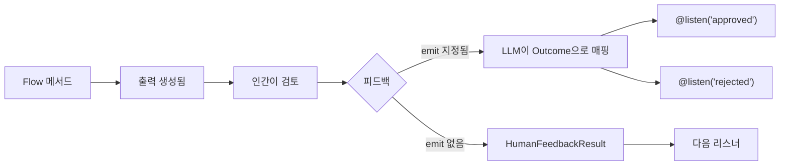

## 개요

<Note>
`@human_feedback` 데코레이터는 **CrewAI 버전 1.8.0 이상**이 필요합니다. 이 기능을 사용하기 전에 설치를 업데이트하세요.
</Note>

`@human_feedback` 데코레이터는 CrewAI Flow 내에서 직접 human-in-the-loop(HITL) 워크플로우를 가능하게 합니다. Flow 실행을 일시 중지하고, 인간에게 검토를 위해 출력을 제시하고, 피드백을 수집하고, 선택적으로 피드백 결과에 따라 다른 리스너로 라우팅할 수 있습니다.

이는 특히 다음과 같은 경우에 유용합니다:

- **품질 보증**: AI가 생성한 콘텐츠를 다운스트림에서 사용하기 전에 검토
- **결정 게이트**: 자동화된 워크플로우에서 인간이 중요한 결정을 내리도록 허용
- **승인 워크플로우**: 승인/거부/수정 패턴 구현
- **대화형 개선**: 출력을 반복적으로 개선하기 위해 피드백 수집



## 빠른 시작

Flow에 인간 피드백을 추가하는 가장 간단한 방법은 다음과 같습니다:

```python Code
from crewai.flow.flow import Flow, start, listen
from crewai.flow.human_feedback import human_feedback

class SimpleReviewFlow(Flow):
    @start()
    @human_feedback(message="이 콘텐츠를 검토해 주세요:")
    def generate_content(self):
        return "검토가 필요한 AI 생성 콘텐츠입니다."

    @listen(generate_content)
    def process_feedback(self, result):
        print(f"콘텐츠: {result.output}")
        print(f"인간의 의견: {result.feedback}")

flow = SimpleReviewFlow()
flow.kickoff()
```

이 Flow를 실행하면:
1. `generate_content`를 실행하고 문자열을 반환합니다
2. 요청 메시지와 함께 사용자에게 출력을 표시합니다
3. 사용자가 피드백을 입력할 때까지 대기합니다 (또는 Enter를 눌러 건너뜁니다)
4. `HumanFeedbackResult` 객체를 `process_feedback`에 전달합니다

## @human_feedback 데코레이터

### 매개변수

| 매개변수 | 타입 | 필수 | 설명 |
|----------|------|------|------|
| `message` | `str` | 예 | 메서드 출력과 함께 인간에게 표시되는 메시지 |
| `emit` | `Sequence[str]` | 아니오 | 가능한 outcome 목록. 피드백이 이 중 하나로 매핑되어 `@listen` 데코레이터를 트리거합니다 |
| `llm` | `str \| BaseLLM` | `emit` 지정 시 | 피드백을 해석하고 outcome에 매핑하는 데 사용되는 LLM |
| `default_outcome` | `str` | 아니오 | 피드백이 제공되지 않을 때 사용할 outcome. `emit`에 있어야 합니다 |
| `metadata` | `dict` | 아니오 | 엔터프라이즈 통합을 위한 추가 데이터 |
| `provider` | `HumanFeedbackProvider` | 아니오 | 비동기/논블로킹 피드백을 위한 커스텀 프로바이더. [비동기 인간 피드백](#비동기-인간-피드백-논블로킹) 참조 |
| `learn` | `bool` | 아니오 | HITL 학습 활성화: 피드백에서 교훈을 추출하고 향후 출력을 사전 검토합니다. 기본값 `False`. [피드백에서 학습하기](#피드백에서-학습하기) 참조 |
| `learn_limit` | `int` | 아니오 | 사전 검토를 위해 불러올 최대 과거 교훈 수. 기본값 `5` |

### 기본 사용법 (라우팅 없음)

`emit`을 지정하지 않으면, 데코레이터는 단순히 피드백을 수집하고 다음 리스너에 `HumanFeedbackResult`를 전달합니다:

```python Code
@start()
@human_feedback(message="이 분석에 대해 어떻게 생각하시나요?")
def analyze_data(self):
    return "분석 결과: 매출 15% 증가, 비용 8% 감소"

@listen(analyze_data)
def handle_feedback(self, result):
    # result는 HumanFeedbackResult입니다
    print(f"분석: {result.output}")
    print(f"피드백: {result.feedback}")
```

### emit을 사용한 라우팅

`emit`을 지정하면, 데코레이터는 라우터가 됩니다. 인간의 자유 형식 피드백이 LLM에 의해 해석되어 지정된 outcome 중 하나로 매핑됩니다:

```python Code
@start()
@human_feedback(
    message="이 콘텐츠의 출판을 승인하시겠습니까?",
    emit=["approved", "rejected", "needs_revision"],
    llm="gpt-4o-mini",
    default_outcome="needs_revision",
)
def review_content(self):
    return "블로그 게시물 초안 내용..."

@listen("approved")
def publish(self, result):
    print(f"출판 중! 사용자 의견: {result.feedback}")

@listen("rejected")
def discard(self, result):
    print(f"폐기됨. 이유: {result.feedback}")

@listen("needs_revision")
def revise(self, result):
    print(f"다음을 기반으로 수정 중: {result.feedback}")
```

<Tip>
LLM은 가능한 경우 구조화된 출력(function calling)을 사용하여 응답이 지정된 outcome 중 하나임을 보장합니다. 이로 인해 라우팅이 신뢰할 수 있고 예측 가능해집니다.
</Tip>

## HumanFeedbackResult

`HumanFeedbackResult` 데이터클래스는 인간 피드백 상호작용에 대한 모든 정보를 포함합니다:

```python Code
from crewai.flow.human_feedback import HumanFeedbackResult

@dataclass
class HumanFeedbackResult:
    output: Any              # 인간에게 표시된 원래 메서드 출력
    feedback: str            # 인간의 원시 피드백 텍스트
    outcome: str | None      # 매핑된 outcome (emit이 지정된 경우)
    timestamp: datetime      # 피드백이 수신된 시간
    method_name: str         # 데코레이터된 메서드의 이름
    metadata: dict           # 데코레이터에 전달된 모든 메타데이터
```

### 리스너에서 접근하기

`emit`이 있는 `@human_feedback` 메서드에 의해 리스너가 트리거되면, `HumanFeedbackResult`를 받습니다:

```python Code
@listen("approved")
def on_approval(self, result: HumanFeedbackResult):
    print(f"원래 출력: {result.output}")
    print(f"사용자 피드백: {result.feedback}")
    print(f"Outcome: {result.outcome}")  # "approved"
    print(f"수신 시간: {result.timestamp}")
```

## 피드백 히스토리 접근하기

`Flow` 클래스는 인간 피드백에 접근하기 위한 두 가지 속성을 제공합니다:

### last_human_feedback

가장 최근의 `HumanFeedbackResult`를 반환합니다:

```python Code
@listen(some_method)
def check_feedback(self):
    if self.last_human_feedback:
        print(f"마지막 피드백: {self.last_human_feedback.feedback}")
```

### human_feedback_history

Flow 동안 수집된 모든 `HumanFeedbackResult` 객체의 리스트입니다:

```python Code
@listen(final_step)
def summarize(self):
    print(f"수집된 총 피드백: {len(self.human_feedback_history)}")
    for i, fb in enumerate(self.human_feedback_history):
        print(f"{i+1}. {fb.method_name}: {fb.outcome or '라우팅 없음'}")
```

<Warning>
각 `HumanFeedbackResult`는 `human_feedback_history`에 추가되므로, 여러 피드백 단계가 서로 덮어쓰지 않습니다. 이 리스트를 사용하여 Flow 동안 수집된 모든 피드백에 접근하세요.
</Warning>

## 완전한 예제: 콘텐츠 승인 워크플로우

콘텐츠 검토 및 승인 워크플로우를 구현하는 전체 예제입니다:

<CodeGroup>

```python Code
from crewai.flow.flow import Flow, start, listen
from crewai.flow.human_feedback import human_feedback, HumanFeedbackResult
from pydantic import BaseModel


class ContentState(BaseModel):
    topic: str = ""
    draft: str = ""
    final_content: str = ""
    revision_count: int = 0


class ContentApprovalFlow(Flow[ContentState]):
    """콘텐츠를 생성하고 인간의 승인을 받는 Flow입니다."""

    @start()
    def get_topic(self):
        self.state.topic = input("어떤 주제에 대해 글을 쓸까요? ")
        return self.state.topic

    @listen(get_topic)
    def generate_draft(self, topic):
        # 실제 사용에서는 LLM을 호출합니다
        self.state.draft = f"# {topic}\n\n{topic}에 대한 초안입니다..."
        return self.state.draft

    @listen(generate_draft)
    @human_feedback(
        message="이 초안을 검토해 주세요. 'approved', 'rejected'로 답하거나 수정 피드백을 제공해 주세요:",
        emit=["approved", "rejected", "needs_revision"],
        llm="gpt-4o-mini",
        default_outcome="needs_revision",
    )
    def review_draft(self, draft):
        return draft

    @listen("approved")
    def publish_content(self, result: HumanFeedbackResult):
        self.state.final_content = result.output
        print("\n✅ 콘텐츠가 승인되어 출판되었습니다!")
        print(f"검토자 코멘트: {result.feedback}")
        return "published"

    @listen("rejected")
    def handle_rejection(self, result: HumanFeedbackResult):
        print("\n❌ 콘텐츠가 거부되었습니다")
        print(f"이유: {result.feedback}")
        return "rejected"

    @listen("needs_revision")
    def revise_content(self, result: HumanFeedbackResult):
        self.state.revision_count += 1
        print(f"\n📝 수정 #{self.state.revision_count} 요청됨")
        print(f"피드백: {result.feedback}")

        # 실제 Flow에서는 generate_draft로 돌아갈 수 있습니다
        # 이 예제에서는 단순히 확인합니다
        return "revision_requested"


# Flow 실행
flow = ContentApprovalFlow()
result = flow.kickoff()
print(f"\nFlow 완료. 요청된 수정: {flow.state.revision_count}")
```

```text Output
어떤 주제에 대해 글을 쓸까요? AI 안전

==================================================
OUTPUT FOR REVIEW:
==================================================
# AI 안전

AI 안전에 대한 초안입니다...
==================================================

이 초안을 검토해 주세요. 'approved', 'rejected'로 답하거나 수정 피드백을 제공해 주세요:
(Press Enter to skip, or type your feedback)

Your feedback: 좋아 보입니다, 승인!

✅ 콘텐츠가 승인되어 출판되었습니다!
검토자 코멘트: 좋아 보입니다, 승인!

Flow 완료. 요청된 수정: 0
```

</CodeGroup>

## 다른 데코레이터와 결합하기

`@human_feedback` 데코레이터는 다른 Flow 데코레이터와 함께 작동합니다. 가장 안쪽 데코레이터(함수에 가장 가까운)로 배치하세요:

```python Code
# 올바름: @human_feedback이 가장 안쪽(함수에 가장 가까움)
@start()
@human_feedback(message="이것을 검토해 주세요:")
def my_start_method(self):
    return "content"

@listen(other_method)
@human_feedback(message="이것도 검토해 주세요:")
def my_listener(self, data):
    return f"processed: {data}"
```

<Tip>
`@human_feedback`를 가장 안쪽 데코레이터(마지막/함수에 가장 가까움)로 배치하여 메서드를 직접 래핑하고 Flow 시스템에 전달하기 전에 반환 값을 캡처할 수 있도록 하세요.
</Tip>

## 모범 사례

### 1. 명확한 요청 메시지 작성

`message` 매개변수는 인간이 보는 것입니다. 실행 가능하게 만드세요:

```python Code
# ✅ 좋음 - 명확하고 실행 가능
@human_feedback(message="이 요약이 핵심 포인트를 정확하게 캡처했나요? '예'로 답하거나 무엇이 빠졌는지 설명해 주세요:")

# ❌ 나쁨 - 모호함
@human_feedback(message="이것을 검토해 주세요:")
```

### 2. 의미 있는 Outcome 선택

`emit`을 사용할 때, 인간의 응답에 자연스럽게 매핑되는 outcome을 선택하세요:

```python Code
# ✅ 좋음 - 자연어 outcome
emit=["approved", "rejected", "needs_more_detail"]

# ❌ 나쁨 - 기술적이거나 불명확
emit=["state_1", "state_2", "state_3"]
```

### 3. 항상 기본 Outcome 제공

사용자가 입력 없이 Enter를 누르는 경우를 처리하기 위해 `default_outcome`을 사용하세요:

```python Code
@human_feedback(
    message="승인하시겠습니까? (수정 요청하려면 Enter 누르세요)",
    emit=["approved", "needs_revision"],
    llm="gpt-4o-mini",
    default_outcome="needs_revision",  # 안전한 기본값
)
```

### 4. 감사 추적을 위한 피드백 히스토리 사용

감사 로그를 생성하기 위해 `human_feedback_history`에 접근하세요:

```python Code
@listen(final_step)
def create_audit_log(self):
    log = []
    for fb in self.human_feedback_history:
        log.append({
            "step": fb.method_name,
            "outcome": fb.outcome,
            "feedback": fb.feedback,
            "timestamp": fb.timestamp.isoformat(),
        })
    return log
```

### 5. 라우팅된 피드백과 라우팅되지 않은 피드백 모두 처리

Flow를 설계할 때, 라우팅이 필요한지 고려하세요:

| 시나리오 | 사용 |
|----------|------|
| 간단한 검토, 피드백 텍스트만 필요 | `emit` 없음 |
| 응답에 따라 다른 경로로 분기 필요 | `emit` 사용 |
| 승인/거부/수정이 있는 승인 게이트 | `emit` 사용 |
| 로깅만을 위한 코멘트 수집 | `emit` 없음 |

## 비동기 인간 피드백 (논블로킹)

기본적으로 `@human_feedback`은 콘솔 입력을 기다리며 실행을 차단합니다. 프로덕션 애플리케이션에서는 Slack, 이메일, 웹훅 또는 API와 같은 외부 시스템과 통합되는 **비동기/논블로킹** 피드백이 필요할 수 있습니다.

### Provider 추상화

커스텀 피드백 수집 전략을 지정하려면 `provider` 매개변수를 사용하세요:

```python Code
from crewai.flow import Flow, start, human_feedback, HumanFeedbackProvider, HumanFeedbackPending, PendingFeedbackContext

class WebhookProvider(HumanFeedbackProvider):
    """웹훅 콜백을 기다리며 Flow를 일시 중지하는 Provider."""

    def __init__(self, webhook_url: str):
        self.webhook_url = webhook_url

    def request_feedback(self, context: PendingFeedbackContext, flow: Flow) -> str:
        # 외부 시스템에 알림 (예: Slack 메시지 전송, 티켓 생성)
        self.send_notification(context)

        # 실행 일시 중지 - 프레임워크가 자동으로 영속성 처리
        raise HumanFeedbackPending(
            context=context,
            callback_info={"webhook_url": f"{self.webhook_url}/{context.flow_id}"}
        )

class ReviewFlow(Flow):
    @start()
    @human_feedback(
        message="이 콘텐츠를 검토해 주세요:",
        emit=["approved", "rejected"],
        llm="gpt-4o-mini",
        provider=WebhookProvider("https://myapp.com/api"),
    )
    def generate_content(self):
        return "AI가 생성한 콘텐츠..."

    @listen("approved")
    def publish(self, result):
        return "출판됨!"
```

<Tip>
Flow 프레임워크는 `HumanFeedbackPending`이 발생하면 **자동으로 상태를 영속화**합니다. Provider는 외부 시스템에 알리고 예외를 발생시키기만 하면 됩니다—수동 영속성 호출이 필요하지 않습니다.
</Tip>

### 일시 중지된 Flow 처리

비동기 provider를 사용하면 `kickoff()`는 예외를 발생시키는 대신 `HumanFeedbackPending` 객체를 반환합니다:

```python Code
flow = ReviewFlow()
result = flow.kickoff()

if isinstance(result, HumanFeedbackPending):
    # Flow가 일시 중지됨, 상태가 자동으로 영속화됨
    print(f"피드백 대기 중: {result.callback_info['webhook_url']}")
    print(f"Flow ID: {result.context.flow_id}")
else:
    # 정상 완료
    print(f"Flow 완료: {result}")
```

### 일시 중지된 Flow 재개

피드백이 도착하면 (예: 웹훅을 통해) Flow를 재개합니다:

```python Code
# 동기 핸들러:
def handle_feedback_webhook(flow_id: str, feedback: str):
    flow = ReviewFlow.from_pending(flow_id)
    result = flow.resume(feedback)
    return result

# 비동기 핸들러 (FastAPI, aiohttp 등):
async def handle_feedback_webhook(flow_id: str, feedback: str):
    flow = ReviewFlow.from_pending(flow_id)
    result = await flow.resume_async(feedback)
    return result
```

### 주요 타입

| 타입 | 설명 |
|------|------|
| `HumanFeedbackProvider` | 커스텀 피드백 provider를 위한 프로토콜 |
| `PendingFeedbackContext` | 일시 중지된 Flow를 재개하는 데 필요한 모든 정보 포함 |
| `HumanFeedbackPending` | Flow가 피드백을 위해 일시 중지되면 `kickoff()`에서 반환됨 |
| `ConsoleProvider` | 기본 블로킹 콘솔 입력 provider |

### PendingFeedbackContext

컨텍스트는 재개에 필요한 모든 것을 포함합니다:

```python Code
@dataclass
class PendingFeedbackContext:
    flow_id: str           # 이 Flow 실행의 고유 식별자
    flow_class: str        # 정규화된 클래스 이름
    method_name: str       # 피드백을 트리거한 메서드
    method_output: Any     # 인간에게 표시된 출력
    message: str           # 요청 메시지
    emit: list[str] | None # 라우팅을 위한 가능한 outcome
    default_outcome: str | None
    metadata: dict         # 커스텀 메타데이터
    llm: str | None        # outcome 매핑을 위한 LLM
    requested_at: datetime
```

### 완전한 비동기 Flow 예제

```python Code
from crewai.flow import (
    Flow, start, listen, human_feedback,
    HumanFeedbackProvider, HumanFeedbackPending, PendingFeedbackContext
)

class SlackNotificationProvider(HumanFeedbackProvider):
    """Slack 알림을 보내고 비동기 피드백을 위해 일시 중지하는 Provider."""

    def __init__(self, channel: str):
        self.channel = channel

    def request_feedback(self, context: PendingFeedbackContext, flow: Flow) -> str:
        # Slack 알림 전송 (직접 구현)
        slack_thread_id = self.post_to_slack(
            channel=self.channel,
            message=f"검토 필요:\n\n{context.method_output}\n\n{context.message}",
        )

        # 실행 일시 중지 - 프레임워크가 자동으로 영속성 처리
        raise HumanFeedbackPending(
            context=context,
            callback_info={
                "slack_channel": self.channel,
                "thread_id": slack_thread_id,
            }
        )

class ContentPipeline(Flow):
    @start()
    @human_feedback(
        message="이 콘텐츠의 출판을 승인하시겠습니까?",
        emit=["approved", "rejected", "needs_revision"],
        llm="gpt-4o-mini",
        default_outcome="needs_revision",
        provider=SlackNotificationProvider("#content-reviews"),
    )
    def generate_content(self):
        return "AI가 생성한 블로그 게시물 콘텐츠..."

    @listen("approved")
    def publish(self, result):
        print(f"출판 중! 검토자 의견: {result.feedback}")
        return {"status": "published"}

    @listen("rejected")
    def archive(self, result):
        print(f"보관됨. 이유: {result.feedback}")
        return {"status": "archived"}

    @listen("needs_revision")
    def queue_revision(self, result):
        print(f"수정 대기열에 추가됨: {result.feedback}")
        return {"status": "revision_needed"}


# Flow 시작 (Slack 응답을 기다리며 일시 중지)
def start_content_pipeline():
    flow = ContentPipeline()
    result = flow.kickoff()

    if isinstance(result, HumanFeedbackPending):
        return {"status": "pending", "flow_id": result.context.flow_id}

    return result


# Slack 웹훅이 실행될 때 재개 (동기 핸들러)
def on_slack_feedback(flow_id: str, slack_message: str):
    flow = ContentPipeline.from_pending(flow_id)
    result = flow.resume(slack_message)
    return result


# 핸들러가 비동기인 경우 (FastAPI, aiohttp, Slack Bolt 비동기 등)
async def on_slack_feedback_async(flow_id: str, slack_message: str):
    flow = ContentPipeline.from_pending(flow_id)
    result = await flow.resume_async(slack_message)
    return result
```

<Warning>
비동기 웹 프레임워크(FastAPI, aiohttp, Slack Bolt 비동기 모드)를 사용하는 경우 `flow.resume()` 대신 `await flow.resume_async()`를 사용하세요. 실행 중인 이벤트 루프 내에서 `resume()`을 호출하면 `RuntimeError`가 발생합니다.
</Warning>

### 비동기 피드백 모범 사례

1. **반환 타입 확인**: `kickoff()`는 일시 중지되면 `HumanFeedbackPending`을 반환합니다—try/except가 필요하지 않습니다
2. **올바른 resume 메서드 사용**: 동기 코드에서는 `resume()`, 비동기 코드에서는 `await resume_async()` 사용
3. **콜백 정보 저장**: `callback_info`를 사용하여 웹훅 URL, 티켓 ID 등을 저장
4. **멱등성 구현**: 안전을 위해 resume 핸들러는 멱등해야 합니다
5. **자동 영속성**: `HumanFeedbackPending`이 발생하면 상태가 자동으로 저장되며 기본적으로 `SQLiteFlowPersistence` 사용
6. **커스텀 영속성**: 필요한 경우 `from_pending()`에 커스텀 영속성 인스턴스 전달

## 피드백에서 학습하기

`learn=True` 매개변수는 인간 검토자와 메모리 시스템 간의 피드백 루프를 활성화합니다. 활성화되면 시스템은 과거 인간의 수정 사항에서 학습하여 출력을 점진적으로 개선합니다.

### 작동 방식

1. **피드백 후**: LLM이 출력 + 피드백에서 일반화 가능한 교훈을 추출하고 `source="hitl"`로 메모리에 저장합니다. 피드백이 단순한 승인(예: "좋아 보입니다")인 경우 아무것도 저장하지 않습니다.
2. **다음 검토 전**: 과거 HITL 교훈을 메모리에서 불러와 LLM이 인간이 보기 전에 출력을 개선하는 데 적용합니다.

시간이 지남에 따라 각 수정 사항이 향후 검토에 반영되므로 인간은 점진적으로 더 나은 사전 검토된 출력을 보게 됩니다.

### 예제

```python Code
class ArticleReviewFlow(Flow):
    @start()
    @human_feedback(
        message="Review this article draft:",
        emit=["approved", "needs_revision"],
        llm="gpt-4o-mini",
        learn=True,  # HITL 학습 활성화
    )
    def generate_article(self):
        return self.crew.kickoff(inputs={"topic": "AI Safety"}).raw

    @listen("approved")
    def publish(self):
        print(f"Publishing: {self.last_human_feedback.output}")

    @listen("needs_revision")
    def revise(self):
        print("Revising based on feedback...")
```

**첫 번째 실행**: 인간이 원시 출력을 보고 "사실에 대한 주장에는 항상 인용을 포함하세요."라고 말합니다. 교훈이 추출되어 메모리에 저장됩니다.

**두 번째 실행**: 시스템이 인용 교훈을 불러와 출력을 사전 검토하여 인용을 추가한 후 개선된 버전을 표시합니다. 인간의 역할이 "모든 것을 수정"에서 "시스템이 놓친 것을 찾기"로 전환됩니다.

### 구성

| 매개변수 | 기본값 | 설명 |
|-----------|--------|------|
| `learn` | `False` | HITL 학습 활성화 |
| `learn_limit` | `5` | 사전 검토를 위해 불러올 최대 과거 교훈 수 |

### 주요 설계 결정

- **모든 것에 동일한 LLM 사용**: 데코레이터의 `llm` 매개변수는 outcome 매핑, 교훈 추출, 사전 검토에 공유됩니다. 여러 모델을 구성할 필요가 없습니다.
- **구조화된 출력**: 추출과 사전 검토 모두 LLM이 지원하는 경우 Pydantic 모델과 함께 function calling을 사용하고, 그렇지 않으면 텍스트 파싱으로 폴백합니다.
- **논블로킹 저장**: 교훈은 백그라운드 스레드에서 실행되는 `remember_many()`를 통해 저장됩니다 -- Flow는 즉시 계속됩니다.
- **우아한 저하**: 추출 중 LLM이 실패하면 아무것도 저장하지 않습니다. 사전 검토 중 실패하면 원시 출력이 표시됩니다. 어느 쪽의 실패도 Flow를 차단하지 않습니다.
- **범위/카테고리 불필요**: 교훈을 저장할 때 `source`만 전달됩니다. 인코딩 파이프라인이 범위, 카테고리, 중요도를 자동으로 추론합니다.

<Note>
`learn=True`는 Flow에 메모리가 사용 가능해야 합니다. Flow는 기본적으로 자동으로 메모리를 얻지만, `_skip_auto_memory`로 비활성화한 경우 HITL 학습은 조용히 건너뜁니다.
</Note>


## 관련 문서

- [Flow 개요](/ko/concepts/flows) - CrewAI Flow에 대해 알아보기
- [Flow 상태 관리](/ko/guides/flows/mastering-flow-state) - Flow에서 상태 관리하기
- [Flow 영속성](/ko/concepts/flows#persistence) - Flow 상태 영속화
- [@router를 사용한 라우팅](/ko/concepts/flows#router) - 조건부 라우팅에 대해 더 알아보기
- [실행 시 인간 입력](/ko/learn/human-input-on-execution) - 태스크 수준 인간 입력
- [메모리](/ko/concepts/memory) - HITL 학습에서 사용되는 통합 메모리 시스템
