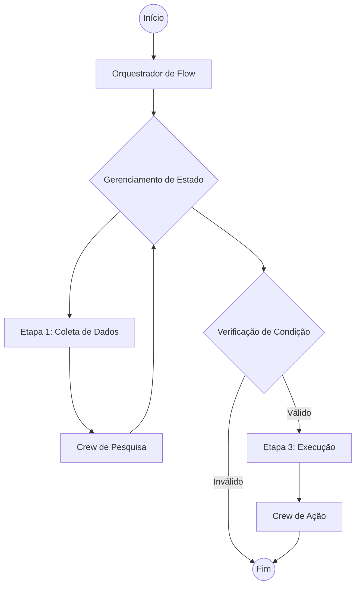

# A Mentalidade Flow-First

Ao construir aplicações de IA de produção com CrewAI, **recomendamos começar com um Flow**.

Embora seja possível executar Crews ou Agentes individuais, envolvê-los em um Flow fornece a estrutura necessária para uma aplicação robusta e escalável.

## Por que Flows?

1.  **Gerenciamento de Estado**: Flows fornecem uma maneira integrada de gerenciar o estado em diferentes etapas da sua aplicação. Isso é crucial para passar dados entre Crews, manter o contexto e lidar com entradas do usuário.
2.  **Controle**: Flows permitem definir caminhos de execução precisos, incluindo loops, condicionais e lógica de ramificação. Isso é essencial para lidar com casos extremos e garantir que sua aplicação se comporte de maneira previsível.
3.  **Observabilidade**: Flows fornecem uma estrutura clara que facilita o rastreamento da execução, a depuração de problemas e o monitoramento do desempenho. Recomendamos o uso do [CrewAI Tracing](/pt-BR/observability/tracing) para insights detalhados. Basta executar `crewai login` para habilitar recursos de observabilidade gratuitos.

## A Arquitetura

Uma aplicação CrewAI de produção típica se parece com isso:



### 1. A Classe Flow
Sua classe `Flow` é o ponto de entrada. Ela define o esquema de estado e os métodos que executam sua lógica.

```python
from crewai.flow.flow import Flow, listen, start
from pydantic import BaseModel

class AppState(BaseModel):
    user_input: str = ""
    research_results: str = ""
    final_report: str = ""

class ProductionFlow(Flow[AppState]):
    @start()
    def gather_input(self):
        # ... lógica para obter entrada ...
        pass

    @listen(gather_input)
    def run_research_crew(self):
        # ... acionar um Crew ...
        pass
```

### 2. Gerenciamento de Estado
Use modelos Pydantic para definir seu estado. Isso garante a segurança de tipos e deixa claro quais dados estão disponíveis em cada etapa.

- **Mantenha o mínimo**: Armazene apenas o que você precisa persistir entre as etapas.
- **Use dados estruturados**: Evite dicionários não estruturados quando possível.

### 3. Crews como Unidades de Trabalho
Delegue tarefas complexas para Crews. Um Crew deve ser focado em um objetivo específico (por exemplo, "Pesquisar um tópico", "Escrever uma postagem no blog").

- **Não superengendre Crews**: Mantenha-os focados.
- **Passe o estado explicitamente**: Passe os dados necessários do estado do Flow para as entradas do Crew.

```python
    @listen(gather_input)
    def run_research_crew(self):
        crew = ResearchCrew()
        result = crew.kickoff(inputs={"topic": self.state.user_input})
        self.state.research_results = result.raw
```

## Primitivas de Controle

Aproveite as primitivas de controle do CrewAI para adicionar robustez e controle aos seus Crews.

### 1. Task Guardrails
Use [Task Guardrails](/pt-BR/concepts/tasks#task-guardrails) para validar as saídas das tarefas antes que sejam aceitas. Isso garante que seus agentes produzam resultados de alta qualidade.

```python
def validate_content(result: TaskOutput) -> Tuple[bool, Any]:
    if len(result.raw) < 100:
        return (False, "Content is too short. Please expand.")
    return (True, result.raw)

task = Task(
    ...,
    guardrail=validate_content
)
```

### 2. Saídas Estruturadas
Sempre use saídas estruturadas (`output_pydantic` ou `output_json`) ao passar dados entre tarefas ou para sua aplicação. Isso evita erros de análise e garante a segurança de tipos.

```python
class ResearchResult(BaseModel):
    summary: str
    sources: List[str]

task = Task(
    ...,
    output_pydantic=ResearchResult
)
```

### 3. LLM Hooks
Use [LLM Hooks](/pt-BR/learn/llm-hooks) para inspecionar ou modificar mensagens antes que elas sejam enviadas para o LLM, ou para higienizar respostas.

```python
@before_llm_call
def log_request(context):
    print(f"Agent {context.agent.role} is calling the LLM...")
```

## Padrões de Implantação

Ao implantar seu Flow, considere o seguinte:

### CrewAI Enterprise
A maneira mais fácil de implantar seu Flow é usando o CrewAI Enterprise. Ele lida com a infraestrutura, autenticação e monitoramento para você.

Confira o [Guia de Implantação](/pt-BR/enterprise/guides/deploy-to-amp) para começar.

```bash
crewai deploy create
```

### Execução Assíncrona
Para tarefas de longa duração, use `kickoff_async` para evitar bloquear sua API.

### Persistência
Use o decorador `@persist` para salvar o estado do seu Flow em um banco de dados. Isso permite retomar a execução se o processo falhar ou se você precisar esperar pela entrada humana.

```python
@persist
class ProductionFlow(Flow[AppState]):
    # ...
```

## Resumo

- **Comece com um Flow.**
- **Defina um Estado claro.**
- **Use Crews para tarefas complexas.**
- **Implante com uma API e persistência.**
