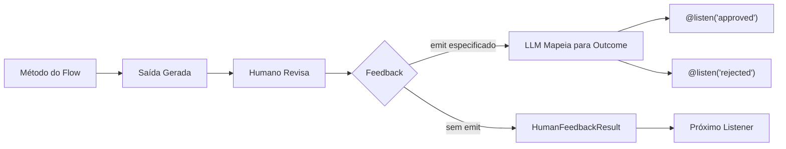

## Visão Geral

<Note>
O decorador `@human_feedback` requer **CrewAI versão 1.8.0 ou superior**. Certifique-se de atualizar sua instalação antes de usar este recurso.
</Note>

O decorador `@human_feedback` permite fluxos de trabalho human-in-the-loop (HITL) diretamente nos CrewAI Flows. Ele permite pausar a execução do flow, apresentar a saída para um humano revisar, coletar seu feedback e, opcionalmente, rotear para diferentes listeners com base no resultado do feedback.

Isso é particularmente valioso para:

- **Garantia de qualidade**: Revisar conteúdo gerado por IA antes de ser usado downstream
- **Portões de decisão**: Deixar humanos tomarem decisões críticas em fluxos automatizados
- **Fluxos de aprovação**: Implementar padrões de aprovar/rejeitar/revisar
- **Refinamento interativo**: Coletar feedback para melhorar saídas iterativamente



## Início Rápido

Aqui está a maneira mais simples de adicionar feedback humano a um flow:

```python Code
from crewai.flow.flow import Flow, start, listen
from crewai.flow.human_feedback import human_feedback

class SimpleReviewFlow(Flow):
    @start()
    @human_feedback(message="Por favor, revise este conteúdo:")
    def generate_content(self):
        return "Este é um conteúdo gerado por IA que precisa de revisão."

    @listen(generate_content)
    def process_feedback(self, result):
        print(f"Conteúdo: {result.output}")
        print(f"Humano disse: {result.feedback}")

flow = SimpleReviewFlow()
flow.kickoff()
```

Quando este flow é executado, ele irá:
1. Executar `generate_content` e retornar a string
2. Exibir a saída para o usuário com a mensagem de solicitação
3. Aguardar o usuário digitar o feedback (ou pressionar Enter para pular)
4. Passar um objeto `HumanFeedbackResult` para `process_feedback`

## O Decorador @human_feedback

### Parâmetros

| Parâmetro | Tipo | Obrigatório | Descrição |
|-----------|------|-------------|-----------|
| `message` | `str` | Sim | A mensagem mostrada ao humano junto com a saída do método |
| `emit` | `Sequence[str]` | Não | Lista de possíveis outcomes. O feedback é mapeado para um destes, que dispara decoradores `@listen` |
| `llm` | `str \| BaseLLM` | Quando `emit` especificado | LLM usado para interpretar o feedback e mapear para um outcome |
| `default_outcome` | `str` | Não | Outcome a usar se nenhum feedback for fornecido. Deve estar em `emit` |
| `metadata` | `dict` | Não | Dados adicionais para integrações enterprise |
| `provider` | `HumanFeedbackProvider` | Não | Provider customizado para feedback assíncrono/não-bloqueante. Veja [Feedback Humano Assíncrono](#feedback-humano-assíncrono-não-bloqueante) |
| `learn` | `bool` | Não | Habilitar aprendizado HITL: destila lições do feedback e pré-revisa saídas futuras. Padrão `False`. Veja [Aprendendo com Feedback](#aprendendo-com-feedback) |
| `learn_limit` | `int` | Não | Máximo de lições passadas para recuperar na pré-revisão. Padrão `5` |

### Uso Básico (Sem Roteamento)

Quando você não especifica `emit`, o decorador simplesmente coleta o feedback e passa um `HumanFeedbackResult` para o próximo listener:

```python Code
@start()
@human_feedback(message="O que você acha desta análise?")
def analyze_data(self):
    return "Resultados da análise: Receita aumentou 15%, custos diminuíram 8%"

@listen(analyze_data)
def handle_feedback(self, result):
    # result é um HumanFeedbackResult
    print(f"Análise: {result.output}")
    print(f"Feedback: {result.feedback}")
```

### Roteamento com emit

Quando você especifica `emit`, o decorador se torna um roteador. O feedback livre do humano é interpretado por um LLM e mapeado para um dos outcomes especificados:

```python Code
from crewai.flow.flow import Flow, start, listen, or_
from crewai.flow.human_feedback import human_feedback

class ReviewFlow(Flow):
    @start()
    def generate_content(self):
        return "Rascunho do post do blog aqui..."

    @human_feedback(
        message="Você aprova este conteúdo para publicação?",
        emit=["approved", "rejected", "needs_revision"],
        llm="gpt-4o-mini",
        default_outcome="needs_revision",
    )
    @listen(or_("generate_content", "needs_revision"))
    def review_content(self):
        return "Rascunho do post do blog aqui..."

    @listen("approved")
    def publish(self, result):
        print(f"Publicando! Usuário disse: {result.feedback}")

    @listen("rejected")
    def discard(self, result):
        print(f"Descartando. Motivo: {result.feedback}")
```

Quando o humano diz algo como "precisa de mais detalhes", o LLM mapeia para `"needs_revision"`, que dispara `review_content` novamente via `or_()` — criando um loop de revisão. O loop continua até que o outcome seja `"approved"` ou `"rejected"`.

<Tip>
O LLM usa saídas estruturadas (function calling) quando disponível para garantir que a resposta seja um dos seus outcomes especificados. Isso torna o roteamento confiável e previsível.
</Tip>

<Warning>
Um método `@start()` só executa uma vez no início do flow. Se você precisa de um loop de revisão, separe o método start do método de revisão e use `@listen(or_("trigger", "revision_outcome"))` no método de revisão para habilitar o self-loop.
</Warning>

## HumanFeedbackResult

O dataclass `HumanFeedbackResult` contém todas as informações sobre uma interação de feedback humano:

```python Code
from crewai.flow.human_feedback import HumanFeedbackResult

@dataclass
class HumanFeedbackResult:
    output: Any              # A saída original do método mostrada ao humano
    feedback: str            # O texto bruto do feedback do humano
    outcome: str | None      # O outcome mapeado (se emit foi especificado)
    timestamp: datetime      # Quando o feedback foi recebido
    method_name: str         # Nome do método decorado
    metadata: dict           # Qualquer metadata passado ao decorador
```

### Acessando em Listeners

Quando um listener é disparado por um método `@human_feedback` com `emit`, ele recebe o `HumanFeedbackResult`:

```python Code
@listen("approved")
def on_approval(self, result: HumanFeedbackResult):
    print(f"Saída original: {result.output}")
    print(f"Feedback do usuário: {result.feedback}")
    print(f"Outcome: {result.outcome}")  # "approved"
    print(f"Recebido em: {result.timestamp}")
```

## Acessando o Histórico de Feedback

A classe `Flow` fornece dois atributos para acessar o feedback humano:

### last_human_feedback

Retorna o `HumanFeedbackResult` mais recente:

```python Code
@listen(some_method)
def check_feedback(self):
    if self.last_human_feedback:
        print(f"Último feedback: {self.last_human_feedback.feedback}")
```

### human_feedback_history

Uma lista de todos os objetos `HumanFeedbackResult` coletados durante o flow:

```python Code
@listen(final_step)
def summarize(self):
    print(f"Total de feedbacks coletados: {len(self.human_feedback_history)}")
    for i, fb in enumerate(self.human_feedback_history):
        print(f"{i+1}. {fb.method_name}: {fb.outcome or 'sem roteamento'}")
```

<Warning>
Cada `HumanFeedbackResult` é adicionado a `human_feedback_history`, então múltiplos passos de feedback não sobrescrevem uns aos outros. Use esta lista para acessar todo o feedback coletado durante o flow.
</Warning>

## Exemplo Completo: Fluxo de Aprovação de Conteúdo

Aqui está um exemplo completo implementando um fluxo de revisão e aprovação de conteúdo:

<CodeGroup>

```python Code
from crewai.flow.flow import Flow, start, listen, or_
from crewai.flow.human_feedback import human_feedback, HumanFeedbackResult
from pydantic import BaseModel


class ContentState(BaseModel):
    draft: str = ""
    revision_count: int = 0
    status: str = "pending"


class ContentApprovalFlow(Flow[ContentState]):
    """Um flow que gera conteúdo e faz loop até o humano aprovar."""

    @start()
    def generate_draft(self):
        self.state.draft = "# IA Segura\n\nEste é um rascunho sobre IA Segura..."
        return self.state.draft

    @human_feedback(
        message="Por favor, revise este rascunho. Aprove, rejeite ou descreva o que precisa mudar:",
        emit=["approved", "rejected", "needs_revision"],
        llm="gpt-4o-mini",
        default_outcome="needs_revision",
    )
    @listen(or_("generate_draft", "needs_revision"))
    def review_draft(self):
        self.state.revision_count += 1
        return f"{self.state.draft} (v{self.state.revision_count})"

    @listen("approved")
    def publish_content(self, result: HumanFeedbackResult):
        self.state.status = "published"
        print(f"Conteúdo aprovado e publicado! Revisor disse: {result.feedback}")
        return "published"

    @listen("rejected")
    def handle_rejection(self, result: HumanFeedbackResult):
        self.state.status = "rejected"
        print(f"Conteúdo rejeitado. Motivo: {result.feedback}")
        return "rejected"


flow = ContentApprovalFlow()
result = flow.kickoff()
print(f"\nFlow finalizado. Status: {flow.state.status}, Revisões: {flow.state.revision_count}")
```

```text Output
==================================================
OUTPUT FOR REVIEW:
==================================================
# IA Segura

Este é um rascunho sobre IA Segura... (v1)
==================================================

Por favor, revise este rascunho. Aprove, rejeite ou descreva o que precisa mudar:
(Press Enter to skip, or type your feedback)

Your feedback: Preciso de mais detalhes sobre segurança em IA.

==================================================
OUTPUT FOR REVIEW:
==================================================
# IA Segura

Este é um rascunho sobre IA Segura... (v2)
==================================================

Por favor, revise este rascunho. Aprove, rejeite ou descreva o que precisa mudar:
(Press Enter to skip, or type your feedback)

Your feedback: Parece bom, aprovado!

Conteúdo aprovado e publicado! Revisor disse: Parece bom, aprovado!

Flow finalizado. Status: published, Revisões: 2
```

</CodeGroup>

## Combinando com Outros Decoradores

O decorador `@human_feedback` funciona com `@start()`, `@listen()` e `or_()`. Ambas as ordens de decoradores funcionam — o framework propaga atributos em ambas as direções — mas os padrões recomendados são:

```python Code
# Revisão única no início do flow (sem self-loop)
@start()
@human_feedback(message="Revise isto:", emit=["approved", "rejected"], llm="gpt-4o-mini")
def my_start_method(self):
    return "content"

# Revisão linear em um listener (sem self-loop)
@listen(other_method)
@human_feedback(message="Revise isto também:", emit=["good", "bad"], llm="gpt-4o-mini")
def my_listener(self, data):
    return f"processed: {data}"

# Self-loop: revisão que pode voltar para revisões
@human_feedback(message="Aprovar ou revisar?", emit=["approved", "revise"], llm="gpt-4o-mini")
@listen(or_("upstream_method", "revise"))
def review_with_loop(self):
    return "content for review"
```

### Padrão de self-loop

Para criar um loop de revisão, o método de revisão deve escutar **ambos** um gatilho upstream e seu próprio outcome de revisão usando `or_()`:

```python Code
@start()
def generate(self):
    return "initial draft"

@human_feedback(
    message="Aprovar ou solicitar alterações?",
    emit=["revise", "approved"],
    llm="gpt-4o-mini",
    default_outcome="approved",
)
@listen(or_("generate", "revise"))
def review(self):
    return "content"

@listen("approved")
def publish(self):
    return "published"
```

Quando o outcome é `"revise"`, o flow roteia de volta para `review` (porque ele escuta `"revise"` via `or_()`). Quando o outcome é `"approved"`, o flow continua para `publish`. Isso funciona porque o engine de flow isenta roteadores da regra "fire once", permitindo que eles re-executem em cada iteração do loop.

### Roteadores encadeados

Um listener disparado pelo outcome de um roteador pode ser ele mesmo um roteador:

```python Code
@start()
@human_feedback(message="Primeira revisão:", emit=["approved", "rejected"], llm="gpt-4o-mini")
def draft(self):
    return "draft content"

@listen("approved")
@human_feedback(message="Revisão final:", emit=["publish", "revise"], llm="gpt-4o-mini")
def final_review(self, prev):
    return "final content"

@listen("publish")
def on_publish(self, prev):
    return "published"
```

### Limitações

- **Métodos `@start()` executam uma vez**: Um método `@start()` não pode fazer self-loop. Se você precisa de um ciclo de revisão, use um método `@start()` separado como ponto de entrada e coloque o `@human_feedback` em um método `@listen()`.
- **Sem `@start()` + `@listen()` no mesmo método**: Esta é uma restrição do framework de Flow. Um método é ou um ponto de início ou um listener, não ambos.

## Melhores Práticas

### 1. Escreva Mensagens de Solicitação Claras

O parâmetro `message` é o que o humano vê. Torne-o acionável:

```python Code
# ✅ Bom - claro e acionável
@human_feedback(message="Este resumo captura com precisão os pontos-chave? Responda 'sim' ou explique o que está faltando:")

# ❌ Ruim - vago
@human_feedback(message="Revise isto:")
```

### 2. Escolha Outcomes Significativos

Ao usar `emit`, escolha outcomes que mapeiem naturalmente para respostas humanas:

```python Code
# ✅ Bom - outcomes em linguagem natural
emit=["approved", "rejected", "needs_more_detail"]

# ❌ Ruim - técnico ou pouco claro
emit=["state_1", "state_2", "state_3"]
```

### 3. Sempre Forneça um Outcome Padrão

Use `default_outcome` para lidar com casos onde usuários pressionam Enter sem digitar:

```python Code
@human_feedback(
    message="Aprovar? (pressione Enter para solicitar revisão)",
    emit=["approved", "needs_revision"],
    llm="gpt-4o-mini",
    default_outcome="needs_revision",  # Padrão seguro
)
```

### 4. Use o Histórico de Feedback para Trilhas de Auditoria

Acesse `human_feedback_history` para criar logs de auditoria:

```python Code
@listen(final_step)
def create_audit_log(self):
    log = []
    for fb in self.human_feedback_history:
        log.append({
            "step": fb.method_name,
            "outcome": fb.outcome,
            "feedback": fb.feedback,
            "timestamp": fb.timestamp.isoformat(),
        })
    return log
```

### 5. Trate Feedback Roteado e Não Roteado

Ao projetar flows, considere se você precisa de roteamento:

| Cenário | Use |
|---------|-----|
| Revisão simples, só precisa do texto do feedback | Sem `emit` |
| Precisa ramificar para caminhos diferentes baseado na resposta | Use `emit` |
| Portões de aprovação com aprovar/rejeitar/revisar | Use `emit` |
| Coletando comentários apenas para logging | Sem `emit` |

## Feedback Humano Assíncrono (Não-Bloqueante - Human in the loop)

Por padrão, `@human_feedback` bloqueia a execução aguardando entrada no console. Para aplicações de produção, você pode precisar de feedback **assíncrono/não-bloqueante** que se integre com sistemas externos como Slack, email, webhooks ou APIs.

### A Abstração de Provider

Use o parâmetro `provider` para especificar uma estratégia customizada de coleta de feedback:

```python Code
from crewai.flow import Flow, start, human_feedback, HumanFeedbackProvider, HumanFeedbackPending, PendingFeedbackContext

class WebhookProvider(HumanFeedbackProvider):
    """Provider que pausa o flow e aguarda callback de webhook."""

    def __init__(self, webhook_url: str):
        self.webhook_url = webhook_url

    def request_feedback(self, context: PendingFeedbackContext, flow: Flow) -> str:
        # Notifica sistema externo (ex: envia mensagem Slack, cria ticket)
        self.send_notification(context)

        # Pausa execução - framework cuida da persistência automaticamente
        raise HumanFeedbackPending(
            context=context,
            callback_info={"webhook_url": f"{self.webhook_url}/{context.flow_id}"}
        )

class ReviewFlow(Flow):
    @start()
    @human_feedback(
        message="Revise este conteúdo:",
        emit=["approved", "rejected"],
        llm="gpt-4o-mini",
        provider=WebhookProvider("https://myapp.com/api"),
    )
    def generate_content(self):
        return "Conteúdo gerado por IA..."

    @listen("approved")
    def publish(self, result):
        return "Publicado!"
```

<Tip>
O framework de flow **persiste automaticamente o estado** quando `HumanFeedbackPending` é lançado. Seu provider só precisa notificar o sistema externo e lançar a exceção—não são necessárias chamadas manuais de persistência.
</Tip>

### Tratando Flows Pausados

Ao usar um provider assíncrono, `kickoff()` retorna um objeto `HumanFeedbackPending` em vez de lançar uma exceção:

```python Code
flow = ReviewFlow()
result = flow.kickoff()

if isinstance(result, HumanFeedbackPending):
    # Flow está pausado, estado é automaticamente persistido
    print(f"Aguardando feedback em: {result.callback_info['webhook_url']}")
    print(f"Flow ID: {result.context.flow_id}")
else:
    # Conclusão normal
    print(f"Flow concluído: {result}")
```

### Retomando um Flow Pausado

Quando o feedback chega (ex: via webhook), retome o flow:

```python Code
# Handler síncrono:
def handle_feedback_webhook(flow_id: str, feedback: str):
    flow = ReviewFlow.from_pending(flow_id)
    result = flow.resume(feedback)
    return result

# Handler assíncrono (FastAPI, aiohttp, etc.):
async def handle_feedback_webhook(flow_id: str, feedback: str):
    flow = ReviewFlow.from_pending(flow_id)
    result = await flow.resume_async(feedback)
    return result
```

### Tipos Principais

| Tipo | Descrição |
|------|-----------|
| `HumanFeedbackProvider` | Protocolo para providers de feedback customizados |
| `PendingFeedbackContext` | Contém todas as informações necessárias para retomar um flow pausado |
| `HumanFeedbackPending` | Retornado por `kickoff()` quando o flow está pausado para feedback |
| `ConsoleProvider` | Provider padrão de entrada bloqueante no console |

### PendingFeedbackContext

O contexto contém tudo necessário para retomar:

```python Code
@dataclass
class PendingFeedbackContext:
    flow_id: str           # Identificador único desta execução de flow
    flow_class: str        # Nome qualificado completo da classe
    method_name: str       # Método que disparou o feedback
    method_output: Any     # Saída mostrada ao humano
    message: str           # A mensagem de solicitação
    emit: list[str] | None # Outcomes possíveis para roteamento
    default_outcome: str | None
    metadata: dict         # Metadata customizado
    llm: str | None        # LLM para mapeamento de outcome
    requested_at: datetime
```

### Exemplo Completo de Flow Assíncrono

```python Code
from crewai.flow import (
    Flow, start, listen, human_feedback,
    HumanFeedbackProvider, HumanFeedbackPending, PendingFeedbackContext
)

class SlackNotificationProvider(HumanFeedbackProvider):
    """Provider que envia notificações Slack e pausa para feedback assíncrono."""

    def __init__(self, channel: str):
        self.channel = channel

    def request_feedback(self, context: PendingFeedbackContext, flow: Flow) -> str:
        # Envia notificação Slack (implemente você mesmo)
        slack_thread_id = self.post_to_slack(
            channel=self.channel,
            message=f"Revisão necessária:\n\n{context.method_output}\n\n{context.message}",
        )

        # Pausa execução - framework cuida da persistência automaticamente
        raise HumanFeedbackPending(
            context=context,
            callback_info={
                "slack_channel": self.channel,
                "thread_id": slack_thread_id,
            }
        )

class ContentPipeline(Flow):
    @start()
    @human_feedback(
        message="Aprova este conteúdo para publicação?",
        emit=["approved", "rejected"],
        llm="gpt-4o-mini",
        default_outcome="rejected",
        provider=SlackNotificationProvider("#content-reviews"),
    )
    def generate_content(self):
        return "Conteúdo de blog post gerado por IA..."

    @listen("approved")
    def publish(self, result):
        print(f"Publicando! Revisor disse: {result.feedback}")
        return {"status": "published"}

    @listen("rejected")
    def archive(self, result):
        print(f"Arquivado. Motivo: {result.feedback}")
        return {"status": "archived"}


# Iniciando o flow (vai pausar e aguardar resposta do Slack)
def start_content_pipeline():
    flow = ContentPipeline()
    result = flow.kickoff()

    if isinstance(result, HumanFeedbackPending):
        return {"status": "pending", "flow_id": result.context.flow_id}

    return result


# Retomando quando webhook do Slack dispara (handler síncrono)
def on_slack_feedback(flow_id: str, slack_message: str):
    flow = ContentPipeline.from_pending(flow_id)
    result = flow.resume(slack_message)
    return result


# Se seu handler é assíncrono (FastAPI, aiohttp, Slack Bolt async, etc.)
async def on_slack_feedback_async(flow_id: str, slack_message: str):
    flow = ContentPipeline.from_pending(flow_id)
    result = await flow.resume_async(slack_message)
    return result
```

<Warning>
Se você está usando um framework web assíncrono (FastAPI, aiohttp, Slack Bolt modo async), use `await flow.resume_async()` em vez de `flow.resume()`. Chamar `resume()` de dentro de um event loop em execução vai lançar um `RuntimeError`.
</Warning>

### Melhores Práticas para Feedback Assíncrono

1. **Verifique o tipo de retorno**: `kickoff()` retorna `HumanFeedbackPending` quando pausado—não precisa de try/except
2. **Use o método resume correto**: Use `resume()` em código síncrono, `await resume_async()` em código assíncrono
3. **Armazene informações de callback**: Use `callback_info` para armazenar URLs de webhook, IDs de tickets, etc.
4. **Implemente idempotência**: Seu handler de resume deve ser idempotente por segurança
5. **Persistência automática**: O estado é automaticamente salvo quando `HumanFeedbackPending` é lançado e usa `SQLiteFlowPersistence` por padrão
6. **Persistência customizada**: Passe uma instância de persistência customizada para `from_pending()` se necessário

## Aprendendo com Feedback

O parâmetro `learn=True` habilita um ciclo de feedback entre revisores humanos e o sistema de memória. Quando habilitado, o sistema melhora progressivamente suas saídas aprendendo com correções humanas anteriores.

### Como Funciona

1. **Após o feedback**: O LLM extrai lições generalizáveis da saída + feedback e as armazena na memória com `source="hitl"`. Se o feedback for apenas aprovação (ex: "parece bom"), nada é armazenado.
2. **Antes da próxima revisão**: Lições HITL passadas são recuperadas da memória e aplicadas pelo LLM para melhorar a saída antes que o humano a veja.

Com o tempo, o humano vê saídas pré-revisadas progressivamente melhores porque cada correção informa revisões futuras.

### Exemplo

```python Code
class ArticleReviewFlow(Flow):
    @start()
    def generate_article(self):
        return self.crew.kickoff(inputs={"topic": "AI Safety"}).raw

    @human_feedback(
        message="Revise este rascunho do artigo:",
        emit=["approved", "needs_revision"],
        llm="gpt-4o-mini",
        learn=True,  # enable HITL learning
    )
    @listen(or_("generate_article", "needs_revision"))
    def review_article(self):
        return self.last_human_feedback.output if self.last_human_feedback else "article draft"

    @listen("approved")
    def publish(self):
        print(f"Publishing: {self.last_human_feedback.output}")
```

**Primeira execução**: O humano vê a saída bruta e diz "Sempre inclua citações para afirmações factuais." A lição é destilada e armazenada na memória.

**Segunda execução**: O sistema recupera a lição sobre citações, pré-revisa a saída para adicionar citações e então mostra a versão melhorada. O trabalho do humano muda de "corrigir tudo" para "identificar o que o sistema deixou passar."

### Configuração

| Parâmetro | Padrão | Descrição |
|-----------|--------|-----------|
| `learn` | `False` | Habilitar aprendizado HITL |
| `learn_limit` | `5` | Máximo de lições passadas para recuperar na pré-revisão |

### Decisões de Design Principais

- **Mesmo LLM para tudo**: O parâmetro `llm` no decorador é compartilhado pelo mapeamento de outcome, destilação de lições e pré-revisão. Não é necessário configurar múltiplos modelos.
- **Saída estruturada**: Tanto a destilação quanto a pré-revisão usam function calling com modelos Pydantic quando o LLM suporta, com fallback para parsing de texto caso contrário.
- **Armazenamento não-bloqueante**: Lições são armazenadas via `remember_many()` que executa em uma thread em segundo plano -- o flow continua imediatamente.
- **Degradação graciosa**: Se o LLM falhar durante a destilação, nada é armazenado. Se falhar durante a pré-revisão, a saída bruta é mostrada. Nenhuma falha bloqueia o flow.
- **Sem escopo/categorias necessários**: Ao armazenar lições, apenas `source` é passado. O pipeline de codificação infere escopo, categorias e importância automaticamente.

<Note>
`learn=True` requer que o Flow tenha memória disponível. Flows obtêm memória automaticamente por padrão, mas se você a desabilitou com `_skip_auto_memory`, o aprendizado HITL será silenciosamente ignorado.
</Note>


## Documentação Relacionada

- [Visão Geral de Flows](/pt-BR/concepts/flows) - Aprenda sobre CrewAI Flows
- [Gerenciamento de Estado em Flows](/pt-BR/guides/flows/mastering-flow-state) - Gerenciando estado em flows
- [Persistência de Flows](/pt-BR/concepts/flows#persistence) - Persistindo estado de flows
- [Roteamento com @router](/pt-BR/concepts/flows#router) - Mais sobre roteamento condicional
- [Input Humano na Execução](/pt-BR/learn/human-input-on-execution) - Input humano no nível de task
- [Memória](/pt-BR/concepts/memory) - O sistema unificado de memória usado pelo aprendizado HITL
