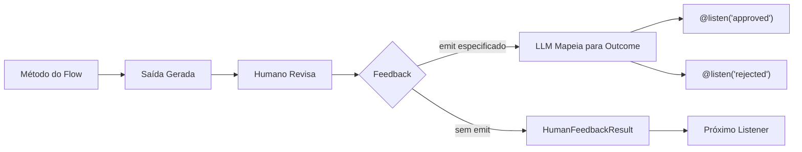

## Visão Geral

O decorador `@human_feedback` permite fluxos de trabalho human-in-the-loop (HITL) diretamente nos CrewAI Flows. Ele permite pausar a execução do flow, apresentar a saída para um humano revisar, coletar seu feedback e, opcionalmente, rotear para diferentes listeners com base no resultado do feedback.

Isso é particularmente valioso para:

- **Garantia de qualidade**: Revisar conteúdo gerado por IA antes de ser usado downstream
- **Portões de decisão**: Deixar humanos tomarem decisões críticas em fluxos automatizados
- **Fluxos de aprovação**: Implementar padrões de aprovar/rejeitar/revisar
- **Refinamento interativo**: Coletar feedback para melhorar saídas iterativamente



## Início Rápido

Aqui está a maneira mais simples de adicionar feedback humano a um flow:

```python Code
from crewai.flow.flow import Flow, start, listen
from crewai.flow.human_feedback import human_feedback

class SimpleReviewFlow(Flow):
    @human_feedback(request="Por favor, revise este conteúdo:")
    @start()
    def generate_content(self):
        return "Este é um conteúdo gerado por IA que precisa de revisão."

    @listen(generate_content)
    def process_feedback(self, result):
        print(f"Conteúdo: {result.output}")
        print(f"Humano disse: {result.feedback}")

flow = SimpleReviewFlow()
flow.kickoff()
```

Quando este flow é executado, ele irá:
1. Executar `generate_content` e retornar a string
2. Exibir a saída para o usuário com a mensagem de solicitação
3. Aguardar o usuário digitar o feedback (ou pressionar Enter para pular)
4. Passar um objeto `HumanFeedbackResult` para `process_feedback`

## O Decorador @human_feedback

### Parâmetros

| Parâmetro | Tipo | Obrigatório | Descrição |
|-----------|------|-------------|-----------|
| `request` | `str` | Sim | A mensagem mostrada ao humano junto com a saída do método |
| `emit` | `Sequence[str]` | Não | Lista de possíveis outcomes. O feedback é mapeado para um destes, que dispara decoradores `@listen` |
| `llm` | `str \| BaseLLM` | Quando `emit` especificado | LLM usado para interpretar o feedback e mapear para um outcome |
| `default_outcome` | `str` | Não | Outcome a usar se nenhum feedback for fornecido. Deve estar em `emit` |
| `metadata` | `dict` | Não | Dados adicionais para integrações enterprise |

### Uso Básico (Sem Roteamento)

Quando você não especifica `emit`, o decorador simplesmente coleta o feedback e passa um `HumanFeedbackResult` para o próximo listener:

```python Code
@human_feedback(request="O que você acha desta análise?")
@start()
def analyze_data(self):
    return "Resultados da análise: Receita aumentou 15%, custos diminuíram 8%"

@listen(analyze_data)
def handle_feedback(self, result):
    # result é um HumanFeedbackResult
    print(f"Análise: {result.output}")
    print(f"Feedback: {result.feedback}")
```

### Roteamento com emit

Quando você especifica `emit`, o decorador se torna um roteador. O feedback livre do humano é interpretado por um LLM e mapeado para um dos outcomes especificados:

```python Code
@human_feedback(
    request="Você aprova este conteúdo para publicação?",
    emit=["approved", "rejected", "needs_revision"],
    llm="gpt-4o-mini",
    default_outcome="needs_revision",
)
@start()
def review_content(self):
    return "Rascunho do post do blog aqui..."

@listen("approved")
def publish(self, result):
    print(f"Publicando! Usuário disse: {result.feedback}")

@listen("rejected")
def discard(self, result):
    print(f"Descartando. Motivo: {result.feedback}")

@listen("needs_revision")
def revise(self, result):
    print(f"Revisando baseado em: {result.feedback}")
```

<Tip>
O LLM usa saídas estruturadas (function calling) quando disponível para garantir que a resposta seja um dos seus outcomes especificados. Isso torna o roteamento confiável e previsível.
</Tip>

## HumanFeedbackResult

O dataclass `HumanFeedbackResult` contém todas as informações sobre uma interação de feedback humano:

```python Code
from crewai.flow.human_feedback import HumanFeedbackResult

@dataclass
class HumanFeedbackResult:
    output: Any              # A saída original do método mostrada ao humano
    feedback: str            # O texto bruto do feedback do humano
    outcome: str | None      # O outcome mapeado (se emit foi especificado)
    timestamp: datetime      # Quando o feedback foi recebido
    method_name: str         # Nome do método decorado
    metadata: dict           # Qualquer metadata passado ao decorador
```

### Acessando em Listeners

Quando um listener é disparado por um método `@human_feedback` com `emit`, ele recebe o `HumanFeedbackResult`:

```python Code
@listen("approved")
def on_approval(self, result: HumanFeedbackResult):
    print(f"Saída original: {result.output}")
    print(f"Feedback do usuário: {result.feedback}")
    print(f"Outcome: {result.outcome}")  # "approved"
    print(f"Recebido em: {result.timestamp}")
```

## Acessando o Histórico de Feedback

A classe `Flow` fornece dois atributos para acessar o feedback humano:

### last_human_feedback

Retorna o `HumanFeedbackResult` mais recente:

```python Code
@listen(some_method)
def check_feedback(self):
    if self.last_human_feedback:
        print(f"Último feedback: {self.last_human_feedback.feedback}")
```

### human_feedback_history

Uma lista de todos os objetos `HumanFeedbackResult` coletados durante o flow:

```python Code
@listen(final_step)
def summarize(self):
    print(f"Total de feedbacks coletados: {len(self.human_feedback_history)}")
    for i, fb in enumerate(self.human_feedback_history):
        print(f"{i+1}. {fb.method_name}: {fb.outcome or 'sem roteamento'}")
```

<Warning>
Cada `HumanFeedbackResult` é adicionado a `human_feedback_history`, então múltiplos passos de feedback não sobrescrevem uns aos outros. Use esta lista para acessar todo o feedback coletado durante o flow.
</Warning>

## Exemplo Completo: Fluxo de Aprovação de Conteúdo

Aqui está um exemplo completo implementando um fluxo de revisão e aprovação de conteúdo:

<CodeGroup>

```python Code
from crewai.flow.flow import Flow, start, listen
from crewai.flow.human_feedback import human_feedback, HumanFeedbackResult
from pydantic import BaseModel


class ContentState(BaseModel):
    topic: str = ""
    draft: str = ""
    final_content: str = ""
    revision_count: int = 0


class ContentApprovalFlow(Flow[ContentState]):
    """Um flow que gera conteúdo e obtém aprovação humana."""

    @start()
    def get_topic(self):
        self.state.topic = input("Sobre qual tópico devo escrever? ")
        return self.state.topic

    @listen(get_topic)
    def generate_draft(self, topic):
        # Em uso real, isso chamaria um LLM
        self.state.draft = f"# {topic}\n\nEste é um rascunho sobre {topic}..."
        return self.state.draft

    @human_feedback(
        request="Por favor, revise este rascunho. Responda 'approved', 'rejected', ou forneça feedback de revisão:",
        emit=["approved", "rejected", "needs_revision"],
        llm="gpt-4o-mini",
        default_outcome="needs_revision",
    )
    @listen(generate_draft)
    def review_draft(self, draft):
        return draft

    @listen("approved")
    def publish_content(self, result: HumanFeedbackResult):
        self.state.final_content = result.output
        print("\n✅ Conteúdo aprovado e publicado!")
        print(f"Comentário do revisor: {result.feedback}")
        return "published"

    @listen("rejected")
    def handle_rejection(self, result: HumanFeedbackResult):
        print("\n❌ Conteúdo rejeitado")
        print(f"Motivo: {result.feedback}")
        return "rejected"

    @listen("needs_revision")
    def revise_content(self, result: HumanFeedbackResult):
        self.state.revision_count += 1
        print(f"\n📝 Revisão #{self.state.revision_count} solicitada")
        print(f"Feedback: {result.feedback}")

        # Em um flow real, você pode voltar para generate_draft
        # Para este exemplo, apenas reconhecemos
        return "revision_requested"


# Executar o flow
flow = ContentApprovalFlow()
result = flow.kickoff()
print(f"\nFlow concluído. Revisões solicitadas: {flow.state.revision_count}")
```

```text Output
Sobre qual tópico devo escrever? Segurança em IA

==================================================
OUTPUT FOR REVIEW:
==================================================
# Segurança em IA

Este é um rascunho sobre Segurança em IA...
==================================================

Por favor, revise este rascunho. Responda 'approved', 'rejected', ou forneça feedback de revisão:
(Press Enter to skip, or type your feedback)

Your feedback: Parece bom, aprovado!

✅ Conteúdo aprovado e publicado!
Comentário do revisor: Parece bom, aprovado!

Flow concluído. Revisões solicitadas: 0
```

</CodeGroup>

## Combinando com Outros Decoradores

O decorador `@human_feedback` funciona com outros decoradores de flow. A ordem importa:

```python Code
# Correto: @human_feedback envolve o decorador de flow
@human_feedback(request="Revise isto:")
@start()
def my_start_method(self):
    return "content"

@human_feedback(request="Revise isto também:")
@listen(other_method)
def my_listener(self, data):
    return f"processed: {data}"
```

<Tip>
Coloque `@human_feedback` como o decorador mais externo (primeiro/topo) para que ele execute após o método completar e possa capturar o valor de retorno.
</Tip>

## Melhores Práticas

### 1. Escreva Mensagens de Solicitação Claras

O parâmetro `request` é o que o humano vê. Torne-o acionável:

```python Code
# ✅ Bom - claro e acionável
@human_feedback(request="Este resumo captura com precisão os pontos-chave? Responda 'sim' ou explique o que está faltando:")

# ❌ Ruim - vago
@human_feedback(request="Revise isto:")
```

### 2. Escolha Outcomes Significativos

Ao usar `emit`, escolha outcomes que mapeiem naturalmente para respostas humanas:

```python Code
# ✅ Bom - outcomes em linguagem natural
emit=["approved", "rejected", "needs_more_detail"]

# ❌ Ruim - técnico ou pouco claro
emit=["state_1", "state_2", "state_3"]
```

### 3. Sempre Forneça um Outcome Padrão

Use `default_outcome` para lidar com casos onde usuários pressionam Enter sem digitar:

```python Code
@human_feedback(
    request="Aprovar? (pressione Enter para solicitar revisão)",
    emit=["approved", "needs_revision"],
    llm="gpt-4o-mini",
    default_outcome="needs_revision",  # Padrão seguro
)
```

### 4. Use o Histórico de Feedback para Trilhas de Auditoria

Acesse `human_feedback_history` para criar logs de auditoria:

```python Code
@listen(final_step)
def create_audit_log(self):
    log = []
    for fb in self.human_feedback_history:
        log.append({
            "step": fb.method_name,
            "outcome": fb.outcome,
            "feedback": fb.feedback,
            "timestamp": fb.timestamp.isoformat(),
        })
    return log
```

### 5. Trate Feedback Roteado e Não Roteado

Ao projetar flows, considere se você precisa de roteamento:

| Cenário | Use |
|---------|-----|
| Revisão simples, só precisa do texto do feedback | Sem `emit` |
| Precisa ramificar para caminhos diferentes baseado na resposta | Use `emit` |
| Portões de aprovação com aprovar/rejeitar/revisar | Use `emit` |
| Coletando comentários apenas para logging | Sem `emit` |

## Documentação Relacionada

- [Visão Geral de Flows](/pt-BR/concepts/flows) - Aprenda sobre CrewAI Flows
- [Gerenciamento de Estado em Flows](/pt-BR/guides/flows/mastering-flow-state) - Gerenciando estado em flows
- [Roteamento com @router](/pt-BR/concepts/flows#router) - Mais sobre roteamento condicional
- [Input Humano na Execução](/pt-BR/learn/human-input-on-execution) - Input humano no nível de task
